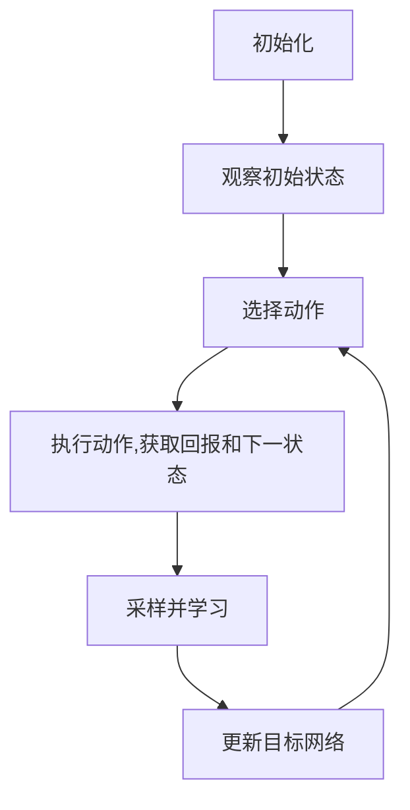

# 深度 Q-learning：在媒体行业中的应用

## 1.背景介绍

在当今数字时代,媒体行业面临着前所未有的挑战和机遇。用户对个性化、高品质内容的需求不断增长,同时内容创作者也需要更有效地吸引和留住受众。在这种背景下,人工智能(AI)技术应运而生,为媒体行业带来了全新的解决方案。其中,深度强化学习(Deep Reinforcement Learning)作为AI领域的一个分支,已经显示出巨大的潜力。

深度Q学习(Deep Q-Learning)是深度强化学习中最著名和最成功的算法之一。它结合了深度神经网络的强大表示能力和Q学习的简单高效,能够在复杂的环境中学习最优策略。在媒体行业中,深度Q学习可以应用于内容推荐、个性化广告投放、内容优化等多个领域,帮助媒体公司更好地服务用户,提高收益。

## 2.核心概念与联系

### 2.1 强化学习概述

强化学习是机器学习的一个重要分支,它关注智能体(Agent)如何通过与环境(Environment)的交互,学习采取最优策略(Policy)以最大化累积回报(Cumulative Reward)。与监督学习和无监督学习不同,强化学习没有给定的输入输出对,而是通过试错来学习。

强化学习包含四个核心元素:

- 智能体(Agent):执行动作的决策实体
- 环境(Environment):智能体所处的环境,提供状态和回报信号
- 策略(Policy):智能体根据状态选择动作的策略
- 回报(Reward):环境对智能体动作的反馈,指导智能体优化策略

### 2.2 Q学习算法

Q学习是强化学习中一种基于价值的算法,它通过学习状态-动作对的价值函数Q(s,a)来近似最优策略。Q(s,a)表示在状态s下执行动作a,然后按最优策略继续执行下去所能获得的累积回报。

Q学习算法的核心是通过不断更新Q值表,使其收敛到最优Q值函数。更新公式如下:

$$Q(s_t, a_t) \leftarrow Q(s_t, a_t) + \alpha [r_t + \gamma \max_a Q(s_{t+1}, a) - Q(s_t, a_t)]$$

其中:
- $\alpha$是学习率
- $\gamma$是折扣因子
- $r_t$是在时刻t获得的即时回报
- $\max_a Q(s_{t+1}, a)$是下一状态下所有动作Q值的最大值

### 2.3 深度Q网络(DQN)

传统的Q学习算法使用表格来存储Q值,在状态空间和动作空间较大时会遇到维数灾难的问题。深度Q网络(Deep Q-Network, DQN)通过使用深度神经网络来估计Q值函数,从而解决了这一问题。

DQN的核心思想是使用一个卷积神经网络(CNN)或全连接网络(FC)作为Q网络,输入状态特征,输出每个动作对应的Q值。在训练过程中,通过与环境交互获得的状态-动作-回报-下一状态样本,更新Q网络的参数,使其逼近真实的Q值函数。

DQN算法通过经验回放池(Experience Replay)和目标网络(Target Network)等技巧,提高了训练的稳定性和效率。

## 3.核心算法原理具体操作步骤

深度Q学习算法的具体操作步骤如下:

1. **初始化**
   - 初始化Q网络(可使用CNN或FC网络)
   - 初始化经验回放池D
   - 初始化目标网络,参数与Q网络相同

2. **观察初始状态**
   - 从环境获取初始状态s

3. **选择动作**
   - 使用$\epsilon$-贪婪策略从Q网络输出选择动作a
     - 以概率$\epsilon$随机选择动作
     - 以概率1-$\epsilon$选择Q值最大的动作

4. **执行动作,获取回报和下一状态**
   - 在环境中执行动作a,获得即时回报r和下一状态s'
   - 将(s,a,r,s')存入经验回放池D

5. **采样并学习**
   - 从经验回放池D中随机采样一个批次的样本
   - 计算目标Q值:
     $$y_i = \begin{cases}
        r_i, & \text{if } s_i \text{ is terminal}\\
        r_i + \gamma \max_{a'} Q'(s_i', a'), & \text{otherwise}
        \end{cases}$$
     其中$Q'$是目标网络
   - 计算Q网络输出的Q值: $Q(s_i, a_i)$
   - 计算损失: $\text{Loss} = \sum_i (y_i - Q(s_i, a_i))^2$
   - 使用梯度下降优化Q网络参数,最小化损失

6. **更新目标网络**
   - 每隔一定步数,将Q网络的参数复制到目标网络

7. **回到步骤3,直到终止**

通过不断与环境交互、学习和更新Q网络,算法最终能够学习到近似最优的Q值函数,从而得到最优策略。



## 4.数学模型和公式详细讲解举例说明

在深度Q学习算法中,有几个关键的数学模型和公式值得详细讲解。

### 4.1 Q值函数

Q值函数$Q(s,a)$定义为在状态s下执行动作a,然后按最优策略继续执行下去所能获得的期望累积回报。它是状态-动作对的价值函数,是Q学习算法的核心。

对于任意策略$\pi$,其对应的Q值函数可以写为:

$$Q^\pi(s,a) = \mathbb{E}_\pi \left[ \sum_{k=0}^\infty \gamma^k r_{t+k+1} \mid s_t=s, a_t=a \right]$$

其中:
- $\gamma$是折扣因子,控制未来回报的衰减程度
- $r_t$是在时刻t获得的即时回报
- $\mathbb{E}_\pi$表示按照策略$\pi$计算期望值

最优Q值函数$Q^*(s,a)$对应于最优策略$\pi^*$,它满足贝尔曼最优方程:

$$Q^*(s,a) = \mathbb{E} \left[ r + \gamma \max_{a'} Q^*(s',a') \mid s,a \right]$$

其中$s'$是执行动作a后到达的下一状态。

通过不断更新Q值函数,使其收敛到最优Q值函数$Q^*$,就可以得到最优策略$\pi^*$。

### 4.2 Q网络

在深度Q学习中,我们使用一个深度神经网络来近似Q值函数,这个网络被称为Q网络。Q网络的输入是状态特征,输出是每个动作对应的Q值。

假设Q网络的参数为$\theta$,其输出为$Q(s,a;\theta)$,目标是使Q网络的输出尽可能逼近真实的Q值函数:

$$\min_\theta \mathbb{E}_{s,a} \left[ \left( Q(s,a;\theta) - Q^*(s,a) \right)^2 \right]$$

为了优化这个目标函数,我们可以使用经验回放池中的样本进行训练。具体来说,对于每个样本$(s,a,r,s')$,我们计算目标Q值:

$$y = r + \gamma \max_{a'} Q'(s',a';\theta^-)$$

其中$Q'$是目标网络,参数$\theta^-$是一个延迟更新的版本。

然后,我们将Q网络的输出$Q(s,a;\theta)$与目标Q值$y$进行比较,计算损失:

$$\text{Loss} = \mathbb{E}_{s,a,r,s'} \left[ \left( y - Q(s,a;\theta) \right)^2 \right]$$

使用梯度下降优化Q网络参数$\theta$,最小化这个损失函数,就可以使Q网络的输出逼近真实的Q值函数。

### 4.3 $\epsilon$-贪婪策略

在深度Q学习中,我们需要在探索(Exploration)和利用(Exploitation)之间寻找平衡。$\epsilon$-贪婪策略就是一种常用的权衡方法。

根据$\epsilon$-贪婪策略,智能体在选择动作时有两种方式:

- 以概率$\epsilon$随机选择一个动作(探索)
- 以概率1-$\epsilon$选择Q值最大的动作(利用)

其中,$\epsilon$是一个超参数,控制探索和利用的权衡。一般而言,在训练早期,我们希望增大$\epsilon$以促进探索;在训练后期,我们希望减小$\epsilon$以利用已学习的策略。

$\epsilon$-贪婪策略可以写为:

$$\pi(a|s) = \begin{cases}
\frac{\epsilon}{|A|}, & \text{随机选择动作}\\
1 - \epsilon + \frac{\epsilon}{|A|}, & a = \arg\max_{a'} Q(s,a';\theta)
\end{cases}$$

其中$|A|$是动作空间的大小。

## 5.项目实践：代码实例和详细解释说明

为了更好地理解深度Q学习算法,我们将通过一个简单的例子来实现它。这个例子是一个经典的强化学习环境:CartPole(小车杆平衡问题)。

### 5.1 环境介绍

CartPole环境是一个控制问题,目标是通过水平移动小车来保持杆子直立。环境的状态由小车的位置、速度、杆子的角度和角速度组成,共4个连续值。可执行的动作有两个:向左推或向右推。如果杆子倾斜超过一定角度或小车移动超出一定范围,游戏结束。

我们将使用OpenAI Gym库来模拟这个环境。

### 5.2 代码实现

首先,我们导入所需的库:

```python
import gym
import math
import random
import numpy as np
import matplotlib
import matplotlib.pyplot as plt
from collections import namedtuple
from itertools import count
from PIL import Image

import torch
import torch.nn as nn
import torch.optim as optim
import torch.nn.functional as F
import torchvision.transforms as T
```

定义一些超参数:

```python
BATCH_SIZE = 128
GAMMA = 0.999
EPS_START = 0.9
EPS_END = 0.05
EPS_DECAY = 200
TARGET_UPDATE = 10
```

定义经验回放池:

```python
Transition = namedtuple('Transition',
                        ('state', 'action', 'next_state', 'reward'))

class ReplayMemory(object):

    def __init__(self, capacity):
        self.capacity = capacity
        self.memory = []
        self.position = 0

    def push(self, *args):
        """Saves a transition."""
        if len(self.memory) < self.capacity:
            self.memory.append(None)
        self.memory[self.position] = Transition(*args)
        self.position = (self.position + 1) % self.capacity

    def sample(self, batch_size):
        return random.sample(self.memory, batch_size)

    def __len__(self):
        return len(self.memory)
```

定义Q网络:

```python
class DQN(nn.Module):

    def __init__(self, h, w, outputs):
        super(DQN, self).__init__()
        self.conv1 = nn.Conv2d(3, 16, kernel_size=5, stride=2)
        self.bn1 = nn.BatchNorm2d(16)
        self.conv2 = nn.Conv2d(16, 32, kernel_size=5, stride=2)
        self.bn2 = nn.BatchNorm2d(32)
        self.conv3 = nn.Conv2d(32, 32, kernel_size=5, stride=2)
        self.bn3 = nn.BatchNorm2d(32)

        def conv2d_size_out(size, kernel_size=5, stride=2):
            return (size - (kernel_size - 1) - 1) // stride + 1
        convw = conv2d_size_out(conv2d_size_out(conv2d_size_out(w)))
        convh = conv2d_size_out(conv2d_size_out(conv2d_size_out(h)))
        linear_input_size = convw * convh * 32
        self.head = nn.Linear(linear_input_size, outputs)

    def forward(self, x):
        x = F.relu(self.bn1(self.conv1(x)))
        x = F.relu(self.bn2(self.conv2(x)))
        x = F.relu(self.bn3(self.conv3(x)))
        return self.head(x.view(x.size(0), -1))
```

实现深度Q学习算法