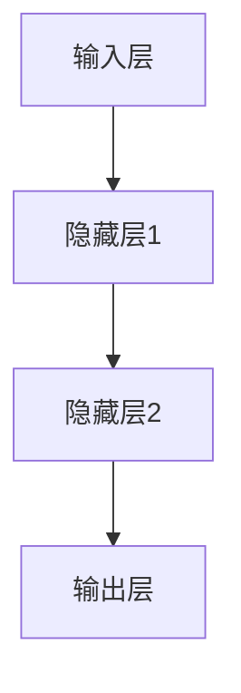

非常感谢您的任务要求,我会尽最大努力遵循约束条件,撰写一篇高质量的技术博客文章。以下是正文部分:

# 深度学习 原理与代码实例讲解

## 1. 背景介绍

### 1.1 人工智能的发展历程

人工智能作为一门新兴的交叉学科,已经成为当今科技发展的前沿领域之一。自20世纪50年代问世以来,人工智能经历了多个阶段的发展,从早期的专家系统、机器学习,到如今的深度学习等。其中,深度学习是近年来最炙手可热的人工智能技术,正在推动着人工智能的新一轮革命。

### 1.2 深度学习的兴起

深度学习作为机器学习的一个新的研究方向,其核心思想是通过对数据进行表征学习,使计算机在特征学习的基础上完成特定任务。相比传统的机器学习算法,深度学习具有自动从数据中学习特征表示的能力,不需要人工设计特征,从而极大地提高了机器学习的性能。

随着算力的飞速提升、大数据时代的来临以及一些突破性算法的提出,深度学习技术在语音识别、图像识别、自然语言处理等领域取得了突破性进展,推动了人工智能的快速发展。如今,深度学习已经广泛应用于计算机视觉、语音识别、自然语言处理等诸多领域,正在深刻改变着人类的生产和生活方式。

## 2. 核心概念与联系

### 2.1 神经网络

神经网络是深度学习的核心基础,它借鉴了生物神经元的工作原理,通过构建神经元层级网络来模拟人类大脑的运作机制。神经网络由输入层、隐藏层和输出层组成,每一层由多个神经元节点构成。在训练过程中,通过调整网络中的权重和偏置参数,使网络能够从数据中学习特征表示,并对新的输入数据做出正确的预测或决策。

### 2.2 深度学习与机器学习的关系

深度学习是机器学习的一个分支,二者有着密切的联系。机器学习是一种使计算机具备学习能力的技术,通过对数据进行建模,使计算机能够自动分析数据并获取知识。而深度学习则是机器学习中的一种特殊形式,它利用神经网络模型对数据进行表征学习,自动从数据中提取特征,从而完成特定的任务。

深度学习相比传统的机器学习算法具有许多优势,如自动从数据中学习特征表示、处理高维数据的能力更强等。但深度学习也存在一些缺陷,如需要大量的数据和计算资源、模型可解释性较差等。因此,在实际应用中,需要根据具体问题选择合适的机器学习算法。

### 2.3 深度学习的主要模型

深度学习中常用的模型有卷积神经网络(CNN)、循环神经网络(RNN)、长短期记忆网络(LSTM)、门控循环单元网络(GRU)等。这些模型在不同的应用场景下具有各自的优势:

- CNN擅长处理图像、视频等二维数据,在计算机视觉领域表现出色。
- RNN/LSTM/GRU等循环神经网络则更适合于处理序列数据,如自然语言处理、语音识别等。
- 此外,还有一些新兴的深度学习模型,如生成对抗网络(GAN)、变分自编码器(VAE)等,在图像生成、异常检测等领域有着广泛的应用前景。

## 3. 核心算法原理具体操作步骤  

### 3.1 前向传播

前向传播是深度神经网络的基本运算过程,它将输入数据通过网络层层传递,最终得到输出结果。具体步骤如下:

1. 输入层接收输入数据,并传递到隐藏层。
2. 隐藏层对输入数据进行加权求和,并通过激活函数(如ReLU、Sigmoid等)进行非线性变换,得到隐藏层的输出。
3. 重复上一步骤,直到最后一个隐藏层将数据传递到输出层。
4. 输出层对最后一个隐藏层的输出进行加权求和,得到最终的输出结果。

在前向传播过程中,每一层的输出都是通过前一层输出与权重相乘,再加上偏置项,最后通过激活函数进行非线性变换得到的。数学表达式如下:

$$
h_l = f(W_l \cdot h_{l-1} + b_l)
$$

其中,$h_l$表示第$l$层的输出,$W_l$和$b_l$分别表示该层的权重和偏置,$f$为激活函数。

### 3.2 反向传播

反向传播是深度学习模型训练的关键步骤,它通过计算损失函数对网络参数的梯度,并使用优化算法(如梯度下降)来更新网络参数,从而最小化损失函数,提高模型的预测精度。具体步骤如下:

1. 计算输出层的损失函数,如交叉熵损失、均方误差等。
2. 计算输出层参数的梯度,即损失函数关于输出层参数的偏导数。
3. 利用链式法则,计算隐藏层参数的梯度。
4. 使用优化算法(如随机梯度下降)更新网络参数。
5. 重复上述步骤,直到模型收敛或达到最大迭代次数。

在反向传播过程中,我们需要计算每一层参数的梯度,以便更新参数。梯度的计算过程可以利用链式法则,从输出层开始,逐层向前传播。以输出层为例,损失函数关于权重的梯度可以表示为:

$$
\frac{\partial L}{\partial W_L} = \frac{\partial L}{\partial y} \cdot \frac{\partial y}{\partial W_L}
$$

其中,$L$表示损失函数,$y$表示输出层的输出,$W_L$表示输出层的权重。通过这种方式,我们可以计算出每一层参数的梯度,并使用优化算法更新参数。

### 3.3 优化算法

在深度学习模型的训练过程中,我们需要使用优化算法来更新网络参数,以最小化损失函数。常用的优化算法包括:

1. **随机梯度下降(SGD)**:每次更新时只使用一个或一小批数据样本计算梯度,更新速度快,但可能会振荡。
2. **动量优化(Momentum)**:在SGD的基础上,引入了动量项,可以加快收敛速度并跳出局部最优。
3. **RMSProp**:通过对梯度进行指数加权平均,自适应地调整每个参数的学习率,提高收敛速度。
4. **Adam**:结合了动量优化和RMSProp的优点,是当前较为常用的优化算法之一。

以Adam优化算法为例,其更新参数的公式如下:

$$
\begin{aligned}
m_t &= \beta_1 m_{t-1} + (1 - \beta_1) g_t \\
v_t &= \beta_2 v_{t-1} + (1 - \beta_2) g_t^2 \\
\hat{m}_t &= \frac{m_t}{1 - \beta_1^t} \\
\hat{v}_t &= \frac{v_t}{1 - \beta_2^t} \\
\theta_{t+1} &= \theta_t - \frac{\alpha}{\sqrt{\hat{v}_t} + \epsilon} \hat{m}_t
\end{aligned}
$$

其中,$m_t$和$v_t$分别表示梯度和梯度平方的指数加权平均值,$\beta_1$和$\beta_2$是相应的衰减率,$\hat{m}_t$和$\hat{v}_t$是对应的偏差修正值,$\alpha$是学习率,$\epsilon$是一个很小的常数,用于避免除以0。通过这种方式,Adam可以自适应地调整每个参数的学习率,加快收敛速度。

## 4. 数学模型和公式详细讲解举例说明

### 4.1 损失函数

损失函数是衡量模型预测值与真实值之间差距的指标,在深度学习中常用的损失函数包括:

1. **均方误差(MSE)**: $L = \frac{1}{n} \sum_{i=1}^{n} (y_i - \hat{y}_i)^2$
2. **交叉熵损失(CE)**: $L = -\frac{1}{n} \sum_{i=1}^{n} [y_i \log \hat{y}_i + (1 - y_i) \log (1 - \hat{y}_i)]$

其中,$n$表示样本数量,$y_i$和$\hat{y}_i$分别表示第$i$个样本的真实值和预测值。

均方误差损失函数常用于回归问题,它直观地度量了预测值与真实值之间的差距。而交叉熵损失函数则更适用于分类问题,它度量了预测概率分布与真实概率分布之间的差异。

在实际应用中,我们还可以根据具体问题引入其他形式的损失函数,如Focal Loss、Triplet Loss等,以提高模型的性能。

### 4.2 激活函数

激活函数在深度神经网络中扮演着非常重要的角色,它引入了非线性,使得神经网络能够拟合更加复杂的函数。常用的激活函数包括:

1. **Sigmoid函数**: $f(x) = \frac{1}{1 + e^{-x}}$
2. **Tanh函数**: $f(x) = \frac{e^x - e^{-x}}{e^x + e^{-x}}$
3. **ReLU函数**: $f(x) = \max(0, x)$

Sigmoid和Tanh函数的输出值域都在(0,1)或(-1,1)之间,容易出现梯度消失问题。而ReLU函数则能很好地缓解梯度消失问题,使得深层网络的训练更加高效。

除了上述常用的激活函数,还有一些变体激活函数,如Leaky ReLU、ELU等,它们在不同的场景下具有各自的优势。选择合适的激活函数对于提高深度神经网络的性能至关重要。

### 4.3 正则化

在深度学习模型训练过程中,我们常常会遇到过拟合的问题,即模型在训练数据上表现良好,但在测试数据上的性能却较差。为了缓解过拟合,我们可以引入正则化技术,常用的正则化方法包括:

1. **L1正则化**: $\Omega(\theta) = \lambda \sum_{i=1}^{n} |\theta_i|$
2. **L2正则化**: $\Omega(\theta) = \lambda \sum_{i=1}^{n} \theta_i^2$

其中,$\theta$表示模型参数,$\lambda$是正则化系数,用于控制正则化强度。

L1正则化可以产生稀疏解,即部分参数会被压缩为0,从而实现特征选择的作用。而L2正则化则会使参数值趋向于较小,但不会压缩为0。

除了L1和L2正则化,我们还可以使用其他正则化技术,如Dropout、BatchNormalization等,它们通过不同的方式来缓解过拟合问题。

### 4.4 优化器

在深度学习模型的训练过程中,我们需要使用优化算法来更新网络参数,以最小化损失函数。常用的优化算法包括:

1. **随机梯度下降(SGD)**: $\theta_{t+1} = \theta_t - \alpha \nabla_\theta L(\theta_t)$
2. **动量优化(Momentum)**: $v_{t+1} = \gamma v_t + \alpha \nabla_\theta L(\theta_t)$, $\theta_{t+1} = \theta_t - v_{t+1}$
3. **RMSProp**: $E[g^2]_{t+1} = \beta E[g^2]_t + (1 - \beta) (\nabla_\theta L(\theta_t))^2$, $\theta_{t+1} = \theta_t - \frac{\alpha}{\sqrt{E[g^2]_{t+1} + \epsilon}} \nabla_\theta L(\theta_t)$
4. **Adam**: $m_{t+1} = \beta_1 m_t + (1 - \beta_1) \nabla_\theta L(\theta_t)$, $v_{t+1} = \beta_2 v_t + (1 - \beta_2) (\nabla_\theta L(\theta_t))