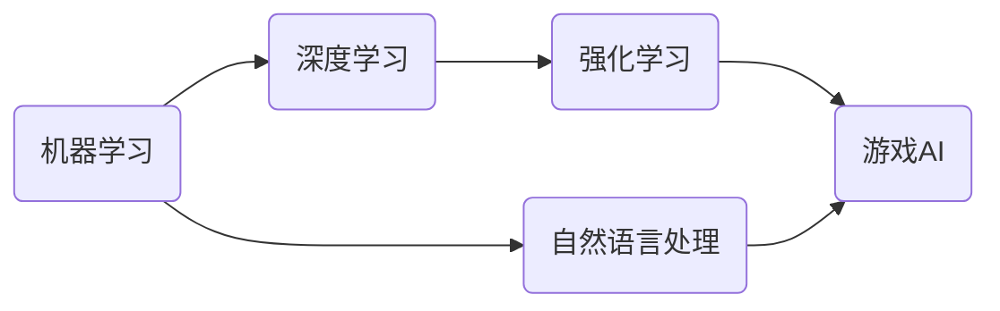
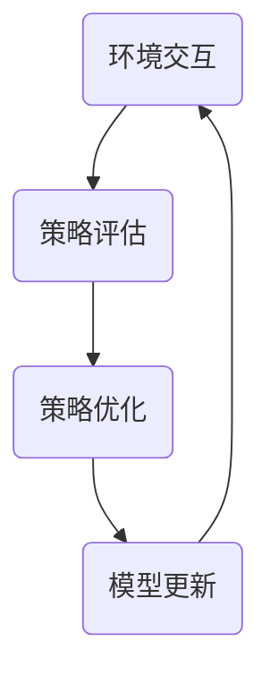

# 游戏AI：激发创新的大模型应用

## 1. 背景介绍

随着人工智能技术的飞速发展，游戏AI已经成为了研究和应用的热点领域。从早期的规则引擎到现在的深度学习模型，游戏AI的演进不仅推动了游戏产业的创新，也为人工智能技术的发展提供了丰富的实验场景。特别是大模型（Large Model）的出现，为游戏AI带来了前所未有的潜力和挑战。

## 2. 核心概念与联系

游戏AI涉及多个核心概念，包括但不限于机器学习、深度学习、强化学习、自然语言处理等。这些技术相互联系，共同构成了游戏AI的基础框架。



## 3. 核心算法原理具体操作步骤

游戏AI的核心算法原理主要基于强化学习，其操作步骤可以概括为环境交互、策略评估、策略优化和模型更新。



## 4. 数学模型和公式详细讲解举例说明

以Q学习（Q-Learning）为例，其数学模型主要基于马尔可夫决策过程（MDP）。Q学习的目标是学习一个策略$\pi$，使得累积奖励最大化。

$$ Q(s_t, a_t) \leftarrow Q(s_t, a_t) + \alpha [r_{t+1} + \gamma \max_{a} Q(s_{t+1}, a) - Q(s_t, a_t)] $$

其中，$s_t$和$a_t$分别代表当前状态和动作，$r_{t+1}$是执行动作后获得的即时奖励，$\alpha$是学习率，$\gamma$是折扣因子。

## 5. 项目实践：代码实例和详细解释说明

以Python语言为例，实现一个简单的Q学习算法：

```python
import numpy as np

# 初始化Q表
Q = np.zeros([环境状态数, 可能动作数])

# Q学习过程
for episode in range(总迭代轮数):
    s = 环境.初始化状态()
    
    while not 结束:
        a = 选择动作(s, Q)
        s_next, r, 结束, _ = 环境.执行动作(a)
        Q[s, a] = Q[s, a] + alpha * (r + gamma * np.max(Q[s_next]) - Q[s, a])
        s = s_next
```

## 6. 实际应用场景

游戏AI的实际应用场景包括但不限于游戏角色行为控制、游戏内容生成、玩家行为分析、游戏测试自动化等。

## 7. 工具和资源推荐

- TensorFlow
- PyTorch
- OpenAI Gym
- Unity ML-Agents

## 8. 总结：未来发展趋势与挑战

游戏AI的未来发展趋势将更加注重模型的泛化能力和实时交互性。同时，如何平衡AI的挑战性和娱乐性，如何保护玩家隐私，也是未来发展的重要挑战。

## 9. 附录：常见问题与解答

Q1: 游戏AI和传统AI有何不同？
A1: 游戏AI更加注重实时性、交互性和娱乐性。

Q2: 如何评估游戏AI的性能？
A2: 可以通过游戏胜率、任务完成率、玩家满意度等多个维度进行评估。

作者：禅与计算机程序设计艺术 / Zen and the Art of Computer Programming