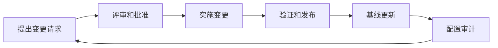
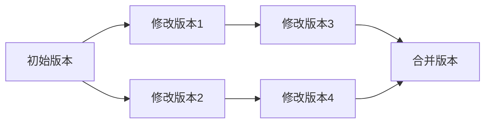

# 环境 (Environment)

## 1. 背景介绍

在计算机科学和软件工程领域,环境(Environment)是一个广泛的概念,它指的是系统或应用程序运行所需的各种外部条件和资源的总和。一个良好的环境对于软件的开发、测试、部署和运行至关重要。随着技术的不断发展,环境的概念也在不断演进和扩展。

环境可以分为多个层面,包括物理环境、操作系统环境、软件环境和网络环境等。物理环境指的是硬件设备,如服务器、个人电脑、移动设备等。操作系统环境则包括不同的操作系统及其配置。软件环境包括各种编程语言、框架、库、中间件和数据库等。网络环境则涉及网络拓扑结构、协议、带宽和安全性等方面。

良好的环境管理对于保证软件的可靠性、性能和安全性至关重要。在软件开发生命周期的各个阶段,环境都扮演着重要的角色。例如,在开发阶段,开发人员需要配置适当的开发环境,包括集成开发环境(IDE)、版本控制系统、构建工具等。在测试阶段,需要准备与生产环境尽可能相似的测试环境,以确保软件在部署后能够正常运行。在部署和运行阶段,则需要配置生产环境,包括应用服务器、数据库服务器、负载均衡器等。

随着云计算、容器和微服务等新兴技术的兴起,环境管理也面临着新的挑战和机遇。云环境提供了灵活的资源调配和扩展能力,但也带来了新的安全和合规性挑战。容器技术则使得应用程序的打包、部署和运行变得更加便捷,但也需要对容器环境进行适当的管理和监控。微服务架构则要求环境能够支持大量独立的服务之间的通信和协作。

## 2. 核心概念与联系

环境管理涉及多个核心概念,包括配置管理、版本控制、构建自动化、容器化、虚拟化、云环境等。这些概念相互关联,共同构建了现代环境管理的基础。

### 2.1 配置管理

配置管理(Configuration Management)是指对系统的配置进行有计划和系统的控制,以确保系统的完整性和可追踪性。在环境管理中,配置管理包括对环境中各种资源(如服务器、数据库、中间件等)的配置进行管理和版本控制。

配置管理通常采用专门的工具和流程,如Git、Subversion等版本控制系统,以及Ansible、Puppet、Chef等配置管理工具。这些工具可以帮助开发人员和运维人员跟踪和管理环境的变更,并在必要时进行回滚或恢复。

### 2.2 版本控制

版本控制(Version Control)是一种记录文件或文件集随时间变化的系统,它可以让多个人共同操作同一批文件,并记录每个人所做的更改。在环境管理中,版本控制系统通常用于管理源代码、配置文件、脚本等与环境相关的文件。

常用的版本控制系统包括Git、Subversion、Mercurial等。这些系统不仅可以记录文件的变更历史,还可以支持分支管理、合并、标签等功能,方便协作和版本管理。

### 2.3 构建自动化

构建自动化(Build Automation)是指通过自动化工具和流程,将源代码、库、配置文件等资源组装成可部署的软件包或镜像。在环境管理中,构建自动化可以确保软件包或镜像的一致性和可重复性,从而简化部署和环境管理的过程。

常用的构建自动化工具包括Make、Ant、Maven、Gradle、Jenkins等。这些工具可以自动执行编译、测试、打包等步骤,并将生成的软件包或镜像推送到指定的存储库或环境中。

### 2.4 容器化

容器化(Containerization)是一种操作系统级虚拟化技术,它可以将应用程序及其依赖项打包成一个独立的容器镜像,并在任何支持容器运行时的环境中运行。容器化可以提高应用程序的可移植性和一致性,简化环境管理的复杂性。

Docker是最流行的容器技术,它提供了一套完整的工具和平台,用于构建、分发和运行容器化应用程序。除了Docker,还有其他容器技术,如Kubernetes、Mesos、Swarm等,用于管理和编排容器化应用程序在多个主机上的部署和运行。

### 2.5 虚拟化

虚拟化(Virtualization)是一种通过软件模拟硬件资源的技术,它可以在单个物理机器上运行多个虚拟机(Virtual Machine,VM)。每个虚拟机都拥有独立的操作系统、应用程序和资源,就像一台独立的物理机器一样。

虚拟化技术可以提高硬件资源的利用率,并为不同的环境提供隔离和安全性。常用的虚拟化技术包括VMware、Hyper-V、Xen等。虚拟化与容器化技术相比,虚拟化的开销较大,但提供了更强的隔离性和安全性。

### 2.6 云环境

云环境(Cloud Environment)是指通过互联网提供按需可扩展的计算资源,如存储、网络、服务器等。云环境可以分为公有云、私有云和混合云。公有云由云服务提供商(如AWS、Azure、Google Cloud)提供,用户可以按需租用资源;私有云则由企业自己建立和管理;混合云则结合了公有云和私有云的优势。

云环境为环境管理带来了新的机遇和挑战。一方面,云环境提供了灵活的资源调配和扩展能力,可以根据需求动态分配和释放资源。另一方面,云环境也带来了新的安全和合规性挑战,需要采取适当的措施来保护数据和应用程序的安全性。

## 3. 核心算法原理具体操作步骤

环境管理涉及多个核心算法和流程,包括配置管理、版本控制、构建自动化、容器编排等。这些算法和流程共同构建了现代环境管理的基础。

### 3.1 配置管理算法

配置管理算法旨在确保系统配置的一致性和可追踪性。常见的配置管理算法包括:

1. **配置项目录(Configuration Item Listing, CIL)**: 列出所有需要管理的配置项,包括硬件、软件、文档等。
2. **配置基线(Configuration Baseline)**: 定义一组经过批准的配置项,作为后续变更的参考。
3. **配置控制板(Configuration Control Board, CCB)**: 评审和批准配置变更请求。
4. **配置审计(Configuration Audit)**: 定期检查配置项是否符合基线要求。

配置管理算法通常由专门的配置管理工具(如Ansible、Puppet、Chef等)实现和自动化。

### 3.2 版本控制算法

版本控制算法用于跟踪和管理文件的变更历史,支持多人协作和版本管理。常见的版本控制算法包括:

1. **差异算法(Diff Algorithm)**: 计算两个文件版本之间的差异,用于跟踪变更。
2. **合并算法(Merge Algorithm)**: 将不同分支上的变更合并到同一个版本。
3. **分支管理算法(Branch Management Algorithm)**: 创建、切换和合并不同的开发分支。
4. **标签算法(Tagging Algorithm)**: 为特定版本添加标签,方便后续引用和管理。

版本控制算法通常由版本控制系统(如Git、Subversion等)实现和自动化。

### 3.3 构建自动化算法

构建自动化算法用于将源代码、库、配置文件等资源组装成可部署的软件包或镜像。常见的构建自动化算法包括:

1. **依赖解析算法(Dependency Resolution Algorithm)**: 解析和下载所需的依赖库。
2. **编译算法(Compilation Algorithm)**: 将源代码编译成可执行文件或库。
3. **测试算法(Testing Algorithm)**: 执行单元测试、集成测试等,确保软件质量。
4. **打包算法(Packaging Algorithm)**: 将编译好的文件、配置文件等打包成可部署的软件包或镜像。

构建自动化算法通常由构建工具(如Make、Ant、Maven、Gradle等)和持续集成/持续交付(CI/CD)平台(如Jenkins、Travis CI等)实现和自动化。

### 3.4 容器编排算法

容器编排算法用于管理和协调容器化应用程序在多个主机上的部署和运行。常见的容器编排算法包括:

1. **调度算法(Scheduling Algorithm)**: 决定将容器实例部署到哪个主机上。
2. **服务发现算法(Service Discovery Algorithm)**: 自动发现和注册容器实例,实现服务间通信。
3. **负载均衡算法(Load Balancing Algorithm)**: 将请求均匀分发到多个容器实例上。
4. **自动伸缩算法(Auto-Scaling Algorithm)**: 根据资源利用率和负载情况,自动扩展或缩减容器实例数量。
5. **健康检查算法(Health Checking Algorithm)**: 定期检查容器实例的健康状态,并重启或替换不健康的实例。

容器编排算法通常由容器编排平台(如Kubernetes、Mesos、Swarm等)实现和自动化。

这些核心算法和流程共同构建了现代环境管理的基础,确保了环境的一致性、可追踪性和自动化。随着技术的不断发展,这些算法也在不断演进和优化,以适应新的需求和挑战。

## 4. 数学模型和公式详细讲解举例说明

在环境管理领域,有一些数学模型和公式可以帮助我们更好地理解和优化环境管理过程。下面我们将详细讲解其中几个重要的模型和公式。

### 4.1 配置管理模型

配置管理模型(Configuration Management Model)描述了配置项在其生命周期内的状态转换过程。一个常见的配置管理模型是 PMBOK(Project Management Body of Knowledge)中定义的模型,如下所示:

在这个模型中,配置项经历了以下阶段:

1. 提出变更请求(Change Request)
2. 评审和批准(Review and Approval)
3. 实施变更(Implement Change)
4. 验证和发布(Verify and Release)
5. 基线更新(Baseline Update)
6. 配置审计(Configuration Audit)

该模型强调了配置管理的闭环过程,确保配置项的变更得到适当的控制和跟踪。

### 4.2 版本控制模型

版本控制模型(Version Control Model)描述了文件在版本控制系统中的状态转换过程。一个常见的版本控制模型是基于有向无环图(Directed Acyclic Graph, DAG)的模型,如下所示:

在这个模型中,每个节点代表一个文件版本,边代表从一个版本到另一个版本的修改。版本控制系统通过维护这个有向无环图,可以跟踪文件的变更历史,支持分支管理、合并等操作。

该模型还可以扩展到分布式版本控制系统(如Git),其中每个节点不仅代表一个版本,还包含了元数据(如作者、时间戳等)。

### 4.3 容器调度模型

容器调度模型(Container Scheduling Model)描述了如何将容器实例调度到合适的主机上运行。一个常见的容器调度模型是基于整数线性规划(Integer Linear Programming, ILP)的模型,如下所示:

$$
\begin{aligned}
\text{maximize} \quad & \sum_{i=1}^{n} \sum_{j=1}^{m} x_{ij} \\
\text{subject to} \quad & \sum_{j=1}^{m} x_{ij} = 1, \quad \forall i \in \{1, \ldots, n\} \\
& \sum_{i=1}^{n} x_{ij} \cdot r_i^{\text{CPU}} \leq C_j^{\text{CPU}}, \quad \forall j \in \{1,