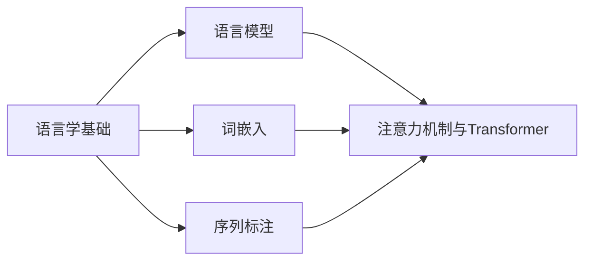

# 现代自然语言处理：从规则到统计

## 1. 背景介绍
### 1.1 自然语言处理的发展历程
#### 1.1.1 早期规则系统
#### 1.1.2 基于统计的方法兴起  
#### 1.1.3 深度学习的崛起
### 1.2 自然语言处理的应用领域
#### 1.2.1 机器翻译
#### 1.2.2 信息检索与问答系统
#### 1.2.3 情感分析与舆情监测
#### 1.2.4 对话系统与智能助手

## 2. 核心概念与联系
### 2.1 语言学基础
#### 2.1.1 语音学
#### 2.1.2 形态学
#### 2.1.3 句法学
#### 2.1.4 语义学
#### 2.1.5 语用学
### 2.2 语言模型
#### 2.2.1 N-gram模型
#### 2.2.2 神经网络语言模型
#### 2.2.3 预训练语言模型
### 2.3 词嵌入
#### 2.3.1 One-hot编码
#### 2.3.2 Word2Vec
#### 2.3.3 GloVe
#### 2.3.4 FastText
### 2.4 序列标注
#### 2.4.1 隐马尔可夫模型(HMM)
#### 2.4.2 条件随机场(CRF)
#### 2.4.3 循环神经网络(RNN)
### 2.5 注意力机制与Transformer
#### 2.5.1 Seq2Seq模型
#### 2.5.2 注意力机制
#### 2.5.3 Transformer架构



## 3. 核心算法原理具体操作步骤
### 3.1 Word2Vec
#### 3.1.1 CBOW模型
1. 选择窗口大小，确定上下文词
2. 将上下文词向量求和平均，得到隐层向量
3. 隐层向量与输出矩阵相乘，通过softmax得到目标词的概率分布
4. 根据真实目标词，计算交叉熵损失，并通过反向传播更新参数

#### 3.1.2 Skip-gram模型 
1. 选择窗口大小，确定上下文词
2. 目标词向量与输出矩阵相乘，通过softmax得到每个上下文词的概率分布
3. 根据真实上下文词，计算交叉熵损失，并通过反向传播更新参数

### 3.2 Transformer
#### 3.2.1 编码器
1. 输入词嵌入与位置编码相加
2. 多头自注意力层：将输入拆分为多个头，分别计算自注意力，并拼接结果
3. 前馈神经网络层：两层全连接网络，中间使用ReLU激活

#### 3.2.2 解码器
1. 输出词嵌入与位置编码相加
2. 带mask的多头自注意力层：防止看到未来信息
3. 编码-解码注意力层：将编码器输出作为key和value，解码器自注意力输出作为query
4. 前馈神经网络层：与编码器相同
5. 线性层+softmax：输出目标词概率分布

## 4. 数学模型和公式详细讲解举例说明
### 4.1 Word2Vec的目标函数
对于CBOW模型，目标是最大化给定上下文的目标词概率：

$$\arg\max_\theta \prod_{w\in C} p(w_t|w_{t-k},...,w_{t-1},w_{t+1},...,w_{t+k};\theta)$$

其中$w_t$为目标词，$w_{t-k},...,w_{t-1},w_{t+1},...,w_{t+k}$为上下文词，$\theta$为模型参数。

对于Skip-gram模型，目标是最大化给定目标词生成上下文词的概率：

$$\arg\max_\theta \prod_{w\in C} \prod_{-k\leq j\leq k,j\neq0} p(w_{t+j}|w_t;\theta)$$

其中$w_t$为目标词，$w_{t+j}$为上下文词，$k$为窗口大小。

### 4.2 Transformer的自注意力机制
自注意力分数计算公式：

$$\text{Attention}(Q,K,V)=\text{softmax}(\frac{QK^T}{\sqrt{d_k}})V$$

其中$Q$为查询矩阵，$K$为键矩阵，$V$为值矩阵，$d_k$为键向量维度。

多头自注意力将$Q$、$K$、$V$通过线性变换拆分为多个头，分别计算自注意力并拼接：

$$\text{MultiHead}(Q,K,V)=\text{Concat}(\text{head}_1,...,\text{head}_h)W^O$$

$$\text{head}_i=\text{Attention}(QW_i^Q,KW_i^K,VW_i^V)$$

其中$W_i^Q$、$W_i^K$、$W_i^V$为第$i$个头的权重矩阵，$W^O$为输出的线性变换矩阵。

## 5. 项目实践：代码实例和详细解释说明
### 5.1 使用Gensim训练Word2Vec模型
```python
from gensim.models import Word2Vec

# 准备文本数据
sentences = [['this', 'is', 'the', 'first', 'sentence'],
             ['this', 'is', 'the', 'second', 'sentence']]

# 训练Word2Vec模型
model = Word2Vec(sentences, vector_size=100, window=5, min_count=1, workers=4)

# 获取词向量
vector = model.wv['sentence']
```

- `sentences`：训练数据，每个句子为单词列表
- `vector_size`：词向量维度
- `window`：上下文窗口大小  
- `min_count`：最小词频阈值
- `workers`：训练线程数

### 5.2 使用PyTorch实现Transformer
```python
import torch
import torch.nn as nn

class MultiHeadAttention(nn.Module):
    def __init__(self, d_model, num_heads):
        super().__init__()
        self.d_model = d_model
        self.num_heads = num_heads
        self.head_dim = d_model // num_heads
        
        self.q_linear = nn.Linear(d_model, d_model)
        self.k_linear = nn.Linear(d_model, d_model)  
        self.v_linear = nn.Linear(d_model, d_model)
        self.out_linear = nn.Linear(d_model, d_model)

    def forward(self, query, key, value, mask=None):
        batch_size = query.size(0)
        
        # 线性变换
        Q = self.q_linear(query)
        K = self.k_linear(key)
        V = self.v_linear(value)
        
        # 拆分为多个头
        Q = Q.view(batch_size, -1, self.num_heads, self.head_dim).transpose(1, 2) 
        K = K.view(batch_size, -1, self.num_heads, self.head_dim).transpose(1, 2)
        V = V.view(batch_size, -1, self.num_heads, self.head_dim).transpose(1, 2)
        
        # 计算注意力分数
        scores = torch.matmul(Q, K.transpose(-2, -1)) / torch.sqrt(torch.tensor(self.head_dim, dtype=torch.float32))
        if mask is not None:
            scores = scores.masked_fill(mask == 0, -1e9)
        attn_weights = nn.functional.softmax(scores, dim=-1)
        
        # 加权求和
        attn_output = torch.matmul(attn_weights, V)
        attn_output = attn_output.transpose(1, 2).contiguous().view(batch_size, -1, self.d_model)
        
        # 线性变换
        output = self.out_linear(attn_output)
        return output
```

- `d_model`：词嵌入维度
- `num_heads`：注意力头数
- `head_dim`：每个头的维度
- `q_linear`、`k_linear`、`v_linear`：计算Q、K、V的线性变换
- `out_linear`：多头注意力结果的线性变换
- `mask`：掩码矩阵，用于屏蔽无效位置的注意力分数

## 6. 实际应用场景
### 6.1 智能客服
- 利用自然语言理解技术，解析用户问题的意图和槽位信息
- 基于问题意图和上下文，从知识库中检索相关答案
- 使用对话生成模型，结合答案和用户画像，生成个性化回复

### 6.2 内容推荐  
- 对用户历史浏览、评论、点赞等行为进行文本挖掘，提取用户兴趣偏好
- 利用主题模型、词嵌入等技术，对文章、视频等内容进行主题和语义表示
- 通过用户兴趣和内容表示的匹配，实现个性化推荐

### 6.3 智能写作助手
- 使用语言模型，根据上文预测下一个词，辅助用户写作
- 基于大规模语料训练的预训练语言模型，可生成连贯、流畅的文本
- 结合知识图谱、文本纠错等技术，提供写作素材推荐、语法检查等功能

## 7. 工具和资源推荐
### 7.1 开源工具包
- NLTK：集成了语料库、分词、词性标注、句法分析等常用NLP工具
- SpaCy：专注于工业级应用，提供高性能的分词、命名实体识别等组件
- Gensim：主题模型工具包，包括LDA、LSI等无监督模型
- HuggingFace Transformers：集成了BERT、GPT等预训练语言模型及应用

### 7.2 语料库资源
- 维基百科：多语言的协作式百科全书，可用于语言模型训练
- 谷歌图书n-gram：多种语言的n-gram频率统计数据
- Common Crawl：网页抓取数据集，包含大量不同语言的网页内容
- 中文语料库：人民日报、微博、小说等各类中文语料

### 7.3 预训练模型
- Word2Vec：经典的词嵌入模型，可以预训练词向量
- GloVe：基于全局词频统计的词嵌入模型  
- BERT：基于Transformer的双向预训练语言模型
- GPT：基于Transformer的单向生成式预训练语言模型
- T5：基于Transformer的文本到文本迁移学习模型

## 8. 总结：未来发展趋势与挑战
### 8.1 预训练语言模型的发展
- 模型规模不断增大，参数量达到数百亿甚至上千亿
- 训练数据更加多样化，涵盖文本、图像、视频等多模态数据
- 模型结构不断创新，如Transformer-XL、XLNet、ELECTRA等

### 8.2 低资源语言的处理
- 大多数语言缺乏大规模标注数据，难以训练高性能模型  
- 通过零样本学习、小样本学习等迁移学习方法，利用高资源语言辅助低资源语言学习
- 构建多语言预训练模型，在不同语言间共享知识

### 8.3 知识融合与推理
- 将结构化知识图谱与非结构化文本相结合，增强语言理解能力
- 通过因果推理、常识推理等，使模型具备类似人类的逻辑思维能力
- 融合规则知识与统计知识，实现可解释、可控的NLP系统

### 8.4 鲁棒性与公平性
- 模型面临对抗攻击、数据偏差等挑战，导致性能不稳定
- 需要研究鲁棒性增强方法，提高模型泛化能力和抗干扰能力
- 关注模型的公平性问题，消除数据中的偏见，避免歧视性决策

## 9. 附录：常见问题与解答
### 9.1 如何选择合适的词嵌入方法？
- 对于普通的NLP任务，可以直接使用预训练的词向量如Word2Vec、GloVe等
- 对于特定领域，可以在领域语料上fine-tune预训练词向量，或从头训练词向量
- 考虑词表大小、语料规模、任务类型等因素，选择合适的词嵌入维度

### 9.2 如何处理OOV（Out-of-Vocabulary）问题？
- 将低频词和未登录词映射到特殊的UNK向量
- 使用字符级别的词嵌入如FastText，可以通过字符的n-gram生成OOV词的词向量
- 使用Byte Pair Encoding (BPE) 算法，将词分解为更小的子词单元

### 9.3 如何解决