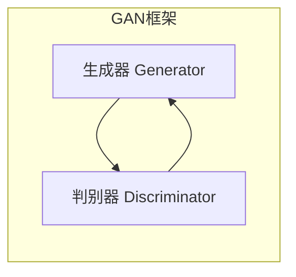

# 生成对抗网络（GAN）：生成与判别

## 1. 背景介绍

### 1.1 生成模型的重要性

在机器学习和人工智能领域,生成模型一直是一个具有挑战性的研究方向。生成模型旨在从训练数据中学习数据分布,并生成新的、逼真的样本数据。这种能力在许多领域都有广泛的应用,例如计算机视觉、自然语言处理、语音合成、艺术创作等。

传统的生成模型方法,如高斯混合模型(Gaussian Mixture Model, GMM)、隐马尔可夫模型(Hidden Markov Model, HMM)等,存在一些局限性,例如难以捕捉复杂数据分布、生成质量有限等。因此,研究人员一直在探索更加有效的生成模型方法。

### 1.2 生成对抗网络(GAN)的提出

2014年,伊恩·古德费勒(Ian Goodfellow)等人在他们的论文"生成对抗网络"中,提出了一种全新的生成模型框架——生成对抗网络(Generative Adversarial Networks, GAN)。这种方法的核心思想是将生成模型的训练过程建模为一个对抗过程,由两个神经网络相互对抗、相互博弈。

GAN的提出开启了生成模型的新时代,它展现了令人惊叹的生成能力,能够生成逼真的图像、语音、视频等数据。自从提出以来,GAN引发了机器学习和人工智能领域的广泛关注和研究热潮,并在多个领域取得了突破性的进展。

## 2. 核心概念与联系

### 2.1 生成对抗网络的基本框架

生成对抗网络(GAN)由两个神经网络组成:生成器(Generator)和判别器(Discriminator)。它们相互对抗,相互博弈,最终达到一种动态平衡。

- **生成器(Generator)**: 生成器的目标是从一个潜在的随机噪声分布中生成逼真的数据样本,以欺骗判别器。
- **判别器(Discriminator)**: 判别器的目标是区分生成器生成的样本和真实的训练数据样本,并提供二元分类结果(真实或生成)的反馈给生成器。

在训练过程中,生成器和判别器相互对抗、相互博弈,生成器努力生成更加逼真的样本以欺骗判别器,而判别器则努力提高自身的判别能力。通过这种对抗训练,生成器和判别器都在不断提高自身的能力,最终达到一种动态平衡,即生成器生成的样本无法被判别器区分开。

### 2.2 生成对抗网络的形式化描述

我们可以将生成对抗网络的训练过程形式化为一个**极小极大博弈问题(Minimax Game)**:

$$\underset{G}{\mathrm{min}}\,\underset{D}{\mathrm{max}}\,V(D,G) = \mathbb{E}_{x\sim p_{\mathrm{data}}(x)}[\log D(x)] + \mathbb{E}_{z\sim p_z(z)}[\log(1-D(G(z)))]$$

其中:

- $G$ 表示生成器的参数
- $D$ 表示判别器的参数
- $p_{\mathrm{data}}(x)$ 表示真实数据样本的分布
- $p_z(z)$ 表示生成器输入的随机噪声分布,通常是高斯分布或均匀分布
- $G(z)$ 表示生成器根据噪声 $z$ 生成的样本
- $D(x)$ 表示判别器对样本 $x$ 为真实数据的概率输出

生成器 $G$ 的目标是最小化这个目标函数,即生成的样本能够最大程度地欺骗判别器。而判别器 $D$ 的目标是最大化这个目标函数,即能够最大程度地区分真实数据和生成数据。通过这种对抗训练,生成器和判别器都在不断提高自身的能力,最终达到一种动态平衡。

### 2.3 生成对抗网络的训练过程

生成对抗网络的训练过程可以概括为以下步骤:

1. 初始化生成器 $G$ 和判别器 $D$ 的参数。
2. 从真实数据分布 $p_{\mathrm{data}}(x)$ 中采样一批真实数据样本。
3. 从噪声分布 $p_z(z)$ 中采样一批随机噪声,并将其输入生成器 $G$ 生成一批生成样本。
4. 将真实数据样本和生成样本输入判别器 $D$,计算判别器对于真实样本和生成样本的输出概率。
5. 更新判别器 $D$ 的参数,使其能够更好地区分真实样本和生成样本。
6. 更新生成器 $G$ 的参数,使其生成的样本能够更好地欺骗判别器 $D$。
7. 重复步骤2-6,直到达到收敛或满足停止条件。

通过这种对抗训练过程,生成器和判别器相互博弈、相互促进,最终达到一种动态平衡,即生成器生成的样本无法被判别器区分开。

## 3. 核心算法原理具体操作步骤

### 3.1 生成对抗网络的训练算法

生成对抗网络的训练算法可以概括为以下步骤:

1. 初始化生成器 $G$ 和判别器 $D$ 的参数。
2. 对于训练的每一个迭代:
   a. 从真实数据分布 $p_{\mathrm{data}}(x)$ 中采样一批真实数据样本 $\{x^{(i)}\}_{i=1}^{m}$。
   b. 从噪声分布 $p_z(z)$ 中采样一批随机噪声 $\{z^{(i)}\}_{i=1}^{m}$,并将其输入生成器 $G$ 生成一批生成样本 $\{G(z^{(i)})\}_{i=1}^{m}$。
   c. 更新判别器 $D$ 的参数:
      - 计算判别器对于真实样本的输出概率 $D(x^{(i)})$。
      - 计算判别器对于生成样本的输出概率 $D(G(z^{(i)}))$。
      - 更新判别器 $D$ 的参数,使其能够最大化以下目标函数:
        $$\frac{1}{m}\sum_{i=1}^{m}\log D(x^{(i)}) + \frac{1}{m}\sum_{i=1}^{m}\log(1-D(G(z^{(i)})))$$
   d. 更新生成器 $G$ 的参数:
      - 计算判别器对于生成样本的输出概率 $D(G(z^{(i)}))$。
      - 更新生成器 $G$ 的参数,使其能够最小化以下目标函数:
        $$\frac{1}{m}\sum_{i=1}^{m}\log(1-D(G(z^{(i)})))$$
3. 重复步骤2,直到达到收敛或满足停止条件。

在实际训练过程中,通常采用一些技巧和优化策略来提高训练的稳定性和效率,例如使用特殊的损失函数、正则化技术、架构改进等。

### 3.2 生成对抗网络的优化策略

由于生成对抗网络的训练过程涉及两个网络相互博弈,因此存在一些挑战和不稳定性。研究人员提出了一些优化策略来改进生成对抗网络的训练过程:

1. **改进的损失函数**:
   - **Wasserstein GAN(WGAN)**: 使用 Wasserstein 距离作为损失函数,提高了训练的稳定性。
   - **Least Squares GAN(LSGAN)**: 使用最小二乘损失函数,避免了传统交叉熵损失函数的梯度饱和问题。

2. **正则化技术**:
   - **梯度惩罚(Gradient Penalty)**: 在判别器的损失函数中加入梯度惩罚项,约束判别器满足 1-Lipschitz 条件,提高了训练的稳定性。
   - **谱归一化(Spectral Normalization)**: 对生成器和判别器的权重矩阵进行谱归一化,控制了网络的 Lipschitz 常数。

3. **架构改进**:
   - **深度卷积网络(Deep Convolutional Networks)**: 使用深度卷积神经网络作为生成器和判别器的架构,能够更好地捕捉图像数据的特征。
   - **自注意力机制(Self-Attention)**: 在生成器和判别器中引入自注意力机制,提高了对长程依赖关系的建模能力。

4. **训练技巧**:
   - **标签平滑(Label Smoothing)**: 在训练判别器时,对标签进行平滑处理,提高了判别器的鲁棒性。
   - **历史平均(Historical Averaging)**: 在生成器的训练过程中,使用历史生成样本的平均值作为目标,提高了生成质量。

这些优化策略的引入显著提高了生成对抗网络的训练稳定性和生成质量,推动了 GAN 在各个领域的应用。

## 4. 数学模型和公式详细讲解举例说明

### 4.1 生成对抗网络的目标函数

生成对抗网络的目标函数可以形式化为一个极小极大博弈问题:

$$\underset{G}{\mathrm{min}}\,\underset{D}{\mathrm{max}}\,V(D,G) = \mathbb{E}_{x\sim p_{\mathrm{data}}(x)}[\log D(x)] + \mathbb{E}_{z\sim p_z(z)}[\log(1-D(G(z)))]$$

其中:

- $G$ 表示生成器的参数
- $D$ 表示判别器的参数
- $p_{\mathrm{data}}(x)$ 表示真实数据样本的分布
- $p_z(z)$ 表示生成器输入的随机噪声分布,通常是高斯分布或均匀分布
- $G(z)$ 表示生成器根据噪声 $z$ 生成的样本
- $D(x)$ 表示判别器对样本 $x$ 为真实数据的概率输出

这个目标函数可以分解为两个部分:

1. $\mathbb{E}_{x\sim p_{\mathrm{data}}(x)}[\log D(x)]$: 这是判别器对于真实数据样本的期望输出概率的对数,判别器的目标是最大化这一项,即将真实样本的输出概率尽可能接近 1。

2. $\mathbb{E}_{z\sim p_z(z)}[\log(1-D(G(z)))]$: 这是判别器对于生成器生成样本的期望输出概率的对数的相反数,判别器的目标是最大化这一项,即将生成样本的输出概率尽可能接近 0。

生成器 $G$ 的目标是最小化这个目标函数,即生成的样本能够最大程度地欺骗判别器。而判别器 $D$ 的目标是最大化这个目标函数,即能够最大程度地区分真实数据和生成数据。

通过这种对抗训练,生成器和判别器都在不断提高自身的能力,最终达到一种动态平衡,即生成器生成的样本无法被判别器区分开。

### 4.2 生成对抗网络的训练算法详解

生成对抗网络的训练算法可以概括为以下步骤:

1. 初始化生成器 $G$ 和判别器 $D$ 的参数。

2. 对于训练的每一个迭代:
   a. 从真实数据分布 $p_{\mathrm{data}}(x)$ 中采样一批真实数据样本 $\{x^{(i)}\}_{i=1}^{m}$,其中 $m$ 表示批次大小。
   b. 从噪声分布 $p_z(z)$ 中采样一批随机噪声 $\{z^{(i)}\}_{i=1}^{m}$,并将其输入生成器 $G$ 生成一批生成样本 $\{G(z^{(i)})\}_{i=1}^{m}$。
   c. 更新判别器 $D$ 的参数:
      - 计算判别器对于真实样本的输出概率 $D(x^{(i)})$。
      - 计算判别器对于生成样本的输出概率 $D(G(z^{(i)}))$。
      - 更新判别器 $D$ 的参数