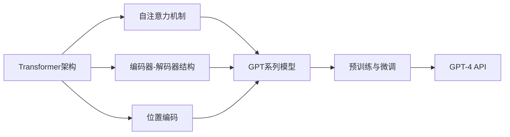

# 生生不息的循环：使用强大的GPT-4 API

## 1. 背景介绍
### 1.1 人工智能的发展历程
#### 1.1.1 早期人工智能的探索
#### 1.1.2 机器学习的崛起
#### 1.1.3 深度学习的突破

### 1.2 自然语言处理的演进
#### 1.2.1 基于规则的自然语言处理
#### 1.2.2 统计学方法的引入
#### 1.2.3 深度学习在自然语言处理中的应用

### 1.3 GPT系列模型的诞生
#### 1.3.1 Transformer架构的提出
#### 1.3.2 GPT-1到GPT-3的进化
#### 1.3.3 GPT-4的强大能力

## 2. 核心概念与联系
### 2.1 Transformer架构
#### 2.1.1 自注意力机制
#### 2.1.2 编码器-解码器结构
#### 2.1.3 位置编码

### 2.2 预训练与微调
#### 2.2.1 无监督预训练
#### 2.2.2 有监督微调
#### 2.2.3 零样本学习

### 2.3 GPT-4 API
#### 2.3.1 API的功能与特点
#### 2.3.2 API的使用方法
#### 2.3.3 API的性能与限制



## 3. 核心算法原理具体操作步骤
### 3.1 Transformer的计算过程
#### 3.1.1 输入嵌入
#### 3.1.2 自注意力计算
#### 3.1.3 前馈神经网络

### 3.2 GPT-4的训练过程
#### 3.2.1 数据准备
#### 3.2.2 模型初始化
#### 3.2.3 无监督预训练
#### 3.2.4 有监督微调

### 3.3 使用GPT-4 API的步骤
#### 3.3.1 获取API密钥
#### 3.3.2 构建请求
#### 3.3.3 解析响应

## 4. 数学模型和公式详细讲解举例说明
### 4.1 自注意力机制的数学表示
#### 4.1.1 查询、键、值的计算
$$Attention(Q,K,V) = softmax(\frac{QK^T}{\sqrt{d_k}})V$$
其中，$Q$、$K$、$V$分别表示查询、键、值，$d_k$为键的维度。

#### 4.1.2 多头注意力
$$MultiHead(Q,K,V) = Concat(head_1, ..., head_h)W^O$$
$$head_i = Attention(QW_i^Q, KW_i^K, VW_i^V)$$
其中，$W_i^Q$、$W_i^K$、$W_i^V$、$W^O$为可学习的权重矩阵。

### 4.2 位置编码的数学表示
$$PE_{(pos,2i)} = sin(pos/10000^{2i/d_{model}})$$
$$PE_{(pos,2i+1)} = cos(pos/10000^{2i/d_{model}})$$
其中，$pos$为位置，$i$为维度，$d_{model}$为模型维度。

## 5. 项目实践：代码实例和详细解释说明
### 5.1 使用Python调用GPT-4 API
```python
import openai

openai.api_key = "YOUR_API_KEY"

response = openai.Completion.create(
    engine="davinci",
    prompt="What is the capital of France?",
    max_tokens=50,
    n=1,
    stop=None,
    temperature=0.7,
)

print(response.choices[0].text.strip())
```
以上代码演示了如何使用Python调用GPT-4 API。首先，需要设置API密钥。然后，使用`openai.Completion.create()`方法发送请求，指定使用的引擎、提示、最大生成标记数等参数。最后，从响应中获取生成的文本。

### 5.2 使用JavaScript调用GPT-4 API
```javascript
const openai = require("openai");

openai.apiKey = "YOUR_API_KEY";

const response = await openai.completions.create({
  engine: "davinci",
  prompt: "What is the capital of France?",
  maxTokens: 50,
  n: 1,
  stop: null,
  temperature: 0.7,
});

console.log(response.data.choices[0].text.trim());
```
以上代码演示了如何使用JavaScript调用GPT-4 API。与Python示例类似，需要设置API密钥，然后使用`openai.completions.create()`方法发送请求，并从响应中获取生成的文本。

## 6. 实际应用场景
### 6.1 智能客服
#### 6.1.1 自动回复客户询问
#### 6.1.2 情感分析与个性化服务
#### 6.1.3 多语言支持

### 6.2 内容生成
#### 6.2.1 文章写作助手
#### 6.2.2 广告文案生成
#### 6.2.3 社交媒体帖子创作

### 6.3 代码辅助
#### 6.3.1 代码补全与建议
#### 6.3.2 代码解释与文档生成
#### 6.3.3 代码错误检测与修复

## 7. 工具和资源推荐
### 7.1 OpenAI官方文档
### 7.2 GPT-4相关论文与研究
### 7.3 开源实现与工具库

## 8. 总结：未来发展趋势与挑战
### 8.1 GPT-4的潜力与局限
### 8.2 人工智能伦理与安全
### 8.3 自然语言处理的未来方向

## 9. 附录：常见问题与解答
### 9.1 如何获取GPT-4 API密钥？
### 9.2 GPT-4 API的定价方式是什么？
### 9.3 使用GPT-4 API需要注意哪些事项？

GPT-4作为当前最先进的自然语言处理模型之一，其强大的语言理解和生成能力为各种应用场景带来了无限可能。通过使用GPT-4 API，开发者可以快速构建智能对话系统、内容生成工具、代码辅助等应用，极大地提高了开发效率和用户体验。

然而，在享受GPT-4带来的便利的同时，我们也需要审慎地考虑其潜在的风险与挑战。如何确保人工智能系统的公平性、透明性和可解释性，如何防范恶意使用和滥用，如何处理由AI生成内容引发的版权和隐私问题等，都是我们在推动人工智能发展过程中不得不面对的重要议题。

展望未来，随着计算能力的不断提升和算法的持续创新，自然语言处理技术必将迎来更加蓬勃的发展。而GPT-4 API作为连接人工智能与现实应用的重要桥梁，也将在这个过程中扮演越来越关键的角色。让我们携手并进，共同探索人工智能的无限可能，创造更加智能、高效、安全的未来。

作者：禅与计算机程序设计艺术 / Zen and the Art of Computer Programming