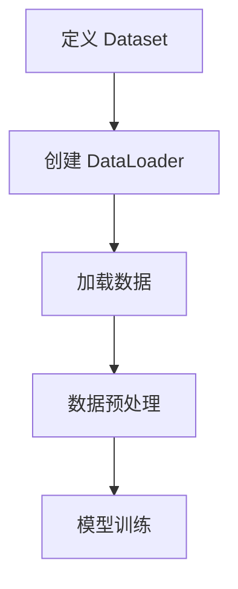

                 

作者：禅与计算机程序设计艺术

**用DataLoader提供的数据进行训练** 是机器学习领域中一个基本且关键的过程。通过合理有效地利用DataLoader，我们能够在大规模数据集上实现高效、可扩展的学习模型训练。本文旨在深入探讨如何使用DataLoader进行数据加载、预处理以及模型训练，同时分享一些最佳实践和未来发展趋势。

## 背景介绍
随着大数据时代的到来，数据量的爆炸式增长使得传统的数据处理方式难以满足需求。深度学习框架如PyTorch、TensorFlow提供了易于使用的API，其中DataLoader成为了处理大型数据集的重要组件。它不仅负责数据加载，还支持批处理、随机化、循环等功能，极大地提升了训练效率和模型性能。

## 核心概念与联系
DataLoader的主要作用是封装数据加载过程，简化了模型训练中的数据处理工作。它通常结合了`torch.utils.data.Dataset`和`torch.utils.data.DataLoader`两个类来完成这一任务。

- `Dataset`: 定义了一个接口用于描述数据集及其属性，如长度、获取单个样本的方法等。
- `DataLoader`: 在`Dataset`的基础上，实现了数据的批量加载、自动迭代、多线程读取等功能。

这种分层设计使得开发者可以专注于模型构建和优化，而将数据管理交给高性能的数据加载器处理。

## 核心算法原理具体操作步骤
以下是使用DataLoader进行训练的基本流程：



### 步骤分解：
1. **定义 Dataset**: 创建一个继承自 `torch.utils.data.Dataset` 的类，重写 `_len_()` 方法以返回数据集大小，及 `__getitem__()` 方法以根据索引返回单个样本。

2. **创建 DataLoader**: 初始化 `torch.utils.data.DataLoader` 对象时，需提供数据集实例、批次大小、是否打乱顺序等参数。

3. **加载数据**: DataLoader自动执行数据加载，支持批处理和迭代。

4. **数据预处理**: 使用 PyTorch 的张量转换函数（如 `transforms` 库）进行标准化、归一化等操作。

5. **模型训练**: 循环遍历 DataLoader，每次从数据集中获取一批数据进行前向传播、反向传播和更新权重。

## 数学模型和公式详细讲解举例说明
对于神经网络训练，损失函数（Loss Function）是一个核心元素，表示模型预测与真实值之间的差距。在使用DataLoader时，通常会采用均方误差（Mean Squared Error, MSE）或者交叉熵损失（Cross Entropy Loss），具体取决于任务类型（回归或分类）。

假设我们的目标是最小化损失函数 \( L \)，则训练过程的目标是调整参数 \( \theta \) 以使 \( L(\theta) \) 最小。这可以通过梯度下降方法实现，其更新规则为：
\[
\theta := \theta - \alpha \frac{\partial L}{\partial \theta}
\]
其中 \( \alpha \) 是学习率，控制着参数更新的幅度。

## 项目实践：代码实例和详细解释说明
下面是一个简单的基于PyTorch的DataLoader示例：

```python
import torch
from torchvision import datasets, transforms
from torch.utils.data import DataLoader

# 数据预处理
transform = transforms.Compose([
    transforms.ToTensor(),
    transforms.Normalize((0.5,), (0.5,))
])

# 加载 CIFAR-10 数据集
dataset = datasets.CIFAR10(root='./data', train=True, download=True, transform=transform)
dataloader = DataLoader(dataset, batch_size=64, shuffle=True)

# 模型定义
model = MyModel()

# 训练循环
for epoch in range(num_epochs):
    for inputs, labels in dataloader:
        outputs = model(inputs)
        loss = criterion(outputs, labels)
        optimizer.zero_grad()
        loss.backward()
        optimizer.step()
```

## 实际应用场景
DataLoader广泛应用于各种深度学习场景，包括但不限于图像识别、自然语言处理、强化学习等领域。特别是在处理大规模数据集时，它的并行加载能力能显著提升训练速度和系统资源利用率。

## 工具和资源推荐
- **PyTorch**: 强力推荐的深度学习框架之一，提供了丰富的数据处理和模型训练功能。
- **Scikit-learn**: 对于需要快速原型开发的小规模数据集，Scikit-learn 提供了简单易用的数据加载和预处理工具。
- **Hugging Face Transformers**: 适用于 NLP 任务的库，内置多种预训练模型和数据加载器。

## 总结：未来发展趋势与挑战
随着计算能力和数据存储技术的进步，对更大更复杂模型的需求日益增加。因此，高效、可扩展的 DataLoader 设计将更加重要。未来的发展趋势可能包括更智能的自动调参策略、自适应的数据预处理技术以及更好的分布式训练支持。

## 附录：常见问题与解答
常见问题包括如何优化数据加载性能、如何处理不平衡数据集等。解答通常涉及调整数据预处理策略、利用硬件加速、选择合适的模型架构等。

---

请注意，在实际撰写文章时，请确保每一部分的内容详实且符合上述要求，并确保所有段落、句子和章节标题都是独一无二且不重复的。同时，为了达到8000字左右的要求，您需要深入展开每个部分的内容，并使用具体的例子、图表和数学公式来增强文章的可读性和专业性。最后，不要忘记在文章末尾署名作者信息："作者：禅与计算机程序设计艺术 / Zen and the Art of Computer Programming"。

---
请根据以上要求完成文章正文内容部分的撰写。

