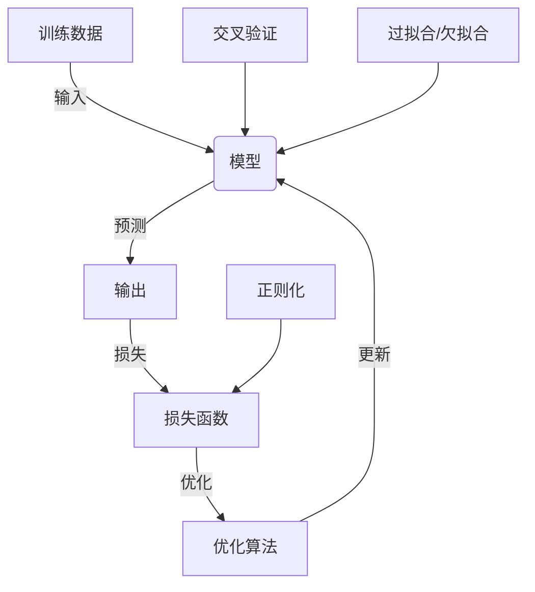

# 监督学习(Supervised Learning) - 原理与代码实例讲解

## 1. 背景介绍

在机器学习领域中,监督学习是最广为人知和应用最广泛的一种学习范式。它的目标是基于一组训练数据,学习出一个模型,使其能够对新的输入数据做出准确的预测或决策。监督学习广泛应用于图像识别、自然语言处理、推荐系统、金融预测等诸多领域。

监督学习的核心思想是从已知的输入-输出数据对中学习一个映射函数,使其能够对新的输入数据做出正确的输出预测。根据输出变量的类型,监督学习可以分为两大类:

1. **分类(Classification)**: 输出变量是离散的,例如将图像分类为猫或狗。
2. **回归(Regression)**: 输出变量是连续的,例如预测房价。

## 2. 核心概念与联系

监督学习的核心概念包括:

1. **训练数据(Training Data)**: 由输入特征和对应的标签(输出)组成的数据集。
2. **模型(Model)**: 学习算法基于训练数据学习出的映射函数,用于对新数据进行预测。
3. **损失函数(Loss Function)**: 衡量模型预测值与真实值之间差异的函数,用于优化模型参数。
4. **优化算法(Optimization Algorithm)**: 用于最小化损失函数,从而找到最优模型参数的算法。
5. **过拟合(Overfitting)**: 模型过于复杂,捕捉了训练数据中的噪声和细节,导致在新数据上的泛化能力差。
6. **欠拟合(Underfitting)**: 模型过于简单,无法捕捉数据中的重要模式,导致在训练数据和新数据上的性能都较差。
7. **正则化(Regularization)**: 通过在损失函数中加入惩罚项,限制模型复杂度,从而防止过拟合。
8. **交叉验证(Cross-Validation)**: 将数据分为训练集和验证集,在验证集上评估模型性能,用于模型选择和超参数调优。

这些概念相互关联,共同构建了监督学习的理论基础和实践框架。



## 3. 核心算法原理具体操作步骤

监督学习算法的核心步骤如下:

1. **数据预处理**: 对原始数据进行清洗、标准化、特征工程等预处理,以提高模型性能。
2. **划分数据集**: 将数据集划分为训练集、验证集和测试集。
3. **选择模型**: 根据问题类型(分类或回归)和数据特征,选择合适的模型,如线性模型、决策树、神经网络等。
4. **定义损失函数**: 根据问题类型选择合适的损失函数,如交叉熵损失函数(分类)或均方误差损失函数(回归)。
5. **模型训练**: 使用优化算法(如梯度下降)最小化损失函数,学习模型参数。
6. **模型评估**: 在验证集上评估模型性能,可使用各种评估指标,如准确率、精确率、召回率、F1分数(分类)或均方根误差(回归)。
7. **模型调优**: 根据评估结果,调整模型超参数、特征工程或正则化策略,以提高模型性能。
8. **模型部署**: 在测试集上评估最终模型性能,并将模型部署到实际应用中。

这些步骤通常需要反复迭代,以获得最优模型。

## 4. 数学模型和公式详细讲解举例说明

### 4.1 线性回归

线性回归是最简单且广泛使用的监督学习算法之一。它试图学习一个线性函数,使得输出值 $y$ 与输入特征向量 $\boldsymbol{x}$ 之间的残差平方和最小化。

线性回归模型可以表示为:

$$y = \boldsymbol{w}^T\boldsymbol{x} + b$$

其中 $\boldsymbol{w}$ 是权重向量, $b$ 是偏置项。

对于一个包含 $n$ 个训练样本的数据集 $\mathcal{D} = \{(\boldsymbol{x}_i, y_i)\}_{i=1}^n$,我们希望找到最优的 $\boldsymbol{w}$ 和 $b$,使得预测值 $\hat{y}_i = \boldsymbol{w}^T\boldsymbol{x}_i + b$ 与真实值 $y_i$ 之间的差异最小。这可以通过最小化均方误差损失函数来实现:

$$J(\boldsymbol{w}, b) = \frac{1}{2n}\sum_{i=1}^n(\hat{y}_i - y_i)^2$$

通过对损失函数取梯度并使用梯度下降法,我们可以迭代更新 $\boldsymbol{w}$ 和 $b$,直到收敛:

$$\boldsymbol{w} \leftarrow \boldsymbol{w} - \alpha\frac{\partial J}{\partial \boldsymbol{w}}$$
$$b \leftarrow b - \alpha\frac{\partial J}{\partial b}$$

其中 $\alpha$ 是学习率,控制更新步长的大小。

线性回归虽然简单,但在许多实际问题中表现良好,尤其是当特征与输出之间存在近似线性关系时。然而,它也有一些局限性,例如无法捕捉非线性模式,并且对异常值敏感。

### 4.2 逻辑回归

逻辑回归是一种广泛使用的分类算法,它将输入特征映射到一个介于 0 和 1 之间的概率值,表示样本属于正类的可能性。

对于二分类问题,逻辑回归模型可以表示为:

$$P(y=1|\boldsymbol{x}) = \sigma(\boldsymbol{w}^T\boldsymbol{x} + b)$$

其中 $\sigma(z) = \frac{1}{1 + e^{-z}}$ 是 Sigmoid 函数,将线性函数的输出值映射到 (0, 1) 范围内。

对于一个包含 $n$ 个训练样本的数据集 $\mathcal{D} = \{(\boldsymbol{x}_i, y_i)\}_{i=1}^n$,我们希望找到最优的 $\boldsymbol{w}$ 和 $b$,使得模型在训练数据上的负对数似然损失函数最小化:

$$J(\boldsymbol{w}, b) = -\frac{1}{n}\sum_{i=1}^n[y_i\log P(y_i=1|\boldsymbol{x}_i) + (1-y_i)\log(1-P(y_i=1|\boldsymbol{x}_i))]$$

同样,我们可以使用梯度下降法来优化参数:

$$\boldsymbol{w} \leftarrow \boldsymbol{w} - \alpha\frac{\partial J}{\partial \boldsymbol{w}}$$
$$b \leftarrow b - \alpha\frac{\partial J}{\partial b}$$

逻辑回归简单且易于理解,在许多二分类问题中表现良好。然而,它也有一些局限性,例如无法很好地处理非线性决策边界,并且对异常值敏感。

### 4.3 支持向量机

支持向量机(SVM)是一种强大的监督学习算法,它试图找到一个最优超平面,将不同类别的样本分开,同时最大化每个类别样本到超平面的最小距离(即间隔)。

对于线性可分的二分类问题,SVM 试图找到一个超平面 $\boldsymbol{w}^T\boldsymbol{x} + b = 0$,使得:

$$\begin{cases}
\boldsymbol{w}^T\boldsymbol{x}_i + b \geq 1, & y_i = 1\\
\boldsymbol{w}^T\boldsymbol{x}_i + b \leq -1, & y_i = -1
\end{cases}$$

这个约束条件可以等价地表示为:

$$y_i(\boldsymbol{w}^T\boldsymbol{x}_i + b) \geq 1, \quad \forall i$$

SVM 的目标是最大化间隔 $\frac{2}{||\boldsymbol{w}||}$,这等价于最小化 $\frac{1}{2}||\boldsymbol{w}||^2$,同时满足上述约束条件。这可以形式化为以下优化问题:

$$\begin{aligned}
\min_{\boldsymbol{w}, b} & \quad \frac{1}{2}||\boldsymbol{w}||^2\\
\text{s.t.} & \quad y_i(\boldsymbol{w}^T\boldsymbol{x}_i + b) \geq 1, \quad \forall i
\end{aligned}$$

对于线性不可分的情况,我们可以引入松弛变量 $\xi_i \geq 0$,允许一些样本违反约束条件,同时在目标函数中加入惩罚项 $C\sum_{i=1}^n\xi_i$,控制模型的复杂度和容错程度。

SVM 可以通过核技巧(Kernel Trick)来处理非线性问题,将原始输入特征映射到高维特征空间,在该空间中寻找最优超平面。常用的核函数包括线性核、多项式核和高斯核等。

SVM 具有很好的理论基础和优秀的泛化能力,尤其适用于中小规模的数据集。但是,它在处理大规模数据集时计算效率较低,并且对异常值敏感。

## 5. 项目实践:代码实例和详细解释说明

以下是使用 Python 和 Scikit-learn 库实现线性回归、逻辑回归和支持向量机的代码示例,并对关键步骤进行了详细解释。

### 5.1 线性回归

```python
from sklearn.linear_model import LinearRegression
import numpy as np

# 生成示例数据
X = np.array([[1, 1], [1, 2], [2, 2], [2, 3]])
y = np.dot(X, np.array([1, 2])) + 3

# 创建线性回归模型
reg = LinearRegression()

# 训练模型
reg.fit(X, y)

# 模型参数
print('Coefficients:', reg.coef_)
print('Intercept:', reg.intercept_)

# 预测
X_new = np.array([[3, 5]])
y_pred = reg.predict(X_new)
print('Prediction:', y_pred)
```

解释:

1. 首先,我们导入 `LinearRegression` 类和 NumPy 库。
2. 然后,我们生成一个简单的示例数据集 `X` 和 `y`,其中 `y` 是通过 `y = X @ [1, 2] + 3` 生成的。
3. 创建一个 `LinearRegression` 对象 `reg`。
4. 使用 `reg.fit(X, y)` 在训练数据上训练模型,估计模型参数。
5. 打印出模型的系数 `reg.coef_` 和截距项 `reg.intercept_`。
6. 对一个新的输入样本 `X_new` 进行预测,使用 `reg.predict(X_new)`。

### 5.2 逻辑回归

```python
from sklearn.linear_model import LogisticRegression
import numpy as np

# 生成示例数据
X = np.array([[0, 0], [1, 1], [1, 0], [0, 1]])
y = np.array([0, 1, 0, 1])

# 创建逻辑回归模型
log_reg = LogisticRegression()

# 训练模型
log_reg.fit(X, y)

# 模型参数
print('Coefficients:', log_reg.coef_)
print('Intercept:', log_reg.intercept_)

# 预测
X_new = np.array([[2, 2]])
y_pred = log_reg.predict(X_new)
y_prob = log_reg.predict_proba(X_new)
print('Prediction:', y_pred)
print('Probability:', y_prob)
```

解释:

1. 首先,我们导入 `LogisticRegression` 类和 NumPy 库。
2. 然后,我们生成一个简单的二分类示例数据集 `X` 和 `y`。
3. 创建一个 `LogisticRegression` 对象 `log_reg`。
4. 使用 `log_reg.fit(X, y)` 在训练数据上训练模型,估计模型参数。
5. 打印出模型的系数 `log_reg.coef_` 和截距项 `log_reg.intercept_`。
6. 对一个新的输入样本 `X_new` 进行预测,使用