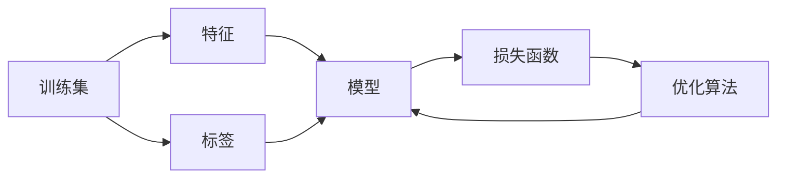

# 监督学习(Supervised Learning) - 原理与代码实例讲解

## 1. 背景介绍
在人工智能的众多分支中，监督学习是机器学习的一个核心领域，它涉及到从标记数据中学习模式，并用这些模式来预测未知数据的标签。监督学习的应用范围广泛，从图像识别、语音识别到金融市场分析，都有它的身影。

## 2. 核心概念与联系
监督学习的核心在于训练集、特征、模型、损失函数和优化算法。训练集由输入特征和对应的标签组成。模型是对现实世界数据关系的抽象，而损失函数则衡量模型预测与实际标签之间的差异。优化算法的目标是调整模型参数，以最小化损失函数。



## 3. 核心算法原理具体操作步骤
监督学习算法的操作步骤通常包括数据预处理、模型选择、模型训练、模型评估和模型应用。数据预处理包括数据清洗、特征选择和特征转换。模型选择涉及选择合适的算法和参数配置。模型训练是通过最小化损失函数来调整模型参数。模型评估则是通过测试集来验证模型的泛化能力。

## 4. 数学模型和公式详细讲解举例说明
以线性回归为例，数学模型可以表示为 $y = \beta_0 + \beta_1x_1 + \beta_2x_2 + ... + \beta_nx_n + \epsilon$，其中 $y$ 是目标变量，$x_i$ 是特征，$\beta_i$ 是模型参数，$\epsilon$ 是误差项。损失函数通常使用均方误差(MSE)，即 $MSE = \frac{1}{m}\sum_{i=1}^{m}(y_i - \hat{y}_i)^2$，其中 $m$ 是样本数量，$y_i$ 是真实值，$\hat{y}_i$ 是预测值。

## 5. 项目实践：代码实例和详细解释说明
以Python的scikit-learn库为例，我们可以使用以下代码来实现线性回归模型的训练和预测：

```python
from sklearn.linear_model import LinearRegression
from sklearn.model_selection import train_test_split
from sklearn.metrics import mean_squared_error

# 假设X是特征矩阵，y是目标变量
X_train, X_test, y_train, y_test = train_test_split(X, y, test_size=0.2)

# 创建线性回归模型实例
model = LinearRegression()

# 训练模型
model.fit(X_train, y_train)

# 预测测试集
y_pred = model.predict(X_test)

# 计算MSE
mse = mean_squared_error(y_test, y_pred)
print(f"Mean Squared Error: {mse}")
```

## 6. 实际应用场景
监督学习在许多领域都有广泛应用，例如金融信贷评分、医疗疾病诊断、零售商品推荐、自然语言处理等。

## 7. 工具和资源推荐
对于监督学习，推荐使用以下工具和资源：
- scikit-learn：一个强大的Python机器学习库。
- TensorFlow和PyTorch：两个主流的深度学习框架。
- Kaggle：一个数据科学竞赛平台，提供大量数据集和案例。

## 8. 总结：未来发展趋势与挑战
监督学习的未来发展趋势包括更深层次的模型解释性、小样本学习、跨领域学习等。挑战则包括数据隐私保护、模型泛化能力、对抗样本的防御等。

## 9. 附录：常见问题与解答
Q1: 监督学习和无监督学习的区别是什么？
A1: 监督学习使用带标签的数据进行训练，而无监督学习则不使用标签。

Q2: 如何选择合适的监督学习模型？
A2: 需要根据数据特点、问题类型和计算资源等因素综合考虑。

作者：禅与计算机程序设计艺术 / Zen and the Art of Computer Programming