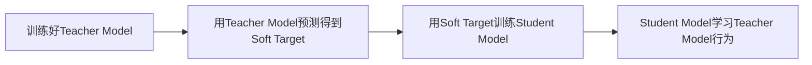

# 知识蒸馏 原理与代码实例讲解

## 1. 背景介绍

知识蒸馏(Knowledge Distillation)是一种将大型复杂模型(Teacher Model)的知识迁移到小型简单模型(Student Model)的技术。随着深度学习的快速发展,模型参数量和计算复杂度不断增加,如何在保证模型性能的同时降低模型复杂度,实现模型小型化和轻量化是一个重要的研究课题。知识蒸馏为解决这一问题提供了新的思路。

### 1.1 知识蒸馏的提出背景
### 1.2 知识蒸馏的研究意义
### 1.3 知识蒸馏的应用场景

## 2. 核心概念与联系

知识蒸馏涉及到以下几个核心概念:

- Teacher Model:通常是一个大型的、训练充分的复杂模型,性能较好但计算开销大。
- Student Model:相对简单小型的模型,计算效率高但性能较差。
- Soft Target:Teacher Model的输出概率分布,蕴含了更多的信息。
- Hard Target:样本的真实标签,信息相对有限。
- 温度参数 Temperature:控制softmax输出概率分布的平滑程度。

### 2.1 Teacher Model与Student Model的关系
### 2.2 Soft Target与Hard Target的区别
### 2.3 温度参数Temperature的作用

## 3. 核心算法原理与具体操作步骤

知识蒸馏的核心思想是让Student Model去模仿Teacher Model的行为。具体算法流程如下:



### 3.1 训练Teacher Model
### 3.2 利用Teacher Model产生Soft Target
### 3.3 用Soft Target训练Student Model
### 3.4 蒸馏过程中的Loss设计

## 4. 数学模型和公式详细讲解举例说明

知识蒸馏的目标是最小化Student模型和Teacher模型的输出分布差异。数学上可以表示为:

$$
\mathcal{L}_{KD} = \mathcal{L}_{CE}(y_s, y) + \alpha \cdot \mathcal{L}_{KL}(p_s, p_t) 
$$

其中,$y_s$是Student模型的输出,$y$是真实标签,$p_s$和$p_t$分别是Student和Teacher的softmax输出概率分布。

$\mathcal{L}_{CE}$是交叉熵损失,衡量Student模型与真实标签的差异:

$$
\mathcal{L}_{CE} = -\sum_{i=1}^{N} y_i \cdot \log (y_{s,i})
$$

$\mathcal{L}_{KL}$是KL散度,衡量Student模型与Teacher模型输出分布的差异:

$$
\mathcal{L}_{KL} = \sum_{i=1}^{N} p_{t,i} \cdot \log \frac{p_{t,i}}{p_{s,i}}
$$

$\alpha$是平衡两种Loss的权重系数。

### 4.1 目标函数的设计与分析
### 4.2 交叉熵损失的作用  
### 4.3 KL散度的作用
### 4.4 目标函数超参数的选择

## 5. 项目实践:代码实例和详细解释说明

下面以CIFAR10图像分类任务为例,演示如何用PyTorch实现知识蒸馏。

### 5.1 准备数据集

```python
transform_train = transforms.Compose([
    transforms.RandomCrop(32, padding=4),
    transforms.RandomHorizontalFlip(),
    transforms.ToTensor(),
    transforms.Normalize((0.4914, 0.4822, 0.4465), (0.2023, 0.1994, 0.2010)),
])

transform_test = transforms.Compose([
    transforms.ToTensor(),
    transforms.Normalize((0.4914, 0.4822, 0.4465), (0.2023, 0.1994, 0.2010)),
])

trainset = torchvision.datasets.CIFAR10(root='./data', train=True, download=True, transform=transform_train)
trainloader = torch.utils.data.DataLoader(trainset, batch_size=128, shuffle=True, num_workers=2)

testset = torchvision.datasets.CIFAR10(root='./data', train=False, download=True, transform=transform_test)
testloader = torch.utils.data.DataLoader(testset, batch_size=128, shuffle=False, num_workers=2)
```

### 5.2 定义Teacher Model和Student Model

```python
class TeacherModel(nn.Module):
    def __init__(self):
        super(TeacherModel, self).__init__()
        self.features = ResNet50()
        self.fc = nn.Linear(2048, 10)

    def forward(self, x):
        x = self.features(x)
        x = self.fc(x)
        return x

class StudentModel(nn.Module):
    def __init__(self):
        super(StudentModel, self).__init__()
        self.features = ResNet18()  
        self.fc = nn.Linear(512, 10)
        
    def forward(self, x):
        x = self.features(x)
        x = self.fc(x)
        return x
```

### 5.3 定义蒸馏Loss

```python
def distillation_loss(y, labels, teacher_scores, T, alpha):
    hard_loss = F.cross_entropy(y, labels) * (1. - alpha) 
    soft_loss = nn.KLDivLoss(reduction='batchmean')(F.log_softmax(y/T, dim=1), F.softmax(teacher_scores/T, dim=1)) * (alpha * T * T)
    return hard_loss + soft_loss
```

### 5.4 训练Student Model

```python
for epoch in range(num_epochs):
    model.train()
    train_loss = 0
    for batch_idx, (data, target) in enumerate(trainloader):
        data, target = data.to(device), target.to(device)
        optimizer.zero_grad()
        output = model(data)
        teacher_output = teacher_model(data)
        loss = distillation_loss(output, target, teacher_output, T, alpha)
        train_loss += loss.item()
        loss.backward()
        optimizer.step()
```

### 5.5 完整代码

详细代码请参见:[Knowledge Distillation with PyTorch](https://github.com/peterliht/knowledge-distillation-pytorch)

## 6. 实际应用场景

知识蒸馏在工业界有广泛的应用,典型场景包括:

### 6.1 移动端部署
将大型模型蒸馏到小型模型,便于在移动设备上部署。如将BERT蒸馏到TinyBERT。

### 6.2 边缘计算
将云端训练的大模型蒸馏到边缘设备,实现本地智能化。如自动驾驶中将检测模型蒸馏到车载设备。

### 6.3 模型加速
用知识蒸馏压缩模型,在精度损失很小的情况下大幅提升推理速度。如将ResNet152蒸馏到ResNet50。

## 7. 工具和资源推荐

- Distiller:英特尔开源的模型蒸馏工具包 https://github.com/IntelLabs/distiller
- DistilBERT:蒸馏版BERT模型 https://github.com/huggingface/transformers/tree/master/examples/distillation 
- TinyBERT:另一个蒸馏版BERT模型 https://github.com/huawei-noah/Pretrained-Language-Model/tree/master/TinyBERT
- Neural Network Distiller:提供多种蒸馏方法的工具包 https://github.com/NervanaSystems/distiller

## 8. 总结:未来发展趋势与挑战

知识蒸馏是模型压缩领域的重要方向,未来仍有许多值得探索的问题:

### 8.1 无Teacher蒸馏
能否让Student模型自己学习,不依赖Teacher模型?

### 8.2 跨模态蒸馏
如何在不同模态(如视觉、语音)间进行知识迁移?

### 8.3 在线蒸馏
能否在模型部署后继续通过蒸馏提升性能?

### 8.4 更高效的蒸馏方法
如何设计更高效的蒸馏pipeline,进一步压缩模型体积和计算量?

## 9. 附录:常见问题与解答

### Q1:什么样的模型适合做Teacher和Student?
A:通常Teacher模型是体积大、精度高的模型,Student模型是体积小、精度低的模型。如ResNet152适合当Teacher,ResNet18适合当Student。

### Q2:蒸馏过程中Temperature参数有什么作用?
A:Temperature参数控制Teacher模型输出分布的软化程度。Temperature越高,概率分布越平缓,迫使Student模型更多地学习相对概率,而非绝对概率。

### Q3:蒸馏和剪枝、量化的区别是什么?  
A:三者都是模型压缩的常用手段。剪枝和量化通过减少参数和降低数值精度来压缩模型;而蒸馏通过知识迁移来压缩模型,不直接修改原模型的参数。

### Q4:蒸馏对Student模型有什么要求?
A:理论上Student模型可以是任意结构,但从知识迁移的角度,Student模型的结构最好与Teacher模型相似,以便更好地继承Teacher模型学到的知识。

作者：禅与计算机程序设计艺术 / Zen and the Art of Computer Programming