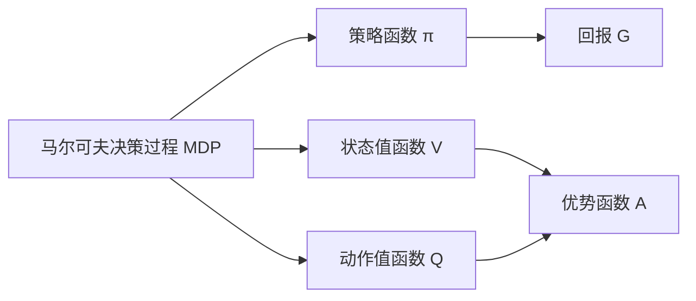

# 策略梯度 (Policy Gradients) 原理与代码实例讲解

## 1. 背景介绍

### 1.1 强化学习概述

强化学习(Reinforcement Learning, RL)是机器学习的一个重要分支,旨在研究如何让智能体(Agent)通过与环境的交互来学习最优策略,从而获得最大的累积奖励。与监督学习和非监督学习不同,强化学习并没有预先准备好的训练数据,而是通过不断地尝试与环境交互,根据反馈的奖励信号来调整策略,最终学习到最优策略。

### 1.2 策略梯度在强化学习中的地位

在强化学习算法中,有两大类主流方法:基于值函数(Value-based)的方法和基于策略(Policy-based)的方法。基于值函数的方法,如Q-learning、Sarsa等,通过学习状态-动作值函数来选择最优动作。而基于策略的方法则是直接对策略函数进行建模和优化,策略梯度(Policy Gradients)就是其中的代表性算法。相比基于值函数的方法,策略梯度具有更好的收敛性和稳定性,特别适用于连续动作空间和高维状态空间的问题。

### 1.3 本文的主要内容

本文将详细介绍策略梯度算法的原理,包括策略函数、目标函数、策略梯度定理等核心概念。同时,我们将通过数学推导和代码实例,深入讲解策略梯度的实现细节。此外,文章还将介绍一些策略梯度的变体和改进算法,总结策略梯度的实际应用场景,并展望其未来的发展趋势与挑战。

## 2. 核心概念与联系

### 2.1 马尔可夫决策过程(MDP)

要理解策略梯度,首先需要了解马尔可夫决策过程(Markov Decision Process, MDP)。MDP 是用于描述序贯决策问题的数学框架,由状态集合 S、动作集合 A、状态转移概率 P、奖励函数 R 和折扣因子 γ 组成。在每个时刻 t,智能体处于状态 s_t,选择动作 a_t,环境根据状态转移概率转移到下一个状态 s_{t+1},并给予奖励 r_t。智能体的目标是最大化累积奖励的期望。

### 2.2 策略函数 π(a|s)

策略函数 π(a|s) 表示智能体在状态 s 下选择动作 a 的概率。在确定性策略中,π(a|s) 可以简化为 a=π(s),即状态到动作的映射。策略函数通常用参数化的形式表示,记为 π_θ,其中 θ 为策略函数的参数。策略梯度算法的目标就是通过优化参数 θ 来最大化期望累积奖励。

### 2.3 状态值函数 V^π(s) 和动作值函数 Q^π(s,a)  

状态值函数 V^π(s) 表示从状态 s 开始,遵循策略 π 的期望累积奖励:

$$V^π(s) = \mathbb{E}_{a_t \sim π}[\sum_{k=0}^{\infty} γ^k r_{t+k} | s_t=s]$$

动作值函数 Q^π(s,a) 表示在状态 s 下选择动作 a,然后遵循策略 π 的期望累积奖励:

$$Q^π(s,a) = \mathbb{E}_{a_t \sim π}[\sum_{k=0}^{\infty} γ^k r_{t+k} | s_t=s, a_t=a]$$

状态值函数和动作值函数满足贝尔曼方程(Bellman Equation):

$$V^π(s) = \sum_a π(a|s) \sum_{s'} P(s'|s,a) [R(s,a,s') + γ V^π(s')]$$

$$Q^π(s,a) = \sum_{s'} P(s'|s,a) [R(s,a,s') + γ \sum_{a'} π(a'|s') Q^π(s',a')]$$

### 2.4 回报 G_t 和优势函数 A^π(s,a)

回报 G_t 表示从时刻 t 开始的累积折扣奖励:

$$G_t = \sum_{k=0}^{\infty} γ^k r_{t+k}$$

优势函数 A^π(s,a) 表示在状态 s 下选择动作 a 相对于遵循策略 π 的优势:

$$A^π(s,a) = Q^π(s,a) - V^π(s)$$

优势函数衡量了动作 a 相对于平均动作值的优劣,在策略梯度算法中起着重要作用。

下图展示了上述核心概念之间的关系:

## 3. 核心算法原理具体操作步骤

### 3.1 策略梯度定理

策略梯度定理给出了期望累积奖励 J(θ) 对策略参数 θ 的梯度:

$$\nabla_θ J(θ) = \mathbb{E}_{s \sim d^π, a \sim π_θ}[\nabla_θ \log π_θ(a|s) Q^π(s,a)]$$

其中,d^π 表示遵循策略 π 的状态分布。这个定理告诉我们,可以通过采样轨迹,计算对数概率 \log π_θ(a|s) 和动作值函数 Q^π(s,a) 的乘积,然后对所有采样数据取平均,来估计策略梯度。

### 3.2 REINFORCE算法

REINFORCE是最经典的策略梯度算法,具体步骤如下:

1. 初始化策略参数 θ
2. 重复以下步骤,直到收敛:
   - 与环境交互,采样一条轨迹 τ={(s_0,a_0,r_0),...,(s_T,a_T,r_T)}
   - 对轨迹中的每个时刻 t:
     - 计算回报 G_t
     - 计算对数概率 \log π_θ(a_t|s_t)
     - 计算梯度 G_t \nabla_θ \log π_θ(a_t|s_t)
   - 对所有时刻的梯度求和并取平均,得到 \nabla_θ J(θ) 的无偏估计
   - 使用梯度上升更新策略参数:θ ← θ + α \nabla_θ J(θ)

其中,α 为学习率。REINFORCE算法直接使用回报 G_t 作为动作值函数 Q^π(s,a) 的无偏估计,但这种估计方差较大,导致算法收敛较慢。

### 3.3 带基线的REINFORCE算法

为了减小梯度估计的方差,可以引入一个基线函数 b(s),对策略梯度定理进行如下改写:

$$\nabla_θ J(θ) = \mathbb{E}_{s \sim d^π, a \sim π_θ}[\nabla_θ \log π_θ(a|s) (Q^π(s,a) - b(s))]$$

常用的基线函数有:
- 状态值函数 V^π(s)
- 时间依赖的常数 b_t
- 状态相关的线性函数 b_w(s) = w^T φ(s)

带状态值函数基线的REINFORCE算法步骤如下:

1. 初始化策略参数 θ 和值函数参数 φ
2. 重复以下步骤,直到收敛:
   - 与环境交互,采样一条轨迹 τ={(s_0,a_0,r_0),...,(s_T,a_T,r_T)}
   - 对轨迹中的每个时刻 t:
     - 计算回报 G_t
     - 计算对数概率 \log π_θ(a_t|s_t)
     - 计算优势函数 A_t = G_t - V_φ(s_t)
     - 计算策略梯度 A_t \nabla_θ \log π_θ(a_t|s_t)
     - 计算值函数梯度 (G_t - V_φ(s_t)) \nabla_φ V_φ(s_t)
   - 对所有时刻的梯度求和并取平均,得到 \nabla_θ J(θ) 和 \nabla_φ J(φ) 的估计
   - 使用梯度上升更新策略参数:θ ← θ + α_θ \nabla_θ J(θ)
   - 使用梯度下降更新值函数参数:φ ← φ - α_φ \nabla_φ J(φ)

其中,α_θ 和 α_φ 分别为策略和值函数的学习率。引入值函数基线可以显著提高策略梯度算法的样本效率。

### 3.4 Actor-Critic算法

Actor-Critic算法是策略梯度和值函数方法的结合,由两部分组成:
- Actor:策略函数 π_θ(a|s),负责选择动作
- Critic:值函数 V_φ(s) 或 Q_φ(s,a),负责评估状态或动作的价值

Actor根据Critic的评估结果更新策略参数,而Critic则根据实际的回报更新值函数参数。常见的Actor-Critic算法有:
- Advantage Actor-Critic (A2C)
- Asynchronous Advantage Actor-Critic (A3C)
- Generalized Advantage Estimation (GAE)
- Proximal Policy Optimization (PPO)

以A2C为例,其算法步骤如下:

1. 初始化策略参数 θ 和值函数参数 φ  
2. 重复以下步骤,直到收敛:
   - 与环境交互,采样一条轨迹 τ={(s_0,a_0,r_0),...,(s_T,a_T,r_T)} 
   - 对轨迹中的每个时刻 t:
     - 计算TD误差 δ_t = r_t + γ V_φ(s_{t+1}) - V_φ(s_t)
     - 计算优势函数 A_t = δ_t + γλA_{t+1}
     - 计算策略梯度 A_t \nabla_θ \log π_θ(a_t|s_t)
     - 计算值函数梯度 δ_t \nabla_φ V_φ(s_t)
   - 对所有时刻的梯度求和并取平均,得到 \nabla_θ J(θ) 和 \nabla_φ J(φ) 的估计
   - 使用梯度上升更新策略参数:θ ← θ + α_θ \nabla_θ J(θ)
   - 使用梯度下降更新值函数参数:φ ← φ - α_φ \nabla_φ J(φ)

其中,λ 为GAE的参数,控制偏差-方差权衡。Actor-Critic算法通过引入值函数,减小了策略梯度的方差,提高了样本效率和稳定性。同时,由于Critic可以实时评估策略的好坏,Actor-Critic算法具有更好的探索能力和更快的收敛速度。

## 4. 数学模型和公式详细讲解举例说明

本节将详细推导策略梯度定理,并给出一个简单的数值例子来说明策略梯度的计算过程。

### 4.1 策略梯度定理推导

我们的目标是最大化期望累积奖励 J(θ):

$$J(θ) = \mathbb{E}_{τ \sim π_θ}[\sum_{t=0}^{\infty} γ^t r_t]$$

其中,τ 表示一条轨迹,τ \sim π_θ 表示轨迹是由策略 π_θ 生成的。根据期望的定义,可以将 J(θ) 改写为:

$$J(θ) = \sum_τ P(τ|θ) R(τ)$$

其中,P(τ|θ) 表示轨迹 τ 在策略 π_θ 下出现的概率,R(τ) 表示轨迹 τ 的累积奖励。对 J(θ) 求梯度,得到:

$$\nabla_θ J(θ) = \sum_τ \nabla_θ P(τ|θ) R(τ)$$

根据对数导数技巧,有:

$$\nabla_θ P(τ|θ) = P(τ|θ) \nabla_θ \log P(τ|θ)$$

将其代入梯度表达式,得到:

$$\nabla_θ J(θ) = \sum_τ P(τ|θ) \nabla_θ \log P(τ|θ) R(τ)$$

$$= \math