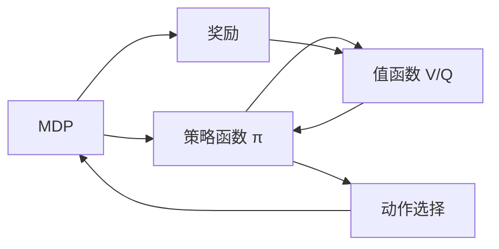

# 策略梯度Policy Gradient原理与代码实例讲解

## 1.背景介绍

强化学习(Reinforcement Learning, RL)是机器学习的一个重要分支,它研究如何让智能体(agent)在与环境的交互中学习最优策略,以获得最大的累积奖励。与监督学习和非监督学习不同,强化学习并没有预先准备好的训练数据,而是通过智能体与环境的不断交互,在获得即时奖励的同时不断优化策略。

策略梯度(Policy Gradient)是强化学习中一类重要的算法,它直接对策略函数进行建模和优化,而不需要对环境进行建模。与另一类基于值函数(Value Function)的方法相比,策略梯度具有更好的收敛性,更适合高维、连续的动作空间,并且可以学习出随机性策略。因此,策略梯度广泛应用于机器人控制、自动驾驶、游戏AI等领域。

本文将深入探讨策略梯度算法的基本原理,推导其数学模型和优化目标,给出具体的算法实现步骤。同时,通过经典的 CartPole 问题的代码实例,讲解如何用 PyTorch 实现策略梯度算法。最后,总结策略梯度的优缺点,展望其在未来的研究方向和应用前景。

## 2.核心概念与联系

在详细讲解策略梯度算法之前,我们先来了解几个核心概念:

### 2.1 马尔可夫决策过程(MDP)

马尔可夫决策过程是描述强化学习问题的经典数学框架。一个MDP由状态集合S、动作集合A、转移概率P、奖励函数R和折扣因子γ组成。在每个时间步t,智能体根据当前状态s_t选择动作a_t,环境根据转移概率P(s_t+1|s_t,a_t)转移到下一个状态s_t+1,同时给予即时奖励r_t。智能体的目标是最大化累积奖励的期望:

$$
\mathbb{E}\left[\sum_{t=0}^{\infty} \gamma^t r_t \right]
$$

其中,γ∈[0,1]是折扣因子,用于平衡即时奖励和长期奖励。

### 2.2 策略函数

策略函数π(a|s)表示在状态s下选择动作a的概率。确定性策略是一个映射π:S→A,随机性策略输出每个动作的概率分布。策略梯度算法的目标就是寻找一个最优策略π*,使得累积奖励最大化:

$$
\pi^* = \arg\max_{\pi} \mathbb{E}_{\tau \sim \pi} \left[ \sum_{t=0}^{T} r(s_t,a_t) \right]
$$

其中,τ表示一条轨迹(s_0,a_0,s_1,a_1,...)。

### 2.3 值函数

值函数表示在某个状态下,遵循某个策略能获得的期望累积奖励。状态值函数V^π(s)表示从状态s开始,遵循策略π的期望回报:

$$
V^{\pi}(s) = \mathbb{E}_{\tau \sim \pi} \left[ \sum_{t=0}^{T} \gamma^t r(s_t,a_t) | s_0=s \right]
$$

状态-动作值函数Q^π(s,a)表示在状态s下选择动作a,然后遵循策略π的期望回报:

$$
Q^{\pi}(s,a) = \mathbb{E}_{\tau \sim \pi} \left[ \sum_{t=0}^{T} \gamma^t r(s_t,a_t) | s_0=s, a_0=a \right]
$$

### 2.4 优势函数

优势函数A^π(s,a)衡量在状态s下选择动作a比平均表现好多少:

$$
A^{\pi}(s,a) = Q^{\pi}(s,a) - V^{\pi}(s)
$$

直观地说,优势函数告诉我们某个动作比baseline(平均水平)好多少。它在策略梯度算法中扮演重要角色。

下图展示了MDP、策略函数、值函数之间的关系:



## 3.核心算法原理具体操作步骤

策略梯度算法的核心思想是:沿着提升性能的方向,直接对策略函数的参数进行梯度上升。具体步骤如下:

1. 随机初始化一个可微的策略函数π_θ(a|s),其中θ为策略的参数
2. 通过与环境交互,收集一批轨迹数据{τ_i}
3. 对每个轨迹τ_i,计算累积奖励R(τ_i)
4. 使用蒙特卡洛方法或Temporal-Difference方法,估计每个时间步的优势函数A^π(s_t,a_t)
5. 基于收集的轨迹,计算策略梯度:
$$
\nabla_{\theta} J(\theta) = \mathbb{E}_{\tau \sim \pi_{\theta}} \left[ \sum_{t=0}^{T} A^{\pi}(s_t,a_t) \nabla_{\theta} \log \pi_{\theta}(a_t|s_t) \right]
$$
6. 使用梯度上升法更新策略参数:θ←θ+α∇_θJ(θ)
7. 重复步骤2-6,直到策略收敛

可以看到,策略梯度算法是一个基于梯度的优化过程。关键是如何估计优势函数和计算策略梯度。下面我们将详细推导其数学原理。

## 4.数学模型和公式详细讲解举例说明

### 4.1 策略目标函数

在策略梯度算法中,我们优化的目标函数是策略的期望累积奖励:

$$
J(\theta) = \mathbb{E}_{\tau \sim \pi_{\theta}} \left[ R(\tau) \right] = \mathbb{E}_{\tau \sim \pi_{\theta}} \left[ \sum_{t=0}^{T} r(s_t,a_t) \right]
$$

其中,τ=(s_0,a_0,s_1,a_1,...)表示一条轨迹,R(τ)表示轨迹的累积奖励。我们的目标是找到一组参数θ,使得J(θ)最大。

### 4.2 策略梯度定理

要优化目标函数J(θ),关键是计算其梯度∇_θJ(θ)。策略梯度定理给出了一个优雅的解:

$$
\nabla_{\theta} J(\theta) = \mathbb{E}_{\tau \sim \pi_{\theta}} \left[ \sum_{t=0}^{T} \nabla_{\theta} \log \pi_{\theta}(a_t|s_t) R(\tau) \right]
$$

直观的解释是:在一条轨迹τ上,每个时间步t的梯度方向由两部分决定:

1. ∇_θlogπ_θ(a_t|s_t):在状态s_t下,采取动作a_t的概率对数的梯度。它告诉我们如何调整策略参数,使得动作a_t发生的概率增大。
2. R(τ):轨迹τ的累积奖励。它告诉我们这条轨迹有多好。

将两者相乘,我们就得到了这一步的梯度方向和大小。对所有时间步求和,再对所有轨迹取期望,就得到了总的梯度∇_θJ(θ)。

### 4.3 引入基线Baseline

上面的策略梯度定理有一个缺陷:它使用轨迹的累积奖励R(τ)作为权重,但R(τ)的方差可能很大,导致梯度估计的方差也很大,从而影响训练的稳定性。

一个常见的改进是引入基线函数b(s_t),它可以是任意与动作无关的函数。将策略梯度定理改写为:

$$
\nabla_{\theta} J(\theta) = \mathbb{E}_{\tau \sim \pi_{\theta}} \left[ \sum_{t=0}^{T} \nabla_{\theta} \log \pi_{\theta}(a_t|s_t) (R(\tau) - b(s_t)) \right]
$$

可以证明,加入基线并不改变梯度的期望,但可以显著降低方差。一个自然的选择是令b(s_t)=V^π(s_t),即状态值函数。这样,我们就得到了优势函数:

$$
A^{\pi}(s_t,a_t) = R(\tau) - V^{\pi}(s_t)
$$

它衡量了动作a_t比平均水平好多少。将其代入策略梯度定理,我们得到:

$$
\nabla_{\theta} J(\theta) = \mathbb{E}_{\tau \sim \pi_{\theta}} \left[ \sum_{t=0}^{T} \nabla_{\theta} \log \pi_{\theta}(a_t|s_t) A^{\pi}(s_t,a_t) \right]
$$

这就是引入优势函数的策略梯度表达式,也是大多数实际算法使用的形式。

### 4.4 蒙特卡洛估计

策略梯度定理给出了梯度的解析表达式,但在实际中,我们无法直接计算期望。一个常用的方法是蒙特卡洛估计:

1. 通过与环境交互,收集一批轨迹数据D={τ_i}
2. 对每个轨迹τ_i,计算优势函数A^π(s_t,a_t)
3. 用经验平均近似期望,得到梯度估计:

$$
\nabla_{\theta} J(\theta) \approx \frac{1}{|D|} \sum_{\tau \in D} \sum_{t=0}^{T} \nabla_{\theta} \log \pi_{\theta}(a_t|s_t) A^{\pi}(s_t,a_t)
$$

然后,我们就可以用梯度上升法更新策略参数:θ←θ+α∇_θJ(θ)。

### 4.5 估计优势函数

估计优势函数A^π(s_t,a_t)是策略梯度算法的关键。有两种常见方法:

1. 蒙特卡洛估计:对每个状态-动作对(s_t,a_t),直接用从t时刻开始的累积奖励减去状态值函数来估计:

$$
A^{\pi}(s_t,a_t) \approx \sum_{t'=t}^{T} \gamma^{t'-t} r(s_{t'},a_{t'}) - V^{\pi}(s_t)
$$

2. TD(Temporal-Difference)估计:利用值函数的Bellman方程,只使用一步回报:

$$
A^{\pi}(s_t,a_t) \approx r(s_t,a_t) + \gamma V^{\pi}(s_{t+1}) - V^{\pi}(s_t)
$$

TD估计的方差更小,但可能有偏差。实际应用中,通常使用广义优势估计(Generalized Advantage Estimation, GAE),在蒙特卡洛和TD估计之间做折中。

## 5.项目实践：代码实例和详细解释说明

下面,我们通过经典的 CartPole 问题,演示如何用 PyTorch 实现策略梯度算法。完整代码见附录。

### 5.1 问题描述

CartPole 是一个经典的强化学习测试问题。一根杆子通过一个关节连接在一个小车上,杆子初始状态是垂直向上的。小车可以左右移动,目标是防止杆子倒下。每一步,智能体可以选择向左或向右推车,使得杆子尽量长时间保持平衡。

### 5.2 定义策略网络

我们使用一个简单的多层感知机(MLP)作为策略网络,输入是状态(杆子的角度、角速度、车的位置、速度),输出是采取各个动作的概率:

```python
class PolicyNet(nn.Module):
    def __init__(self, state_dim, hidden_dim, action_dim):
        super(PolicyNet, self).__init__()
        self.fc1 = nn.Linear(state_dim, hidden_dim)
        self.fc2 = nn.Linear(hidden_dim, action_dim)

    def forward(self, x):
        x = F.relu(self.fc1(x))
        x = F.softmax(self.fc2(x), dim=1)
        return x
```

### 5.3 定义值函数网络

为了估计优势函数,我们还需要一个值函数网络,用于估计每个状态的期望回报。它也是一个MLP,但输出是一个标量:

```python
class ValueNet(nn.Module):
    def __init__(self, state_dim, hidden_dim):
        super(ValueNet, self).__init__()
        self.fc1 = nn.Linear(state_dim, hidden_dim)
        self.fc2 = nn.Linear(hidden