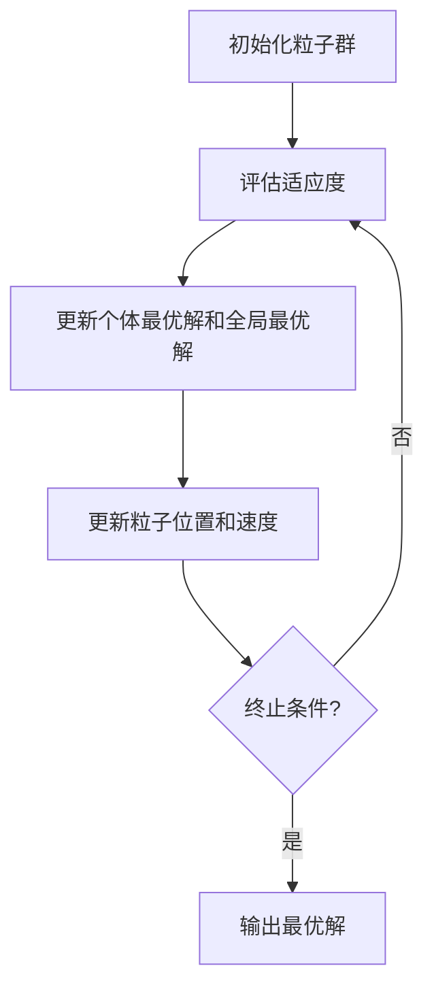

# 粒子群算法(Particle Swarm Optimization) - 原理与代码实例讲解

## 1. 背景介绍

### 1.1 优化算法的重要性

在现代计算机科学和工程领域中,优化算法扮演着至关重要的角色。无论是机器学习模型的训练、工程设计还是资源分配等,都需要求解复杂的优化问题。传统的数学优化方法往往受到问题约束和目标函数特性的限制,难以有效解决高维、非线性、非凸等复杂优化问题。因此,发展高效、通用的优化算法成为了当前研究的热点。

### 1.2 粒子群算法的起源

粒子群优化算法(Particle Swarm Optimization, PSO)是一种基于群体智能的进化计算技术,它源于对鸟群捕食行为的模拟研究。1995年,由肯尼迪(Kennedy)和埃伯哈特(Eberhart)两位科学家在研究鸟群捕食行为时受到启发,提出了这种全新的优化算法。该算法模拟了鸟群在空中寻找食物的过程,通过个体与个体之间的信息共享,最终找到全局最优解。

### 1.3 粒子群算法的特点

粒子群算法具有以下几个显著特点:

1. **简单性**: 算法原理简单,易于理解和实现。
2. **高效性**: 在求解高维、非线性、非凸等复杂优化问题时表现出较高的效率。
3. **无需梯度信息**: 不需要目标函数的梯度信息,适用于非连续、不可导的优化问题。
4. **并行性**: 算法本身具有良好的并行性,易于在分布式环境中实现。

这些特点使得粒子群算法在工程优化、机器学习、模式识别、信号处理等诸多领域得到了广泛应用。

## 2. 核心概念与联系

### 2.1 粒子群算法的基本概念

粒子群算法将待优化的问题映射到一个多维空间,在该空间中定义一组粒子群。每个粒子代表一个可能的解,具有自身的位置和速度。粒子通过不断更新自身的位置和速度,在解空间中飞行寻找最优解。

粒子群算法中的核心概念包括:

- **粒子(Particle)**: 代表一个可能的解,由位置向量和速度向量组成。
- **适应度函数(Fitness Function)**: 用于评估粒子所代表解的优劣程度。
- **个体最优(Personal Best, pbest)**: 每个粒子在搜索过程中所遇到的最优解。
- **全局最优(Global Best, gbest)**: 整个粒子群中所有粒子找到的最优解。

### 2.2 粒子群算法的工作流程

粒子群算法的基本工作流程如下:

1. 初始化一组粒子群,包括每个粒子的初始位置和速度。
2. 评估每个粒子的适应度,并确定当前的个体最优解和全局最优解。
3. 根据粒子的当前位置、速度、个体最优解和全局最优解,更新每个粒子的速度和位置。
4. 重复步骤3,直到达到终止条件(如最大迭代次数或目标函数值)。

在更新粒子位置和速度时,需要考虑以下两个因素:

- **个体经验(Cognitive Component)**: 粒子趋向于朝着自身历史最优解的方向移动。
- **社会经验(Social Component)**: 粒子也会受到当前粒子群全局最优解的影响,朝着全局最优解的方向移动。

通过个体经验和社会经验的平衡,粒子群算法可以在全局和局部搜索之间达到一种动态平衡,从而提高算法的性能。



## 3. 核心算法原理具体操作步骤

### 3.1 粒子群算法的数学模型

粒子群算法的数学模型可以用以下公式表示:

$$
\begin{aligned}
v_{i}^{(t+1)} &= \omega v_{i}^{(t)} + c_{1}r_{1}\left(p_{i}^{(t)} - x_{i}^{(t)}\right) + c_{2}r_{2}\left(g^{(t)} - x_{i}^{(t)}\right) \\
x_{i}^{(t+1)} &= x_{i}^{(t)} + v_{i}^{(t+1)}
\end{aligned}
$$

其中:

- $x_{i}^{(t)}$表示第$i$个粒子在第$t$次迭代时的位置向量。
- $v_{i}^{(t)}$表示第$i$个粒子在第$t$次迭代时的速度向量。
- $p_{i}^{(t)}$表示第$i$个粒子在第$t$次迭代时的个体最优解。
- $g^{(t)}$表示在第$t$次迭代时的全局最优解。
- $\omega$是惯性权重,控制粒子继承上一代速度的程度。
- $c_{1}$和$c_{2}$分别是认知加速常数和社会加速常数,控制粒子朝个体最优解和全局最优解移动的程度。
- $r_{1}$和$r_{2}$是两个服从均匀分布$U(0,1)$的随机数,用于增加算法的随机性。

### 3.2 算法步骤

基于上述数学模型,粒子群算法的具体步骤如下:

1. **初始化粒子群**:
   - 随机初始化一组粒子的位置和速度。
   - 评估每个粒子的适应度,并确定初始的个体最优解和全局最优解。

2. **更新粒子速度和位置**:
   - 对于每个粒子,根据上述公式更新其速度和位置。

3. **评估新粒子**:
   - 评估更新后的粒子的适应度。
   - 更新个体最优解和全局最优解。

4. **终止条件检查**:
   - 如果达到终止条件(如最大迭代次数或目标函数值),则算法结束,输出全局最优解。
   - 否则,返回步骤2,继续迭代。

需要注意的是,在实际实现中,还需要考虑粒子位置和速度的边界约束,以防止粒子飞出搜索空间。此外,也可以引入一些改进策略,如动态调整惯性权重、加速常数等,以提高算法的性能。

## 4. 数学模型和公式详细讲解举例说明

### 4.1 粒子群算法的数学模型解析

在上一节中,我们介绍了粒子群算法的核心数学模型:

$$
\begin{aligned}
v_{i}^{(t+1)} &= \omega v_{i}^{(t)} + c_{1}r_{1}\left(p_{i}^{(t)} - x_{i}^{(t)}\right) + c_{2}r_{2}\left(g^{(t)} - x_{i}^{(t)}\right) \\
x_{i}^{(t+1)} &= x_{i}^{(t)} + v_{i}^{(t+1)}
\end{aligned}
$$

这个模型描述了粒子在每一次迭代中如何更新自身的速度和位置。让我们逐一分析每一项的含义:

1. $\omega v_{i}^{(t)}$: 这一项表示粒子继承上一代速度的部分,其中$\omega$是惯性权重,控制了粒子继承上一代速度的程度。较大的$\omega$值有利于全局搜索,较小的$\omega$值有利于局部搜索。

2. $c_{1}r_{1}\left(p_{i}^{(t)} - x_{i}^{(t)}\right)$: 这一项表示粒子朝向自身历史最优解(个体最优解)的加速度,其中$c_{1}$是认知加速常数,控制了粒子朝个体最优解移动的程度;$r_{1}$是一个服从均匀分布$U(0,1)$的随机数,用于增加算法的随机性。

3. $c_{2}r_{2}\left(g^{(t)} - x_{i}^{(t)}\right)$: 这一项表示粒子朝向当前粒子群全局最优解的加速度,其中$c_{2}$是社会加速常数,控制了粒子朝全局最优解移动的程度;$r_{2}$也是一个服从均匀分布$U(0,1)$的随机数。

4. $x_{i}^{(t+1)} = x_{i}^{(t)} + v_{i}^{(t+1)}$: 这一项表示粒子根据更新后的速度,更新自身的位置。

通过上述公式,粒子在每一次迭代中都会根据自身的历史最优解、当前粒子群的全局最优解以及上一代的速度,来调整自身的速度和位置,从而在解空间中不断飞行寻找最优解。

### 4.2 数学模型的实例分析

为了更好地理解上述数学模型,我们来看一个具体的实例。假设我们要求解一个二维函数$f(x,y) = x^2 + y^2$的最小值,搜索空间为$[-10,10] \times [-10,10]$。

设置算法参数如下:

- 粒子群规模为10个粒子。
- 惯性权重$\omega = 0.8$。
- 认知加速常数$c_{1} = 2.0$。
- 社会加速常数$c_{2} = 2.0$。

初始化一个粒子群,每个粒子的初始位置和速度都是随机生成的。假设在第$t$次迭代时,第$i$个粒子的位置为$x_{i}^{(t)} = (2.5, -3.0)$,速度为$v_{i}^{(t)} = (0.8, -1.2)$,个体最优解为$p_{i}^{(t)} = (1.0, -2.0)$,全局最优解为$g^{(t)} = (-1.5, 1.0)$,随机数$r_{1} = 0.6$,随机数$r_{2} = 0.4$。

根据上述公式,我们可以计算出第$i$个粒子在第$t+1$次迭代时的速度和位置:

$$
\begin{aligned}
v_{i}^{(t+1)} &= 0.8 \times (0.8, -1.2) + 2.0 \times 0.6 \times ((1.0, -2.0) - (2.5, -3.0)) \\
&\quad + 2.0 \times 0.4 \times ((-1.5, 1.0) - (2.5, -3.0)) \\
&= (0.64, -0.96) + (-1.2, 0.6) + (-1.6, 1.6) \\
&= (-2.16, 1.24)
\end{aligned}
$$

$$
x_{i}^{(t+1)} = (2.5, -3.0) + (-2.16, 1.24) = (0.34, -1.76)
$$

因此,在第$t+1$次迭代时,第$i$个粒子的新位置为$(0.34, -1.76)$。通过不断迭代,粒子群最终将收敛到函数的最小值点$(0, 0)$。

这个简单的实例说明了粒子群算法如何通过个体经验和社会经验的平衡,在解空间中不断探索和优化,最终找到最优解。

## 5. 项目实践: 代码实例和详细解释说明

### 5.1 Python 实现粒子群算法

下面是使用 Python 实现粒子群算法的代码示例,用于求解上一节中提到的二维函数$f(x,y) = x^2 + y^2$的最小值:

```python
import random
import numpy as np

# 定义目标函数
def objective_function(x, y):
    return x**2 + y**2

# 粒子群算法类
class ParticleSwarmOptimization:
    def __init__(self, num_particles, max_iter, bounds, c1=2.0, c2=2.0, w=0.8):
        self.num_particles = num_particles
        self.max_iter = max_iter
        self.bounds = bounds
        self.c1 = c1
        self.c2 = c2
        self.w = w
        self.particles = []
        self.gbest_value = float('inf')
        self.gbest_position = None

    def initialize_particles(self):
        for _ in range(self.num_particles):
            x = random.uniform(self.bounds[0], self.bounds[1])
            y = random.uniform(self.bounds[0], self.bounds[1])