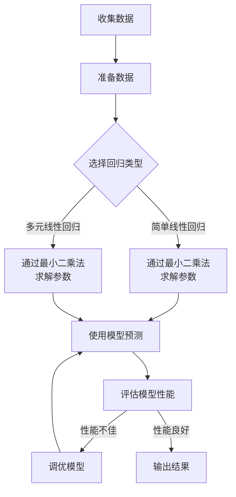

# 线性回归原理与代码实例讲解

## 1.背景介绍

线性回归是机器学习中最基础和最常用的算法之一。它通过找到自变量和因变量之间的线性关系,建立数学模型来预测连续型数据。线性回归广泛应用于金融、经济、工程等诸多领域,是数据分析和预测的重要工具。

线性回归的主要思想是通过最小二乘法拟合出最佳的直线或者平面,使预测值与真实值之间的残差平方和最小。根据自变量的个数,线性回归可分为简单线性回归(一个自变量)和多元线性回归(多个自变量)。

## 2.核心概念与联系

### 2.1 回归分析

回归分析是确定两个或多个变量之间关系的一种统计方法。其目的是通过研究自变量和因变量之间的关系,建立数学模型来预测因变量的值。

### 2.2 最小二乘法

最小二乘法是一种数学优化技术,用于在所有可能的情况下找到使残差平方和最小的最佳拟合线或平面。其原理是求解使残差平方和最小的参数值。

### 2.3 残差

残差是指实际观测值与模型预测值之间的差值。残差平方和最小意味着模型对数据的拟合程度最高。

### 2.4 过拟合与欠拟合

过拟合是指模型过于复杂,捕捉了数据中的噪声,导致在训练集上表现良好但在新数据上泛化能力差。欠拟合则是模型过于简单,无法很好地捕捉数据的内在规律。

## 3.核心算法原理具体操作步骤

线性回归的核心算法原理如下:

1. 收集数据
2. 准备数据,包括缺失值处理、特征缩放等
3. 根据自变量个数选择简单线性回归或多元线性回归
4. 通过最小二乘法求解模型参数(截距和系数)
5. 使用模型进行预测
6. 评估模型性能,如必要进行调优

具体操作步骤:



## 4.数学模型和公式详细讲解举例说明

### 4.1 简单线性回归

简单线性回归模型如下:

$$y = \theta_0 + \theta_1x$$

其中:
- $y$是因变量
- $x$是自变量 
- $\theta_0$是截距
- $\theta_1$是系数

我们的目标是找到最优的$\theta_0$和$\theta_1$,使残差平方和最小:

$$\min_{\theta_0,\theta_1} \sum_{i=1}^{m}(y^{(i)}-\theta_0-\theta_1x^{(i)})^2$$

通过最小二乘法求解,可得:

$$\theta_1 = \frac{\sum_{i=1}^{m}(x^{(i)}-\bar{x})(y^{(i)}-\bar{y})}{\sum_{i=1}^{m}(x^{(i)}-\bar{x})^2}$$

$$\theta_0 = \bar{y} - \theta_1\bar{x}$$

其中$\bar{x}$和$\bar{y}$分别是$x$和$y$的均值。

### 4.2 多元线性回归

多元线性回归模型如下:

$$y = \theta_0 + \theta_1x_1 + \theta_2x_2 + \cdots + \theta_nx_n$$

我们的目标是找到最优的$\theta_0,\theta_1,\cdots,\theta_n$,使残差平方和最小:

$$\min_{\theta_0,\theta_1,\cdots,\theta_n} \sum_{i=1}^{m}(y^{(i)}-\theta_0-\theta_1x_1^{(i)}-\cdots-\theta_nx_n^{(i)})^2$$

通过最小二乘法求解,需要使用矩阵方法。设$\mathbf{X}$为$m \times (n+1)$的矩阵,其中每一行为$(1, x_1^{(i)}, x_2^{(i)}, \cdots, x_n^{(i)})$;$\boldsymbol{\theta}$为$(n+1) \times 1$的参数向量;$\mathbf{y}$为$m \times 1$的因变量向量。那么上式可以写为:

$$\min_{\boldsymbol{\theta}} \left\lVert \mathbf{X}\boldsymbol{\theta} - \mathbf{y} \right\rVert^2$$

对$\boldsymbol{\theta}$求导并令其等于0,可得闭式解:

$$\boldsymbol{\theta} = (\mathbf{X}^T\mathbf{X})^{-1}\mathbf{X}^T\mathbf{y}$$

### 4.3 举例说明

假设我们有一个数据集,包含房屋面积(x)和房价(y),我们希望建立一个简单线性回归模型来预测房价。数据如下:

| 面积(平方米) | 房价(万元) |
|------------|-----------|
| 150        | 32        |
| 200        | 42        |
| 250        | 52        |
| 300        | 63        |

我们可以计算出:
- $\bar{x} = 225$
- $\bar{y} = 47.25$
- $\sum(x^{(i)}-\bar{x})(y^{(i)}-\bar{y}) = 3375$  
- $\sum(x^{(i)}-\bar{x})^2 = 37500$

将这些值代入公式,可得:
- $\theta_1 = 3375/37500 = 0.09$
- $\theta_0 = 47.25 - 0.09 \times 225 = 27$

因此,我们的模型为:

$$y = 27 + 0.09x$$

如果一个房屋面积为280平方米,我们可以预测它的房价为:

$$y = 27 + 0.09 \times 280 = 52.2 (万元)$$

## 5.项目实践:代码实例和详细解释说明

以Python语言为例,我们可以使用scikit-learn库来实现线性回归。以下是一个简单的代码示例:

```python
# 导入所需库
import numpy as np
from sklearn.linear_model import LinearRegression

# 样本数据(面积,价格)
X = np.array([[150], [200], [250], [300]])
y = np.array([32, 42, 52, 63])

# 创建模型并拟合
model = LinearRegression()
model.fit(X, y)

# 输出模型参数
print(f'Intercept: {model.intercept_}')
print(f'Coefficient: {model.coef_[0]}')

# 进行预测
new_area = 280
new_price = model.predict([[new_area]])
print(f'A house with area {new_area} sq.m. is predicted to cost {new_price[0]:.2f} million RMB')
```

代码解释:

1. 首先导入所需的numpy和sklearn库。
2. 创建样本数据X(面积)和y(价格)。
3. 创建LinearRegression模型实例。
4. 调用fit()方法,使用样本数据对模型进行训练,得到最优参数。
5. 输出模型的截距(intercept)和系数(coefficient)。
6. 创建一个新的面积值280,调用predict()方法预测对应的房价。
7. 输出预测结果。

运行结果:

```
Intercept: 27.0
Coefficient: 0.09
A house with area 280 sq.m. is predicted to cost 52.20 million RMB
```

上述代码实现了一个简单的线性回归模型,可以根据房屋面积预测房价。在实际应用中,我们可能需要使用更多的特征(如房龄、地段等)并采用多元线性回归模型来获得更准确的预测结果。

## 6.实际应用场景

线性回归在现实生活中有着广泛的应用,例如:

- 金融领域:预测股票价格、利率等
- 经济领域:分析GDP与其他因素的关系
- 工程领域:建筑材料强度与成分的关系
- 医疗健康:药物剂量与疗效的关系
- 零售业:销售额与广告费用的关系
- 气象领域:温度与其他因素的关系
- 社会学:人口与各种社会经济指标的关系

任何涉及变量之间存在线性关系的场景,都可以尝试使用线性回归模型进行分析和预测。

## 7.工具和资源推荐

- Python库:scikit-learn、statsmodels、Pandas、Numpy等
- R语言:lm()函数
- MATLAB: regress()函数
- Excel:数据分析加载项中的回归工具
-在线课程:AndrewNg机器学习公开课、Coursera、edX等
-书籍:《An Introduction to Statistical Learning》、《Pattern Recognition and Machine Learning》等
-文档:scikit-learn官方文档、statsmodels文档等

## 8.总结:未来发展趋势与挑战

线性回归作为最基础的机器学习算法,在未来仍将广泛应用。但同时也面临一些挑战:

- 大数据场景下,线性回归可能无法满足实时性和可伸缩性要求
- 线性回归只能处理线性可分数据,对于非线性数据需要进行特征工程
- 在高维数据上,线性回归可能会遇到维数灾难问题
- 线性回归对异常值敏感,需要进行数据预处理

未来的发展趋势包括:

- 结合其他机器学习算法,形成混合模型以提高性能
- 并行化和分布式计算,提高线性回归在大数据场景下的适用性
- 自动化特征工程和模型选择,降低人工参与
- 引入正则化、交叉验证等技术,提高模型的泛化能力
- 将线性回归与深度学习相结合,处理更复杂的数据

## 9.附录:常见问题与解答

1. 什么是线性回归?

   线性回归是一种在自变量和因变量之间建立线性关系的监督学习算法,用于预测连续型数据。它通过最小化残差平方和来寻找最佳拟合线或平面。

2. 线性回归的优缺点是什么?

   优点:模型简单、易于理解和解释、计算高效、对线性数据拟合效果好。
   缺点:对非线性数据拟合效果差、对异常值敏感、难以处理高维数据。

3. 如何评估线性回归模型的性能?

   常用的评估指标包括均方根误差(RMSE)、决定系数(R平方)、残差分析等。RMSE越小、R平方越接近1,模型性能越好。

4. 什么是欠拟合和过拟合?如何避免?

   欠拟合是模型过于简单,无法捕捉数据内在规律;过拟合是模型过于复杂,捕捉了噪声。可通过交叉验证、正则化等技术来避免过拟合。

5. 多元线性回归与简单线性回归有何不同?

   简单线性回归只有一个自变量,多元线性回归有多个自变量。多元线性回归的计算需要使用矩阵方法。

总之,线性回归虽然简单,但在许多实际场景中依然有着广泛的应用。理解其原理并掌握使用方法,对于数据分析和建模是至关重要的。

作者: 禅与计算机程序设计艺术 / Zen and the Art of Computer Programming