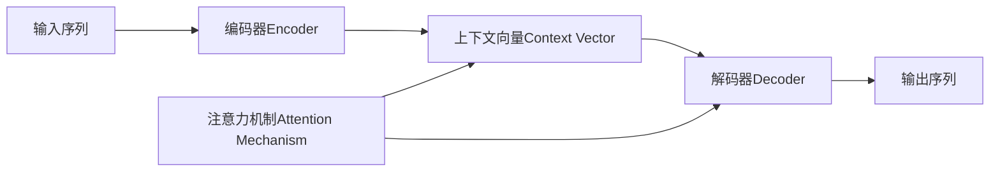

# 编码器的输出和编码器-解码器的连接

## 1. 背景介绍

### 1.1 编码器-解码器模型概述

编码器-解码器(Encoder-Decoder)模型是一种广泛应用于自然语言处理、机器翻译、语音识别等领域的深度学习模型。它由两个主要部分组成:编码器(Encoder)和解码器(Decoder)。编码器负责将输入序列转换为一个固定长度的向量表示,而解码器则根据这个向量表示生成输出序列。

### 1.2 编码器的作用

在编码器-解码器模型中,编码器扮演着至关重要的角色。它需要捕捉输入序列的语义信息,并将其编码为一个紧凑的向量表示。这个向量表示通常被称为"上下文向量"(Context Vector)或"思想向量"(Thought Vector),它包含了输入序列的关键特征和语义信息。

### 1.3 编码器-解码器的连接方式

编码器的输出,即上下文向量,需要传递给解码器,以便解码器根据这个向量生成输出序列。编码器和解码器之间的连接方式对模型的性能和效果有着重要影响。常见的连接方式包括:

- 直接连接:将编码器的输出直接作为解码器的输入。
- 注意力机制:引入注意力机制,让解码器在生成每个输出时,都能够根据当前的隐藏状态和编码器的输出计算注意力权重,从而选择性地关注输入序列的不同部分。
- 双向注意力:在编码器和解码器之间引入双向的注意力机制,使得编码器和解码器都能够根据对方的状态计算注意力权重。

## 2. 核心概念与联系

### 2.1 编码器(Encoder)

编码器是一种将输入序列转换为固定长度向量表示的模型。常见的编码器包括:

- RNN编码器:使用循环神经网络(RNN),如LSTM或GRU,对输入序列进行编码。
- CNN编码器:使用卷积神经网络(CNN)对输入序列进行编码,通常用于处理图像或语音数据。
- Transformer编码器:使用自注意力机制(Self-Attention)对输入序列进行编码,不依赖于RNN或CNN。

### 2.2 解码器(Decoder)  

解码器是一种根据编码器的输出生成输出序列的模型。常见的解码器包括:

- RNN解码器:使用RNN对编码器的输出进行解码,生成输出序列。
- Transformer解码器:使用自注意力机制和编码-解码注意力机制对编码器的输出进行解码。

### 2.3 上下文向量(Context Vector)

上下文向量是编码器将输入序列压缩为一个固定长度向量表示的结果。它包含了输入序列的语义信息和关键特征,是连接编码器和解码器的桥梁。

### 2.4 注意力机制(Attention Mechanism)

注意力机制是一种让模型在生成输出时,能够选择性地关注输入序列不同部分的机制。它通过计算输入序列各个位置与当前解码器隐藏状态之间的相关性,生成注意力权重,并根据权重对编码器的输出进行加权求和,得到一个上下文向量。

### 2.5 概念之间的联系

下图展示了编码器、解码器、上下文向量和注意力机制之间的关系:



## 3. 核心算法原理具体操作步骤

### 3.1 编码器的计算过程

以RNN编码器为例,其计算过程如下:

1. 将输入序列 $x=(x_1,x_2,...,x_T)$ 逐个输入到RNN编码器中。
2. 对于每个时间步 $t$,计算隐藏状态 $h_t$:
   
   $h_t=f(x_t,h_{t-1})$
   
   其中 $f$ 是RNN的状态转移函数,如LSTM或GRU。
3. 将最后一个时间步的隐藏状态 $h_T$ 作为编码器的输出,即上下文向量 $c$。

### 3.2 解码器的计算过程

以RNN解码器为例,其计算过程如下:

1. 将编码器的输出 $c$ 作为解码器的初始隐藏状态 $s_0$。
2. 对于每个时间步 $t$,根据上一时间步的输出 $y_{t-1}$ 和当前隐藏状态 $s_{t-1}$ 计算当前时间步的隐藏状态 $s_t$:
   
   $s_t=f(y_{t-1},s_{t-1},c)$
   
   其中 $f$ 是RNN的状态转移函数。
3. 根据当前隐藏状态 $s_t$ 计算当前时间步的输出分布 $p(y_t|y_{<t},x)$:
   
   $p(y_t|y_{<t},x)=g(s_t)$
   
   其中 $g$ 是输出层函数,如softmax函数。
4. 根据输出分布采样或选择概率最大的词作为当前时间步的输出 $y_t$。
5. 重复步骤2-4,直到生成完整的输出序列。

### 3.3 注意力机制的计算过程

以Bahdanau注意力为例,其计算过程如下:

1. 对于解码器的每个时间步 $t$,计算当前隐藏状态 $s_t$ 与编码器各时间步隐藏状态 $h_i$ 的注意力权重 $\alpha_{ti}$:
   
   $e_{ti}=v^\top \tanh(W_s s_t + W_h h_i)$
   
   $\alpha_{ti}=\frac{\exp(e_{ti})}{\sum_{j=1}^T \exp(e_{tj})}$
   
   其中 $v$、$W_s$ 和 $W_h$ 是可学习的参数。
2. 根据注意力权重 $\alpha_{ti}$ 计算当前时间步的上下文向量 $c_t$:
   
   $c_t=\sum_{i=1}^T \alpha_{ti} h_i$
3. 将上下文向量 $c_t$ 与当前隐藏状态 $s_t$ 拼接或相加,得到新的隐藏状态 $\tilde{s}_t$:
   
   $\tilde{s}_t=\tanh(W_c[c_t;s_t])$
   
   其中 $W_c$ 是可学习的参数。
4. 使用新的隐藏状态 $\tilde{s}_t$ 计算当前时间步的输出分布。

## 4. 数学模型和公式详细讲解举例说明

### 4.1 编码器数学模型

以LSTM编码器为例,其状态转移函数为:

$$
\begin{aligned}
i_t &= \sigma(W_{ii} x_t + b_{ii} + W_{hi} h_{t-1} + b_{hi}) \\
f_t &= \sigma(W_{if} x_t + b_{if} + W_{hf} h_{t-1} + b_{hf}) \\
g_t &= \tanh(W_{ig} x_t + b_{ig} + W_{hg} h_{t-1} + b_{hg}) \\
o_t &= \sigma(W_{io} x_t + b_{io} + W_{ho} h_{t-1} + b_{ho}) \\
c_t &= f_t * c_{t-1} + i_t * g_t \\
h_t &= o_t * \tanh(c_t)
\end{aligned}
$$

其中 $i_t$、$f_t$、$o_t$ 分别是输入门、遗忘门和输出门,$g_t$ 是候选记忆细胞状态,$c_t$ 是记忆细胞状态,$h_t$ 是隐藏状态,$W$ 和 $b$ 是可学习的参数,$\sigma$ 是sigmoid激活函数,$*$ 是逐元素相乘。

### 4.2 解码器数学模型

以LSTM解码器为例,其状态转移函数为:

$$
\begin{aligned}
i_t &= \sigma(W_{ii} y_{t-1} + b_{ii} + W_{hi} s_{t-1} + b_{hi} + W_{ci} c + b_{ci}) \\
f_t &= \sigma(W_{if} y_{t-1} + b_{if} + W_{hf} s_{t-1} + b_{hf} + W_{cf} c + b_{cf}) \\
g_t &= \tanh(W_{ig} y_{t-1} + b_{ig} + W_{hg} s_{t-1} + b_{hg} + W_{cg} c + b_{cg}) \\
o_t &= \sigma(W_{io} y_{t-1} + b_{io} + W_{ho} s_{t-1} + b_{ho} + W_{co} c + b_{co}) \\
c_t &= f_t * c_{t-1} + i_t * g_t \\
s_t &= o_t * \tanh(c_t)
\end{aligned}
$$

其中 $y_{t-1}$ 是上一时间步的输出,$s_{t-1}$ 是上一时间步的隐藏状态,$c$ 是编码器的输出即上下文向量,其余符号与编码器相同。

### 4.3 注意力机制数学模型

以Bahdanau注意力为例,其计算过程为:

$$
\begin{aligned}
e_{ti} &= v^\top \tanh(W_s s_t + W_h h_i) \\
\alpha_{ti} &= \frac{\exp(e_{ti})}{\sum_{j=1}^T \exp(e_{tj})} \\
c_t &= \sum_{i=1}^T \alpha_{ti} h_i \\
\tilde{s}_t &= \tanh(W_c[c_t;s_t])
\end{aligned}
$$

其中 $e_{ti}$ 是解码器第 $t$ 个时间步与编码器第 $i$ 个时间步的对齐分数,$\alpha_{ti}$ 是对应的注意力权重,$c_t$ 是第 $t$ 个时间步的上下文向量,$\tilde{s}_t$ 是融合了上下文信息的新隐藏状态,$v$、$W_s$、$W_h$ 和 $W_c$ 是可学习的参数。

举例说明,假设编码器的隐藏状态为 $h_1,h_2,h_3$,解码器当前时间步的隐藏状态为 $s_t$,则注意力权重的计算过程为:

$$
\begin{aligned}
e_{t1} &= v^\top \tanh(W_s s_t + W_h h_1) \\
e_{t2} &= v^\top \tanh(W_s s_t + W_h h_2) \\
e_{t3} &= v^\top \tanh(W_s s_t + W_h h_3) \\
\alpha_{t1} &= \frac{\exp(e_{t1})}{\exp(e_{t1})+\exp(e_{t2})+\exp(e_{t3})} \\
\alpha_{t2} &= \frac{\exp(e_{t2})}{\exp(e_{t1})+\exp(e_{t2})+\exp(e_{t3})} \\
\alpha_{t3} &= \frac{\exp(e_{t3})}{\exp(e_{t1})+\exp(e_{t2})+\exp(e_{t3})} \\
c_t &= \alpha_{t1} h_1 + \alpha_{t2} h_2 + \alpha_{t3} h_3
\end{aligned}
$$

## 5. 项目实践:代码实例和详细解释说明

下面是一个使用PyTorch实现的简单的编码器-解码器模型,包含了注意力机制:

```python
import torch
import torch.nn as nn

class Encoder(nn.Module):
    def __init__(self, input_size, hidden_size):
        super(Encoder, self).__init__()
        self.hidden_size = hidden_size
        self.embedding = nn.Embedding(input_size, hidden_size)
        self.gru = nn.GRU(hidden_size, hidden_size)

    def forward(self, input, hidden):
        embedded = self.embedding(input).view(1, 1, -1)
        output, hidden = self.gru(embedded, hidden)
        return output, hidden

class AttentionDecoder(nn.Module):
    def __init__(self, hidden_size, output_size):
        super(AttentionDecoder, self).__init__()
        self.hidden_size = hidden_size
        self.embedding = nn.Embedding(output_size, hidden_size)
        self.attn = nn.Linear(hidden_size * 2, 1)
        self.attn_combine = nn.Linear(hidden_size * 2, hidden_size)
        self.gru = nn.GRU(hidden_size, hidden_size)
        self.out = nn.Linear(hidden_size, output_size)

    def forward(self, input, hidden, encoder_outputs):
        embedded = self.embedding(input).view(1, 1, -1)
        attn_weights = F.