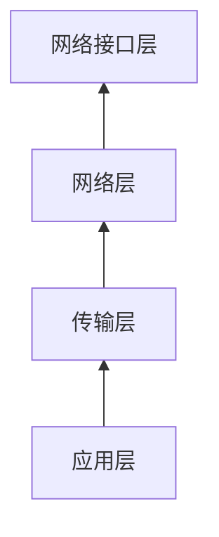
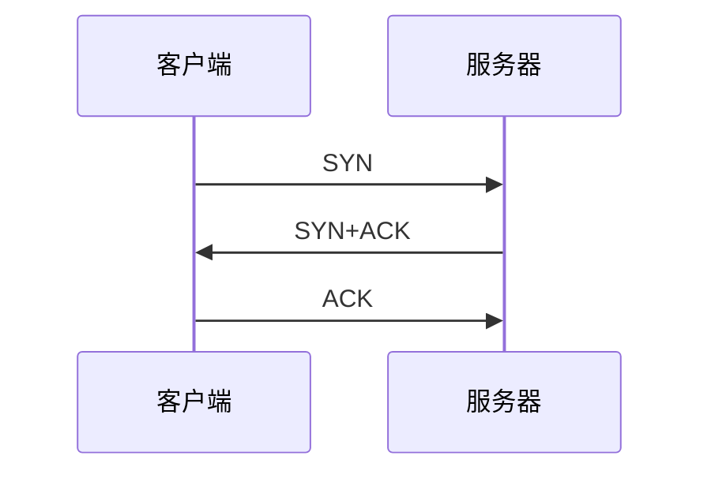
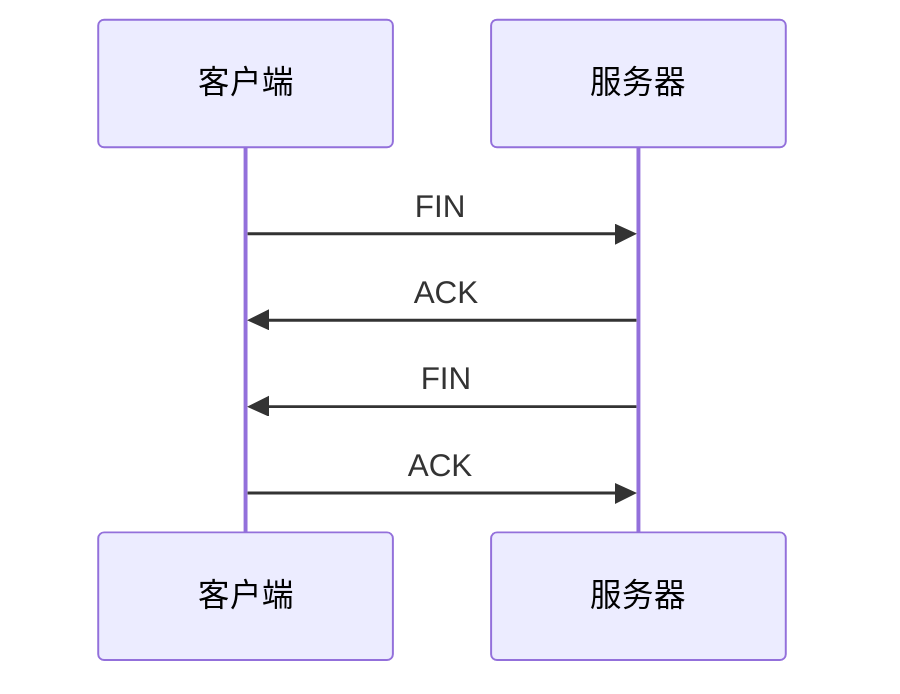

# 网络协议与TCP/IP原理与实践

## 1. 背景介绍

### 1.1 网络通信的重要性
在当今高度互联的数字世界中,网络通信已成为信息交换和资源共享的关键。从个人电脑到移动设备,从小型局域网到广阔的互联网,网络无处不在,支撑着我们的日常生活和工作。

### 1.2 网络协议的作用
为了实现不同设备之间的高效可靠通信,我们需要一套规则和标准,这就是网络协议。网络协议定义了数据传输的格式、顺序以及错误处理等细节,就像人类交流需要语言一样,计算机通信依赖于协议。

### 1.3 TCP/IP协议栈
在众多网络协议中,TCP/IP无疑是使用最广泛、影响最深远的一个协议家族。它是互联网的基石,也是各种应用协议的基础。本文将深入探讨TCP/IP的原理和实践,帮助读者系统地理解这一重要协议栈。

## 2. 核心概念与联系

### 2.1 协议栈与分层思想
#### 2.1.1 分层的必要性
计算机网络是一个复杂的系统,为了解决设计和实现的复杂性,我们采用分层的思想,将网络功能划分为若干层次,每层只专注于实现特定的功能。

#### 2.1.2 TCP/IP的四层模型
TCP/IP协议栈通常分为四个层次:
- 应用层:为应用程序提供网络服务,如HTTP、FTP等
- 传输层:提供端到端的通信,如TCP、UDP 
- 网络层:负责数据包的路由和转发,如IP协议
- 网络接口层:处理与物理网络的互连,如以太网



### 2.2 数据封装与解封装
#### 2.2.1 封装过程
在发送数据时,上层协议的数据被当做下层协议的"负载",逐层添加协议头,形成协议数据单元PDU。这个过程称为封装。

#### 2.2.2 解封装过程
接收数据时,数据包逐层往上传递,每层协议读取自己的协议头,剥离后交给上层处理,直到原始数据到达目的应用程序。这个过程称为解封装。


## 3. 核心算法原理具体操作步骤

### 3.1 三次握手建立连接
TCP是面向连接的协议,通信双方在数据传输前需要先建立连接。这个过程通过三次握手实现:

1. 客户端发送SYN请求连接
2. 服务器回复SYN+ACK表示接受连接
3. 客户端发送ACK确认,连接建立



### 3.2 四次挥手释放连接
当数据传输完成后,通信双方需要释放连接。这个过程通过四次挥手实现:

1. 客户端发送FIN请求关闭连接 
2. 服务器回复ACK表示收到请求
3. 服务器发送FIN表示同意关闭
4. 客户端回复ACK确认,连接关闭



### 3.3 滑动窗口流量控制
TCP使用滑动窗口机制实现流量控制,动态调整发送窗口大小,防止发送方发送速率太快导致接收方处理不过来。

- 发送窗口 = Min(对方接收窗口,本地拥塞窗口)
- 接收方通过TCP头部的Window字段通告自己的接收窗口大小
- 拥塞窗口根据网络拥塞情况动态调整

## 4. 数学模型和公式详细讲解举例说明

### 4.1 RTT测量与RTO计算
TCP通过测量往返时间RTT来估计网络延迟,进而计算重传超时时间RTO。

- 采样RTT的指数加权移动平均:
$$SRTT = (1-\alpha) * SRTT + \alpha * RTT$$

- 计算RTT的偏差:
$$DevRTT = (1-\beta) * DevRTT + \beta * |RTT - SRTT|$$

- 计算RTO:
$$RTO = SRTT + 4 * DevRTT$$

其中$\alpha$和$\beta$是平滑因子,通常取值0.125和0.25。这种计算方式能够适应网络延迟的波动。

### 4.2 拥塞控制的AIMD算法
TCP使用加性增加、乘性减少(AIMD)算法调节拥塞窗口,实现拥塞控制。

- 加性增加:每个RTT内,拥塞窗口增加1个MSS
$$cwnd = cwnd + MSS$$

- 乘性减少:发生拥塞时,拥塞窗口减半
$$cwnd = cwnd / 2$$

这种算法能够在带宽利用率和公平性之间取得平衡。

## 5. 项目实践：代码实例和详细解释说明

下面是一个基于Python的简单TCP服务器和客户端示例,展示了TCP编程的基本流程。

服务器代码:

```python
import socket

HOST = '127.0.0.1'  # 服务器IP地址
PORT = 65432        # 服务器监听端口

with socket.socket(socket.AF_INET, socket.SOCK_STREAM) as s:
    s.bind((HOST, PORT))
    s.listen()
    conn, addr = s.accept()
    with conn:
        print('Connected by', addr)
        while True:
            data = conn.recv(1024)
            if not data:
                break
            conn.sendall(data)
```

客户端代码:

```python
import socket

HOST = '127.0.0.1'  # 服务器IP地址 
PORT = 65432        # 服务器端口

with socket.socket(socket.AF_INET, socket.SOCK_STREAM) as s:
    s.connect((HOST, PORT))
    s.sendall(b'Hello, world')
    data = s.recv(1024)

print('Received', repr(data))
```

代码解释:
1. 服务器创建TCP套接字,绑定IP地址和端口,开始监听连接请求
2. 客户端创建TCP套接字,连接服务器
3. 服务器接受客户端连接,创建新的套接字用于通信
4. 客户端向服务器发送数据
5. 服务器接收数据并原样发回(echo服务器)
6. 客户端接收服务器返回的数据并打印

这个例子虽然简单,但展示了TCP编程的基本步骤,即创建套接字、建立连接、收发数据。实际应用中的网络程序要考虑的细节要复杂得多,如异常处理、多线程、I/O多路复用等。

## 6. 实际应用场景

### 6.1 Web浏览
当我们在浏览器输入URL并按下回车键时,背后的HTTP协议就是基于TCP工作的。浏览器作为客户端,与Web服务器建立TCP连接,然后发送HTTP请求并接收HTTP响应。

### 6.2 电子邮件
SMTP协议用于发送电子邮件,POP3和IMAP用于接收电子邮件,它们都是基于TCP的应用层协议。邮件客户端与邮件服务器之间通过TCP连接收发邮件。

### 6.3 文件传输
FTP和SFTP是常用的文件传输协议,它们在TCP之上提供可靠的文件上传和下载功能。文件传输客户端与服务器建立控制连接和数据连接,实现文件的传送。

### 6.4 远程登录
SSH和Telnet协议允许用户远程登录到另一台计算机,执行命令并获取结果。它们通过TCP连接在客户端和服务器之间交换数据,并提供了身份认证和加密等安全功能。

## 7. 工具和资源推荐

### 7.1 Wireshark
Wireshark是一款免费开源的网络抓包和分析工具,支持多种协议解码,是学习和调试网络协议的利器。通过Wireshark,你可以截获网络数据包并查看其中的TCP头部信息。

### 7.2 tcpdump
tcpdump是一个命令行的网络抓包工具,可以在各种Unix/Linux系统上使用。它能够显示TCP数据包的头部信息,对网络问题进行诊断。

### 7.3 Python socket库
Python提供了socket库,可以方便地进行TCP编程。无论是实现一个简单的Echo服务器,还是开发功能完善的网络应用,使用Python socket库都是不错的选择。

### 7.4 RFC文档
如果你想深入理解TCP/IP协议的标准和细节,最权威的资料莫过于IETF(互联网工程任务组)发布的RFC(Request for Comments)文档。例如,RFC793详细描述了TCP协议的规范。

## 8. 总结：未来发展趋势与挑战

### 8.1 高速网络环境下的TCP优化
随着网络带宽的不断提升,如何让TCP在高速、长距离网络中保持高吞吐量是一大挑战。各种TCP变体如CUBIC、BBR等,通过优化拥塞控制算法,改善了TCP的传输性能。

### 8.2 无线网络中的TCP表现
无线网络由于其高丢包率、延迟抖动等特点,给TCP带来了新的挑战。一些针对无线环境的TCP改进方案,如TCP Westwood,能够更好地适应无线链路的特性。

### 8.3 多路传输协议MPTCP
MPTCP(Multipath TCP)是TCP的一个扩展,允许单个TCP连接在多个网络路径上同时传输数据。这提高了网络利用率和可靠性,但同时也带来了新的复杂度,如子流的调度等。

### 8.4 信息中心网络ICN
信息中心网络(ICN)是一种新型网络架构,它以内容为中心,而不是传统的以主机为中心。ICN中的数据传输不再依赖于源地址和目的地址,而是通过内容名称进行路由和缓存。这可能会对传输层协议提出新的要求。

## 9. 附录：常见问题与解答

### 9.1 TCP和UDP的区别是什么?
TCP是面向连接的、可靠的传输协议,提供全双工通信和拥塞控制;UDP是无连接的、不可靠的传输协议,无法保证数据的到达和顺序。TCP适合可靠性要求高的应用,UDP适合实时性要求高的应用。

### 9.2 TCP如何实现可靠传输?
TCP通过以下机制实现可靠传输:
- 数据分段和编号:发送的数据被分割成段,每个段有序号,接收方可以检测丢失和乱序
- 确认应答:接收方收到数据后发送ACK确认,发送方收到ACK才认为数据发送成功
- 超时重传:发送方在一定时间内未收到ACK则认为数据丢失,会重新发送
- 校验和:TCP头部和数据都有校验和,接收方可以检测数据是否损坏

### 9.3 为什么TCP连接需要三次握手?
三次握手的目的是同步双方的序列号和确认号,并交换 TCP窗口大小信息。第三次握手是为了防止历史连接的建立请求,同时也是为了对方可以确认自己的接收能力。两次握手无法确认客户端的接收能力。

### 9.4 TCP的流量控制和拥塞控制有什么区别?
流量控制是通信双方速度匹配的机制,保证发送方发送速率不超过接收方处理能力。拥塞控制是防止过多的数据注入网络,避免网络中的路由器或链路过载。前者是点对点通信量的控制,后者是全局性的网络流量控制。

### 9.5 TCP的keepalive机制是什么?
TCP keepalive是一种检测连接是否存活的机制。当连接空闲一段时间后,主机发送keepalive探测包,如果对方回应,则认为连接正常,否则认为连接已断开并释放资源。这可以防止一方异常退出后另一方长时间占用不必要的连接资源。

作者：