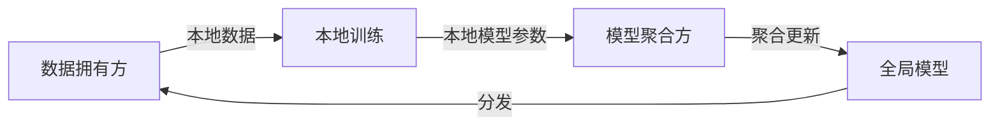

# 联邦学习 原理与代码实例讲解

## 1.背景介绍
### 1.1 联邦学习的起源与发展
联邦学习(Federated Learning)是一种分布式机器学习范式,由Google于2016年首次提出。它旨在解决数据孤岛问题,在不集中数据的情况下实现机器学习模型的训练。随着数据隐私保护意识的增强和法规的出台,联邦学习受到学术界和工业界的广泛关注,成为机器学习领域的研究热点之一。

### 1.2 联邦学习解决的痛点
传统的机器学习通常需要将数据集中到一起进行训练,但现实中很多场景数据无法共享或转移,如:

- 不同医院的病历数据
- 不同公司的用户数据  
- 分布在不同物联网设备上的数据

联邦学习通过在数据产生的本地训练模型,并仅共享模型参数而非原始数据,既能利用分散的数据资源,又能保护数据隐私,是解决这一痛点的有效方法。

### 1.3 联邦学习的应用前景
联邦学习在医疗、金融、工业、智慧城市等领域都有广阔的应用前景,如:

- 医疗领域:利用分布在不同医院的医疗数据训练辅助诊断模型
- 金融领域:多个银行合作训练反欺诈模型
- 工业领域:利用分布在不同工厂的设备数据训练预测性维护模型 
- 智慧城市:利用分布在不同区域的交通、环境数据训练智能交通调度模型

随着5G、物联网等技术的发展,联邦学习有望成为人工智能应用的重要推动力。

## 2.核心概念与联系
### 2.1 联邦学习的定义
联邦学习是一种分布式机器学习框架,旨在训练利用存储在多个分散实体中的数据,同时不会将数据集中到一个中心位置。

### 2.2 联邦学习的参与方
联邦学习通常涉及以下参与方:

- 数据拥有方(Data Owner):拥有本地数据的参与方,如不同的医院、银行、设备等。
- 模型聚合方(Model Aggregator):负责协调各方训练过程,聚合本地模型参数生成全局模型,可以是数据拥有方之一,也可以是独立的第三方。

### 2.3 联邦学习的过程
典型的联邦学习过程如下:

1. 模型聚合方选择或设计机器学习模型,初始化模型参数。
2. 将初始模型参数分发给各数据拥有方。 
3. 各数据拥有方利用本地数据在本地训练模型,得到本地模型参数。
4. 各数据拥有方将本地模型参数上传给模型聚合方。
5. 模型聚合方聚合各方上传的模型参数,更新全局模型。
6. 重复步骤2-5,直到模型收敛或达到预设的迭代次数。

### 2.4 联邦学习与传统分布式学习的区别
联邦学习与传统分布式机器学习的主要区别在于:

- 联邦学习的训练数据分散在不同实体,不会集中到一起;而传统分布式学习通常将数据集中到一个中心节点。
- 联邦学习强调数据隐私保护,原始数据不会离开本地;而传统分布式学习对数据隐私保护的考虑较少。
- 联邦学习的参与方通常是松散的联盟关系,算力、数据分布不均衡;而传统分布式学习多在同一组织内,算力、数据分布相对均衡。

下图展示了联邦学习的核心概念与联系:



## 3.核心算法原理具体操作步骤
联邦学习的核心算法是FederatedAveraging(FedAvg),由Google于2016年提出。下面介绍FedAvg的具体步骤。

### 3.1 符号定义
- $K$:参与联邦学习的客户端总数。
- $N_k$:第$k$个客户端的本地数据样本数。 
- $w_t$:第$t$轮通信后的全局模型参数。
- $w^k_t$:第$t$轮通信后第$k$个客户端的本地模型参数。

### 3.2 服务端执行
1. 初始化全局模型参数$w_0$
2. for each round $t = 1,2,...,T$ do
3.    从$K$个客户端中随机选择$m$个客户端参与本轮训练
4.    将当前全局模型参数$w_t$发送给选中的$m$个客户端
5.    等待客户端上传本地模型参数
6.    收到客户端上传的本地模型参数后,进行聚合更新:
      $w_{t+1} \leftarrow \sum_{k=1}^m \frac{N_k}{N} w^k_t$
7. end for

其中$N=\sum_{k=1}^m N_k$为参与聚合的客户端总样本数。

### 3.3 客户端执行  
1. 收到服务端发送的全局模型参数$w_t$
2. 将全局模型参数$w_t$作为初始值,利用本地数据进行训练,得到本地模型参数$w^k_t$
3. 将本地模型参数$w^k_t$上传给服务端

客户端的本地训练可采用标准的优化算法如SGD、Adam等。

### 3.4 算法解释
- 服务端的聚合更新公式$w_{t+1} \leftarrow \sum_{k=1}^m \frac{N_k}{N} w^k_t$本质上是对客户端上传的模型参数做加权平均,权重为客户端数据样本数占总样本数的比例。这相当于客户端在本地用$\frac{N_k}{N}$的采样率对全局模型做了近似。

- 客户端的本地训练可看作是在全局模型的基础上用本地数据做微调。通过多轮通信迭代,可使全局模型从各客户端学习,最终得到一个泛化性能良好的模型。

FedAvg算法兼顾了通信效率和模型性能,被广泛应用于联邦学习实践中。但它也存在改进空间,如如何设置合适的参与客户端数、本地迭代次数等,是目前联邦学习研究的重点问题之一。

## 4.数学模型和公式详细讲解举例说明
本节我们从优化的角度来解释FedAvg算法,并举例说明。

### 4.1 问题建模
考虑一个supervised learning问题,假设每个客户端$k$有本地数据集$\mathcal{D}_k$,本地loss function为$F_k(w)$。我们的目标是优化全局模型的损失函数:

$$
\min_{w} f(w) := \sum_{k=1}^K p_k F_k(w)
$$

其中$p_k = \frac{N_k}{N}, N=\sum_{k=1}^K N_k$。这表示全局目标是各客户端目标的加权平均,权重为客户端数据量占总数据量的比例。

### 4.2 FedAvg的数学解释
FedAvg算法可以看作是对全局目标$f(w)$应用分布式SGD优化。具体来说,每轮通信中:

1. 服务端将当前模型参数$w_t$发送给客户端
2. 每个客户端$k$在本地用$w_t$初始化,进行$E$轮SGD迭代:

$$
w^k_{t,i+1} = w^k_{t,i} - \eta \nabla F_k(w^k_{t,i}), i=0,...,E-1
$$

3. 客户端将本地更新后的模型$w^k_{t,E}$发送给服务端
4. 服务端对客户端模型进行加权平均,得到新的全局模型:

$$
w_{t+1} = \sum_{k=1}^K p_k w^k_{t,E}
$$

可以证明,当本地迭代次数$E=1$时,FedAvg等价于在全局目标$f(w)$上应用SGD:

$$
w_{t+1} = w_t - \eta \sum_{k=1}^K p_k \nabla F_k(w_t)
$$

当$E>1$时,FedAvg在全局目标上的更新近似为:

$$
w_{t+1} \approx w_t - \eta \sum_{k=1}^K p_k \nabla F_k(w^k_{t,E-1})
$$

相当于客户端在本地用$p_k$的采样率对全局模型做了$E$步近似。

### 4.3 举例说明
考虑一个简单的线性回归问题:$y=wx+b$。假设有2个客户端,本地数据集分别为:

- 客户端1: $\mathcal{D}_1=\{(1,1),(2,2)\}$
- 客户端2: $\mathcal{D}_2=\{(3,3),(4,4),(5,5)\}$

使用均方误差损失,客户端的本地目标函数为:

$$
F_1(w,b) = \frac{1}{2}[(wx_1+b-y_1)^2+(wx_2+b-y_2)^2]
$$
$$
F_2(w,b) = \frac{1}{3}[(wx_3+b-y_3)^2+(wx_4+b-y_4)^2+(wx_5+b-y_5)^2] 
$$

全局目标为:

$$
f(w,b) = \frac{2}{5}F_1(w,b) + \frac{3}{5}F_2(w,b)
$$

假设初始模型参数为$w_0=1,b_0=0$,学习率$\eta=0.01$,本地迭代次数$E=5$,进行FedAvg:

- 第1轮:
  - 客户端1:$w^1_{1,5}=0.82, b^1_{1,5}=0.18$
  - 客户端2:$w^2_{1,5}=0.94, b^2_{1,5}=0.06$
  - 服务端聚合:$w_1=0.89, b_1=0.11$
- 第2轮:  
  - 客户端1:$w^1_{2,5}=0.87, b^1_{2,5}=0.13$
  - 客户端2:$w^2_{2,5}=0.97, b^2_{2,5}=0.03$
  - 服务端聚合:$w_2=0.93, b_2=0.07$
- ...

经过多轮迭代,最终收敛于最优解$w^*=1,b^*=0$。

这个简单例子展示了FedAvg的运作机制:客户端在本地用自己的数据更新模型,服务端聚合各客户端模型得到全局模型,通过反复迭代可以在不集中数据的情况下学习到全局最优模型。

## 5.项目实践：代码实例和详细解释说明
本节我们用Python实现一个简单的FedAvg算法,并应用于手写数字识别任务。

### 5.1 依赖库
```python
import numpy as np
import tensorflow as tf
import tensorflow_federated as tff
```

- numpy:数值计算库
- tensorflow:深度学习框架
- tensorflow_federated:联邦学习框架,封装了联邦平均算法

### 5.2 数据准备
我们使用MNIST手写数字数据集,将其划分为两个客户端:
```python
mnist = tf.keras.datasets.mnist
(x_train, y_train), (x_test, y_test) = mnist.load_data()

# 划分为两个客户端
client1_data = (x_train[:30000], y_train[:30000]) 
client2_data = (x_train[30000:], y_train[30000:])

# 构建tff数据集
client1_dataset = tf.data.Dataset.from_tensor_slices(client1_data).batch(32)  
client2_dataset = tf.data.Dataset.from_tensor_slices(client2_data).batch(32)

federated_train_data = [client1_dataset, client2_dataset]
```

### 5.3 模型定义
我们使用一个简单的CNN模型:
```python
def create_keras_model():
    model = tf.keras.models.Sequential([
        tf.keras.layers.Conv2D(32, (3, 3), activation='relu', input_shape=(28, 28, 1)),
        tf.keras.layers.MaxPooling2D((2, 2)),
        tf.keras.layers.Conv2D(64, (3, 3), activation='relu'),
        tf.keras.layers.MaxPooling2D((2, 2)),
        tf.keras.layers.Conv2D(64, (3, 3), activation='relu'),
        tf.