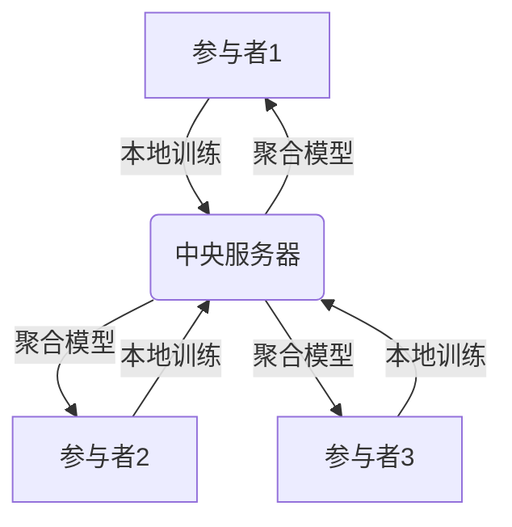
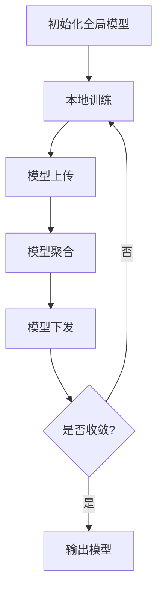

# 联邦学习(Federated Learning) - 原理与代码实例讲解

## 1.背景介绍

### 1.1 数据隐私保护的重要性

在当今的数字时代,数据被视为新的"石油",是推动人工智能和机器学习算法发展的关键资源。然而,随着数据收集和利用的增加,个人隐私和数据安全问题也日益受到关注。传统的集中式机器学习方法需要将所有数据集中在一个中央服务器上进行训练,这可能会导致隐私泄露和数据滥用的风险。

### 1.2 联邦学习的兴起

为了解决数据隐私和安全问题,联邦学习(Federated Learning)作为一种新兴的分布式机器学习范式应运而生。联邦学习允许多个参与者(如个人、组织或设备)在保护数据隐私的同时,共同训练一个机器学习模型,而无需将原始数据传输到中央服务器。这种方法不仅可以保护敏感数据的隐私,还可以减少数据传输和存储的成本。

### 1.3 联邦学习的应用场景

联邦学习在许多领域都有广泛的应用前景,例如:

- **医疗保健**: 不同医院可以在不共享患者隐私数据的情况下,协作训练疾病诊断模型,提高诊断精度。
- **金融**: 银行可以在保护客户隐私的同时,共同训练欺诈检测和风险评估模型。
- **物联网(IoT)**: 联邦学习可以在边缘设备(如手机、智能家居设备等)上训练个性化模型,而无需将数据上传到云端。
- **社交网络**: 社交媒体平台可以利用联邦学习来训练推荐系统和内容过滤模型,保护用户隐私。

## 2.核心概念与联系

### 2.1 联邦学习的基本概念

联邦学习是一种分布式机器学习范式,它允许多个参与者在保护数据隐私的同时,共同训练一个全局模型。每个参与者在本地训练模型,然后将模型更新(如权重或梯度)上传到一个中央服务器。中央服务器聚合所有参与者的模型更新,并将聚合后的全局模型发送回各个参与者,用于下一轮的本地训练。这个过程反复进行,直到模型收敛。

### 2.2 联邦学习与传统机器学习的区别

与传统的集中式机器学习不同,联邦学习具有以下特点:

- **数据隐私保护**: 原始数据不会离开参与者的本地设备,只有模型更新会被上传到中央服务器。
- **异构数据**: 参与者的数据可能来自不同的分布,具有不同的特征和标签。
- **非独立同分布(Non-IID)**: 参与者的数据通常不满足独立同分布(IID)的假设,这给模型训练带来了新的挑战。
- **通信效率**: 由于需要在参与者和中央服务器之间传输模型更新,因此通信效率是一个重要考虑因素。
- **安全性**: 联邦学习需要解决潜在的安全威胁,如差分隐私、模型攻击和数据污染等。

### 2.3 联邦学习的关键技术

实现高效和安全的联邦学习需要以下关键技术:

- **聚合算法**: 用于在中央服务器上聚合来自参与者的模型更新,例如FedAvg、FedProx等。
- **通信优化**: 减少参与者和中央服务器之间的通信开销,例如模型压缩、延迟更新等。
- **隐私保护**: 采用差分隐私、加密计算等技术,保护参与者的数据隐私。
- **非IID数据处理**: 处理参与者之间的数据分布差异,例如个性化模型、知识蒸馏等。
- **安全防护**: 防御模型攻击、数据污染等安全威胁,例如Byzantine容错、异常检测等。

## 3.核心算法原理具体操作步骤

### 3.1 FedAvg算法

FedAvg(Federated Averaging)是联邦学习中最基本和广泛使用的聚合算法。它的工作原理如下:

1. **初始化**: 中央服务器初始化一个全局模型$w_0$,并将其发送给所有参与者。

2. **本地训练**: 每个参与者$k$使用本地数据$D_k$在当前全局模型$w_t$的基础上进行$E$轮本地训练,得到本地模型$w_k^{t+1}$。

3. **模型上传**: 参与者将本地模型$w_k^{t+1}$上传到中央服务器。

4. **模型聚合**: 中央服务器根据参与者的数据量$n_k$,对所有本地模型进行加权平均,得到新的全局模型$w_{t+1}$:

   $$w_{t+1} = \sum_{k=1}^{K} \frac{n_k}{n} w_k^{t+1}$$

   其中$K$是参与者的总数,$n$是所有参与者的数据量之和。

5. **模型下发**: 中央服务器将新的全局模型$w_{t+1}$发送给所有参与者。

6. **迭代训练**: 重复步骤2-5,直到模型收敛或达到最大迭代次数。

### 3.2 FedProx算法

FedProx(Federated Proximal)是一种改进的联邦学习算法,旨在解决参与者之间的数据分布差异(Non-IID)问题。它在FedAvg的基础上引入了一个正则化项,限制本地模型与全局模型的偏离程度。

FedProx的本地训练目标函数如下:

$$\min_{w} F_k(w) + \frac{\mu}{2} \|w - w_t\|^2$$

其中$F_k(w)$是参与者$k$的本地损失函数,$\mu$是正则化系数,$w_t$是当前的全局模型。

通过引入正则化项,FedProx可以在一定程度上缓解参与者之间的数据分布差异,提高模型的泛化能力。

### 3.3 FedProx算法步骤

1. **初始化**: 中央服务器初始化一个全局模型$w_0$,并将其发送给所有参与者。

2. **本地训练**: 每个参与者$k$使用本地数据$D_k$在当前全局模型$w_t$的基础上进行$E$轮本地训练,得到本地模型$w_k^{t+1}$,优化目标如下:

   $$\min_{w} F_k(w) + \frac{\mu}{2} \|w - w_t\|^2$$

3. **模型上传**: 参与者将本地模型$w_k^{t+1}$上传到中央服务器。

4. **模型聚合**: 中央服务器根据参与者的数据量$n_k$,对所有本地模型进行加权平均,得到新的全局模型$w_{t+1}$:

   $$w_{t+1} = \sum_{k=1}^{K} \frac{n_k}{n} w_k^{t+1}$$

5. **模型下发**: 中央服务器将新的全局模型$w_{t+1}$发送给所有参与者。

6. **迭代训练**: 重复步骤2-5,直到模型收敛或达到最大迭代次数。

FedProx算法通过引入正则化项,可以在一定程度上缓解参与者之间的数据分布差异,提高模型的泛化能力。但是,正则化系数$\mu$的选择对算法的性能有重要影响,需要根据具体情况进行调整。

## 4.数学模型和公式详细讲解举例说明

### 4.1 联邦学习的目标函数

在联邦学习中,我们希望找到一个全局模型$w$,使得所有参与者的损失函数之和最小化。数学表达式如下:

$$\min_{w} F(w) = \sum_{k=1}^{K} \frac{n_k}{n} F_k(w)$$

其中$K$是参与者的总数,$n_k$是参与者$k$的数据量,$n$是所有参与者的数据量之和,$F_k(w)$是参与者$k$的本地损失函数。

通过最小化总损失函数$F(w)$,我们可以找到一个在所有参与者的数据上表现良好的全局模型。

### 4.2 FedAvg算法的数学模型

FedAvg算法通过迭代的方式逼近最优解。在第$t$轮迭代中,每个参与者$k$使用本地数据$D_k$在当前全局模型$w_t$的基础上进行$E$轮本地训练,得到本地模型$w_k^{t+1}$。

本地训练的目标函数为:

$$\min_{w} F_k(w)$$

然后,中央服务器根据参与者的数据量$n_k$,对所有本地模型进行加权平均,得到新的全局模型$w_{t+1}$:

$$w_{t+1} = \sum_{k=1}^{K} \frac{n_k}{n} w_k^{t+1}$$

可以证明,如果每个参与者的本地损失函数$F_k(w)$是连续可微的,并且满足一定的光滑条件,那么FedAvg算法将收敛到最优解。

### 4.3 FedProx算法的数学模型

FedProx算法在FedAvg的基础上引入了一个正则化项,旨在缓解参与者之间的数据分布差异。

在第$t$轮迭代中,每个参与者$k$使用本地数据$D_k$在当前全局模型$w_t$的基础上进行$E$轮本地训练,优化目标如下:

$$\min_{w} F_k(w) + \frac{\mu}{2} \|w - w_t\|^2$$

其中$\mu$是正则化系数,用于控制本地模型与全局模型之间的偏离程度。

通过引入正则化项,FedProx算法可以在一定程度上缓解参与者之间的数据分布差异,提高模型的泛化能力。但是,正则化系数$\mu$的选择对算法的性能有重要影响,需要根据具体情况进行调整。

### 4.4 示例:线性回归模型

为了更好地理解联邦学习的数学模型,我们以线性回归为例进行说明。

假设有$K$个参与者,每个参与者$k$有一个本地数据集$D_k = \{(x_i^k, y_i^k)\}_{i=1}^{n_k}$,其中$x_i^k \in \mathbb{R}^d$是输入特征向量,$y_i^k \in \mathbb{R}$是目标变量。

我们希望找到一个线性模型$y = w^Tx + b$,使得所有参与者的平方损失之和最小化:

$$\min_{w, b} F(w, b) = \sum_{k=1}^{K} \frac{n_k}{n} \sum_{i=1}^{n_k} (w^Tx_i^k + b - y_i^k)^2$$

在FedAvg算法中,每个参与者$k$使用本地数据$D_k$在当前全局模型$(w_t, b_t)$的基础上进行$E$轮本地训练,得到本地模型$(w_k^{t+1}, b_k^{t+1})$。然后,中央服务器根据参与者的数据量$n_k$,对所有本地模型进行加权平均,得到新的全局模型$(w_{t+1}, b_{t+1})$:

$$w_{t+1} = \sum_{k=1}^{K} \frac{n_k}{n} w_k^{t+1}, \quad b_{t+1} = \sum_{k=1}^{K} \frac{n_k}{n} b_k^{t+1}$$

在FedProx算法中,每个参与者$k$在本地训练时,优化目标如下:

$$\min_{w, b} \sum_{i=1}^{n_k} (w^Tx