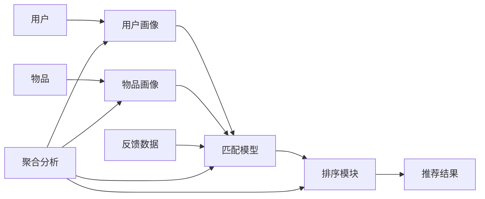

# 聚合分析在推荐系统领域的应用实例

## 1. 背景介绍

### 1.1 推荐系统的重要性

在当今信息爆炸的时代,推荐系统在各个领域扮演着越来越重要的角色。它能够帮助用户从海量的信息中快速发现感兴趣的内容,提高用户的满意度和忠诚度。无论是电商平台、社交网络,还是内容分发平台,推荐系统都已成为不可或缺的核心组件之一。

### 1.2 聚合分析的价值

聚合分析(Aggregation Analysis)作为一种强大的数据分析技术,在推荐系统中具有广泛的应用前景。它通过对不同维度的数据进行聚合,挖掘出有价值的模式和规律,从而为推荐决策提供更加全面和精准的依据。聚合分析不仅能够提高推荐的质量,还能够提升系统的性能和效率。

### 1.3 本文的目的和结构

本文旨在探讨聚合分析在推荐系统领域的应用实例,分享一些实践经验和思考。全文分为9个部分：背景介绍,核心概念与联系,核心算法原理,数学模型和公式,项目实践,实际应用场景,工具和资源推荐,总结与展望,以及附录。希望通过本文,读者能够对聚合分析在推荐系统中的应用有更加深入和全面的认识。

## 2. 核心概念与联系

### 2.1 推荐系统的基本架构

一个典型的推荐系统通常由以下几个核心组件构成：

- 用户画像(User Profile):通过收集用户的各种属性、行为、偏好等信息,构建用户特征向量。
- 物品画像(Item Profile):类似地,对推荐的物品(如商品、文章、视频等)也要提取特征,形成物品特征向量。  
- 匹配模型(Matching Model):基于用户和物品的特征,计算二者的匹配度或者相似度,生成推荐结果。
- 排序模块(Ranking Module):对生成的推荐结果进行排序,选出Top-N推荐给用户。
- 反馈机制(Feedback):收集用户对推荐结果的反馈,用于优化和更新推荐模型。

### 2.2 聚合分析的定义

聚合分析是指将数据按照某种维度进行分组、汇总,提炼出高层次的统计指标和规律的过程。常见的聚合操作包括:求和、平均、计数、去重等。聚合分析能够从宏观角度把握数据的整体特征,发现隐藏的关联和趋势。

### 2.3 聚合分析与推荐系统的关系 

在推荐系统中,聚合分析主要应用在以下几个方面:

- 特征工程:通过聚合不同来源的数据(如用户属性、行为日志、外部数据等),构建更加丰富和有区分度的特征。
- 候选集生成:利用聚合指标(如热度、相似度等)初步筛选出一批推荐候选,缩小搜索空间。
- 排序优化:将聚合统计量作为排序模型的特征,提高排序的效果。
- 冷启动:利用聚合信息(如热门商品、新用户的群体偏好等)解决新用户、新物品的推荐问题。

下图展示了聚合分析在推荐系统架构中的作用:

## 3. 核心算法原理具体操作步骤

本节介绍几种常用的聚合分析算法在推荐系统中的应用原理和操作步骤。

### 3.1 基于物品的协同过滤(Item-based CF)

#### 3.1.1 基本原理

基于物品的协同过滤的核心思想是:找到用户喜欢的物品,然后推荐与之相似的其他物品。其中物品的相似度通过聚合分析用户的行为数据(如评分、点击、购买等)来计算。

#### 3.1.2 具体步骤

1. 建立用户-物品评分矩阵。矩阵的行表示用户,列表示物品,元素值为用户对物品的评分。  
2. 计算物品两两之间的相似度。常用的相似度度量有:
   - 余弦相似度:$sim(i,j)=\frac{\sum_{u∈U}R_{u,i}R_{u,j}}{\sqrt{\sum_{u∈U}R_{u,i}^2}\sqrt{\sum_{u∈U}R_{u,j}^2}}$
   - 皮尔逊相关系数:$sim(i,j)=\frac{\sum_{u∈U}(R_{u,i}-\overline{R_i})(R_{u,j}-\overline{R_j})}{\sqrt{\sum_{u∈U}(R_{u,i}-\overline{R_i})^2}\sqrt{\sum_{u∈U}(R_{u,j}-\overline{R_j})^2}}$
   
   其中$R_{u,i}$表示用户$u$对物品$i$的评分,$\overline{R_i}$表示物品$i$的平均评分。

3. 对每个用户,基于物品相似度,聚合其历史评分过的物品,计算其他物品的预测评分:

$$\hat{R}_{u,i}=\frac{\sum_{j∈S(u,i)}sim(i,j)R_{u,j}}{\sum_{j∈S(u,i)}sim(i,j)}$$

其中$S(u,i)$表示与物品$i$相似的、用户$u$评分过的物品集合。

4. 将预测评分高的Top-N物品推荐给用户。

### 3.2 基于标签的推荐(Tag-based)

#### 3.2.1 基本原理

利用用户对物品的标签标注,通过聚合分析用户和物品的标签,构建用户和物品的主题偏好,然后基于主题相似度进行推荐。

#### 3.2.2 具体步骤

1. 收集用户对物品的标签标注数据,形成用户-物品-标签的三元组$(u,i,t)$。

2. 聚合用户和物品的标签向量。用户$u$的标签向量为:

$$\vec{T_u}=(w_{u,1},w_{u,2},...,w_{u,n})$$

其中$w_{u,k}$表示标签$t_k$对用户$u$的重要性,可以用标签频次、TF-IDF等方法计算。物品的标签向量$\vec{T_i}$类似定义。

3. 计算用户和物品在标签空间的相似度,常用的相似度度量有:
   - 余弦相似度:$sim(u,i)=\frac{\vec{T_u}·\vec{T_i}}{\|\vec{T_u}\|\|\vec{T_i}\|}$
   - 杰卡德相似度:$sim(u,i)=\frac{|\vec{T_u}∩\vec{T_i}|}{|\vec{T_u}∪\vec{T_i}|}$

4. 将与用户标签偏好相似度高的物品推荐给用户。 

### 3.3 基于关联规则的推荐

#### 3.3.1 基本原理

通过聚合分析用户的购买记录,挖掘物品之间的关联规则(如"啤酒→尿布"),然后根据关联规则给用户推荐经常一起购买的物品。

#### 3.3.2 具体步骤

1. 将每个用户的购买记录表示为一个事务,物品是事务中的项。

2. 采用Apriori、FP-Growth等频繁项集挖掘算法,找出物品的频繁共现模式。

3. 根据频繁项集生成关联规则。一条关联规则形如$A→B$,其中$A$和$B$是两个非空的物品集合。关联规则的重要指标有:
   - 支持度:$Support(A→B)=\frac{|A∪B|}{N}$,表示$A$和$B$同时出现的概率。
   - 置信度:$Confidence(A→B)=\frac{Support(A∪B)}{Support(A)}$,表示在包含$A$的事务中同时包含$B$的概率。

4. 设置支持度和置信度的阈值,选择强关联规则。对于每个用户的购买记录,用关联规则扩展出推荐的物品。

## 4. 数学模型和公式详细讲解举例说明

本节详细讲解聚合分析中涉及的几个重要的数学模型和公式,并给出具体的例子说明。

### 4.1 用户-物品评分矩阵

用户-物品评分矩阵是推荐系统的基础数据结构,矩阵的行表示用户,列表示物品,元素值为用户对物品的评分。例如:

|   | 物品1 | 物品2 | 物品3 |
|:--|:--:|:--:|:--:|
| 用户1 | 3 | 4 |  |
| 用户2 | 4 |  | 5 |
| 用户3 |  | 2 | 3 |

矩阵中空白的元素表示用户未对该物品评分。矩阵通常很稀疏。

### 4.2 余弦相似度

余弦相似度用于度量两个向量之间的夹角余弦值。夹角越小余弦值越大,表示两个向量方向越接近,也就是相似度越高。

假设有两个$n$维向量$\mathbf{a}=(a_1,a_2,...,a_n)$和$\mathbf{b}=(b_1,b_2,...,b_n)$,其余弦相似度为:

$$cos(\mathbf{a},\mathbf{b})=\frac{\mathbf{a}·\mathbf{b}}{\|\mathbf{a}\|\|\mathbf{b}\|}=\frac{\sum_{i=1}^na_ib_i}{\sqrt{\sum_{i=1}^na_i^2}\sqrt{\sum_{i=1}^nb_i^2}}$$

例如,向量$\mathbf{a}=(1,2,3)$和$\mathbf{b}=(2,3,4)$的余弦相似度为:

$$cos(\mathbf{a},\mathbf{b})=\frac{1×2+2×3+3×4}{\sqrt{1^2+2^2+3^2}\sqrt{2^2+3^2+4^2}}≈0.992$$

### 4.3 皮尔逊相关系数

皮尔逊相关系数用于度量两个变量之间的线性相关性,取值范围在$[-1,1]$之间。值越接近1表示正相关越强,越接近-1表示负相关越强,0表示不相关。

假设有两组观测值$X=(x_1,x_2,...,x_n)$和$Y=(y_1,y_2,...,y_n)$,其皮尔逊相关系数为:

$$r=\frac{\sum_{i=1}^n(x_i-\overline{X})(y_i-\overline{Y})}{\sqrt{\sum_{i=1}^n(x_i-\overline{X})^2}\sqrt{\sum_{i=1}^n(y_i-\overline{Y})^2}}$$

其中$\overline{X}$和$\overline{Y}$分别是$X$和$Y$的均值。

例如,两组观测值$X=(1,2,3,4,5)$和$Y=(2,4,6,8,10)$的皮尔逊相关系数为:

$$r=\frac{(1-3)(2-6)+(2-3)(4-6)+...+(5-3)(10-6)}{\sqrt{(1-3)^2+...+(5-3)^2}\sqrt{(2-6)^2+...+(10-6)^2}}=1$$

表明$X$和$Y$存在完全正相关。

### 4.4 关联规则的支持度和置信度

支持度和置信度是关联规则挖掘中的两个重要指标。支持度表示规则的覆盖度,置信度表示规则的可信程度。

假设有一条关联规则$A→B$,其中$A$和$B$是两个物品集合,$N$表示总事务数,则:

- 支持度:$Support(A→B)=\frac{|A∪B|}{N}$
- 置信度:$Confidence(A→B)=\frac{Support(A∪B)}{Support(A)}$

例如,在1000个购物事务中,有50个事务同时包含啤酒和尿布,而包含啤酒的事务有100个,则关联规则"啤酒→尿布"的支持度和置信度分别为:

- $Support(啤酒→尿布)=\