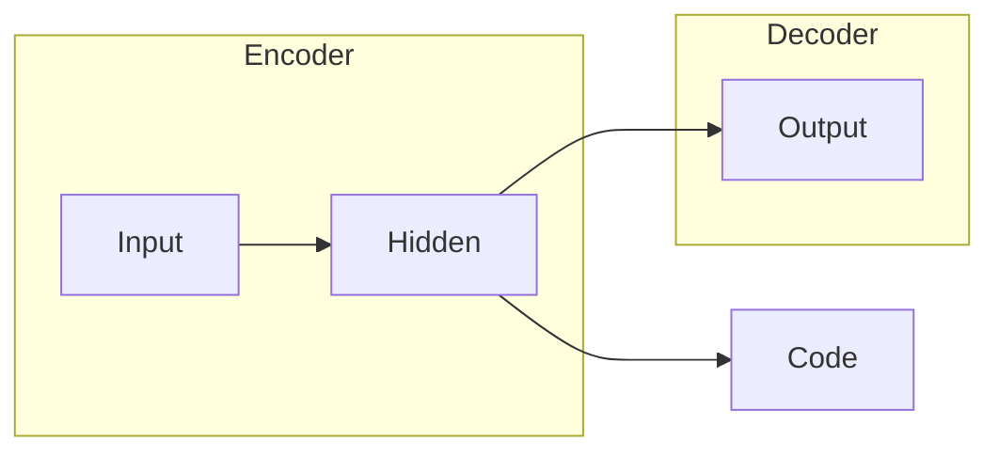

# 自动编码器 (Autoencoder) 原理与代码实例讲解

## 1. 背景介绍

### 1.1 什么是自动编码器？

自动编码器(Autoencoder)是一种无监督学习的人工神经网络,它被设计用于从输入数据中自动学习高效的数据编码。自动编码器的目标是学习一种表示形式,使得输入数据可以通过降维编码后再解码而获得与原始输入数据非常相似的输出。

自动编码器由两部分组成:编码器(Encoder)和解码器(Decoder)。编码器将高维输入数据压缩为低维编码表示,而解码器则尝试从该编码表示中重构出与原始输入数据尽可能相似的输出。

### 1.2 自动编码器的应用

自动编码器在许多领域有着广泛的应用,例如:

- **数据去噪**:通过将噪声数据输入到自动编码器,可以获得去噪后的清晰数据输出。
- **数据压缩**:自动编码器可以将高维数据压缩为低维编码,从而实现数据压缩。
- **特征学习**:自动编码器可以从原始数据中自动学习有用的特征表示。
- **异常检测**:通过检测输入数据与自动编码器重构输出之间的差异,可以发现异常数据。

## 2. 核心概念与联系

### 2.1 自动编码器的基本结构

自动编码器由编码器和解码器两部分组成,如下图所示:



编码器将高维输入数据映射到低维编码空间,而解码器则尝试从该低维编码中重构出与原始输入数据尽可能相似的输出。

### 2.2 自动编码器的损失函数

自动编码器的训练目标是最小化输入数据与重构输出之间的差异,通常使用均方误差(Mean Squared Error, MSE)作为损失函数:

$$J(x, \hat{x}) = \frac{1}{n}\sum_{i=1}^{n}(x_i - \hat{x}_i)^2$$

其中 $x$ 表示原始输入数据, $\hat{x}$ 表示自动编码器的重构输出, $n$ 是数据的维度。

### 2.3 自动编码器的变体

根据编码器和解码器的结构不同,自动编码器有多种变体:

- **稀疏自动编码器(Sparse Autoencoder)**: 在编码层引入稀疏性约束,使得编码具有更强的表示能力。
- **去噪自动编码器(Denoising Autoencoder)**: 在训练时向输入数据中引入噪声,使得自动编码器学会从噪声数据中恢复原始数据。
- **变分自动编码器(Variational Autoencoder, VAE)**: 将编码空间建模为概率分布,可以生成新的数据样本。

## 3. 核心算法原理具体操作步骤

### 3.1 自动编码器的前向传播

自动编码器的前向传播过程包括编码和解码两个阶段:

1. **编码阶段**:输入数据 $x$ 通过编码器映射到隐藏层(编码层),得到编码表示 $h = f(x)$,其中 $f$ 是编码器的函数。
2. **解码阶段**:编码表示 $h$ 通过解码器映射到输出层,得到重构输出 $\hat{x} = g(h)$,其中 $g$ 是解码器的函数。

### 3.2 自动编码器的反向传播

自动编码器的训练过程使用反向传播算法,根据输入数据与重构输出之间的差异调整网络参数:

1. 计算输入数据 $x$ 与重构输出 $\hat{x}$ 之间的损失 $J(x, \hat{x})$。
2. 计算损失函数相对于网络参数的梯度。
3. 使用优化算法(如梯度下降)更新网络参数,以最小化损失函数。

### 3.3 自动编码器的训练技巧

为了提高自动编码器的性能,可以采用以下一些训练技巧:

- **预训练**:先对编码器或解码器进行单独预训练,再对整个自动编码器进行微调。
- **正则化**:在损失函数中加入正则化项,如 L1 或 L2 正则化,以防止过拟合。
- **噪声注入**:在输入数据中注入噪声,使得自动编码器具有更强的鲁棒性。
- **对抗训练**:将自动编码器与判别器(Discriminator)结合,形成对抗生成网络(GAN),提高生成数据的质量。

## 4. 数学模型和公式详细讲解举例说明

### 4.1 自动编码器的数学模型

假设输入数据为 $x \in \mathbb{R}^{d}$,编码器将其映射到隐藏层(编码层)的编码表示 $h \in \mathbb{R}^{d'}$,其中 $d' < d$。编码器的函数可表示为:

$$h = f(x) = \sigma(Wx + b)$$

其中 $W \in \mathbb{R}^{d' \times d}$ 是编码器的权重矩阵, $b \in \mathbb{R}^{d'}$ 是偏置向量, $\sigma$ 是非线性激活函数(如 ReLU 或 Sigmoid)。

解码器将编码表示 $h$ 映射回原始数据空间,得到重构输出 $\hat{x} \in \mathbb{R}^{d}$,其函数可表示为:

$$\hat{x} = g(h) = \sigma'(W'h + b')$$

其中 $W' \in \mathbb{R}^{d \times d'}$ 是解码器的权重矩阵, $b' \in \mathbb{R}^{d}$ 是偏置向量, $\sigma'$ 是解码器的激活函数。

自动编码器的目标是最小化输入数据 $x$ 与重构输出 $\hat{x}$ 之间的差异,通常使用均方误差(MSE)作为损失函数:

$$J(x, \hat{x}) = \frac{1}{n}\sum_{i=1}^{n}(x_i - \hat{x}_i)^2$$

在训练过程中,通过反向传播算法计算损失函数相对于网络参数(如 $W$, $W'$, $b$, $b'$)的梯度,并使用优化算法(如梯度下降)更新这些参数,以最小化损失函数。

### 4.2 自动编码器的数学模型举例

假设我们有一个简单的自动编码器,其输入数据 $x$ 是一个 4 维向量,编码层的维度为 2,激活函数使用 Sigmoid 函数。

编码器的权重矩阵 $W \in \mathbb{R}^{2 \times 4}$,偏置向量 $b \in \mathbb{R}^{2}$,编码函数为:

$$h = f(x) = \sigma(Wx + b)$$

假设输入数据为 $x = [0.5, 0.1, 0.2, 0.8]^T$,编码器的权重矩阵和偏置向量分别为:

$$W = \begin{bmatrix}
0.1 & 0.4 & 0.2 & 0.5 \\
0.3 & 0.2 & 0.6 & 0.1
\end{bmatrix}, \quad b = \begin{bmatrix}
0.2 \\
0.1
\end{bmatrix}$$

则编码表示 $h$ 可计算为:

$$h = \sigma(Wx + b) = \sigma\left(\begin{bmatrix}
0.1 & 0.4 & 0.2 & 0.5 \\
0.3 & 0.2 & 0.6 & 0.1
\end{bmatrix} \begin{bmatrix}
0.5 \\
0.1 \\
0.2 \\
0.8
\end{bmatrix} + \begin{bmatrix}
0.2 \\
0.1
\end{bmatrix}\right) = \begin{bmatrix}
0.62 \\
0.58
\end{bmatrix}$$

接下来,解码器将编码表示 $h$ 映射回原始数据空间,得到重构输出 $\hat{x}$。假设解码器的权重矩阵 $W' \in \mathbb{R}^{4 \times 2}$,偏置向量 $b' \in \mathbb{R}^{4}$,解码函数为:

$$\hat{x} = g(h) = \sigma'(W'h + b')$$

假设解码器的权重矩阵和偏置向量分别为:

$$W' = \begin{bmatrix}
0.6 & 0.2 \\
0.1 & 0.4 \\
0.3 & 0.5 \\
0.2 & 0.1
\end{bmatrix}, \quad b' = \begin{bmatrix}
0.1 \\
0.2 \\
0.3 \\
0.4
\end{bmatrix}$$

则重构输出 $\hat{x}$ 可计算为:

$$\hat{x} = \sigma'(W'h + b') = \sigma'\left(\begin{bmatrix}
0.6 & 0.2 \\
0.1 & 0.4 \\
0.3 & 0.5 \\
0.2 & 0.1
\end{bmatrix} \begin{bmatrix}
0.62 \\
0.58
\end{bmatrix} + \begin{bmatrix}
0.1 \\
0.2 \\
0.3 \\
0.4
\end{bmatrix}\right) = \begin{bmatrix}
0.51 \\
0.14 \\
0.25 \\
0.79
\end{bmatrix}$$

在这个例子中,自动编码器将 4 维输入数据 $x = [0.5, 0.1, 0.2, 0.8]^T$ 编码为 2 维表示 $h = [0.62, 0.58]^T$,然后从该编码表示中重构出与原始输入数据接近的输出 $\hat{x} = [0.51, 0.14, 0.25, 0.79]^T$。

## 5. 项目实践: 代码实例和详细解释说明

在这一节,我们将使用 Python 和 TensorFlow 库实现一个简单的自动编码器,并对代码进行详细解释。

### 5.1 导入所需库

```python
import tensorflow as tf
from tensorflow.keras.layers import Input, Dense
from tensorflow.keras.models import Model
import numpy as np
import matplotlib.pyplot as plt
```

我们导入了 TensorFlow、Numpy 和 Matplotlib 库,用于构建自动编码器模型、生成示例数据和可视化结果。

### 5.2 生成示例数据

```python
# 生成示例数据
X_train = np.array([[0.5, 0.1, 0.2, 0.8], 
                    [0.9, 0.2, 0.1, 0.6],
                    [0.3, 0.8, 0.4, 0.7],
                    [0.7, 0.5, 0.6, 0.2]])
```

我们生成了一个包含 4 个样本的示例数据集 `X_train`,每个样本是一个 4 维向量。

### 5.3 构建自动编码器模型

```python
# 输入维度
input_dim = X_train.shape[1]

# 编码器
input_layer = Input(shape=(input_dim,))
encoded = Dense(2, activation='relu')(input_layer)

# 解码器
decoded = Dense(input_dim, activation='sigmoid')(encoded)

# 构建自动编码器模型
autoencoder = Model(input_layer, decoded)

# 编译模型
autoencoder.compile(optimizer='adam', loss='mse')
```

我们首先定义输入数据的维度 `input_dim`。然后,我们构建了自动编码器模型:

- 编码器部分使用一个密集层将输入数据映射到 2 维编码空间,激活函数为 ReLU。
- 解码器部分使用另一个密集层将编码表示映射回原始数据空间,激活函数为 Sigmoid。
- 我们使用 `Model` 类将编码器和解码器组合成完整的自动编码器模型。
- 最后,我们使用均方误差(MSE)作为损失函数,Adam 优化器进行模型编译。

### 5.4 训练自动编码器模型

```python
# 训练模型
autoencoder.fit(X_train, X_train, epochs=50, batch_size=4, shuffle=True)
```

我们使用 `fit` 函数训练自动编码器模型,将输入数据 `X_train` 作为输入和目标输出。我们设置训练 50 个 epoch,批量大小为 4,并在每个 epoch 开始时随机打乱数据顺序。

### 5.5 测试自动编码器模型

```python
# 测试模型