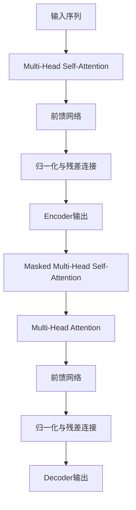
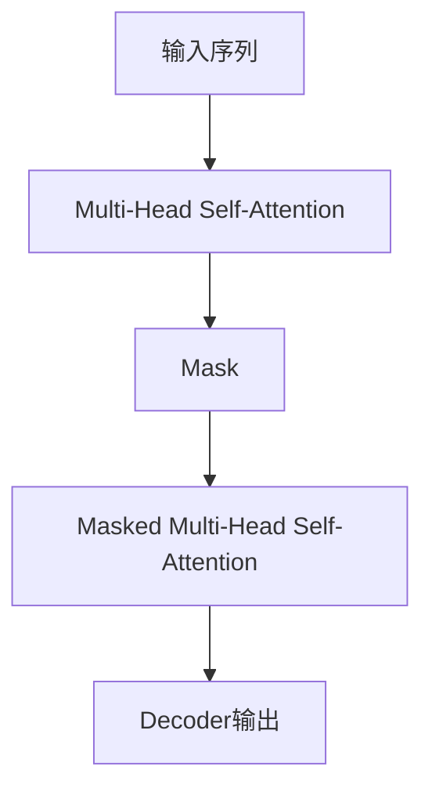

# 自注意力(Self-Attention)原理与代码实战案例讲解

## 1.背景介绍

### 1.1 序列数据处理的挑战

在自然语言处理、语音识别、机器翻译等领域,我们经常会遇到序列数据,如文本、语音、视频等。与传统的结构化数据不同,序列数据具有以下特点:

- 长度可变
- 顺序敏感
- 存在长程依赖关系

传统的神经网络模型如RNN(循环神经网络)、LSTM在处理长序列时存在梯度消失/爆炸的问题,难以有效捕捉长程依赖关系。而Self-Attention则能够直接对序列中任意两个位置之间的元素建模,捕捉全局依赖关系,成为解决序列数据处理挑战的有力工具。

### 1.2 Self-Attention的兴起

2017年,Self-Attention被提出并应用于Transformer模型,取得了令人瞩目的成绩,在机器翻译等任务上超越了RNN。自此,Self-Attention成为NLP领域的研究热点,也逐渐被引入到计算机视觉、语音识别等其他领域。

## 2.核心概念与联系

### 2.1 Self-Attention的核心思想

Self-Attention的核心思想是计算一个序列中每个元素与该序列中所有其他元素的相关性,并据此为每个元素分配权重。具体来说,对于序列中的任意一个元素,Self-Attention会计算它与序列中所有其他元素的注意力分数(attention score),然后根据这些分数对所有元素进行加权求和,得到该元素的表示向量。

$$
\mathrm{Attention}(Q, K, V) = \mathrm{softmax}(\frac{QK^T}{\sqrt{d_k}})V
$$

其中 $Q$ 为查询(Query)向量, $K$ 为键(Key)向量, $V$ 为值(Value)向量。$d_k$ 为缩放因子,用于防止点积过大导致softmax函数的梯度较小。

### 2.2 Self-Attention与传统注意力机制的区别

传统的注意力机制(如Seq2Seq模型中的注意力)是在编码器(Encoder)和解码器(Decoder)之间建立依赖关系,而Self-Attention则是对同一个序列内元素之间的依赖关系进行建模。

此外,传统注意力机制是基于对齐的思想,即查询向量与键向量之间的相似性决定了注意力权重的分配。而Self-Attention则更加灵活,可以根据不同的任务对查询、键、值向量进行不同的设计。

### 2.3 Self-Attention在Transformer中的应用

Transformer是第一个将Self-Attention应用于序列数据处理的模型,它完全抛弃了RNN和卷积网络,使用Self-Attention作为主要的编码和解码组件。Transformer的编码器由多层Self-Attention和前馈网络组成,解码器则在Self-Attention的基础上增加了对编码器输出的注意力。

上图展示了Transformer的基本结构,其中Self-Attention是编码器和解码器中的关键组件。

## 3.核心算法原理具体操作步骤

### 3.1 注意力计算过程

Self-Attention的计算过程可以分为以下几个步骤:

1. **线性投影**: 将输入序列 $X$ 分别投影到查询 $Q$、键 $K$ 和值 $V$ 的向量空间,得到 $Q$、$K$、$V$ 矩阵。

   $$Q = XW_Q, K = XW_K, V = XW_V$$

2. **计算注意力分数**: 通过 $Q$ 和 $K$ 的矩阵乘积计算注意力分数矩阵 $S$,并对分数进行缩放处理。
   
   $$S = \frac{QK^T}{\sqrt{d_k}}$$

3. **softmax归一化**: 对每一行的注意力分数进行softmax归一化,得到注意力权重矩阵 $A$。

   $$A = \mathrm{softmax}(S)$$

4. **加权求和**: 将注意力权重矩阵 $A$ 与值矩阵 $V$ 相乘,得到输出矩阵 $O$。
   
   $$O = AV$$

上述过程可以用一个公式总结:

$$\mathrm{Attention}(Q, K, V) = \mathrm{softmax}(\frac{QK^T}{\sqrt{d_k}})V$$

### 3.2 Multi-Head Attention

单一的Self-Attention只能从一个子空间捕捉序列间的依赖关系,为了提高模型的表达能力,Transformer引入了Multi-Head Attention机制。

Multi-Head Attention将查询 $Q$、键 $K$ 和值 $V$ 分别投影到 $h$ 个子空间,并在每个子空间内计算Self-Attention,最后将所有子空间的结果拼接起来。

$$\begin{aligned}
\mathrm{MultiHead}(Q, K, V) &= \mathrm{Concat}(\mathrm{head}_1, \dots, \mathrm{head}_h)W^O\\
\mathrm{where}\ \mathrm{head}_i &= \mathrm{Attention}(QW_i^Q, KW_i^K, VW_i^V)
\end{aligned}$$

Multi-Head Attention能够从不同的子空间捕捉序列间的依赖关系,提高了模型的表达能力。

### 3.3 Masked Self-Attention

在机器翻译等序列生成任务中,解码器需要根据已生成的输出序列和编码器的输出序列来预测下一个元素。为了避免解码器获取未来的信息,Transformer在解码器的Self-Attention中引入了Mask机制。

具体来说,对于序列中的第 $i$ 个位置,Masked Self-Attention只允许其与前 $i-1$ 个位置的元素进行注意力计算,屏蔽掉后面的元素。这样可以确保解码器在生成第 $i$ 个元素时,只依赖于前 $i-1$ 个元素的信息。

## 4.数学模型和公式详细讲解举例说明

在前面的章节中,我们已经介绍了Self-Attention的基本原理和计算过程。现在,我们来更深入地探讨Self-Attention的数学模型,并通过具体的例子来说明其计算细节。

### 4.1 Self-Attention的矩阵形式

假设我们有一个长度为 $n$ 的输入序列 $X = [x_1, x_2, \dots, x_n]$,其中每个 $x_i$ 是一个 $d$ 维向量。我们首先将 $X$ 分别投影到查询 $Q$、键 $K$ 和值 $V$ 的向量空间,得到矩阵 $Q$、$K$ 和 $V$,其中 $Q, K \in \mathbb{R}^{n \times d_k}$, $V \in \mathbb{R}^{n \times d_v}$。

$$Q = XW_Q, K = XW_K, V = XW_V$$

其中 $W_Q \in \mathbb{R}^{d \times d_k}$, $W_K \in \mathbb{R}^{d \times d_k}$, $W_V \in \mathbb{R}^{d \times d_v}$ 分别为查询、键和值的投影矩阵。

接下来,我们计算注意力分数矩阵 $S \in \mathbb{R}^{n \times n}$,其中第 $i$ 行第 $j$ 列的元素 $s_{ij}$ 表示第 $i$ 个位置对第 $j$ 个位置的注意力分数。

$$s_{ij} = \frac{q_i^Tk_j}{\sqrt{d_k}}$$

其中 $q_i$ 和 $k_j$ 分别为 $Q$ 和 $K$ 的第 $i$ 行和第 $j$ 行。$\sqrt{d_k}$ 是一个缩放因子,用于防止点积过大导致softmax函数的梯度较小。

然后,我们对每一行的注意力分数进行softmax归一化,得到注意力权重矩阵 $A \in \mathbb{R}^{n \times n}$。

$$a_{ij} = \frac{\exp(s_{ij})}{\sum_{k=1}^n \exp(s_{ik})}$$

最后,我们将注意力权重矩阵 $A$ 与值矩阵 $V$ 相乘,得到输出矩阵 $O \in \mathbb{R}^{n \times d_v}$。

$$o_i = \sum_{j=1}^n a_{ij}v_j$$

其中 $o_i$ 是 $O$ 的第 $i$ 行,表示第 $i$ 个位置的输出向量。

### 4.2 Multi-Head Attention的矩阵形式

Multi-Head Attention将查询 $Q$、键 $K$ 和值 $V$ 分别投影到 $h$ 个子空间,并在每个子空间内计算Self-Attention,最后将所有子空间的结果拼接起来。

具体来说,对于第 $l$ 个子空间 $(l = 1, 2, \dots, h)$,我们有:

$$\begin{aligned}
Q^l &= XW_Q^l, K^l = XW_K^l, V^l = XW_V^l\\
O^l &= \mathrm{Attention}(Q^l, K^l, V^l)
\end{aligned}$$

其中 $W_Q^l \in \mathbb{R}^{d \times d_k}$, $W_K^l \in \mathbb{R}^{d \times d_k}$, $W_V^l \in \mathbb{R}^{d \times d_v}$ 分别为第 $l$ 个子空间的查询、键和值的投影矩阵。

最终的输出矩阵 $O \in \mathbb{R}^{n \times d_v}$ 是所有子空间输出的拼接:

$$O = \mathrm{Concat}(O^1, O^2, \dots, O^h)W^O$$

其中 $W^O \in \mathbb{R}^{hd_v \times d_v}$ 是一个可训练的权重矩阵,用于将多个子空间的输出融合到一个 $d_v$ 维的向量空间中。

### 4.3 计算示例

为了更好地理解Self-Attention的计算过程,我们来看一个具体的例子。假设我们有一个长度为 3 的输入序列 $X = [x_1, x_2, x_3]$,其中每个 $x_i$ 是一个 4 维向量。我们将 $X$ 分别投影到 2 维的查询、键和值空间,得到矩阵 $Q$、$K$ 和 $V$。

$$\begin{aligned}
Q &= \begin{bmatrix}
1 & 2\\
3 & 4\\
5 & 6
\end{bmatrix}, K = \begin{bmatrix}
7 & 8\\
9 & 10\\
11 & 12
\end{bmatrix}, V = \begin{bmatrix}
13 & 14\\
15 & 16\\
17 & 18
\end{bmatrix}
\end{aligned}$$

接下来,我们计算注意力分数矩阵 $S$:

$$S = \frac{QK^T}{\sqrt{2}} = \begin{bmatrix}
\frac{1 \times 7 + 2 \times 8}{\sqrt{2}} & \frac{1 \times 9 + 2 \times 10}{\sqrt{2}} & \frac{1 \times 11 + 2 \times 12}{\sqrt{2}}\\
\frac{3 \times 7 + 4 \times 8}{\sqrt{2}} & \frac{3 \times 9 + 4 \times 10}{\sqrt{2}} & \frac{3 \times 11 + 4 \times 12}{\sqrt{2}}\\
\frac{5 \times 7 + 6 \times 8}{\sqrt{2}} & \frac{5 \times 9 + 6 \times 10}{\sqrt{2}} & \frac{5 \times 11 + 6 \times 12}{\sqrt{2}}
\end{bmatrix}$$

$$= \begin{bmatrix}
21 & 23 & 25\\
45 & 49 & 53\\
69 & 75 & 81
\end{bmatrix}$$

对每一行进行softmax归一化,得到注意力权重矩阵 $A$:

$$A = \mat