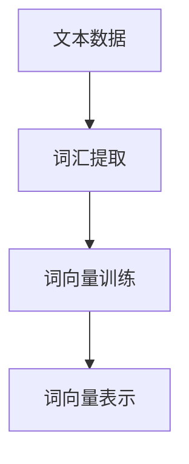
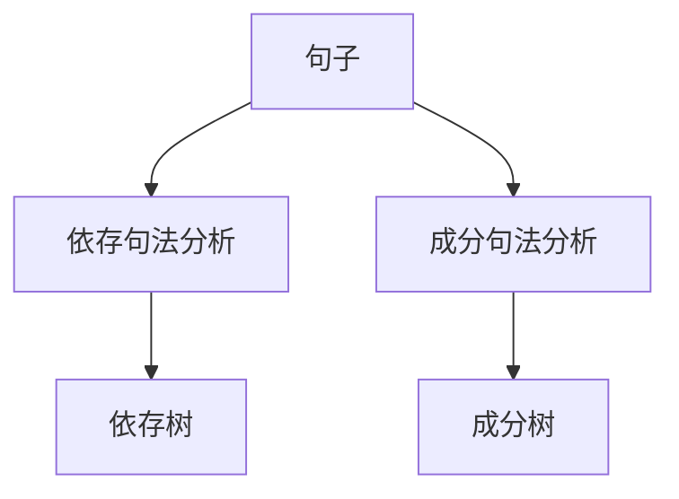
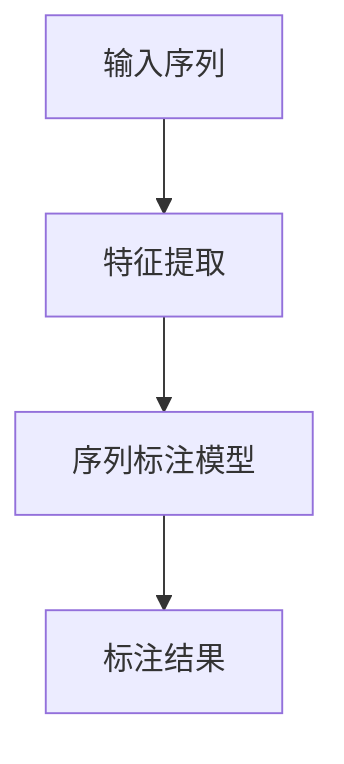
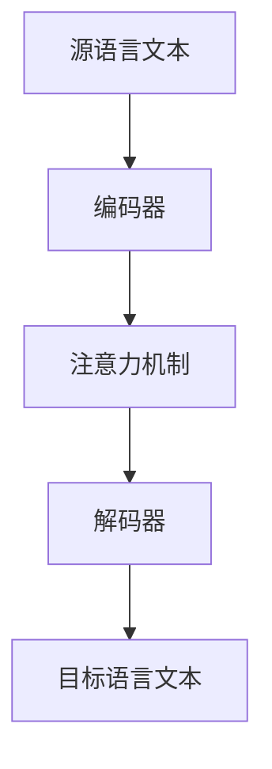

# 自然语言处理(Natural Language Processing) - 原理与代码实例讲解

## 1.背景介绍

自然语言处理（Natural Language Processing，简称NLP）是人工智能和计算语言学的一个重要分支，旨在实现计算机对人类语言的理解、生成和处理。随着大数据和深度学习技术的发展，NLP在过去十年中取得了显著的进展，广泛应用于搜索引擎、智能助手、翻译系统、情感分析等领域。

NLP的核心挑战在于自然语言的复杂性和多样性。人类语言不仅包含丰富的语法和语义信息，还具有模糊性和歧义性。为了应对这些挑战，研究人员开发了多种算法和模型，从传统的统计方法到现代的深度学习技术。

## 2.核心概念与联系

### 2.1 词汇与语法

词汇是语言的基本单位，语法则是词汇组合成句子的规则。NLP的基本任务之一是词汇和语法的解析，包括词性标注、句法分析等。

### 2.2 语义与语用

语义是语言的意义，语用则是语言在特定上下文中的使用。NLP需要理解和生成具有正确语义和语用的文本，这涉及到词义消歧、共指消解等任务。

### 2.3 统计与机器学习

统计方法和机器学习是NLP的基础。通过对大量文本数据的统计分析，NLP模型可以学习语言的规律和模式。现代NLP广泛使用深度学习技术，如卷积神经网络（CNN）和循环神经网络（RNN）。

### 2.4 预训练与微调

预训练模型（如BERT、GPT）通过在大规模语料库上进行训练，学习到丰富的语言表示。然后，通过微调，这些模型可以适应特定任务，如文本分类、问答系统等。

## 3.核心算法原理具体操作步骤

### 3.1 词向量表示

词向量（Word Embedding）是将词汇映射到低维向量空间的技术。常见的方法包括Word2Vec、GloVe等。词向量表示捕捉了词汇之间的语义关系。



### 3.2 句法分析

句法分析是解析句子的语法结构，常用的方法包括依存句法分析和成分句法分析。依存句法分析将句子表示为依存树，成分句法分析将句子表示为成分树。



### 3.3 序列标注

序列标注任务包括词性标注、命名实体识别等。常用的模型有条件随机场（CRF）、双向LSTM等。



### 3.4 机器翻译

机器翻译是将一种语言的文本翻译成另一种语言。现代机器翻译系统多采用神经机器翻译（NMT）技术，如基于注意力机制的Transformer模型。



## 4.数学模型和公式详细讲解举例说明

### 4.1 词向量模型

词向量模型通过优化目标函数，将词汇映射到低维向量空间。以Word2Vec中的Skip-gram模型为例，其目标是最大化上下文词的条件概率：

$$
\max \prod_{t=1}^{T} \prod_{-c \leq j \leq c, j \neq 0} P(w_{t+j} | w_t)
$$

其中，$w_t$ 是中心词，$w_{t+j}$ 是上下文词，$c$ 是上下文窗口大小。

### 4.2 条件随机场

条件随机场（CRF）是一种用于序列标注的概率图模型。给定输入序列 $X$ 和标注序列 $Y$，CRF的目标是最大化条件概率 $P(Y|X)$：

$$
P(Y|X) = \frac{1}{Z(X)} \exp \left( \sum_{t=1}^{T} \sum_{k} \lambda_k f_k(y_{t-1}, y_t, X, t) \right)
$$

其中，$Z(X)$ 是归一化因子，$f_k$ 是特征函数，$\lambda_k$ 是特征权重。

### 4.3 注意力机制

注意力机制在机器翻译中广泛应用。以Transformer模型为例，注意力机制通过计算查询（Query）、键（Key）和值（Value）之间的加权和来捕捉输入序列的相关性：

$$
\text{Attention}(Q, K, V) = \text{softmax} \left( \frac{QK^T}{\sqrt{d_k}} \right) V
$$

其中，$Q$ 是查询矩阵，$K$ 是键矩阵，$V$ 是值矩阵，$d_k$ 是键的维度。

## 5.项目实践：代码实例和详细解释说明

### 5.1 词向量训练

以下是使用Gensim库训练Word2Vec词向量的示例代码：

```python
from gensim.models import Word2Vec

# 训练数据
sentences = [["自然语言处理", "是", "人工智能", "的", "一个", "重要", "分支"],
             ["词向量", "是", "NLP", "的", "基础"]]

# 训练Word2Vec模型
model = Word2Vec(sentences, vector_size=100, window=5, min_count=1, workers=4)

# 获取词向量
vector = model.wv['自然语言处理']
print(vector)
```

### 5.2 依存句法分析

以下是使用spaCy库进行依存句法分析的示例代码：

```python
import spacy

# 加载预训练模型
nlp = spacy.load("zh_core_web_sm")

# 解析句子
doc = nlp("自然语言处理是人工智能的一个重要分支")

# 打印依存关系
for token in doc:
    print(f"{token.text} -> {token.dep_} -> {token.head.text}")
```

### 5.3 序列标注

以下是使用BiLSTM-CRF进行命名实体识别的示例代码：

```python
import torch
import torch.nn as nn
import torch.optim as optim
from torchcrf import CRF

class BiLSTM_CRF(nn.Module):
    def __init__(self, vocab_size, tagset_size, embedding_dim, hidden_dim):
        super(BiLSTM_CRF, self).__init__()
        self.embedding = nn.Embedding(vocab_size, embedding_dim)
        self.lstm = nn.LSTM(embedding_dim, hidden_dim // 2, num_layers=1, bidirectional=True)
        self.hidden2tag = nn.Linear(hidden_dim, tagset_size)
        self.crf = CRF(tagset_size, batch_first=True)

    def forward(self, sentences):
        embeddings = self.embedding(sentences)
        lstm_out, _ = self.lstm(embeddings)
        emissions = self.hidden2tag(lstm_out)
        return emissions

# 示例数据
sentences = torch.tensor([[1, 2, 3, 4], [5, 6, 7, 8]])
tags = torch.tensor([[0, 1, 2, 3], [4, 5, 6, 7]])

# 模型参数
vocab_size = 10
tagset_size = 8
embedding_dim = 100
hidden_dim = 200

# 初始化模型
model = BiLSTM_CRF(vocab_size, tagset_size, embedding_dim, hidden_dim)

# 损失函数和优化器
optimizer = optim.SGD(model.parameters(), lr=0.01)

# 训练模型
for epoch in range(10):
    model.zero_grad()
    emissions = model(sentences)
    loss = -model.crf(emissions, tags)
    loss.backward()
    optimizer.step()
    print(f"Epoch {epoch+1}, Loss: {loss.item()}")
```

## 6.实际应用场景

### 6.1 搜索引擎

NLP技术在搜索引擎中广泛应用，包括查询理解、文档检索、排序等。通过自然语言处理，搜索引擎可以更准确地理解用户意图，提供更相关的搜索结果。

### 6.2 智能助手

智能助手（如Siri、Alexa）依赖NLP技术进行语音识别、意图识别和对话管理。通过自然语言处理，智能助手可以与用户进行自然的语言交互，提供信息查询、任务执行等服务。

### 6.3 机器翻译

机器翻译系统（如Google翻译）使用NLP技术将一种语言的文本翻译成另一种语言。现代机器翻译系统多采用神经机器翻译（NMT）技术，能够生成流畅、准确的翻译结果。

### 6.4 情感分析

情感分析是通过NLP技术分析文本中的情感倾向，广泛应用于社交媒体监控、市场调研等领域。通过情感分析，企业可以了解用户对产品和服务的反馈，及时调整策略。

## 7.工具和资源推荐

### 7.1 开源工具

- **NLTK**：一个用于Python的自然语言处理工具包，提供了丰富的文本处理功能。
- **spaCy**：一个高效的自然语言处理库，支持多种语言的词性标注、句法分析等任务。
- **Gensim**：一个用于主题建模和词向量训练的Python库，支持Word2Vec、Doc2Vec等模型。
- **Transformers**：由Hugging Face提供的开源库，支持多种预训练模型（如BERT、GPT）和任务（如文本分类、问答系统）。

### 7.2 数据集

- **Penn Treebank**：一个广泛使用的英语语料库，包含词性标注、句法树等标注信息。
- **CoNLL-2003**：一个用于命名实体识别的标准数据集，包含英语和德语的标注数据。
- **SQuAD**：一个用于问答系统的标准数据集，包含大量的问答对和上下文文本。

### 7.3 在线资源

- **Coursera**：提供多门自然语言处理相关的在线课程，如斯坦福大学的《自然语言处理》课程。
- **arXiv**：一个开放获取的学术论文预印本平台，包含大量的自然语言处理研究论文。
- **Kaggle**：一个数据科学竞赛平台，提供多种自然语言处理相关的竞赛和数据集。

## 8.总结：未来发展趋势与挑战

### 8.1 发展趋势

- **多模态学习**：结合文本、图像、语音等多种模态的信息，提升自然语言处理的效果。
- **自监督学习**：通过自监督学习技术，利用大量未标注数据进行预训练，提升模型的泛化能力。
- **小样本学习**：开发能够在少量标注数据上进行有效学习的模型，降低数据标注的成本。

### 8.2 挑战

- **语言多样性**：不同语言之间的差异和复杂性对自然语言处理提出了挑战，需要开发适应多语言的模型和算法。
- **语义理解**：深度理解文本的语义和上下文信息仍然是一个难题，需要进一步研究和探索。
- **伦理和隐私**：自然语言处理技术的应用涉及到用户隐私和伦理问题，需要在技术发展过程中充分考虑和解决。

## 9.附录：常见问题与解答

### 9.1 什么是自然语言处理？

自然语言处理是人工智能和计算语言学的一个分支，旨在实现计算机对人类语言的理解、生成和处理。

### 9.2 词向量是什么？

词向量是将词汇映射到低维向量空间的技术，常用的方法包括Word2Vec、GloVe等。词向量表示捕捉了词汇之间的语义关系。

### 9.3 什么是依存句法分析？

依存句法分析是解析句子的语法结构，将句子表示为依存树。依存树中的节点表示词汇，边表示词汇之间的依存关系。

### 9.4 什么是条件随机场？

条件随机场（CRF）是一种用于序列标注的概率图模型，目标是最大化输入序列和标注序列的条件概率。

### 9.5 什么是注意力机制？

注意力机制通过计算查询、键和值之间的加权和来捕捉输入序列的相关性，广泛应用于机器翻译等任务。

### 9.6 如何选择自然语言处理工具？

选择自然语言处理工具时，可以根据任务需求、语言支持、性能表现等因素进行综合考虑。常用的工具包括NLTK、spaCy、Gensim、Transformers等。

---

作者：禅与计算机程序设计艺术 / Zen and the Art of Computer Programming