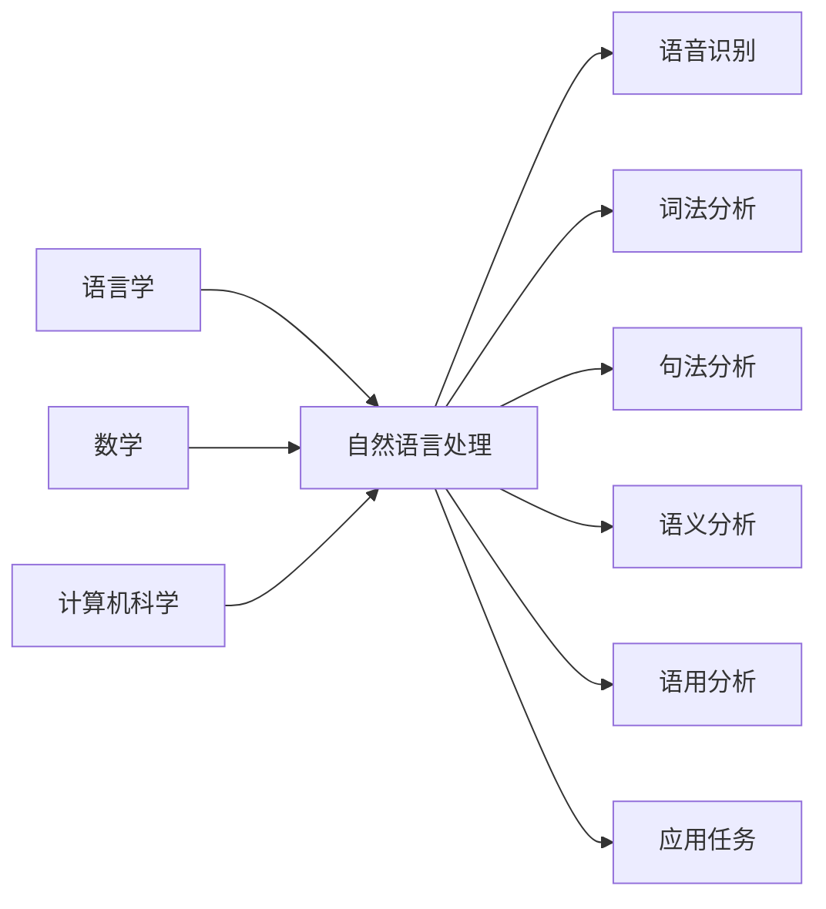

# 自然语言处理(Natural Language Processing) - 原理与代码实例讲解

## 1. 背景介绍
### 1.1 自然语言处理的定义与发展历程
自然语言处理(Natural Language Processing,缩写NLP)是人工智能(Artificial Intelligence, AI)的一个重要分支。它主要研究人与计算机之间用自然语言进行有效通信的各种理论和方法。自然语言处理的目标是让计算机能够理解、生成和处理人类语言,使人机交互更加自然和高效。

自然语言处理的研究始于20世纪50年代。1950年,图灵提出了著名的"图灵测试",即如果一台机器能够与人类进行对话而不能被辨别出其机器身份,那么称这台机器具有智能。这一思想奠定了自然语言处理的基础。

此后,自然语言处理经历了基于规则、基于统计和基于深度学习三个主要阶段:

- 基于规则阶段(20世纪50年代-90年代):这一阶段主要采用人工构建语法规则和词典的方法,代表系统有Eliza、Parry等。
- 基于统计阶段(20世纪90年代-2010年):这一阶段利用大规模语料库和统计机器学习方法,代表模型有隐马尔可夫模型(HMM)、条件随机场(CRF)等。
- 基于深度学习阶段(2010年至今):这一阶段利用深度神经网络,特别是循环神经网络(RNN)、卷积神经网络(CNN)、注意力机制、Transformer等模型,极大地提升了自然语言处理的性能,代表模型有BERT、GPT等。

### 1.2 自然语言处理的主要任务
自然语言处理涉及多个层次的语言分析任务,主要包括:

1. 语音识别:将语音信号转换为文本。
2. 分词:将连续的文本切分成有意义的词汇单元。
3. 词性标注:判断每个词在句子中的词性(如名词、动词等)。
4. 命名实体识别:识别文本中的人名、地名、机构名等特定类型的实体。
5. 句法分析:分析句子的语法结构,如主语、谓语、宾语等成分。
6. 语义角色标注:分析句子中的语义角色,如施事、受事、时间、地点等。
7. 指代消解:确定代词、指示词等指代的对象。
8. 语义相似度计算:计算两个文本在语义上的相似程度。
9. 文本分类:将文本划分到预定义的类别中。
10. 信息抽取:从非结构化文本中抽取结构化信息。
11. 机器翻译:将一种自然语言翻译成另一种自然语言。
12. 文本摘要:从长文本中自动提取关键信息形成简明扼要的摘要。
13. 问答系统:根据用户提出的问题给出相应的答案。
14. 对话系统:实现人机对话交互。

## 2. 核心概念与联系
### 2.1 语言学概念
自然语言处理与语言学密切相关,涉及语言学的多个分支:

- 语音学:研究语音的发音、声学特征等。
- 音系学:研究语音中有意义的最小单位——音位。
- 形态学:研究词的内部结构和构词法。
- 句法学:研究句子的结构和语法规则。
- 语义学:研究语言表达的意义。
- 语用学:研究语言在具体语境中的使用。

### 2.2 数学与计算机科学概念
自然语言处理还涉及诸多数学和计算机科学概念:

- 概率论与数理统计:语言模型、分类器等都基于概率统计理论。
- 信息论:衡量语言单元的信息量,如交叉熵、互信息等。
- 图论:用图的概念表示句法结构、语义网络等。
- 形式语言与自动机:用形式化的方法描述语言的句法结构。
- 机器学习:从数据中学习语言的统计规律,如朴素贝叶斯、支持向量机、条件随机场等。
- 深度学习:利用深度神经网络学习语言的分布式表示,如词向量、句向量、预训练语言模型等。

### 2.3 核心概念之间的联系
下图展示了自然语言处理中核心概念之间的联系:

自然语言处理以语言学为理论基础,以数学和计算机科学为技术手段,通过多层次的语言分析,最终服务于各类自然语言处理应用任务。

## 3. 核心算法原理具体操作步骤
本节介绍几种自然语言处理的核心算法及其操作步骤。

### 3.1 基于统计的分词算法
#### 3.1.1 最大匹配法(Maximum Matching Method, MM)
最大匹配法也称为"正向最大匹配法",其基本思想是:从左到右扫描待分词文本,每次取尽可能长的词。

具体步骤如下:
1. 将输入文本按字符串为单位,从左到右进行扫描。
2. 取指针指向的n个字符作为匹配字符,查找词典。
3. 若在词典中找到该词,则将该词作为一个词切分出来。
4. 若未找到,则将指针回退一个字符,重复步骤2-3,直到切分出词或回退到句首。
5. 重复步骤2-4,直到文本扫描完毕。

#### 3.1.2 隐马尔可夫模型(Hidden Markov Model, HMM)
隐马尔可夫模型将分词问题建模为序列标注问题。其基本思想是:句子是状态序列,词是观测序列,分词就是求状态序列的最佳路径。

HMM的三个基本问题:
1. 评估观察序列概率:前向-后向算法
2. 学习模型参数:Baum-Welch算法(EM算法)
3. 预测状态序列:维特比算法

以预测问题为例,维特比算法的具体步骤如下:
1. 初始化:计算初始状态概率。
2. 递推:计算到达每个状态的最大概率。
3. 终止:确定最优路径的终点。
4. 回溯:从终点开始逆向找到最优路径。

### 3.2 基于深度学习的命名实体识别算法
#### 3.2.1 BiLSTM-CRF
BiLSTM-CRF模型由双向LSTM(BiLSTM)和条件随机场(CRF)组成,其中BiLSTM用于提取特征,CRF用于解码标注序列。

具体步骤如下:
1. 输入层:将每个词转换为词向量。
2. BiLSTM层:提取词的上下文特征。
   - 正向LSTM:从左到右编码
   - 反向LSTM:从右到左编码
   - 拼接正向和反向的隐藏状态
3. CRF层:预测最优标注序列。
   - 定义发射分数(emission score)和转移分数(transition score) 
   - 维特比解码:求最优标注路径

#### 3.2.2 BERT
BERT(Bidirectional Encoder Representations from Transformers)是一种预训练语言模型,可以通过微调用于命名实体识别任务。

具体步骤如下:
1. 输入:将句子转换为WordPiece分词序列,添加[CLS]和[SEP]标记,进行Positional Encoding。
2. BERT编码:通过多层Transformer编码器提取词的上下文表示。
3. 微调:在BERT输出的每个词向量上添加一个全连接层,预测每个词的实体标签。
4. 微调训练:以softmax交叉熵为损失函数,fine-tune所有参数。
5. 推理:对新句子进行编码和标注预测。

## 4. 数学模型和公式详细讲解举例说明
本节详细讲解自然语言处理中的几个重要数学模型和公式。

### 4.1 语言模型
语言模型用于计算一个句子的概率。给定句子$S=w_1w_2...w_n$,语言模型的目标是估计联合概率$P(w_1,w_2,...,w_n)$。

根据链式法则,联合概率可以分解为:

$$P(w_1,w_2,...,w_n)=P(w_1)P(w_2|w_1)P(w_3|w_1,w_2)...P(w_n|w_1,w_2,...,w_{n-1})$$

即:

$$P(S)=\prod_{i=1}^nP(w_i|w_1,w_2,...,w_{i-1})$$

其中$P(w_i|w_1,w_2,...,w_{i-1})$称为条件概率,表示在给定前$i-1$个词的条件下,第$i$个词为$w_i$的概率。

然而,随着$i$的增大,条件概率的计算变得不可行。因此,实际中常用n-gram模型进行近似:

$$P(w_i|w_1,w_2,...,w_{i-1}) \approx P(w_i|w_{i-n+1},...,w_{i-1})$$

即只考虑前$n-1$个词的影响。当$n=1,2,3$时,分别称为unigram、bigram和trigram模型。

以bigram为例,句子概率可以近似为:

$$P(S) \approx \prod_{i=1}^nP(w_i|w_{i-1})$$

其中$P(w_i|w_{i-1})$可以通过极大似然估计(MLE)计算:

$$P(w_i|w_{i-1})=\frac{count(w_{i-1},w_i)}{\sum_wcount(w_{i-1},w)}$$

其中$count(w_{i-1},w_i)$表示在语料库中$w_{i-1}w_i$出现的次数,$\sum_wcount(w_{i-1},w)$表示以$w_{i-1}$开头的bigram的总数。

例如,给定句子"I love natural language processing",假设语料库的bigram统计如下:

| Bigram | Count |
|--------|-------|
| <s> I  | 100   |
| I love | 20    |
| love natural | 5 |
| natural language | 8 |
| language processing | 3 |
| processing </s> | 6 |

则该句子的概率估计为:

$$P(S) \approx P(I|<s>)P(love|I)P(natural|love)P(language|natural)P(processing|language)P(</s>|processing)$$

$$=\frac{100}{100} \times \frac{20}{100} \times \frac{5}{20} \times \frac{8}{8} \times \frac{3}{8} \times \frac{6}{6}=0.00225$$

### 4.2 条件随机场(CRF)
条件随机场常用于序列标注任务,如词性标注、命名实体识别等。相比隐马尔可夫模型,条件随机场是判别式模型,可以引入任意的特征函数。

设输入序列为$X=(x_1,x_2,...,x_n)$,输出序列为$Y=(y_1,y_2,...,y_n)$,条件随机场模型定义为:

$$P(Y|X)=\frac{1}{Z(X)}exp(\sum_{i=1}^n\sum_{j=1}^m\lambda_jt_j(y_{i-1},y_i,X,i)+\sum_{i=1}^n\sum_{k=1}^l\mu_ks_k(y_i,X,i))$$

其中:
- $Z(X)$是归一化因子,用于确保$P(Y|X)$是一个合法的概率分布。
- $t_j$是定义在边上的特征函数,称为转移特征,表示对于输入序列$X$及其位置$i$,从标签$y_{i-1}$转移到$y_i$的得分。
- $s_k$是定义在结点上的特征函数,称为状态特征,表示对于输入序列$X$及其位置$i$,标签$y_i$的得分。
- $\lambda_j$和$\mu_k$是对应的特征权重,需要从训练数据中学习。

以命名实体识别为例,假设输入序列为"Barack Obama is the president of the United States",输出序列为"B-PER I-PER O O O O O B-LOC I-LOC"。

可以定义如下的特征函数:
- $t_1(y_{i-1},y_i,X,i)=\mathbb{I}(y_{