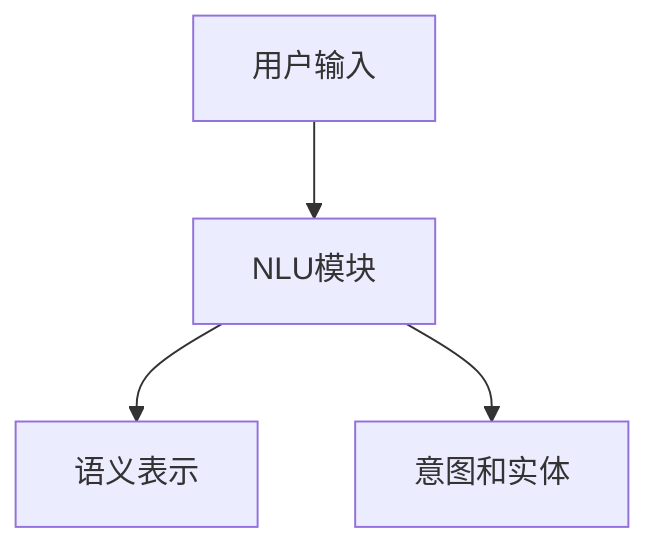
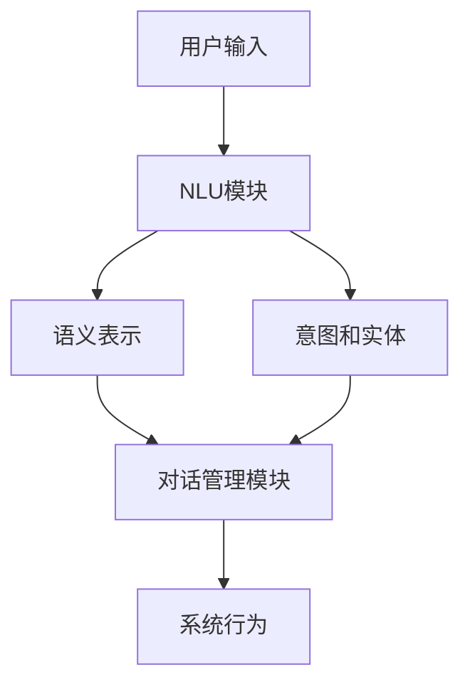
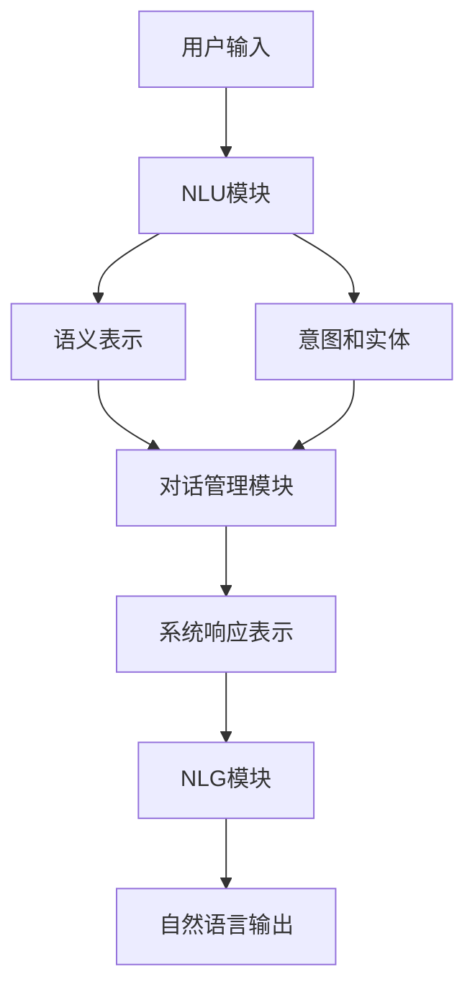

# 自然语言对话系统(Conversational AI)原理与代码实战案例讲解

## 1.背景介绍

### 1.1 自然语言处理的重要性

在当今的数字时代,人机交互已经成为了日常生活中不可或缺的一部分。随着人工智能技术的不断发展,自然语言处理(Natural Language Processing, NLP)正在为人机交互带来革命性的变革。自然语言处理旨在使计算机能够理解和生成人类语言,从而实现人与机器之间自然、流畅的交互。

### 1.2 对话系统的兴起

作为自然语言处理的一个重要分支,对话系统(Conversational AI)已经引起了广泛关注。对话系统旨在模拟人与人之间的自然对话,使用户能够以自然语言的形式与计算机系统进行交互,获取所需的信息或完成特定的任务。随着深度学习技术的不断进步,对话系统的性能也在不断提高,逐渐渗透到了各个领域,如客户服务、智能助手、教育培训等。

### 1.3 对话系统的挑战

尽管取得了长足的进步,但构建一个真正智能的对话系统仍然面临着诸多挑战。首先,自然语言本身具有高度的复杂性和多义性,需要系统能够准确理解语境和语义。其次,对话系统需要具备持续的上下文理解能力,以维持一致的对话主题和流程。此外,对话系统还需要具备一定的推理和知识获取能力,以便根据用户的需求提供有价值的信息或建议。

## 2.核心概念与联系

### 2.1 自然语言理解(NLU)

自然语言理解(Natural Language Understanding, NLU)是对话系统的核心组成部分之一。它负责将用户的自然语言输入转化为计算机可以理解的形式,例如语义表示或意图和实体提取。常见的 NLU 技术包括词法分析、句法分析、命名实体识别、关系提取等。

### 2.2 对话管理(DM)

对话管理(Dialogue Management, DM)模块负责根据用户的输入和系统的状态,决定系统的下一步行为。它维护对话的上下文和状态,并根据对话策略做出相应的响应。对话管理是对话系统的"大脑",决定了对话的流程和逻辑。

### 2.3 自然语言生成(NLG)

自然语言生成(Natural Language Generation, NLG)模块负责将系统的响应转化为自然语言的形式,以便用户理解。它需要考虑语言的流畅性、一致性和上下文相关性。常见的 NLG 技术包括句子规划、实现和表面实现等。

### 2.4 核心概念的联系

自然语言理解、对话管理和自然语言生成是对话系统的三大核心组成部分,它们紧密相连,共同构建了一个完整的对话系统。NLU 模块将用户的自然语言输入转化为计算机可以理解的形式,对话管理模块根据 NLU 的输出和系统状态决定下一步行为,而 NLG 模块则将系统的响应转化为自然语言输出。这三个模块相互配合,形成了一个闭环,使对话系统能够与用户进行自然、流畅的交互。

## 3.核心算法原理具体操作步骤

### 3.1 自然语言理解算法

#### 3.1.1 词法分析

词法分析是自然语言理解的第一步,它将输入的自然语言文本分割成一个个的词元(token)。常见的词法分析算法包括正则表达式匹配、基于规则的分词和基于统计的分词等。

1. 预处理:去除文本中的标点符号、数字等无用字符。
2. 分词:将预处理后的文本按照一定的规则切分成一个个词元。
3. 词性标注:为每个词元赋予相应的词性标记,如名词、动词、形容词等。

#### 3.1.2 句法分析

句法分析旨在确定句子的语法结构,构建句子的语法树。常见的句法分析算法包括基于规则的句法分析和基于统计的句法分析等。

1. 词性标注:利用词法分析的结果,为每个词元赋予词性标记。
2. 语法规则匹配:根据预定义的语法规则,尝试匹配输入句子的语法结构。
3. 构建语法树:根据匹配的语法规则,构建句子的语法树。

#### 3.1.3 语义分析

语义分析旨在理解句子的实际含义,提取句子的语义表示。常见的语义分析算法包括基于规则的语义分析、基于统计的语义分析和基于深度学习的语义分析等。

1. 构建语义表示:根据句法分析的结果,利用语义规则或统计模型构建句子的语义表示。
2. 实体识别:识别出句子中的实体,如人名、地名、组织名等。
3. 关系提取:识别出句子中实体之间的关系,如"工作于"、"位于"等。

### 3.2 对话管理算法

#### 3.2.1 基于规则的对话管理

基于规则的对话管理算法依赖于预定义的规则集,根据当前的对话状态和用户输入,选择合适的系统响应。

1. 定义对话状态:确定对话的初始状态和可能的状态转移。
2. 构建规则集:根据业务需求,定义一系列规则,描述在特定状态下对应的系统行为。
3. 状态跟踪:跟踪当前的对话状态。
4. 规则匹配:根据当前状态和用户输入,匹配相应的规则。
5. 执行系统行为:执行匹配规则对应的系统行为,如提供信息、执行命令等。

#### 3.2.2 基于机器学习的对话管理

基于机器学习的对话管理算法利用大量的对话数据,训练模型自动学习对话策略。常见的算法包括马尔可夫决策过程(MDP)、深度强化学习等。

1. 数据收集:收集大量的人与人之间的对话数据。
2. 数据标注:为对话数据标注状态、行为等信息。
3. 特征提取:从对话数据中提取相关的特征,如词袋、上下文等。
4. 模型训练:利用标注数据训练对话管理模型,学习对话策略。
5. 策略优化:根据模型在验证集上的表现,不断优化对话策略。

### 3.3 自然语言生成算法

#### 3.3.1 基于模板的自然语言生成

基于模板的自然语言生成算法利用预定义的模板,将系统响应的语义表示转化为自然语言输出。

1. 定义模板:根据业务需求,设计一系列模板,用于表达不同的语义。
2. 模板选择:根据系统响应的语义表示,选择合适的模板。
3. 槽位填充:将语义表示中的实体、属性等信息填充到模板的相应位置。
4. 语言实现:根据模板和填充的信息,生成最终的自然语言输出。

#### 3.3.2 基于神经网络的自然语言生成

基于神经网络的自然语言生成算法利用序列到序列(Seq2Seq)模型,直接从系统响应的语义表示生成自然语言输出。

1. 数据准备:收集大量的(语义表示,自然语言)对,作为训练数据。
2. 模型构建:构建 Seq2Seq 模型,包括编码器(Encoder)和解码器(Decoder)。
3. 模型训练:利用训练数据,训练 Seq2Seq 模型,使其学习语义到自然语言的映射。
4. 模型推理:在推理阶段,将系统响应的语义表示输入编码器,解码器生成相应的自然语言输出。

## 4.数学模型和公式详细讲解举例说明

### 4.1 词袋模型(Bag-of-Words)

词袋模型是自然语言处理中一种常用的文本表示方法。它将一段文本看作是一个"袋子",里面装着这段文本中出现的所有词语,而不考虑词语的顺序和语法结构。

设有一个文档集合 $\mathcal{D} = \{d_1, d_2, \ldots, d_n\}$,其中每个文档 $d_i$ 都是一个词语序列 $\{w_1, w_2, \ldots, w_m\}$。我们构建一个词汇表 $\mathcal{V} = \{v_1, v_2, \ldots, v_k\}$,包含了所有出现过的词语。

对于每个文档 $d_i$,我们可以用一个 $k$ 维向量 $\vec{x}_i$ 来表示,其中第 $j$ 个维度的值 $x_{ij}$ 表示词语 $v_j$ 在文档 $d_i$ 中出现的次数。这种表示方式被称为词袋模型,可以用下式表示:

$$\vec{x}_i = (x_{i1}, x_{i2}, \ldots, x_{ik})$$

其中 $x_{ij} = \text{count}(v_j, d_i)$,表示词语 $v_j$ 在文档 $d_i$ 中出现的次数。

例如,假设我们有一个包含两个文档的集合 $\mathcal{D} = \{d_1, d_2\}$,其中 $d_1 = \text{"apple banana apple"}$,而 $d_2 = \text{"banana orange"}$。我们的词汇表为 $\mathcal{V} = \{\text{"apple"}, \text{"banana"}, \text{"orange"}\}$。那么,文档 $d_1$ 的词袋表示为 $\vec{x}_1 = (2, 1, 0)$,而文档 $d_2$ 的词袋表示为 $\vec{x}_2 = (0, 1, 1)$。

词袋模型虽然简单,但在许多自然语言处理任务中都有着广泛的应用,如文本分类、信息检索等。它的优点是计算简单、易于理解,但也存在一些缺点,如丢失了词序信息、无法处理语义等。

### 4.2 N-gram 语言模型

N-gram 语言模型是一种基于统计的语言模型,它假设一个词语的出现概率只与前面的 $N-1$ 个词语有关。N-gram 模型广泛应用于自然语言生成、机器翻译、语音识别等领域。

设有一个语料库 $\mathcal{C} = \{w_1, w_2, \ldots, w_m\}$,其中每个 $w_i$ 表示一个词语。我们定义 N-gram 计数函数 $C(w_{i-N+1}^i)$ 为语料库中出现过的 N-gram $w_{i-N+1}^i = (w_{i-N+1}, w_{i-N+2}, \ldots, w_i)$ 的次数。

那么,在 N-gram 语言模型中,一个长度为 $m$ 的句子 $S = w_1^m = (w_1, w_2, \ldots, w_m)$ 的概率可以计算为:

$$P(S) = P(w_1^m) = \prod_{i=1}^m P(w_i | w_{i-N+1}^{i-1})$$

其中,条件概率 $P(w_i | w_{i-N+1}^{i-1})$ 可以使用最大似然估计法估计:

$$P(w_i | w_{i-N+1}^{i-1}) = \frac{C(w_{i-N+1}^i)}{\sum_{w \in \mathcal{V}} C(w_{i-N+1}^{i-1}w)}$$

这里 $\mathcal{V}$ 表示词汇表,分母部分是对所有可能的 N-gram 进行归一化。

例如,对