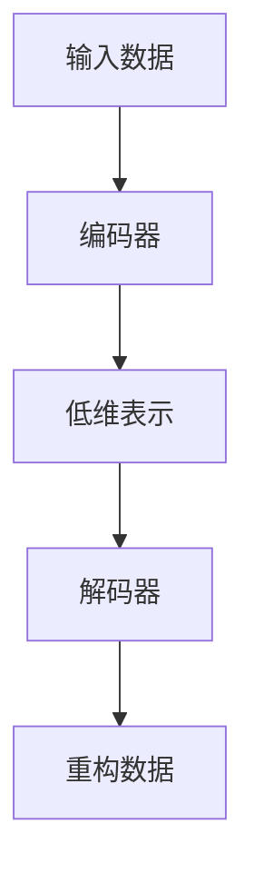

# 自编码器原理与代码实战案例讲解

## 1.背景介绍

自编码器（Autoencoder）是一种无监督学习算法，广泛应用于数据降维、特征提取和生成模型等领域。自编码器的核心思想是通过神经网络将输入数据编码为低维表示，再从低维表示重构出原始数据。自编码器的目标是使重构数据尽可能接近原始数据，从而学习到数据的内在结构。

自编码器最早由Hinton等人在2006年提出，随着深度学习的发展，自编码器在图像处理、自然语言处理和推荐系统等领域得到了广泛应用。本文将详细介绍自编码器的原理、算法、数学模型，并通过代码实例展示其实际应用。

## 2.核心概念与联系

### 2.1 自编码器的基本结构

自编码器由编码器（Encoder）和解码器（Decoder）两部分组成。编码器将输入数据映射到低维表示，解码器则将低维表示重构为原始数据。自编码器的基本结构如下图所示：



### 2.2 自编码器的类型

自编码器有多种变体，包括稀疏自编码器、去噪自编码器、变分自编码器等。不同类型的自编码器在结构和训练目标上有所不同，但其基本思想是一致的。

### 2.3 自编码器与其他模型的联系

自编码器与主成分分析（PCA）等传统降维方法有相似之处，但自编码器具有更强的非线性表示能力。此外，自编码器还与生成对抗网络（GAN）等生成模型有密切联系，变分自编码器（VAE）就是一种典型的生成模型。

## 3.核心算法原理具体操作步骤

### 3.1 编码器

编码器的任务是将输入数据 $x$ 映射到低维表示 $z$。编码器通常由若干层神经网络组成，其输出为低维表示 $z$。编码器的数学表示为：

$$
z = f(x)
$$

其中，$f$ 表示编码器的映射函数。

### 3.2 解码器

解码器的任务是将低维表示 $z$ 重构为原始数据 $\hat{x}$。解码器同样由若干层神经网络组成，其输出为重构数据 $\hat{x}$。解码器的数学表示为：

$$
\hat{x} = g(z)
$$

其中，$g$ 表示解码器的映射函数。

### 3.3 损失函数

自编码器的目标是使重构数据 $\hat{x}$ 尽可能接近原始数据 $x$。为此，我们定义重构误差作为损失函数，常用的损失函数包括均方误差（MSE）和交叉熵损失。均方误差的数学表示为：

$$
L(x, \hat{x}) = \| x - \hat{x} \|^2
$$

### 3.4 训练过程

自编码器的训练过程包括以下步骤：

1. 初始化网络参数。
2. 前向传播：计算编码器输出的低维表示 $z$，再通过解码器计算重构数据 $\hat{x}$。
3. 计算损失函数：根据原始数据 $x$ 和重构数据 $\hat{x}$ 计算重构误差。
4. 反向传播：根据损失函数对网络参数进行梯度更新。
5. 重复步骤2-4，直到损失函数收敛。

## 4.数学模型和公式详细讲解举例说明

### 4.1 编码器的数学模型

假设输入数据 $x$ 为 $n$ 维向量，编码器由若干层全连接神经网络组成。编码器的第 $i$ 层输出为：

$$
h_i = \sigma(W_i h_{i-1} + b_i)
$$

其中，$W_i$ 和 $b_i$ 分别为第 $i$ 层的权重矩阵和偏置向量，$\sigma$ 为激活函数，$h_0 = x$。

编码器的最终输出为低维表示 $z$：

$$
z = h_L
$$

其中，$L$ 为编码器的层数。

### 4.2 解码器的数学模型

解码器的结构与编码器类似，其第 $j$ 层输出为：

$$
h_j' = \sigma(W_j' h_{j-1}' + b_j')
$$

其中，$W_j'$ 和 $b_j'$ 分别为第 $j$ 层的权重矩阵和偏置向量，$h_0' = z$。

解码器的最终输出为重构数据 $\hat{x}$：

$$
\hat{x} = h_{L'}'
$$

其中，$L'$ 为解码器的层数。

### 4.3 损失函数的数学表示

自编码器的损失函数通常为均方误差，其数学表示为：

$$
L(x, \hat{x}) = \frac{1}{n} \sum_{i=1}^n (x_i - \hat{x}_i)^2
$$

其中，$n$ 为输入数据的维度，$x_i$ 和 $\hat{x}_i$ 分别为原始数据和重构数据的第 $i$ 个分量。

## 5.项目实践：代码实例和详细解释说明

### 5.1 数据准备

在本项目中，我们将使用MNIST数据集进行自编码器的训练和测试。MNIST数据集包含60000张训练图像和10000张测试图像，每张图像为28x28像素的灰度图像。

```python
import torch
import torch.nn as nn
import torch.optim as optim
from torchvision import datasets, transforms

# 数据预处理
transform = transforms.Compose([transforms.ToTensor(), transforms.Normalize((0.5,), (0.5,))])

# 加载MNIST数据集
train_dataset = datasets.MNIST(root='./data', train=True, download=True, transform=transform)
test_dataset = datasets.MNIST(root='./data', train=False, download=True, transform=transform)

train_loader = torch.utils.data.DataLoader(train_dataset, batch_size=64, shuffle=True)
test_loader = torch.utils.data.DataLoader(test_dataset, batch_size=64, shuffle=False)
```

### 5.2 自编码器模型定义

我们将定义一个简单的自编码器模型，包括编码器和解码器两部分。

```python
class Autoencoder(nn.Module):
    def __init__(self):
        super(Autoencoder, self).__init__()
        # 编码器
        self.encoder = nn.Sequential(
            nn.Linear(28 * 28, 128),
            nn.ReLU(),
            nn.Linear(128, 64),
            nn.ReLU(),
            nn.Linear(64, 32),
            nn.ReLU()
        )
        # 解码器
        self.decoder = nn.Sequential(
            nn.Linear(32, 64),
            nn.ReLU(),
            nn.Linear(64, 128),
            nn.ReLU(),
            nn.Linear(128, 28 * 28),
            nn.Sigmoid()
        )

    def forward(self, x):
        x = self.encoder(x)
        x = self.decoder(x)
        return x

# 实例化模型
model = Autoencoder()
```

### 5.3 模型训练

我们将使用均方误差（MSE）作为损失函数，Adam优化器进行模型训练。

```python
criterion = nn.MSELoss()
optimizer = optim.Adam(model.parameters(), lr=0.001)

# 训练模型
num_epochs = 20
for epoch in range(num_epochs):
    for data in train_loader:
        img, _ = data
        img = img.view(img.size(0), -1)
        output = model(img)
        loss = criterion(output, img)
        optimizer.zero_grad()
        loss.backward()
        optimizer.step()
    print(f'Epoch [{epoch+1}/{num_epochs}], Loss: {loss.item():.4f}')
```

### 5.4 模型测试

我们将对测试数据进行重构，并可视化原始图像和重构图像。

```python
import matplotlib.pyplot as plt

# 测试模型
model.eval()
with torch.no_grad():
    for data in test_loader:
        img, _ = data
        img = img.view(img.size(0), -1)
        output = model(img)
        break

# 可视化原始图像和重构图像
fig, axes = plt.subplots(1, 2)
axes[0].imshow(img[0].view(28, 28).numpy(), cmap='gray')
axes[0].set_title('Original Image')
axes[1].imshow(output[0].view(28, 28).numpy(), cmap='gray')
axes[1].set_title('Reconstructed Image')
plt.show()
```

## 6.实际应用场景

### 6.1 数据降维

自编码器可以用于数据降维，将高维数据映射到低维空间，从而减少数据的存储和计算成本。例如，在图像处理领域，自编码器可以将高分辨率图像压缩为低维表示，再通过解码器重构出原始图像。

### 6.2 特征提取

自编码器可以用于特征提取，从原始数据中提取出有用的特征。例如，在自然语言处理领域，自编码器可以从文本数据中提取出语义特征，从而提高文本分类和情感分析的效果。

### 6.3 图像去噪

去噪自编码器（Denoising Autoencoder）可以用于图像去噪，将噪声图像重构为清晰图像。例如，在医学图像处理领域，去噪自编码器可以用于去除医学图像中的噪声，从而提高诊断的准确性。

### 6.4 异常检测

自编码器可以用于异常检测，通过比较重构误差来判断数据是否异常。例如，在工业设备监控领域，自编码器可以用于检测设备的异常状态，从而及时发现故障并进行维护。

## 7.工具和资源推荐

### 7.1 深度学习框架

- **TensorFlow**：谷歌开发的开源深度学习框架，支持多种平台和语言，适用于大规模深度学习模型的训练和部署。
- **PyTorch**：Facebook开发的开源深度学习框架，具有动态计算图和易于调试的特点，广泛应用于学术研究和工业界。

### 7.2 数据集

- **MNIST**：手写数字图像数据集，包含60000张训练图像和10000张测试图像，广泛用于图像分类和生成模型的研究。
- **CIFAR-10**：包含60000张32x32彩色图像的分类数据集，分为10个类别，广泛用于图像分类和生成模型的研究。

### 7.3 书籍和教程

- **《深度学习》**：Ian Goodfellow等人编写的经典深度学习教材，系统介绍了深度学习的基本概念、算法和应用。
- **《神经网络与深度学习》**：Michael Nielsen编写的在线教程，详细介绍了神经网络和深度学习的原理和实现。

## 8.总结：未来发展趋势与挑战

自编码器作为一种无监督学习算法，具有广泛的应用前景和研究价值。随着深度学习的发展，自编码器在数据降维、特征提取和生成模型等领域取得了显著成果。然而，自编码器在实际应用中仍面临一些挑战：

### 8.1 模型复杂度

随着数据规模和模型复杂度的增加，自编码器的训练和推理成本也随之增加。如何在保证模型性能的前提下降低计算成本，是自编码器研究的重要方向。

### 8.2 数据质量

自编码器的性能依赖于训练数据的质量。在实际应用中，数据往往存在噪声和缺失值，如何处理这些问题是自编码器研究的一个重要挑战。

### 8.3 模型解释性

自编码器作为一种黑箱模型，其内部机制难以解释。如何提高自编码器的可解释性，使其在实际应用中更加透明和可信，是未来研究的重要方向。

## 9.附录：常见问题与解答

### 9.1 自编码器与PCA的区别是什么？

自编码器与PCA都是数据降维的方法，但自编码器具有更强的非线性表示能力。PCA是一种线性降维方法，通过线性变换将数据映射到低维空间，而自编码器通过神经网络实现非线性映射，能够捕捉数据的复杂结构。

### 9.2 如何选择自编码器的网络结构？

自编码器的网络结构包括编码器和解码器的层数、每层的神经元数量和激活函数等。选择网络结构时需要考虑数据的维度和复杂度，通常通过实验和交叉验证来确定最佳结构。

### 9.3 自编码器的训练过程需要注意哪些问题？

自编码器的训练过程需要注意以下问题：
- 数据预处理：对输入数据进行归一化和标准化，减少数据的噪声和偏差。
- 超参数选择：选择合适的学习率、批量大小和训练轮数，避免过拟合和欠拟合。
- 模型评估：使用验证集评估模型性能，避免在测试集上调参。

### 9.4 自编码器可以用于生成新数据吗？

是的，自编码器可以用于生成新数据。变分自编码器（VAE）是一种典型的生成模型，通过学习数据的概率分布，可以生成与训练数据相似的新数据。

### 9.5 自编码器在工业界有哪些应用？

自编码器在工业界有广泛应用，包括图像压缩、特征提取、图像去噪和异常检测等。例如，在工业设备监控中，自编码器可以用于检测设备的异常状态，从而及时发现故障并进行维护。

---

作者：禅与计算机程序设计艺术 / Zen and the Art of Computer Programming