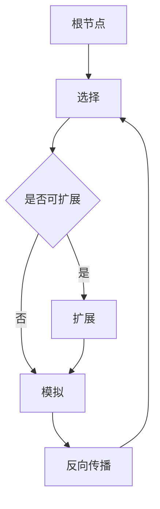

# 蒙特卡洛树搜索(Monte Carlo Tree Search) - 原理与代码实例讲解

## 1. 背景介绍
### 1.1 什么是蒙特卡洛树搜索
蒙特卡洛树搜索（Monte Carlo Tree Search，MCTS）是一种启发式搜索算法，它将随机采样与树搜索相结合，在博弈类问题和决策类问题中表现出色。与传统的基于评估函数的搜索算法不同，MCTS通过大量的随机模拟来估计每个决策的期望收益，并不断优化搜索树以找到最优决策。

### 1.2 MCTS的发展历史
MCTS算法最早由Coulom在2006年提出，用于求解围棋博弈问题。此后，MCTS在计算机博弈领域得到广泛应用，并在围棋、国际象棋、五子棋等棋类游戏中取得了巨大成功。2016年，DeepMind公司开发的AlphaGo系统结合深度学习与MCTS，战胜了人类顶尖围棋选手，引起了学术界和业界的广泛关注。近年来，MCTS的应用领域不断扩展，在自动驾驶、机器人控制、推荐系统等领域展现出巨大潜力。

### 1.3 MCTS的优势
与传统搜索算法相比，MCTS具有以下优势：

1. 无需设计领域特定的评估函数，通过随机模拟来估计决策的期望收益。
2. 能够在巨大的状态空间中快速找到promising的决策，避免穷举搜索。  
3. 具有渐进式优化的特点，搜索时间越长，决策质量越高。
4. 能够灵活地平衡探索与利用，在获取新知识和利用已有知识之间权衡。

## 2. 核心概念与联系
### 2.1 MCTS的四个阶段
MCTS算法主要由以下四个阶段组成：

1. Selection：从根节点开始，递归地选择最有潜力的子节点，直到达到叶子节点或未被扩展的节点。
2. Expansion：如果选择阶段到达的节点是未被扩展的，则创建一个或多个子节点。 
3. Simulation：从扩展阶段创建的节点开始，进行随机模拟直到达到终止状态，并返回模拟结果。
4. Backpropagation：将模拟结果反向传播更新路径上各个节点的统计信息。

这四个阶段以迭代的方式不断重复，每次迭代都会扩展搜索树并优化节点的统计信息。

### 2.2 MCTS的核心组件
MCTS算法的核心组件包括：

1. 状态（State）：问题的当前状态，如棋局的布局。
2. 行动（Action）：在给定状态下可以采取的决策，如下棋的位置。
3. 奖励（Reward）：在终止状态下根据结果给出的即时奖励。
4. 策略（Policy）：选择行动的策略，常用的有UCB（Upper Confidence Bound）策略。
5. 价值（Value）：状态的期望回报，通过大量随机模拟来估计。

### 2.3 MCTS的关键思想
MCTS的关键思想可以总结为：

1. 平衡探索与利用：在选择阶段，既要选择价值高的节点来利用已有的知识，又要探索新的可能性以获取更多信息。
2. 渐进式优化：通过不断地迭代，逐步扩展搜索树并优化节点的统计信息，使得决策质量不断提高。
3. 随机采样：通过大量的随机模拟来估计决策的期望收益，无需依赖领域知识和评估函数。

下图展示了MCTS算法的整体流程：



## 3. 核心算法原理具体操作步骤
MCTS算法的具体操作步骤如下：

### 3.1 Selection阶段
1. 从根节点出发，递归地选择子节点，直到达到叶子节点或未被扩展的节点。
2. 选择节点时，使用UCB策略来平衡探索与利用。UCB值计算公式为：
   
   $UCB=\frac{w_i}{n_i}+C\sqrt{\frac{\ln N}{n_i}}$
   
   其中，$w_i$为节点i的胜率，$n_i$为节点i的访问次数，$N$为父节点的访问次数，$C$为探索常数。

### 3.2 Expansion阶段  
1. 如果选择阶段到达的节点是未被扩展的，则创建一个或多个子节点。
2. 子节点的初始统计信息为0，即胜率和访问次数都为0。

### 3.3 Simulation阶段
1. 从扩展阶段创建的节点开始，进行随机模拟直到达到终止状态。
2. 在模拟过程中，随机选择可行的行动，直到游戏结束或达到预设的模拟深度。
3. 根据模拟结果给出即时奖励，如胜利为1，失败为-1，平局为0。

### 3.4 Backpropagation阶段 
1. 将模拟结果反向传播更新路径上各个节点的统计信息。
2. 对于路径上的每个节点，更新其访问次数和胜率：
   
   $n_i=n_i+1$
   
   $w_i=w_i+\Delta w_i$
   
   其中，$\Delta w_i$为节点i在本次模拟中的奖励。

### 3.5 迭代与决策
1. 重复以上四个阶段，直到满足预设的迭代次数或时间限制。
2. 根据根节点的子节点统计信息，选择访问次数最高或胜率最高的节点作为最终决策。

## 4. 数学模型和公式详细讲解举例说明
### 4.1 UCB公式解释
UCB（Upper Confidence Bound）是MCTS中常用的节点选择策略，用于平衡探索与利用。UCB值计算公式为：

$$UCB=\frac{w_i}{n_i}+C\sqrt{\frac{\ln N}{n_i}}$$

其中，各符号含义如下：
- $w_i$：节点i的胜率，即节点i的总奖励除以访问次数。
- $n_i$：节点i的访问次数。
- $N$：父节点的访问次数。
- $C$：探索常数，控制探索的程度。$C$值越大，越倾向于探索；$C$值越小，越倾向于利用。

UCB公式由两部分组成：
1. exploitation项：$\frac{w_i}{n_i}$表示节点i的平均奖励，反映了节点i的价值。
2. exploration项：$C\sqrt{\frac{\ln N}{n_i}}$表示节点i的不确定性，鼓励探索访问次数较少的节点。

在选择阶段，每次选择UCB值最大的子节点，直到达到叶子节点或未扩展节点。

### 4.2 UCB公式举例说明
假设当前有三个子节点A、B、C，其统计信息如下：

| 节点 | 访问次数 $n_i$ | 总奖励 $w_i$ |
|:---:|:---:|:---:|
| A | 10 | 6 |
| B | 5 | 3 |
| C | 2 | 2 |

父节点的访问次数 $N=10+5+2=17$，设探索常数 $C=\sqrt{2}$。

计算每个节点的UCB值：

$$UCB_A=\frac{6}{10}+\sqrt{2}\sqrt{\frac{\ln 17}{10}}=1.07$$
$$UCB_B=\frac{3}{5}+\sqrt{2}\sqrt{\frac{\ln 17}{5}}=1.35$$
$$UCB_C=\frac{2}{2}+\sqrt{2}\sqrt{\frac{\ln 17}{2}}=2.17$$

根据UCB值，选择节点C进行扩展，体现了探索新节点的倾向。

## 5. 项目实践：代码实例和详细解释说明
下面以Python代码实现MCTS算法，并以井字棋游戏为例进行说明。

### 5.1 定义状态和行动
```python
import numpy as np

class State:
    def __init__(self, board=None):
        self.board = np.zeros((3, 3), dtype=int) if board is None else board
        self.player = 1  # 玩家1为1，玩家2为-1
    
    def get_actions(self):
        return [(i, j) for i in range(3) for j in range(3) if self.board[i, j] == 0]
    
    def take_action(self, action):
        i, j = action
        new_board = np.copy(self.board)
        new_board[i, j] = self.player
        new_state = State(new_board)
        new_state.player = -self.player
        return new_state
    
    def is_terminal(self):
        for i in range(3):
            if abs(sum(self.board[i, :])) == 3:
                return True
            if abs(sum(self.board[:, i])) == 3:
                return True
        if abs(sum([self.board[i, i] for i in range(3)])) == 3:
            return True
        if abs(sum([self.board[i, 2-i] for i in range(3)])) == 3:
            return True
        if 0 not in self.board:
            return True
        return False
    
    def get_reward(self):
        for i in range(3):
            if abs(sum(self.board[i, :])) == 3:
                return sum(self.board[i, :]) // 3
            if abs(sum(self.board[:, i])) == 3:
                return sum(self.board[:, i]) // 3
        if abs(sum([self.board[i, i] for i in range(3)])) == 3:
            return sum([self.board[i, i] for i in range(3)]) // 3
        if abs(sum([self.board[i, 2-i] for i in range(3)])) == 3:
            return sum([self.board[i, 2-i] for i in range(3)]) // 3
        return 0
```

- `State`类表示井字棋的状态，包括棋盘`board`和当前玩家`player`。
- `get_actions`方法返回当前状态下的可行行动，即空位置的坐标。
- `take_action`方法根据给定行动生成新的状态。
- `is_terminal`方法判断当前状态是否为终止状态，即有玩家获胜或棋盘已满。
- `get_reward`方法返回当前状态的即时奖励，玩家1获胜为1，玩家2获胜为-1，平局为0。

### 5.2 定义MCTS节点
```python
class Node:
    def __init__(self, state, parent=None):
        self.state = state
        self.parent = parent
        self.children = []
        self.visits = 0
        self.value = 0
    
    def expand(self):
        for action in self.state.get_actions():
            new_state = self.state.take_action(action)
            self.children.append(Node(new_state, self))
    
    def select_child(self, c=1.4):
        best_score = -np.inf
        best_child = None
        for child in self.children:
            score = child.value / child.visits + c * np.sqrt(np.log(self.visits) / child.visits)
            if score > best_score:
                best_score = score
                best_child = child
        return best_child
    
    def backpropagate(self, reward):
        self.visits += 1
        self.value += reward
        if self.parent:
            self.parent.backpropagate(-reward)
```

- `Node`类表示MCTS搜索树中的节点，包括状态`state`、父节点`parent`、子节点列表`children`、访问次数`visits`和总价值`value`。
- `expand`方法根据当前节点的状态扩展子节点。
- `select_child`方法使用UCB策略选择最优子节点。
- `backpropagate`方法将模拟结果反向传播更新路径上节点的统计信息。

### 5.3 实现MCTS算法
```python
def mcts(state, num_iterations):
    root = Node(state)
    for _ in range(num_iterations):
        node = root
        while node.children:
            node = node.select_child()
        if not node.state.is_terminal():
            node.expand()
            node = node.children[0]
        reward = node.state.get_reward()
        node.backpropagate(reward)
    return max(root.children, key=lambda c: c.visits).state
```

- `mcts`函数接受初始状态`state`和迭代次数`num_iterations`，返回最优决策对应的状态。
- 在每次迭代中，从根节点开始选择最优子节点，直到达到叶子节点或未扩展节点。
- 如果当前节点未达到终止状态，则