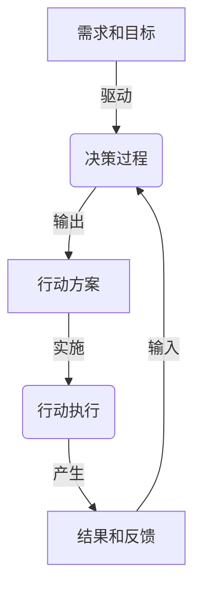

# 行动 (Action)

## 1.背景介绍

在当今快节奏的数字时代,行动(Action)已成为一个至关重要的概念。无论是个人生活还是企业运营,行动都是推动变革和实现目标的关键驱动力。在这个瞬息万变的环境中,我们需要以敏捷和高效的方式做出正确的行动,以适应不断变化的需求和挑战。

行动不仅仅是一种物理活动,更是一种思维模式和决策过程。它需要我们对当前情况有深入的理解,并能够预测未来可能的结果。通过分析数据、评估风险和权衡利弊,我们可以做出明智的决策,并将其转化为有意义的行动。

在科技领域,行动扮演着至关重要的角色。无论是开发新产品、优化流程还是解决复杂问题,都需要我们采取果断和精准的行动。通过将理论知识与实践经验相结合,我们可以创造出真正有价值的解决方案,推动技术的进步和创新。

## 2.核心概念与联系

### 2.1 行动的驱动力

要理解行动的本质,我们必须探究其背后的驱动力。通常情况下,行动是由需求、目标或问题所驱动的。无论是个人还是组织,都会面临各种各样的需求和挑战,这些需求和挑战就是推动我们采取行动的原因。

例如,一家公司可能需要开发新产品来满足市场需求,因此需要采取一系列行动,如进行市场调研、设计产品原型、编写代码等。同样,个人也会因为各种原因而采取行动,如学习新技能、改善生活习惯或解决特定问题。

### 2.2 行动的决策过程

决策过程是行动的核心环节。在采取行动之前,我们需要权衡各种选择,评估每个选择的利弊,并选择最佳方案。这个过程涉及到数据收集、分析和决策制定等多个步骤。

决策过程可以概括为以下几个关键步骤:

1. **定义目标和需求**:明确行动的目的和期望结果。
2. **收集相关数据**:从多个渠道收集与目标相关的数据和信息。
3. **分析数据**:使用适当的分析方法和工具来处理数据,发现潜在的模式和见解。
4. **评估备选方案**:根据分析结果,列出可能的解决方案或行动方案,并评估每个方案的优缺点。
5. **做出决策**:基于评估结果,选择最佳的行动方案。
6. **执行和监控**:实施所选择的行动方案,并持续监控执行过程,必要时进行调整。

### 2.3 行动的实施和反馈

一旦做出决策,我们就需要将其转化为具体的行动。行动的实施过程需要仔细规划和协调,以确保高效和有序的执行。在实施过程中,我们还需要收集反馈信息,以评估行动的效果和影响。

反馈可以来自多个渠道,如数据分析、用户反馈、同事评论等。通过分析这些反馈,我们可以了解行动的成功与否,并识别出需要改进的领域。根据反馈,我们可以调整行动策略,优化流程,或者重新评估目标和需求。

这种持续的反馈循环有助于我们不断改进行动的效率和效果,从而更好地适应变化的环境和需求。

## 3.核心算法原理具体操作步骤

虽然行动看似是一个抽象的概念,但它实际上可以通过一系列具体的步骤和算法来实现。以下是行动的核心算法原理和具体操作步骤:

### 3.1 目标设定算法

在采取任何行动之前,我们首先需要明确目标。目标设定算法可以帮助我们确定具体、可衡量、可实现、相关和有时限的目标(SMART目标)。

1. 收集需求和期望结果
2. 分析需求的优先级和相关性
3. 将需求转化为具体、可衡量的目标
4. 评估目标的可实现性和相关性
5. 为目标设置时间限制
6. 审查和调整目标,确保其符合SMART原则

### 3.2 数据收集和分析算法

为了做出明智的决策,我们需要收集和分析相关数据。数据收集和分析算法可以帮助我们从各种渠道获取数据,并使用适当的分析技术来发现见解和模式。

1. 确定所需数据的类型和来源
2. 设计数据收集策略和工具
3. 收集结构化和非结构化数据
4. 清理和预处理数据
5. 选择适当的分析技术(如统计分析、机器学习、数据挖掘等)
6. 应用分析技术,发现模式和见解
7. 可视化分析结果,方便解释和理解

### 3.3 决策算法

决策算法是行动过程中最关键的一步。它将数据分析的结果转化为可行的行动方案,并评估每个方案的优缺点,最终选择最佳方案。

1. 根据分析结果,生成可能的行动方案
2. 为每个方案确定评估标准(如成本、风险、效益等)
3. 对每个方案进行评估,计算得分
4. 比较不同方案的得分,选择得分最高的方案
5. 如有必要,进行敏感性分析和情景模拟
6. 做出最终决策,选择行动方案

### 3.4 行动执行和监控算法

一旦确定了行动方案,我们就需要将其付诸实施。行动执行和监控算法可以确保行动的有序进行,并持续收集反馈信息,以便进行必要的调整。

1. 制定行动执行计划,包括时间表、资源分配和责任分工
2. 实施行动计划,协调各个环节的执行
3. 收集执行过程中的数据和反馈
4. 分析反馈数据,评估行动的效果和影响
5. 根据反馈,调整行动策略或流程
6. 持续监控和优化,确保行动的有效性

通过遵循这些核心算法原理和具体操作步骤,我们可以系统地规划、执行和优化行动,从而更有效地实现目标并应对不断变化的环境和需求。

## 4.数学模型和公式详细讲解举例说明

虽然行动看似是一个抽象的概念,但它实际上可以通过数学模型和公式来量化和优化。以下是一些常用的数学模型和公式,可以帮助我们更好地理解和管理行动过程。

### 4.1 决策树模型

决策树是一种常用的决策模型,它将决策过程表示为一棵树状结构。每个节点代表一个决策点,边代表不同的选择,而叶节点代表最终的结果或行动。

决策树模型可以用以下公式表示:

$$
V(n) = \max_{a \in A(n)} \left\{\sum_{s' \in S} P(s'|s,a) \left[R(s,a,s') + \gamma V(s')\right]\right\}
$$

其中:

- $V(n)$ 表示当前节点 $n$ 的值函数,即在该节点做出最优决策后可获得的最大期望回报。
- $A(n)$ 表示在节点 $n$ 可采取的行动集合。
- $S$ 表示所有可能的状态集合。
- $P(s'|s,a)$ 表示在状态 $s$ 采取行动 $a$ 后,转移到状态 $s'$ 的概率。
- $R(s,a,s')$ 表示在状态 $s$ 采取行动 $a$ 并转移到状态 $s'$ 时获得的即时回报。
- $\gamma$ 是一个折现因子,用于权衡即时回报和未来回报的重要性。

通过计算每个节点的值函数,我们可以确定在每个决策点上采取哪种行动是最优的。

### 4.2 马尔可夫决策过程 (MDP)

马尔可夫决策过程是一种强大的数学框架,可用于建模序列决策问题,如机器人导航、资源分配等。MDP由以下要素组成:

- 一组状态 $S$
- 一组行动 $A$
- 转移概率函数 $P(s'|s,a)$,表示在状态 $s$ 采取行动 $a$ 后,转移到状态 $s'$ 的概率
- 回报函数 $R(s,a,s')$,表示在状态 $s$ 采取行动 $a$ 并转移到状态 $s'$ 时获得的即时回报

MDP的目标是找到一个策略 $\pi: S \rightarrow A$,将每个状态映射到一个行动,以最大化预期的累积回报。

值函数 $V^\pi(s)$ 表示在状态 $s$ 下,按照策略 $\pi$ 行动所获得的预期累积回报:

$$
V^\pi(s) = \mathbb{E}_\pi \left[\sum_{t=0}^\infty \gamma^t R(s_t, a_t, s_{t+1}) | s_0 = s\right]
$$

其中 $\gamma$ 是折现因子,用于权衡即时回报和未来回报的重要性。

通过求解贝尔曼方程或使用强化学习算法(如 Q-Learning、策略梯度等),我们可以找到最优策略 $\pi^*$,使得 $V^{\pi^*}(s) \geq V^\pi(s)$ 对于所有状态 $s$ 和策略 $\pi$ 成立。

### 4.3 行动价值函数

在决策过程中,我们不仅需要评估每个状态的价值,还需要评估在特定状态下采取特定行动的价值。这就引入了行动价值函数 $Q(s,a)$ 的概念。

$Q(s,a)$ 表示在状态 $s$ 下采取行动 $a$,然后按照最优策略行动所获得的预期累积回报:

$$
Q(s,a) = \mathbb{E}_{\pi^*} \left[\sum_{t=0}^\infty \gamma^t R(s_t, a_t, s_{t+1}) | s_0 = s, a_0 = a\right]
$$

通过估计 $Q(s,a)$ 的值,我们可以直接选择在每个状态下采取哪种行动是最优的,而不需要先找到最优策略。

$Q(s,a)$ 满足以下贝尔曼方程:

$$
Q(s,a) = \sum_{s'} P(s'|s,a) \left[R(s,a,s') + \gamma \max_{a'} Q(s',a')\right]
$$

我们可以使用各种强化学习算法(如 Q-Learning、深度 Q-Network 等)来估计 $Q(s,a)$ 的值,并据此选择最优行动。

### 4.4 多臂老虎机问题

多臂老虎机问题是一个经典的探索与利用权衡问题,它可以用来模拟在有限资源和不确定性条件下做出最优决策的情况。

假设我们有 $K$ 个老虎机臂,每个臂的回报服从某个未知分布。我们的目标是通过不断拉动臂并观察回报,来找到最优的臂,并最大化累积回报。

设 $\mu_k$ 表示第 $k$ 个臂的期望回报,我们希望找到 $\mu^* = \max_k \mu_k$ 对应的臂。

一种常用的策略是 $\epsilon$-贪婪算法:

1. 初始化每个臂的估计值 $\hat{\mu}_k = 0$,拉动次数 $n_k = 0$
2. 对于每一次拉动:
   - 以概率 $\epsilon$ 随机选择一个臂
   - 以概率 $1 - \epsilon$ 选择当前估计值最大的臂 $\arg\max_k \hat{\mu}_k$
3. 观察选择臂的回报 $r$,更新估计值 $\hat{\mu}_k = \frac{n_k \hat{\mu}_k + r}{n_k + 1}$,拉动次数 $n_k = n_k + 1$

$\epsilon$-贪婪算法在探索(选择未知臂以获取新信息)和利用(选择当前最优臂以获