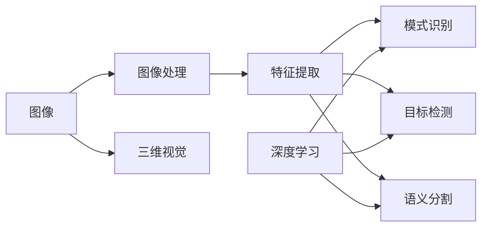

# 计算机视觉(CV)原理与代码实战案例讲解

## 1.背景介绍

### 1.1 计算机视觉概述

计算机视觉(Computer Vision,简称CV)是一门研究如何使计算机能够"看懂"数字图像或视频,从而对图像内容进行分析和理解的科学。它是人工智能领域的一个重要分支,旨在赋予计算机类似人类视觉的感知和理解能力。

计算机视觉涉及多个学科领域,包括数学、物理学、生物学、心理学、计算机科学等。它综合运用了图像处理、模式识别、机器学习等技术,通过对图像和视频数据的获取、表示、处理和分析,从而实现对视觉信息的感知、理解和应用。

### 1.2 计算机视觉发展历程

计算机视觉的研究可以追溯到20世纪60年代初期。1963年,美国麻省理工学院的Larry Roberts在他的博士论文中提出了从二维几何图形中重建三维物体结构的思想,这被认为是计算机视觉的开端。

此后,计算机视觉经历了几个重要的发展阶段:

- 20世纪70年代,David Marr提出了视觉计算理论框架,为计算机视觉奠定了理论基础。

- 20世纪80年代,随着计算机性能的提升,一些经典的计算机视觉算法如Canny边缘检测、Hough变换等被提出。

- 20世纪90年代,统计学习方法开始引入计算机视觉,如支持向量机(SVM)等。

- 21世纪初,Viola-Jones人脸检测算法的提出,使实时目标检测成为可能。

- 2012年,深度学习方法在ImageNet大规模视觉识别挑战赛(ILSVRC)中取得突破,从此深度学习成为计算机视觉的主流方法。

- 近年来,计算机视觉已广泛应用于人脸识别、自动驾驶、医学影像分析等诸多领域,深刻影响着人类社会生活。

### 1.3 计算机视觉的应用场景

计算机视觉技术在工业生产、日常生活、科学研究等领域有着广泛的应用前景,主要包括:

- 智能监控:通过摄像头自动检测异常行为,如交通违章、安全隐患等。

- 人脸识别:用于身份认证、考勤管理、安防等。 

- 自动驾驶:通过视觉感知实现障碍物检测、车道保持、交通标志识别等。

- 医学影像分析:辅助医生进行疾病诊断,如肿瘤检测、眼底图像分析等。

- 工业视觉检测:用于工业生产的缺陷检测、质量控制等。

- 虚拟/增强现实:应用于游戏、电影特效制作等。

- 其他应用如人机交互、无人机巡检、农业病虫害监测等不一而足。

## 2.核心概念与联系

### 2.1 图像

图像是计算机视觉的基本处理对象。数字图像可以看作是一个二维矩阵,矩阵的每个元素称为像素(pixel),像素值表示该点的亮度或颜色信息。常见的图像类型有二值图像、灰度图像和彩色图像。

### 2.2 图像处理

图像处理是对图像进行各种变换和分析,以改善图像质量或提取所需信息的过程。主要包括图像增强、图像复原、图像分割、图像表示与描述等。常用的图像处理算法有直方图均衡化、中值滤波、Sobel算子等。

### 2.3 特征提取

特征提取是从图像中提取能够表征图像内容本质属性的特征量的过程。常用的图像特征有颜色特征、纹理特征、形状特征、关键点特征等。经典的特征描述子有SIFT、SURF、HOG等。

### 2.4 模式识别

模式识别是根据特征相似性对图像内容进行分类和识别的过程。主要分为有监督学习和无监督学习两大类。常用的分类器有支持向量机(SVM)、K近邻(KNN)、决策树、朴素贝叶斯等。

### 2.5 目标检测

目标检测是在图像中定位并识别出感兴趣目标(如人脸、行人、车辆等)的过程。经典的目标检测算法有Haar特征+AdaBoost、HOG+SVM、DPM等,近年来基于深度学习的方法如R-CNN、YOLO、SSD等成为主流。

### 2.6 语义分割

语义分割是对图像中的每个像素赋予一个语义类别标签(如人、车、建筑等)。常用的语义分割网络有FCN、SegNet、U-Net等。

### 2.7 深度学习

深度学习是机器学习的一个分支,通过构建多层神经网络来自动学习数据的层次化特征表示。近年来,以卷积神经网络(CNN)为代表的深度学习方法在计算机视觉领域取得了巨大成功。

### 2.8 三维视觉

三维视觉是从二维图像恢复三维场景结构信息的过程。主要包括双目/多目立体视觉、结构光、TOF等技术。三维重建是其核心问题之一。

以下是这些核心概念之间的联系:

## 3.核心算法原理具体操作步骤

### 3.1 Canny边缘检测算法

Canny边缘检测是计算机视觉中常用的边缘检测算法,具体步骤如下:

1. 使用高斯滤波器平滑图像,去除噪声。

2. 计算图像梯度幅值和方向。通常使用Sobel算子计算水平和垂直方向的一阶导数$G_x$和$G_y$,然后计算梯度幅值$G=\sqrt{G_x^2+G_y^2}$和梯度方向$\theta=\arctan(\frac{G_y}{G_x})$。

3. 对梯度幅值进行非极大值抑制。沿着梯度方向,只保留局部梯度幅值最大的像素点,抑制非极大值。

4. 双阈值处理和连接边缘。设置高阈值$T_H$和低阈值$T_L$,大于$T_H$的像素点为强边缘,小于$T_L$的为非边缘,介于两者之间的为弱边缘。如果弱边缘连接到强边缘则保留,否则抑制。

### 3.2 SIFT特征提取算法

SIFT(尺度不变特征变换)是一种用于图像匹配的局部特征描述子,对尺度、旋转、亮度变化保持不变性。提取步骤如下:

1. 尺度空间极值检测。在多个尺度下用高斯差分(DoG)金字塔构建尺度空间,在相邻尺度的DoG图像中检测局部极值点,作为潜在的关键点。

2. 关键点定位。通过泰勒展开拟合局部极值点位置,并剔除低对比度和边缘响应不稳定的点。

3. 关键点方向赋值。以关键点为中心取邻域内像素的梯度方向直方图,取直方图峰值作为该关键点的主方向,实现旋转不变性。

4. 关键点描述子生成。以关键点为中心,在其尺度空间邻域内,划分4x4子区域,每个子区域计算8个方向的梯度直方图,共128维特征向量,并进行归一化处理以提高光照不变性。

### 3.3 Haar特征+AdaBoost人脸检测算法

Viola-Jones人脸检测算法由Haar特征和AdaBoost分类器级联构成,是第一个实时人脸检测系统。步骤如下:

1. Haar特征提取。定义多种尺度的Haar特征模板,如边缘特征、线性特征、中心特征等。将图像划分为多个子窗口,在每个子窗口内计算Haar特征的响应值。使用积分图可以快速计算Haar特征。

2. AdaBoost训练。使用AdaBoost算法训练多个弱分类器,每个弱分类器基于一个Haar特征,通过阈值比较对样本进行二分类。AdaBoost通过调整样本权重,将多个弱分类器组合成一个强分类器。

3. 级联分类器。将多个强分类器级联,前面的分类器用于快速剔除大量负样本,后面的分类器用于细致识别。如果样本通过所有级别则认为是人脸。

4. 多尺度滑动窗口检测。构建图像金字塔,在多个尺度下用滑动窗口方式检测人脸,可以检测不同大小的人脸。

### 3.4 R-CNN目标检测算法

R-CNN是将CNN引入目标检测的开创性工作,包括区域生成、特征提取、分类和位置精修等步骤:

1. 区域生成。使用选择性搜索算法生成1000~2000个候选区域(Region Proposal)。

2. 特征提取。将每个候选区域缩放到固定尺寸,送入预训练的CNN网络(如AlexNet)提取特征。

3. 区域分类。使用SVM对每个区域的CNN特征进行分类,判断属于哪一类目标。

4. 位置精修。对于属于目标的区域,使用回归器进一步精修其位置。

后续的Fast R-CNN和Faster R-CNN在此基础上进行了改进,提高了检测速度和精度。

## 4.数学模型和公式详细讲解举例说明

### 4.1 图像梯度

图像梯度反映了图像像素在水平和垂直方向上的变化率,是许多计算机视觉算法的基础。对于图像函数$I(x,y)$,其梯度定义为:

$$
\nabla I=\left[ \begin{matrix} G_x \\ G_y \end{matrix} \right]=\left[ \begin{matrix} \frac{\partial I}{\partial x} \\ \frac{\partial I}{\partial y} \end{matrix} \right]
$$

其中,$G_x$和$G_y$分别为水平和垂直方向的梯度分量。梯度的幅值和方向为:

$$
G=\sqrt{G_x^2+G_y^2}, \theta=\arctan(\frac{G_y}{G_x})
$$

在离散情况下,可以用相邻像素的差分近似计算梯度,如:

$$
G_x=I(x+1,y)-I(x,y), G_y=I(x,y+1)-I(x,y)
$$

或使用Sobel算子等模板与图像卷积计算梯度。

梯度反映了图像的局部变化,梯度幅值大的地方通常是边缘或纹理区域,梯度方向垂直于边缘方向。因此,梯度信息常用于边缘检测、特征提取、图像分割等任务中。

### 4.2 卷积神经网络

卷积神经网络(CNN)是深度学习中最常用于图像识别的网络结构。相比传统的全连接神经网络,CNN利用了图像的局部相关性和平移不变性,通过局部连接和权值共享减少了参数数量。CNN主要由以下几种层构成:

1. 卷积层。卷积层使用多个卷积核对输入图像进行卷积操作,提取不同的特征图。对于输入图像$X$和卷积核$W$,卷积操作定义为:

$$(X*W)(i,j)=\sum_m \sum_n X(m,n)W(i-m,j-n)$$

2. 激活层。卷积层之后通常接一个非线性激活函数,如ReLU(修正线性单元):

$$ReLU(x)=max(0,x)$$

ReLU能够增加网络的非线性表达能力,同时避免梯度消失问题。

3. 池化层。池化层对特征图进行下采样,减小特征图尺寸,提高特征的平移不变性。常用的池化操作有最大池化和平均池化:

$$MaxPool(X)(i,j)=\max_{m,n} X(i+m,j+n)$$

$$AvgPool(X)(i,j)=\frac{1}{M}\sum_{m,n} X(i+m,j+n)