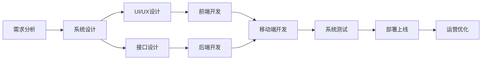

# 跨境电商全盘项目开发、管理实践

## 1. 背景介绍

### 1.1 跨境电商的兴起与发展现状

跨境电商是指分属不同关境的交易主体，通过电子商务平台达成交易、进行支付结算，并通过跨境物流送达商品、完成交易的一种国际商业活动。近年来，随着互联网技术的快速发展和全球化进程的不断深入，跨境电商已成为国际贸易的重要组成部分。据统计，2020年全球跨境电商交易规模达到了4.8万亿美元，预计到2026年将达到8.76万亿美元，年均复合增长率高达12.8%。

### 1.2 跨境电商项目开发面临的机遇与挑战

跨境电商项目开发面临着巨大的市场机遇。一方面，跨境电商打破了地域限制，使得商家能够触达全球消费者；另一方面，跨境电商降低了国际贸易的门槛，为中小企业参与国际竞争提供了机会。然而，跨境电商项目开发也面临着诸多挑战，如法律法规差异、支付安全、物流配送、文化差异等，需要开发团队具备全球化视野和跨学科能力，才能驾驭复杂的跨境电商项目。

## 2. 核心概念与联系

### 2.1 跨境电商平台的核心模块

一个完整的跨境电商平台通常包括以下核心模块：

- 用户模块：包括用户注册、登录、个人中心等功能。
- 商品模块：包括商品管理、商品展示、商品搜索、商品推荐等功能。  
- 订单模块：包括订单创建、订单支付、订单跟踪、订单售后等功能。
- 支付模块：对接不同国家和地区的主流支付方式，确保资金安全。
- 物流模块：集成跨境物流服务，实现商品的跨境配送和追踪。
- 营销模块：提供多种营销工具，如优惠券、秒杀、拼团等，提升销量。
- 客服模块：提供多语言客服支持，及时解决用户问题，提升用户体验。

### 2.2 跨境电商项目开发涉及的关键技术

跨境电商项目开发涉及前端、后端、移动端等多个技术领域，需要综合运用以下关键技术：

- 前端技术：HTML5、CSS3、JavaScript、Vue.js、React 等。  
- 后端技术：Java、Python、Node.js、Go 等，以及 Spring、Django、Express、Gin 等 Web 框架。
- 移动端技术：iOS、Android 原生开发，以及 Flutter、React Native 等跨平台开发技术。
- 数据库技术：MySQL、PostgreSQL、MongoDB、Redis 等。
- 微服务架构：将复杂系统拆分为多个独立的微服务，提高开发效率和系统弹性。
- 云计算和 DevOps：借助 AWS、Azure、阿里云等云平台，实现弹性扩容和全自动化运维。

### 2.3 跨境电商项目开发流程

跨境电商项目开发通常遵循以下流程：



## 3. 核心算法原理具体操作步骤

### 3.1 推荐算法

推荐算法是跨境电商平台的核心之一，能够根据用户的历史行为和偏好，智能推荐用户可能感兴趣的商品，提升转化率。常见的推荐算法包括：

- 协同过滤算法：基于用户或商品的相似性，为用户推荐相似用户喜欢或相似商品。
- 基于内容的推荐算法：根据商品的属性特征，为用户推荐相似特征的商品。
- 组合推荐算法：综合协同过滤和基于内容的推荐，平衡推荐的多样性和精准性。

以协同过滤算法为例，其基本步骤如下：

1. 收集用户行为数据，如浏览、收藏、购买等。
2. 计算用户或商品的相似度矩阵。
3. 根据相似度矩阵，为用户生成个性化推荐列表。
4. 对推荐结果进行排序和过滤，提高推荐质量。
5. 在线上环境中展示推荐结果，并追踪推荐效果。
6. 定期更新用户行为数据和相似度矩阵，保持推荐的实时性。

### 3.2 搜索算法 

搜索算法是跨境电商平台的另一个核心，能够帮助用户快速找到所需商品。常见的搜索算法包括：

- 倒排索引：将商品的关键词提取出来，建立关键词到商品的映射关系，加速搜索响应。
- 正排索引：将商品的完整信息存储在索引中，支持复杂的结构化查询。
- 语义检索：利用自然语言处理技术，理解用户的搜索意图，返回语义相关的结果。

以倒排索引为例，其基本步骤如下：

1. 对商品信息进行分词和提取关键词。
2. 构建关键词到商品 ID 的倒排索引。
3. 用户输入搜索词后，对搜索词进行分词。
4. 在倒排索引中查找包含搜索词的商品 ID。
5. 根据商品 ID 获取完整的商品信息。  
6. 对搜索结果进行排序、过滤和高亮显示。
7. 返回最终的搜索结果给用户。

## 4. 数学模型和公式详细讲解举例说明

### 4.1 协同过滤推荐算法的数学原理

协同过滤推荐算法的核心思想是利用用户或商品之间的相似性，为用户推荐相似用户喜欢或相似商品。其数学原理可以用以下公式表示：

1. 用户相似度计算

设 $u_i$ 和 $u_j$ 是两个用户，$I_{u_i}$ 和 $I_{u_j}$ 分别是他们交互过的商品集合，则用户相似度可以用 Jaccard 系数计算：

$$sim(u_i, u_j) = \frac{|I_{u_i} \cap I_{u_j}|}{|I_{u_i} \cup I_{u_j}|}$$

其中 $|I_{u_i} \cap I_{u_j}|$ 表示两个用户共同交互过的商品数，$|I_{u_i} \cup I_{u_j}|$ 表示两个用户交互过的商品总数。

2. 商品相似度计算

设 $i_m$ 和 $i_n$ 是两个商品，$U_{i_m}$ 和 $U_{i_n}$ 分别是与它们交互过的用户集合，则商品相似度可以用 Cosine 相似度计算：

$$sim(i_m, i_n) = \frac{|U_{i_m} \cap U_{i_n}|}{\sqrt{|U_{i_m}| \times |U_{i_n}|}}$$

其中 $|U_{i_m} \cap U_{i_n}|$ 表示与两个商品都交互过的用户数，$|U_{i_m}|$ 和 $|U_{i_n}|$ 分别表示与每个商品交互过的用户总数。

3. 生成推荐列表

对于用户 $u$，可以找到与其相似度最高的 $K$ 个用户，然后将这些用户交互过但用户 $u$ 未交互过的商品作为推荐候选。设 $S_u$ 是用户 $u$ 的 $K$ 个最相似用户集合，则推荐候选商品集合 $R_u$ 为：

$$R_u = \bigcup_{v \in S_u} I_v - I_u$$

最后，可以对推荐候选商品集合进行排序，如按照商品的流行度、用户相似度的加权平均值等，生成最终的推荐列表。

### 4.2 搜索排序算法的数学原理

搜索结果的排序直接影响用户的搜索体验和商品曝光，需要综合考虑多种因素。常见的搜索排序算法包括 BM25、Learning to Rank 等。以 BM25 为例，其数学原理如下：

设 $Q$ 是用户的查询词，$D$ 是商品文档，BM25 算法计算查询词 $Q$ 与文档 $D$ 的相关性得分为：

$$score(D,Q) = \sum_{i=1}^n IDF(q_i) \cdot \frac{f(q_i, D) \cdot (k_1 + 1)}{f(q_i, D) + k_1 \cdot (1 - b + b \cdot \frac{|D|}{avgdl})}$$

其中：
- $IDF(q_i)$ 是查询词 $q_i$ 的逆文档频率，衡量词的稀疏程度：

$$IDF(q_i) = log \frac{N - n(q_i) + 0.5}{n(q_i) + 0.5}$$

其中 $N$ 是文档总数，$n(q_i)$ 是包含查询词 $q_i$ 的文档数。

- $f(q_i, D)$ 是查询词 $q_i$ 在文档 $D$ 中的出现频率。
- $k_1$ 和 $b$ 是调节因子，控制词频和文档长度的影响力。
- $|D|$ 是文档 $D$ 的长度，$avgdl$ 是所有文档的平均长度。

最终，将所有查询词的得分相加，得到文档 $D$ 与查询 $Q$ 的总相关性得分，按照得分高低对搜索结果进行排序即可。

## 5. 项目实践：代码实例和详细解释说明

下面以一个简单的协同过滤推荐算法为例，给出 Python 代码实现和详细说明。

```python
import numpy as np
from sklearn.metrics.pairwise import cosine_similarity

class UserCF:
    def __init__(self, data):
        self.data = data
        self.user_item_matrix = self._create_user_item_matrix()
        self.user_similarity_matrix = self._create_user_similarity_matrix()

    def _create_user_item_matrix(self):
        """创建用户-物品交互矩阵"""
        user_ids = self.data['user_id'].unique()
        item_ids = self.data['item_id'].unique()
        user_item_matrix = np.zeros((len(user_ids), len(item_ids)))
        for _, row in self.data.iterrows():
            user_idx = np.where(user_ids == row['user_id'])[0][0]
            item_idx = np.where(item_ids == row['item_id'])[0][0]
            user_item_matrix[user_idx, item_idx] = 1
        return user_item_matrix

    def _create_user_similarity_matrix(self):
        """创建用户相似度矩阵"""
        return cosine_similarity(self.user_item_matrix)

    def recommend(self, user_id, top_n=10):
        """为用户生成推荐列表"""
        user_idx = np.where(self.data['user_id'].unique() == user_id)[0][0]
        user_similarities = self.user_similarity_matrix[user_idx]
        similar_users = np.argsort(-user_similarities)[1:top_n+1]
        
        item_scores = np.zeros(self.user_item_matrix.shape[1])
        for similar_user in similar_users:
            item_scores += self.user_item_matrix[similar_user] * user_similarities[similar_user]
        
        recommended_items = np.argsort(-item_scores)[:top_n]
        return recommended_items
```

代码说明：

1. 首先定义了一个 `UserCF` 类，初始化时传入用户行为数据 `data`。
2. `_create_user_item_matrix` 方法根据用户行为数据创建用户-物品交互矩阵，矩阵中 1 表示用户与物品有交互，0 表示无交互。
3. `_create_user_similarity_matrix` 方法利用 `sklearn` 的 `cosine_similarity` 函数计算用户相似度矩阵。
4. `recommend` 方法根据给定的用户 ID，找到最相似的 $top_n$ 个用户，然后计算每个物品的推荐得分，最后返回得分最高的 $top_n$ 个物品作为推荐结果。

使用示例：

```python
import pandas as pd

# 读取用户行为数据
data = pd.read_csv('user_behavior.csv')

# 创建 UserCF 对象
user_cf = UserCF(data)

# 为用户 ID 为 1 的用户生成 5 个推