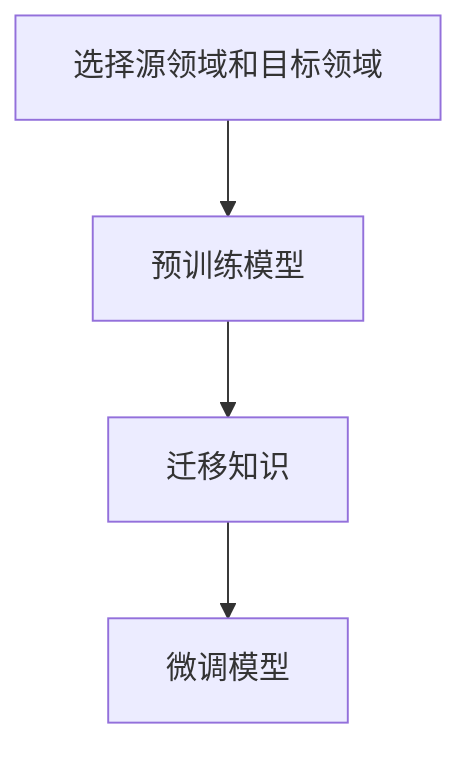

# 迁移学习 (Transfer Learning)

## 1.背景介绍

在人工智能和机器学习领域，迁移学习（Transfer Learning）已经成为一个备受关注的研究方向。传统的机器学习方法通常需要大量的标注数据来训练模型，但在实际应用中，获取大量标注数据往往是昂贵且耗时的。迁移学习通过将已经在一个任务上训练好的模型应用到另一个相关任务上，从而减少对大量标注数据的需求，提高模型的训练效率和性能。

迁移学习的概念最早可以追溯到20世纪90年代，但随着深度学习的兴起和计算能力的提升，迁移学习在近几年得到了广泛的应用和研究。它在计算机视觉、自然语言处理、语音识别等多个领域都取得了显著的成果。

## 2.核心概念与联系

### 2.1 迁移学习的定义

迁移学习是一种机器学习方法，它通过将一个领域（源领域）中学到的知识应用到另一个领域（目标领域）中，以提高目标领域任务的学习效果。迁移学习的核心思想是利用源领域的知识来弥补目标领域数据不足的问题。

### 2.2 迁移学习的类型

迁移学习可以根据源领域和目标领域的相似性以及任务的相似性分为以下几种类型：

- **归纳迁移学习（Inductive Transfer Learning）**：源领域和目标领域的任务不同，但目标领域有少量标注数据。
- **迁移迁移学习（Transductive Transfer Learning）**：源领域和目标领域的任务相同，但目标领域没有标注数据。
- **无监督迁移学习（Unsupervised Transfer Learning）**：源领域和目标领域的任务不同，且目标领域没有标注数据。

### 2.3 迁移学习的基本流程

迁移学习的基本流程可以概括为以下几个步骤：

1. **选择源领域和目标领域**：确定源领域和目标领域的任务和数据。
2. **预训练模型**：在源领域的数据上训练一个模型。
3. **迁移知识**：将预训练模型的参数迁移到目标领域。
4. **微调模型**：在目标领域的数据上对迁移后的模型进行微调。

以下是迁移学习基本流程的Mermaid流程图：



## 3.核心算法原理具体操作步骤

### 3.1 预训练模型

预训练模型是迁移学习的基础。通常，我们会选择一个在大规模数据集上训练好的模型作为预训练模型。例如，在计算机视觉任务中，常用的预训练模型有VGG、ResNet、Inception等。

### 3.2 迁移知识

迁移知识的过程包括以下几个步骤：

1. **加载预训练模型**：从预训练模型库中加载已经训练好的模型。
2. **冻结部分层**：根据任务的需求，冻结预训练模型的部分层，使其参数在训练过程中保持不变。
3. **添加新层**：在预训练模型的基础上，添加适合目标任务的新层。

### 3.3 微调模型

微调模型是指在目标领域的数据上对迁移后的模型进行训练，以适应目标任务。微调的过程包括以下几个步骤：

1. **设置学习率**：通常，微调时的学习率要比预训练时低，以防止模型参数发生剧烈变化。
2. **训练模型**：在目标领域的数据上训练模型，更新新添加层的参数。
3. **评估模型**：在验证集上评估模型的性能，调整超参数以获得最佳效果。

## 4.数学模型和公式详细讲解举例说明

### 4.1 迁移学习的数学定义

假设源领域为 $D_S = \{X_S, P(X_S)\}$，其中 $X_S$ 是源领域的特征空间，$P(X_S)$ 是源领域的特征分布。目标领域为 $D_T = \{X_T, P(X_T)\}$，其中 $X_T$ 是目标领域的特征空间，$P(X_T)$ 是目标领域的特征分布。

源任务为 $T_S = \{Y_S, f_S(X_S)\}$，其中 $Y_S$ 是源任务的标签空间，$f_S(X_S)$ 是源任务的目标函数。目标任务为 $T_T = \{Y_T, f_T(X_T)\}$，其中 $Y_T$ 是目标任务的标签空间，$f_T(X_T)$ 是目标任务的目标函数。

迁移学习的目标是通过学习源领域的知识 $f_S(X_S)$，来提高目标领域任务 $f_T(X_T)$ 的性能。

### 4.2 迁移学习的损失函数

在迁移学习中，常用的损失函数包括以下几种：

1. **交叉熵损失（Cross-Entropy Loss）**：用于分类任务，定义为：
   $$
   L_{CE} = -\sum_{i=1}^{N} y_i \log(\hat{y}_i)
   $$
   其中，$y_i$ 是真实标签，$\hat{y}_i$ 是预测概率。

2. **均方误差损失（Mean Squared Error Loss）**：用于回归任务，定义为：
   $$
   L_{MSE} = \frac{1}{N} \sum_{i=1}^{N} (y_i - \hat{y}_i)^2
   $$
   其中，$y_i$ 是真实值，$\hat{y}_i$ 是预测值。

3. **对比损失（Contrastive Loss）**：用于度量学习，定义为：
   $$
   L_{Contrastive} = \frac{1}{2N} \sum_{i=1}^{N} \left( y_i d_i^2 + (1 - y_i) \max(0, m - d_i)^2 \right)
   $$
   其中，$d_i$ 是样本对之间的距离，$m$ 是边界阈值。

### 4.3 举例说明

假设我们有一个在ImageNet数据集上预训练的ResNet模型，现在我们希望将其应用到一个新的图像分类任务中。具体步骤如下：

1. **加载预训练模型**：
   ```python
   from keras.applications import ResNet50
   base_model = ResNet50(weights='imagenet', include_top=False)
   ```

2. **冻结部分层**：
   ```python
   for layer in base_model.layers:
       layer.trainable = False
   ```

3. **添加新层**：
   ```python
   from keras.models import Model
   from keras.layers import Dense, GlobalAveragePooling2D

   x = base_model.output
   x = GlobalAveragePooling2D()(x)
   x = Dense(1024, activation='relu')(x)
   predictions = Dense(num_classes, activation='softmax')(x)

   model = Model(inputs=base_model.input, outputs=predictions)
   ```

4. **微调模型**：
   ```python
   from keras.optimizers import Adam

   model.compile(optimizer=Adam(lr=0.0001), loss='categorical_crossentropy', metrics=['accuracy'])
   model.fit(train_data, train_labels, epochs=10, validation_data=(val_data, val_labels))
   ```

## 5.项目实践：代码实例和详细解释说明

### 5.1 项目背景

假设我们有一个新的图像分类任务，需要将图像分为猫和狗两类。我们将使用在ImageNet数据集上预训练的VGG16模型，并将其迁移到我们的新任务中。

### 5.2 数据准备

首先，我们需要准备训练数据和验证数据。假设我们的数据存储在以下目录结构中：

```
data/
    train/
        cats/
        dogs/
    validation/
        cats/
        dogs/
```

### 5.3 代码实例

以下是完整的代码实例：

```python
import os
import numpy as np
from keras.preprocessing.image import ImageDataGenerator
from keras.applications import VGG16
from keras.models import Model
from keras.layers import Dense, Flatten
from keras.optimizers import Adam

# 数据路径
train_dir = 'data/train'
validation_dir = 'data/validation'

# 数据生成器
train_datagen = ImageDataGenerator(rescale=1./255)
validation_datagen = ImageDataGenerator(rescale=1./255)

train_generator = train_datagen.flow_from_directory(
    train_dir,
    target_size=(150, 150),
    batch_size=20,
    class_mode='binary'
)

validation_generator = validation_datagen.flow_from_directory(
    validation_dir,
    target_size=(150, 150),
    batch_size=20,
    class_mode='binary'
)

# 加载预训练模型
base_model = VGG16(weights='imagenet', include_top=False, input_shape=(150, 150, 3))

# 冻结预训练模型的层
for layer in base_model.layers:
    layer.trainable = False

# 添加新层
x = base_model.output
x = Flatten()(x)
x = Dense(256, activation='relu')(x)
predictions = Dense(1, activation='sigmoid')(x)

model = Model(inputs=base_model.input, outputs=predictions)

# 编译模型
model.compile(optimizer=Adam(lr=0.0001), loss='binary_crossentropy', metrics=['accuracy'])

# 训练模型
model.fit(
    train_generator,
    steps_per_epoch=100,
    epochs=10,
    validation_data=validation_generator,
    validation_steps=50
)
```

### 5.4 详细解释

1. **数据生成器**：我们使用 `ImageDataGenerator` 来生成训练数据和验证数据，并对图像进行归一化处理。
2. **加载预训练模型**：我们加载了在ImageNet数据集上预训练的VGG16模型，并去掉了顶层。
3. **冻结预训练模型的层**：我们将预训练模型的所有层设置为不可训练，以保持其参数不变。
4. **添加新层**：我们在预训练模型的基础上添加了一个全连接层和一个输出层，用于二分类任务。
5. **编译模型**：我们使用Adam优化器和二元交叉熵损失函数来编译模型。
6. **训练模型**：我们在训练数据上训练模型，并在验证数据上评估模型的性能。

## 6.实际应用场景

迁移学习在多个领域都有广泛的应用，以下是一些典型的应用场景：

### 6.1 计算机视觉

在计算机视觉领域，迁移学习被广泛应用于图像分类、目标检测、图像分割等任务。例如，使用在ImageNet数据集上预训练的模型，可以显著提高在小数据集上的图像分类性能。

### 6.2 自然语言处理

在自然语言处理领域，迁移学习被应用于文本分类、情感分析、机器翻译等任务。例如，BERT、GPT等预训练语言模型在多个NLP任务上都取得了显著的效果。

### 6.3 语音识别

在语音识别领域，迁移学习被应用于语音识别、语音合成、语音情感分析等任务。例如，使用在大规模语音数据集上预训练的模型，可以提高在特定领域语音识别的准确性。

### 6.4 医疗诊断

在医疗诊断领域，迁移学习被应用于医学影像分析、疾病预测等任务。例如，使用在大规模医学影像数据集上预训练的模型，可以提高在特定疾病诊断上的准确性。

## 7.工具和资源推荐

### 7.1 工具

1. **TensorFlow**：一个开源的机器学习框架，支持迁移学习。
2. **Keras**：一个高级神经网络API，支持迁移学习，易于使用。
3. **PyTorch**：一个开源的深度学习框架，支持迁移学习，灵活性高。

### 7.2 资源

1. **ImageNet**：一个大规模图像数据集，常用于预训练模型。
2. **COCO**：一个大规模图像数据集，常用于目标检测和图像分割任务。
3. **OpenAI GPT**：一个预训练语言模型，常用于自然语言处理任务。

## 8.总结：未来发展趋势与挑战

迁移学习作为一种有效的机器学习方法，已经在多个领域取得了显著的成果。然而，迁移学习仍然面临一些挑战和未来的发展趋势：

### 8.1 挑战

1. **领域差异**：源领域和目标领域之间的差异可能导致迁移学习效果不佳。
2. **数据隐私**：在某些应用场景中，源领域数据可能涉及隐私问题，无法直接使用。
3. **计算资源**：预训练模型通常需要大量的计算资源，可能不适用于资源受限的环境。

### 8.2 未来发展趋势

1. **自监督学习**：通过自监督学习方法，可以在没有标注数据的情况下进行预训练，从而提高迁移学习的效果。
2. **多任务学习**：通过多任务学习方法，可以同时学习多个相关任务，从而提高模型的泛化能力。
3. **联邦学习**：通过联邦学习方法，可以在保护数据隐私的前提下进行迁移学习，从而解决数据隐私问题。

## 9.附录：常见问题与解答

### 9.1 迁移学习适用于哪些场景？

迁移学习适用于源领域和目标领域具有一定相似性的场景，特别是在目标领域数据较少的情况下。

### 9.2 如何选择预训练模型？

选择预训练模型时，应根据目标任务的需求选择在相关数据集上预训练的模型。例如，对于图像分类任务，可以选择在ImageNet数据集上预训练的模型。

### 9.3 迁移学习的效果如何评估？

迁移学习的效果可以通过在目标领域的验证集上评估模型的性能来进行评估。常用的评估指标包括准确率、精确率、召回率、F1分数等。

### 9.4 迁移学习是否总是有效？

迁移学习并不总是有效，特别是在源领域和目标领域差异较大的情况下。此时，可能需要进行更多的微调或选择更合适的预训练模型。

### 9.5 迁移学习的计算资源需求如何？

迁移学习通常需要较大的计算资源，特别是在预训练模型的训练过程中。然而，通过使用预训练模型，可以显著减少在目标领域的训练时间和计算资源需求。

---

作者：禅与计算机程序设计艺术 / Zen and the Art of Computer Programming