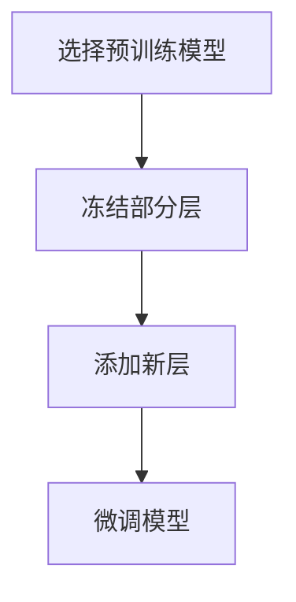

# 迁移学习 原理与代码实例讲解

## 1.背景介绍

迁移学习（Transfer Learning）是机器学习和深度学习领域中的一个重要分支。它的核心思想是将已经在某个任务上训练好的模型知识迁移到另一个相关任务上，从而减少新任务的训练时间和数据需求。迁移学习在计算机视觉、自然语言处理等领域取得了显著的成果，极大地推动了人工智能技术的发展。

在传统的机器学习中，每个任务都需要从头开始训练模型，这不仅耗时耗力，而且需要大量的数据。然而，迁移学习通过利用预训练模型，可以在较少的数据和时间内取得较好的效果。这种方法特别适用于数据稀缺的场景。

## 2.核心概念与联系

### 2.1 迁移学习的定义

迁移学习是指将一个领域或任务中学到的知识应用到另一个领域或任务中。具体来说，迁移学习可以分为以下几种类型：

- **领域迁移**：将一个领域中的知识迁移到另一个相关领域。
- **任务迁移**：将一个任务中的知识迁移到另一个相关任务。
- **跨模态迁移**：将一种模态（如图像）的知识迁移到另一种模态（如文本）。

### 2.2 迁移学习的基本流程

迁移学习的基本流程可以概括为以下几个步骤：

1. **选择预训练模型**：选择一个在大规模数据集上预训练好的模型。
2. **冻结部分层**：冻结预训练模型的部分层，以保留其学到的特征。
3. **添加新层**：在预训练模型的基础上添加新的层，以适应新任务。
4. **微调模型**：在新任务的数据上微调整个模型。

### 2.3 迁移学习与其他学习方法的联系

迁移学习与其他学习方法，如监督学习、无监督学习和强化学习，有着密切的联系。它可以看作是这些方法的扩展和补充，通过迁移学习，可以在较少的数据和时间内取得更好的效果。

## 3.核心算法原理具体操作步骤

### 3.1 选择预训练模型

选择预训练模型是迁移学习的第一步。常用的预训练模型包括VGG、ResNet、Inception等，这些模型在大规模数据集（如ImageNet）上进行了预训练，具有很强的特征提取能力。

### 3.2 冻结部分层

在选择好预训练模型后，需要冻结其部分层，以保留其学到的特征。通常情况下，冻结靠近输入层的部分，因为这些层学到的是通用的低级特征，如边缘、纹理等。

### 3.3 添加新层

在冻结部分层的基础上，需要添加新的层，以适应新任务。通常情况下，这些新层包括全连接层、激活函数等。

### 3.4 微调模型

最后一步是微调整个模型。在新任务的数据上进行微调，以适应新任务的特定需求。微调的过程包括调整学习率、优化器等超参数。

以下是迁移学习的基本流程图：



## 4.数学模型和公式详细讲解举例说明

### 4.1 迁移学习的数学定义

迁移学习的数学定义可以表示为：

$$
\mathcal{D}_S = \{(x_i^S, y_i^S)\}_{i=1}^{n_S}
$$

$$
\mathcal{D}_T = \{(x_i^T, y_i^T)\}_{i=1}^{n_T}
$$

其中，$\mathcal{D}_S$ 表示源领域的数据集，$\mathcal{D}_T$ 表示目标领域的数据集。迁移学习的目标是利用 $\mathcal{D}_S$ 中学到的知识来提高 $\mathcal{D}_T$ 上的性能。

### 4.2 迁移学习的损失函数

迁移学习的损失函数可以表示为：

$$
L = L_T + \lambda L_S
$$

其中，$L_T$ 表示目标任务的损失，$L_S$ 表示源任务的损失，$\lambda$ 是一个权重参数，用于平衡两者的影响。

### 4.3 举例说明

假设我们有一个在ImageNet上预训练好的ResNet模型，现在我们希望将其应用到一个新的图像分类任务上。具体步骤如下：

1. **选择预训练模型**：选择ResNet模型。
2. **冻结部分层**：冻结ResNet模型的前几层。
3. **添加新层**：在ResNet模型的基础上添加一个全连接层和一个Softmax层。
4. **微调模型**：在新任务的数据上进行微调。

## 5.项目实践：代码实例和详细解释说明

### 5.1 环境准备

首先，我们需要安装必要的库：

```bash
pip install tensorflow keras
```

### 5.2 代码实例

以下是一个使用Keras进行迁移学习的代码实例：

```python
import tensorflow as tf
from tensorflow.keras.applications import ResNet50
from tensorflow.keras.layers import Dense, Flatten
from tensorflow.keras.models import Model
from tensorflow.keras.preprocessing.image import ImageDataGenerator

# 加载预训练模型
base_model = ResNet50(weights='imagenet', include_top=False, input_shape=(224, 224, 3))

# 冻结预训练模型的前几层
for layer in base_model.layers:
    layer.trainable = False

# 添加新层
x = base_model.output
x = Flatten()(x)
x = Dense(1024, activation='relu')(x)
predictions = Dense(10, activation='softmax')(x)

# 构建新模型
model = Model(inputs=base_model.input, outputs=predictions)

# 编译模型
model.compile(optimizer='adam', loss='categorical_crossentropy', metrics=['accuracy'])

# 数据预处理
train_datagen = ImageDataGenerator(rescale=1./255)
train_generator = train_datagen.flow_from_directory(
    'data/train',
    target_size=(224, 224),
    batch_size=32,
    class_mode='categorical'
)

# 训练模型
model.fit(train_generator, epochs=10)
```

### 5.3 详细解释

1. **加载预训练模型**：我们使用ResNet50作为预训练模型，并去掉其顶层。
2. **冻结预训练模型的前几层**：通过设置 `layer.trainable = False` 来冻结前几层。
3. **添加新层**：在预训练模型的基础上添加一个全连接层和一个Softmax层。
4. **编译模型**：使用Adam优化器和交叉熵损失函数来编译模型。
5. **数据预处理**：使用 `ImageDataGenerator` 进行数据预处理。
6. **训练模型**：在新任务的数据上进行微调。

## 6.实际应用场景

迁移学习在多个领域都有广泛的应用，以下是一些典型的应用场景：

### 6.1 计算机视觉

在计算机视觉领域，迁移学习被广泛应用于图像分类、目标检测、图像分割等任务。例如，使用在ImageNet上预训练的模型，可以显著提高在小数据集上的图像分类性能。

### 6.2 自然语言处理

在自然语言处理领域，迁移学习被广泛应用于文本分类、情感分析、机器翻译等任务。例如，使用在大规模语料库上预训练的BERT模型，可以显著提高在特定任务上的性能。

### 6.3 医疗诊断

在医疗诊断领域，迁移学习被广泛应用于医学影像分析、疾病预测等任务。例如，使用在大规模医学影像数据上预训练的模型，可以显著提高在特定疾病上的诊断准确率。

## 7.工具和资源推荐

### 7.1 工具

- **TensorFlow**：一个开源的机器学习框架，支持迁移学习。
- **Keras**：一个高层次的神经网络API，支持快速构建和训练模型。
- **PyTorch**：一个开源的深度学习框架，支持动态计算图和迁移学习。

### 7.2 资源

- **ImageNet**：一个大规模的图像数据集，常用于预训练模型。
- **COCO**：一个大规模的图像数据集，常用于目标检测和图像分割任务。
- **BERT**：一个在大规模语料库上预训练的语言模型，常用于自然语言处理任务。

## 8.总结：未来发展趋势与挑战

迁移学习作为一种有效的机器学习方法，已经在多个领域取得了显著的成果。然而，迁移学习也面临一些挑战，如如何选择合适的预训练模型、如何处理源任务和目标任务之间的差异等。

未来，随着数据和计算资源的不断增加，迁移学习有望在更多领域取得突破。同时，如何提高迁移学习的效率和效果，也是一个值得深入研究的问题。

## 9.附录：常见问题与解答

### 9.1 迁移学习适用于哪些场景？

迁移学习适用于数据稀缺、训练时间有限的场景，特别是在计算机视觉和自然语言处理领域。

### 9.2 如何选择预训练模型？

选择预训练模型时，可以根据任务的相似性和数据的规模来选择。例如，对于图像分类任务，可以选择在ImageNet上预训练的模型。

### 9.3 迁移学习的效果如何评估？

迁移学习的效果可以通过在目标任务上的性能来评估，如准确率、精确率、召回率等。

### 9.4 迁移学习的常见问题有哪些？

迁移学习的常见问题包括如何选择合适的预训练模型、如何处理源任务和目标任务之间的差异、如何调整超参数等。

---

作者：禅与计算机程序设计艺术 / Zen and the Art of Computer Programming