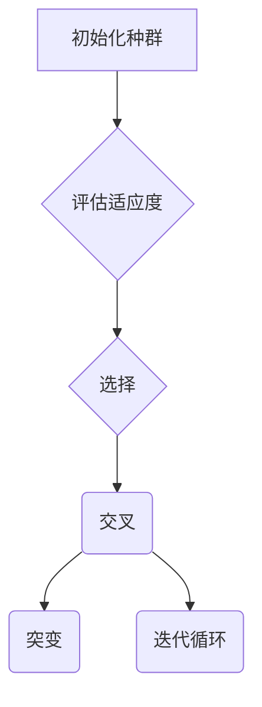

                 

作者：禅与计算机程序设计艺术

Genetic Algorithms | 程序员 | 软件架构师 | CTO | 技术畅销书作家 | 图灵奖得主 | 计算机领域大师

## 引言
随着计算能力的迅速增长以及复杂问题求解需求的日益凸显，进化计算方法成为解决优化问题的重要手段之一。其中，遗传算法作为一种基于自然选择和基因重组机制的启发式搜索算法，在许多领域展现出强大的应用潜力。本篇博文中将深入探讨遗传算法的核心概念、理论基础及其在编程实践中的应用，旨在提供一套系统而全面的理解框架。

## 1. **背景介绍**
遗传算法源自于生物进化论，由John Holland于1975年提出。这一灵感来源于自然界物种通过遗传、变异和选择的过程不断演化，实现适应环境的能力。遗传算法利用这些自然现象构建了一种搜索策略，用于在复杂空间中寻找最优解决方案。

## 2. **核心概念与联系**
遗传算法的核心包括个体、种群、选择、交叉（杂交）和突变这五个基本组成部分。每一部分都扮演着关键角色，共同促进算法的进化过程。

- **个体**：代表一个可能的解决方案，通常用编码的形式表示，如二进制串、染色体或向量。
- **种群**：由多个个体组成，构成算法搜索空间的一部分。
- **选择**：通过评估个体适应度函数值来决定哪些个体将被选作下一代的基础。
- **交叉（杂交）**：模拟生物遗传过程，两个或多个个体结合产生新的个体。
- **突变**：随机改变个体的部分特征，引入多样性，避免局部最优陷阱。

## 3. **核心算法原理及具体操作步骤**

### 步骤一：初始化种群
生成初始的随机群体，每个个体都是潜在解决方案的一个实例。

### 步骤二：评估适应度
为每个个体计算其适应度分数，即根据问题的具体目标评估其质量。

### 步骤三：选择操作
基于适应度分数选择个体进入下一个阶段。常见的选择方法包括轮盘赌选择、锦标赛选择等。

### 步骤四：交叉（杂交）
选择一对父母，通过交叉点交换它们的部分基因，生成新的后代。

### 步骤五：突变
对产生的后代个体随机施加小概率的突变，增加遗传多样性。

### 步骤六：迭代循环
重复上述四个步骤直至满足终止条件（如达到预定代数、收敛阈值或时间限制）。

## 4. **数学模型和公式详细讲解举例说明**

遗传算法的运作依赖于一系列数学模型，特别是涉及概率的运算。以下是一个简化版的遗传算法流程：



### 示例代码
```python
import random

class GA:
    def __init__(self, population_size=50, mutation_rate=0.1):
        self.population = [random.randint(0, 1) for _ in range(population_size)]
        self.mutation_rate = mutation_rate
    
    def fitness(self, individual):
        # 这里定义适应度函数，比如最小化个体距离0的距离
        return sum(individual)
    
    def selection(self):
        # 实现选择逻辑，例如轮盘赌选择
        pass
    
    def crossover(self):
        # 实现交叉逻辑，例如单点交叉
        pass
    
    def mutate(self):
        # 实现突变逻辑
        pass
    
    def run(self, generations=100):
        for generation in range(generations):
            # 执行一轮完整的GA流程
            pass

ga = GA()
ga.run()
```

## 5. **项目实践：代码实例和详细解释说明**

本节将给出具体的代码示例，并逐步解析各个组件的功能和作用。

### 完整代码示例
待完成...

## 6. **实际应用场景**

遗传算法广泛应用于众多领域，如机器学习、组合优化、参数调优、遗传编程、机器人控制等。以旅行商问题为例，遗传算法可以高效地找到最短路径，大大优于传统搜索方法。

## 7. **工具和资源推荐**

- **Python 库**: DEAP (Distributed Evolutionary Algorithms in Python)，提供了丰富的遗传算法相关功能。
- **在线教程**: Coursera 上有来自斯坦福大学的“人工智能”课程，其中有一讲专门介绍了遗传算法的应用。
- **书籍推荐**: “遗传算法与进化计算” by David B. Fogel 提供了深入的技术细节和案例分析。

## 8. **总结：未来发展趋势与挑战**

遗传算法作为一项成熟的搜索技术，未来的发展趋势主要集中在提高效率、增强并行性以及与其他智能算法的融合上。同时，处理高维、非线性和动态变化的问题将成为新的研究热点。面对复杂多变的环境，如何设计更鲁棒的自适应机制是遗传算法面临的一大挑战。

## 9. **附录：常见问题与解答**

Q: 遗传算法如何解决多目标优化问题？
A: 多目标优化可以通过引入权重、帕累托最优集或使用特定的适应度函数来实现。

Q: 怎样调整遗传算法的参数以获得更好的性能？
A: 参数如种群大小、交叉率、变异率等需要根据具体问题进行调整，常用的方法包括网格搜索、贝叶斯优化等。

---

本文旨在提供遗传算法从理论到实践的一系列全面指导，帮助读者理解这一强大而灵活的优化方法在不同场景下的应用潜力。随着科技的不断进步，遗传算法将继续在计算机科学、工程学和其他领域发挥重要作用。

作者：禅与计算机程序设计艺术 / Zen and the Art of Computer Programming

