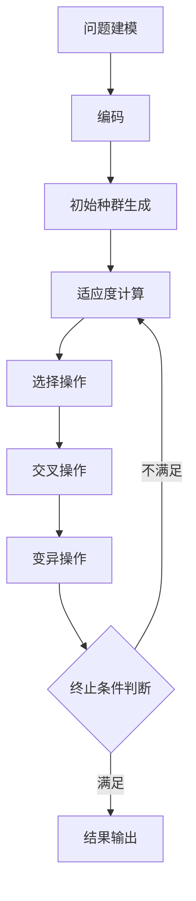

# 遗传算法在水资源管理中的应用

## 1.背景介绍

水资源是人类赖以生存的关键资源,合理有效地管理和利用水资源对于可持续发展至关重要。传统的水资源管理方法通常依赖于经验和试错法,效率低下且难以处理复杂的约束条件。随着计算能力的不断提高,遗传算法(Genetic Algorithm, GA)作为一种有效的优化算法,在水资源管理领域展现出巨大的应用潜力。

遗传算法是一种模拟生物进化过程的优化算法,具有全局寻优能力强、解空间广、易于并行化等优点。它通过模拟生物进化中的选择、交叉和变异等操作,在解空间中不断进化,最终获得满足约束条件的最优解或近似最优解。在水资源管理中,遗传算法可以用于解决诸如水库调度、灌溉系统优化、管网设计等复杂的组合优化问题。

## 2.核心概念与联系

### 2.1 遗传算法的基本概念

遗传算法的核心思想是模拟生物进化过程,通过选择、交叉和变异等操作,在解空间中不断进化,寻找最优解。其基本概念包括:

1. **编码**: 将问题的解空间映射到一个由有限长度字符串组成的空间,这些字符串称为染色体或个体。
2. **适应度函数**: 用于评估个体的优劣程度,适应度越高,被选中的机会越大。
3. **选择操作**: 根据个体的适应度,选择出优秀个体,用于产生下一代种群。
4. **交叉操作**: 将两个或多个优秀个体的部分基因组合,产生新的个体。
5. **变异操作**: 对个体的基因进行微小的随机变化,增加种群的多样性。

### 2.2 水资源管理中的应用

在水资源管理中,遗传算法可以应用于以下几个方面:

1. **水库调度**: 确定水库的最佳蓄水和排水策略,以满足下游用水需求和防洪要求。
2. **灌溉系统优化**: 优化灌溉管网的布局和运行参数,提高灌溉效率,节约水资源。
3. **供水管网设计**: 设计最佳的供水管网布局,满足用水需求并最小化成本。
4. **地下水模型优化**: 优化地下水模型的参数,提高模型的预测精度。
5. **水质管理**: 优化水质监测点的布置,提高监测效率。

## 3.核心算法原理具体操作步骤

遗传算法在水资源管理中的应用通常包括以下几个步骤:

1. **问题建模**: 将实际问题抽象为数学模型,确定决策变量、目标函数和约束条件。
2. **编码**: 将决策变量编码为染色体,通常采用二进制编码或实数编码。
3. **初始种群生成**: 随机生成一定数量的初始个体,作为算法的起点。
4. **适应度计算**: 根据目标函数和约束条件,计算每个个体的适应度值。
5. **选择操作**: 根据适应度值,选择出优秀个体,作为下一代种群的父代。常用的选择方法包括轮盘赌选择、锦标赛选择等。
6. **交叉操作**: 对选择出的父代个体进行交叉操作,产生新的子代个体。常用的交叉方法包括单点交叉、多点交叉、均匀交叉等。
7. **变异操作**: 对交叉后的个体进行变异操作,增加种群的多样性。常用的变异方法包括基因突变、调换突变等。
8. **终止条件判断**: 判断是否满足终止条件,如达到最大迭代次数或目标函数值满足要求。如果不满足,返回步骤4,继续进行下一代种群的进化。
9. **结果输出**: 输出满足终止条件时的最优解及其目标函数值。

上述步骤可以通过流程图更直观地展示:



## 4.数学模型和公式详细讲解举例说明

在水资源管理中,遗传算法通常需要建立数学模型,将实际问题抽象为优化问题。以水库调度为例,其数学模型可以表示为:

**决策变量**:
$$
X = \{x_1, x_2, \ldots, x_T\}
$$
其中 $x_t$ 表示第 $t$ 时段的水库出库流量。

**目标函数**:
$$
\max \sum_{t=1}^{T} B_t(x_t)
$$
其中 $B_t(x_t)$ 表示第 $t$ 时段的水资源利用效益函数,通常与出库流量 $x_t$ 有关。

**约束条件**:

1. 水量平衡约束:
$$
V_{t+1} = V_t + I_t - x_t - E_t
$$
其中 $V_t$ 表示第 $t$ 时段的水库蓄水量, $I_t$ 表示第 $t$ 时段的入库流量, $E_t$ 表示第 $t$ 时段的水库蓄水损失。

2. 水库蓄水量约束:
$$
V_{\min} \leq V_t \leq V_{\max}
$$
其中 $V_{\min}$ 和 $V_{\max}$ 分别表示水库的最小和最大蓄水量。

3. 出库流量约束:
$$
x_{\min} \leq x_t \leq x_{\max}
$$
其中 $x_{\min}$ 和 $x_{\max}$ 分别表示出库流量的最小和最大值。

在遗传算法中,上述数学模型中的决策变量 $X$ 将被编码为染色体,目标函数和约束条件将被用于计算个体的适应度。通过不断进化,算法将寻找满足约束条件的最优解或近似最优解。

## 5.项目实践: 代码实例和详细解释说明

为了更好地理解遗传算法在水资源管理中的应用,我们以Python语言为例,实现一个简单的水库调度优化问题。

### 5.1 问题描述

假设有一座水库,需要根据未来一年的入库流量和用水需求,确定每个月的出库流量,使得水资源利用效益最大化,同时满足水库蓄水量和出库流量的约束条件。

### 5.2 数学模型

**决策变量**:
$$
X = \{x_1, x_2, \ldots, x_{12}\}
$$
其中 $x_t$ 表示第 $t$ 个月的出库流量。

**目标函数**:
$$
\max \sum_{t=1}^{12} B_t(x_t) = \sum_{t=1}^{12} (a_t x_t - b_t x_t^2)
$$
其中 $a_t$ 和 $b_t$ 为常数,表示第 $t$ 个月的水资源利用效益函数的参数。

**约束条件**:

1. 水量平衡约束:
$$
V_{t+1} = V_t + I_t - x_t - E_t
$$
其中 $V_t$ 表示第 $t$ 个月的水库蓄水量, $I_t$ 表示第 $t$ 个月的入库流量, $E_t$ 表示第 $t$ 个月的水库蓄水损失。

2. 水库蓄水量约束:
$$
V_{\min} \leq V_t \leq V_{\max}
$$
其中 $V_{\min}$ 和 $V_{\max}$ 分别表示水库的最小和最大蓄水量。

3. 出库流量约束:
$$
x_{\min} \leq x_t \leq x_{\max}
$$
其中 $x_{\min}$ 和 $x_{\max}$ 分别表示出库流量的最小和最大值。

### 5.3 代码实现

```python
import numpy as np

# 定义问题参数
V_min = 100  # 水库最小蓄水量
V_max = 500  # 水库最大蓄水量
x_min = 10  # 出库流量最小值
x_max = 100  # 出库流量最大值
I = [80, 75, 70, 90, 120, 150, 180, 170, 110, 95, 85, 80]  # 入库流量
E = [5, 5, 5, 6, 7, 8, 9, 8, 7, 6, 5, 5]  # 蓄水损失
a = [10, 10, 10, 12, 15, 18, 20, 18, 15, 12, 10, 10]  # 效益函数参数
b = [0.1, 0.1, 0.1, 0.2, 0.3, 0.4, 0.5, 0.4, 0.3, 0.2, 0.1, 0.1]  # 效益函数参数

# 定义遗传算法参数
pop_size = 100  # 种群大小
max_iter = 200  # 最大迭代次数
pc = 0.8  # 交叉概率
pm = 0.2  # 变异概率

# 编码
def encode(x):
    return np.array([int(xi * 10) for xi in x])

# 解码
def decode(x):
    return np.array([xi / 10 for xi in x])

# 适应度函数
def fitness(x):
    x = decode(x)
    V = V_min
    fit = 0
    for t in range(12):
        V = V + I[t] - x[t] - E[t]
        if V_min <= V <= V_max and x_min <= x[t] <= x_max:
            fit += a[t] * x[t] - b[t] * x[t] ** 2
        else:
            fit = 0
            break
    return fit

# 选择操作
def selection(pop, fitness_values):
    total_fitness = sum(fitness_values)
    probs = [fv / total_fitness for fv in fitness_values]
    new_pop = []
    for i in range(pop_size):
        idx = np.random.choice(len(pop), p=probs)
        new_pop.append(pop[idx])
    return new_pop

# 交叉操作
def crossover(pop):
    new_pop = []
    for i in range(0, pop_size, 2):
        if np.random.rand() < pc:
            p1 = pop[i]
            p2 = pop[i + 1]
            cross_point = np.random.randint(1, 12)
            c1 = np.concatenate((p1[:cross_point], p2[cross_point:]))
            c2 = np.concatenate((p2[:cross_point], p1[cross_point:]))
            new_pop.append(c1)
            new_pop.append(c2)
        else:
            new_pop.append(pop[i])
            new_pop.append(pop[i + 1])
    return new_pop

# 变异操作
def mutation(pop):
    new_pop = []
    for p in pop:
        if np.random.rand() < pm:
            mut_point = np.random.randint(0, 12)
            p[mut_point] = np.random.randint(x_min * 10, x_max * 10 + 1)
        new_pop.append(p)
    return new_pop

# 初始化种群
pop = [encode(np.random.uniform(x_min, x_max, 12)) for i in range(pop_size)]

# 迭代进化
best_fit = 0
best_sol = None
for i in range(max_iter):
    fitness_values = [fitness(p) for p in pop]
    pop = selection(pop, fitness_values)
    pop = crossover(pop)
    pop = mutation(pop)
    max_fit = max(fitness_values)
    if max_fit > best_fit:
        best_fit = max_fit
        best_sol = decode(pop[fitness_values.index(max_fit)])
    print(f"Iteration {i + 1}: Best fitness = {best_fit}")

# 输出结果
print("Best solution:", best_sol)
print("Best fitness:", best_fit)
```

### 5.4 代码解释

1. 首先定义问题参数,包括水库蓄水量和出库流量的约束条件、入库流量、蓄水损失以及效益函数的参数。
2. 定义遗传算法参数,包括种群大小、最大迭代次数、交叉概率和变异概率。
3. 定义编码和解码函数,将决策变量映射到整数空间,方便进行遗传操作。
4. 定义适应度函数,根据目标函数和约束条件计算个体的适应度值。
5. 定义选择、交叉和变异操作,分别用于选择优秀个体、产生新的个体和增加种群多样性。
6