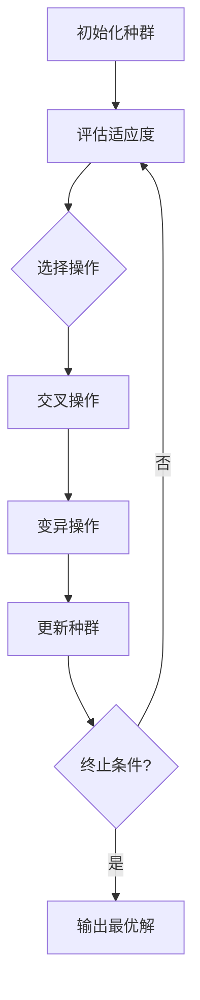

# 遗传算法在统计学研究中的应用

## 1.背景介绍

统计学是一门研究如何收集、组织、分析和解释数据的科学。在当今大数据时代,统计学在各个领域都扮演着重要角色,尤其是在数据分析和建模方面。然而,随着数据量和复杂性的增加,传统的统计方法往往难以有效地处理这些数据。这就需要引入新的计算技术和算法来解决这些挑战。

遗传算法(Genetic Algorithm, GA)是一种受生物进化过程启发的优化算法,被广泛应用于各个领域的优化问题求解。由于其强大的全局搜索能力和鲁棒性,遗传算法在统计学研究中也得到了广泛的应用,尤其是在参数估计、模型选择、聚类分析等领域。

本文将深入探讨遗传算法在统计学研究中的应用,包括其基本原理、核心算法、数学模型、实际应用场景等,旨在为读者提供全面的理解和实践指导。

## 2.核心概念与联系

### 2.1 遗传算法基本概念

遗传算法是一种基于生物进化过程的优化算法,主要思想是模拟自然界中生物的遗传、变异和选择过程,通过不断迭代,逐步优化解决方案。

遗传算法的核心思想包括:

1. **编码**: 将待优化问题的解空间编码为一组染色体(个体),通常使用二进制编码或实数编码。
2. **适应度函数**: 用于评估每个个体的优劣程度,是算法的驱动力。
3. **选择**: 根据适应度函数,选择出优秀的个体作为父代,用于产生下一代种群。
4. **交叉**: 将父代个体的部分基因组合,产生新的子代个体。
5. **变异**: 在子代个体中引入少量随机变异,增加种群的多样性。

通过不断迭代上述过程,算法可以逐步优化种群中的个体,最终得到满足要求的最优解或近似最优解。

### 2.2 遗传算法与统计学的联系

在统计学研究中,常常需要解决各种优化问题,例如参数估计、模型选择、聚类分析等。这些问题往往具有以下特点:

1. **高维复杂**: 涉及大量参数和变量,解空间高维且复杂。
2. **非线性**: 目标函数和约束条件往往是非线性的。
3. **多模态**: 存在多个局部最优解,难以找到全局最优解。
4. **噪声干扰**: 数据中存在噪声和异常值,影响优化结果。

传统的统计方法如最小二乘法、最大似然估计等,在处理这些复杂问题时往往会受到局限性的影响。而遗传算法作为一种全局优化算法,具有以下优势:

1. **全局搜索能力强**: 可以有效避免陷入局部最优解。
2. **适应性好**: 可以处理各种复杂的非线性问题。
3. **鲁棒性高**: 对噪声和异常值具有一定的容忍度。
4. **并行计算**: 可以利用并行计算加速优化过程。

因此,将遗传算法应用于统计学研究中,可以有效解决传统方法难以处理的复杂优化问题,提高模型的精度和可靠性。

## 3.核心算法原理具体操作步骤

遗传算法的核心算法流程如下:

1. **初始化种群**

首先需要随机生成一个初始种群,每个个体对应一个可能的解。常用的编码方式包括二进制编码和实数编码。

2. **评估适应度**

对每个个体计算其适应度值,适应度值反映了个体的优劣程度。适应度函数的设计对算法的性能有重要影响。

3. **选择操作**

根据适应度值,从当前种群中选择出一部分优秀个体作为父代,用于产生下一代种群。常用的选择方法包括轮盘赌选择、锦标赛选择等。

4. **交叉操作**

将父代个体的部分基因组合,产生新的子代个体。交叉操作是遗传算法的核心,它可以保留父代个体的优良基因,并产生新的基因组合。常用的交叉方法包括单点交叉、多点交叉、均匀交叉等。

5. **变异操作**

在子代个体中引入少量随机变异,增加种群的多样性,防止算法过早收敛于局部最优解。常用的变异方法包括位变异、均匀变异等。

6. **更新种群**

用产生的子代个体替换原种群中的一部分个体,形成新的种群。

7. **终止条件判断**

检查是否满足终止条件,如达到最大迭代次数、目标函数值小于阈值等。如果满足终止条件,则输出当前种群中的最优个体作为最终解;否则,返回步骤2,继续进行下一轮迭代。

通过上述步骤的不断迭代,算法可以逐步优化种群中的个体,最终得到满足要求的最优解或近似最优解。

## 4.数学模型和公式详细讲解举例说明

在遗传算法中,数学模型和公式起着至关重要的作用,它们为算法的设计和实现提供了理论基础和指导。下面将详细介绍一些核心的数学模型和公式。

### 4.1 编码方式

编码是将优化问题的解空间映射到遗传算法可操作的空间的过程。常用的编码方式包括二进制编码和实数编码。

**二进制编码**

二进制编码是将解空间映射到一个由0和1组成的二进制串。假设优化问题的解空间为 $\mathbf{X} = [a, b]$,其中 $a$ 和 $b$ 分别表示解空间的下限和上限。将解空间等分为 $2^l$ 个区间,则每个解可以用一个长度为 $l$ 的二进制串表示。编码公式如下:

$$
x_i = a + (b - a) \times \frac{\sum_{j=0}^{l-1} x_{ij} \times 2^j}{2^l - 1}
$$

其中, $x_i$ 表示解的十进制值, $x_{ij}$ 表示二进制串的第 $j$ 位取值(0或1)。

**实数编码**

实数编码直接将解空间映射到实数空间,每个个体对应一个实数向量。假设优化问题的解空间为 $\mathbf{X} = [a_1, b_1] \times [a_2, b_2] \times \cdots \times [a_n, b_n]$,则每个个体可以表示为一个长度为 $n$ 的实数向量 $(x_1, x_2, \cdots, x_n)$,其中 $x_i \in [a_i, b_i]$。

### 4.2 适应度函数

适应度函数用于评估每个个体的优劣程度,是遗传算法的驱动力。适应度函数的设计对算法的性能有重要影响。

对于最小化问题,适应度函数可以直接使用目标函数的负值:

$$
f(x) = -F(x)
$$

其中, $F(x)$ 表示待优化的目标函数。

对于最大化问题,适应度函数可以使用目标函数的正值:

$$
f(x) = F(x)
$$

如果目标函数的值域不是非负的,可以对目标函数进行平移和缩放,使其值域映射到非负区间:

$$
f(x) = \alpha F(x) + \beta
$$

其中, $\alpha$ 和 $\beta$ 是常数,用于将目标函数的值域映射到非负区间。

在实际应用中,适应度函数的设计需要根据具体问题进行调整,以确保算法的收敛性和效率。

### 4.3 选择操作

选择操作是根据个体的适应度值,从当前种群中选择出一部分优秀个体作为父代,用于产生下一代种群。常用的选择方法包括轮盘赌选择和锦标赛选择。

**轮盘赌选择**

轮盘赌选择是一种基于适应度比例的选择方法。每个个体被选择的概率与其适应度值成正比。假设种群中有 $N$ 个个体,第 $i$ 个个体的适应度值为 $f_i$,则第 $i$ 个个体被选择的概率为:

$$
p_i = \frac{f_i}{\sum_{j=1}^N f_j}
$$

**锦标赛选择**

锦标赛选择是一种基于竞争的选择方法。每次从种群中随机选择 $k$ 个个体(通常 $k=2$),然后选择其中适应度值最高的个体作为父代。锦标赛选择的优点是可以控制选择压力,避免出现过早收敛的情况。

### 4.4 交叉操作

交叉操作是将父代个体的部分基因组合,产生新的子代个体。常用的交叉方法包括单点交叉、多点交叉和均匀交叉。

**单点交叉**

单点交叉是在父代个体的编码串中随机选择一个交叉点,然后交换两个父代个体在该点后面的基因片段,产生两个新的子代个体。

假设有两个父代个体 $P_1$ 和 $P_2$,编码串长度为 $l$,交叉点位置为 $k$,则单点交叉操作如下:

$$
\begin{aligned}
P_1 &= (p_{11}, p_{12}, \cdots, p_{1k}, p_{1(k+1)}, \cdots, p_{1l}) \\
P_2 &= (p_{21}, p_{22}, \cdots, p_{2k}, p_{2(k+1)}, \cdots, p_{2l})
\end{aligned}
$$

交叉后产生两个子代个体 $C_1$ 和 $C_2$:

$$
\begin{aligned}
C_1 &= (p_{11}, p_{12}, \cdots, p_{1k}, p_{2(k+1)}, \cdots, p_{2l}) \\
C_2 &= (p_{21}, p_{22}, \cdots, p_{2k}, p_{1(k+1)}, \cdots, p_{1l})
\end{aligned}
$$

**多点交叉**

多点交叉是在父代个体的编码串中随机选择多个交叉点,然后交换两个父代个体在这些交叉点之间的基因片段,产生两个新的子代个体。

**均匀交叉**

均匀交叉是根据一定的交叉概率,从两个父代个体中随机选取基因片段,组合成新的子代个体。均匀交叉可以更好地保留父代个体的优良基因,同时也增加了种群的多样性。

### 4.5 变异操作

变异操作是在子代个体中引入少量随机变异,增加种群的多样性,防止算法过早收敛于局部最优解。常用的变异方法包括位变异和均匀变异。

**位变异**

位变异是对二进制编码的个体进行变异操作。对于每个个体,按照一定的变异概率 $p_m$,随机选择一些位置,将0变为1,将1变为0。

假设个体的编码串长度为 $l$,变异概率为 $p_m$,则第 $i$ 位发生变异的概率为:

$$
p_i = 1 - (1 - p_m)^l
$$

**均匀变异**

均匀变异是对实数编码的个体进行变异操作。对于每个个体,按照一定的变异概率 $p_m$,随机选择一些位置,在该位置上加上一个服从均匀分布的随机扰动。

假设个体的第 $i$ 维取值为 $x_i$,变异后的取值为 $x_i^{\prime}$,则:

$$
x_i^{\prime} = x_i + \delta
$$

其中, $\delta$ 是一个服从均匀分布 $U(-\alpha, \alpha)$ 的随机变量,表示变异的幅度。

变异操作的目的是增加种群的多样性,避免算法陷入局部最优解。但是,过高的变异概率可能会破坏已有的优良基因,导致算法性能下降。因此,