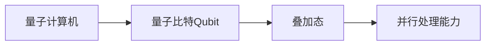
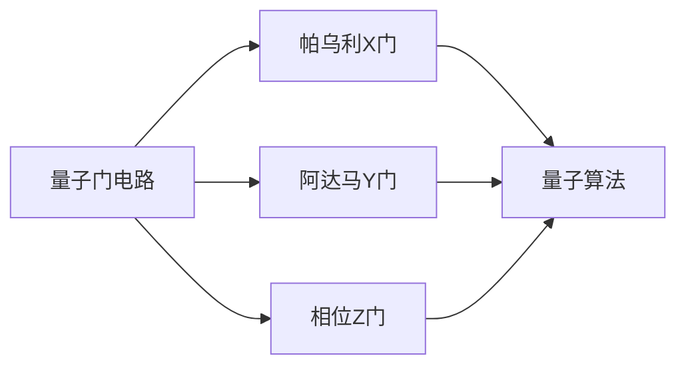
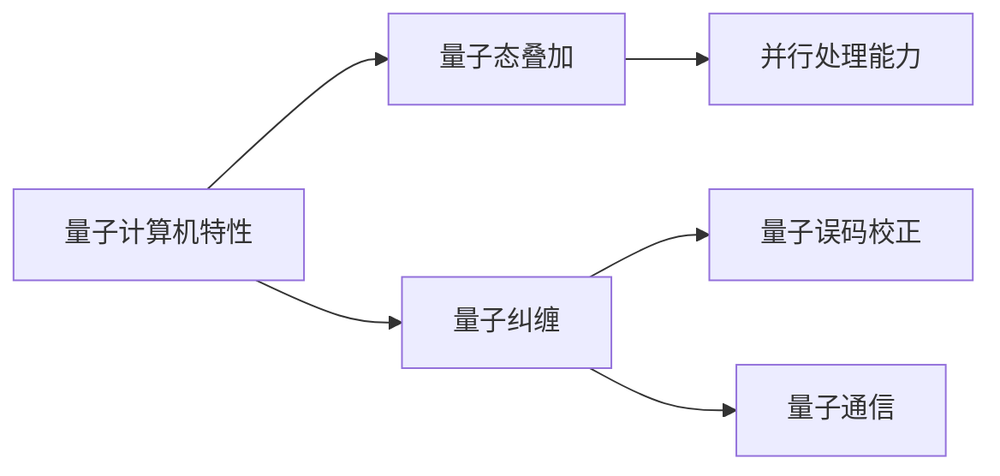
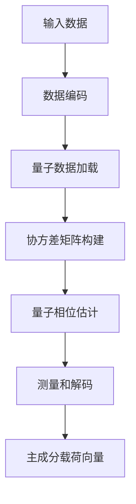
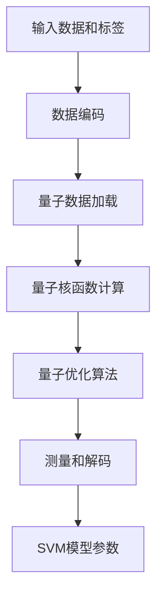
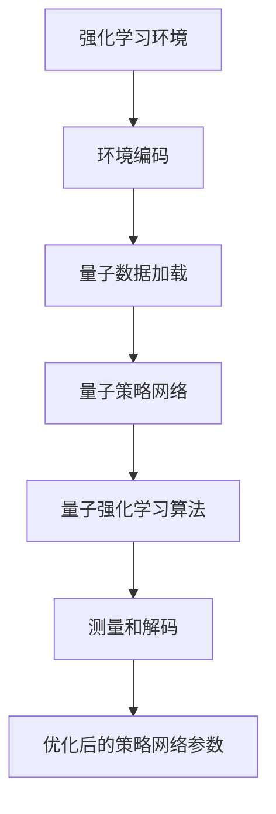

# 量子机器学习原理与代码实战案例讲解

## 1.背景介绍

### 1.1 量子计算机的兴起

量子计算机是一种利用量子力学原理来执行计算操作的新型计算机系统。与传统的基于晶体管的计算机不同,量子计算机利用量子态的特殊性质(如叠加态和纠缠态)来存储信息和执行计算。

量子计算的概念最早可以追溯到20世纪80年代,当时理查德·费曼提出了量子模拟的想法。随后,量子算法的研究取得了重大进展,例如彼得·肖尔在1994年发明了著名的"肖尔算法",展示了量子计算在解决大整数分解问题上的巨大潜力。

近年来,由于量子硬件技术的快速发展,量子计算机的实现逐渐成为可能。谷歌、IBM、英特尔等科技巨头纷纷投入大量资源研发量子计算机。2019年,谷歌宣布实现了"量子优越性",标志着量子计算机在特定任务上已经超越了传统计算机。

### 1.2 机器学习与量子计算的结合

机器学习是当前人工智能领域的核心技术之一,已被广泛应用于图像识别、自然语言处理、推荐系统等诸多领域。然而,随着数据量的激增和模型复杂度的提高,传统的机器学习算法在计算能力和存储空间方面遇到了瓶颈。

量子计算机凭借其独特的运算方式,为解决机器学习中的一些挑战问题提供了新的契机。将量子计算与机器学习相结合,就产生了一个新兴的交叉学科——量子机器学习(Quantum Machine Learning)。

量子机器学习旨在利用量子计算的优势,设计出更高效、更精确的机器学习算法,提高数据处理能力和模型性能。同时,量子机器学习也可以帮助我们更好地理解和模拟一些复杂的量子系统,为量子计算机的发展提供支持。

## 2.核心概念与联系

### 2.1 量子比特(Qubit)

量子比特(Qubit)是量子计算机中最基本的信息单元。与经典计算机中的比特(Bit)只能表示0或1两种状态不同,量子比特可以同时存在0和1的叠加态,即$|q\rangle = \alpha|0\rangle + \beta|1\rangle$,其中$\alpha$和$\beta$是复数,且满足$|\alpha|^2 + |\beta|^2 = 1$。

量子比特的这种叠加态特性,使得它能够同时对应多个不同的状态,从而大大增加了量子计算机的并行处理能力。

### 2.2 量子门电路

与经典计算机中使用逻辑门电路来执行计算操作类似,量子计算机也需要使用量子门电路来操作量子比特。常见的量子门包括:

- 帕乌利X门: 将量子比特的0和1状态互换
- 阿达马Y门: 将量子比特的基向量旋转180度
- 相位Z门: 对量子比特的相位进行翻转

通过对量子比特施加一系列量子门操作,可以实现各种量子算法和量子线路。

### 2.3 量子态叠加和量子纠缠

量子态叠加和量子纠缠是量子计算机区别于经典计算机的两个关键特性。

量子态叠加指的是量子比特可以同时存在多个不同状态的叠加。这使得量子计算机能够同时对应多个不同的计算路径,大大提高了并行处理能力。

量子纠缠则描述了多个量子比特之间存在着微妙的相关性,它们的状态无法被单独描述,只能作为一个整体来看待。量子纠缠为量子计算机带来了一些独特的计算优势,例如量子电路中的量子纠缠态可以被用于量子误码校正和量子通信等应用。

### 2.4 量子机器学习与经典机器学习的关系

量子机器学习可以被视为经典机器学习的一种推广和扩展。它们有以下几点联系:

1. **目标相同**: 都旨在从数据中提取有用的模式和规律,对未知数据进行预测或决策。

2. **数学基础**: 量子机器学习和经典机器学习都建立在概率论、线性代数等数学理论之上。

3. **算法框架**: 许多经典机器学习算法(如支持向量机、主成分分析等)都有对应的量子版本算法。

4. **应用领域**: 量子机器学习可以应用于图像识别、自然语言处理等经典机器学习的应用场景。

与此同时,量子机器学习也具有自身的独特优势:

1. **提高计算效率**: 利用量子态叠加和量子并行性,可以加速某些机器学习算法的执行。

2. **处理更复杂数据**: 量子计算机有能力处理和模拟一些复杂的量子系统数据。

3. **保护数据隐私**: 量子机器学习算法可以通过量子加密技术来保护数据隐私。

## 3.核心算法原理具体操作步骤

### 3.1 量子主成分分析算法

主成分分析(Principal Component Analysis, PCA)是一种常用的无监督机器学习算法,广泛应用于数据降维、特征提取等领域。量子主成分分析算法就是将经典PCA算法移植到量子计算机上的版本。

量子主成分分析算法的核心步骤如下:

1. **数据编码**: 将输入数据编码为量子态。

2. **量子数据加载**: 利用量子线路将编码后的数据加载到量子寄存器中。

3. **协方差矩阵构建**: 构建输入数据的协方差矩阵,并将其编码为量子态。

4. **量子相位估计**: 使用量子相位估计算法来近似计算协方差矩阵的特征值和特征向量。

5. **测量和解码**: 对量子寄存器进行测量,并将测量结果解码为主成分载荷向量。

相比经典PCA算法,量子版本的优势在于利用量子态叠加和量子并行性,可以更高效地计算协方差矩阵的特征值和特征向量,从而加速整个算法的执行。

### 3.2 量子支持向量机算法

支持向量机(Support Vector Machine, SVM)是一种有监督的机器学习算法,常用于分类和回归问题。量子支持向量机算法则是将经典SVM算法移植到量子计算机上的版本。

量子支持向量机算法的核心步骤如下:

1. **数据编码**: 将输入数据和标签编码为量子态。

2. **量子数据加载**: 利用量子线路将编码后的数据和标签加载到量子寄存器中。

3. **量子核函数计算**: 使用量子线路来计算训练数据之间的核函数值。

4. **量子优化算法**: 利用量子优化算法(如量子主模近似算法)来求解SVM的对偶形式,获得最优分类超平面的参数。

5. **测量和解码**: 对量子寄存器进行测量,并将测量结果解码为SVM模型的参数。

与经典SVM算法相比,量子版本的优势在于利用量子并行性来加速核函数的计算,以及使用量子优化算法来更高效地求解SVM的对偶形式,从而提高整个算法的执行效率。

### 3.3 量子强化学习算法

强化学习是一种基于奖惩机制的机器学习范式,常用于解决序列决策问题。量子强化学习算法则是将经典强化学习算法移植到量子计算机上的版本。

量子强化学习算法的核心步骤如下:

1. **环境编码**: 将强化学习环境(状态、动作、奖励等)编码为量子态。

2. **量子数据加载**: 利用量子线路将编码后的环境数据加载到量子寄存器中。

3. **量子策略网络**: 使用量子线路构建量子策略网络,用于预测每个状态下的最优动作。

4. **量子强化学习算法**: 利用量子版本的强化学习算法(如量子Q-Learning或量子策略梯度算法)来更新量子策略网络的参数。

5. **测量和解码**: 对量子寄存器进行测量,并将测量结果解码为优化后的量子策略网络参数。

与经典强化学习算法相比,量子版本的优势在于利用量子态叠加和量子并行性来加速策略网络的训练,以及使用量子优化算法来更高效地更新策略网络参数,从而提高整个算法的执行效率和收敛速度。

## 4.数学模型和公式详细讲解举例说明

### 4.1 量子态表示

在量子计算中,量子态是描述量子系统状态的基本概念。一个$n$比特的量子态可以表示为:

$$
|\psi\rangle = \sum_{i=0}^{2^n-1} \alpha_i|i\rangle
$$

其中,每个$\alpha_i$是一个复数系数,满足归一化条件$\sum_{i=0}^{2^n-1} |\alpha_i|^2 = 1$。$|i\rangle$表示计算基底,是$n$比特的经典状态。

例如,一个单比特量子态可以表示为:

$$
|\psi\rangle = \alpha|0\rangle + \beta|1\rangle
$$

其中$\alpha$和$\beta$是复数,且$|\alpha|^2 + |\beta|^2 = 1$。这个量子态同时包含了$|0\rangle$和$|1\rangle$两种经典状态的叠加。

### 4.2 量子门操作

量子门是量子计算中的基本操作单元,用于改变量子态的状态。常见的量子门包括:

1. **帕乌利X门**:

$$
X = \begin{pmatrix}
0 & 1 \\
1 & 0
\end{pmatrix}
$$

作用于量子态$|\psi\rangle = \alpha|0\rangle + \beta|1\rangle$,得到:

$$
X|\psi\rangle = \beta|0\rangle + \alpha|1\rangle
$$

即X门将$|0\rangle$和$|1\rangle$状态互换。

2. **阿达马Y门**:

$$
Y = \begin{pmatrix}
0 & -i \\
i & 0
\end{pmatrix}
$$

作用于量子态$|\psi\rangle$,得到:

$$
Y|\psi\rangle = i\alpha|1\rangle - i\beta|0\rangle
$$

即Y门将量子态绕Y轴旋转180度。

3. **相位Z门**:

$$
Z = \begin{pmatrix}
1 & 0 \\
0 & -1
\end{pmatrix}
$$

作用于量子态$|\psi\rangle$,得到:

$$
Z|\psi\rangle = \alpha|0\rangle - \beta|1\rangle
$$

即Z门对$|1\rangle$状态施加一个相位翻转。

通过组合不同的量子门,