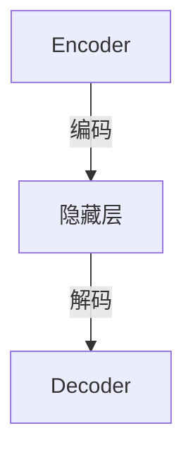

                 

作者：禅与计算机程序设计艺术

**Zen and the Art of Computer Programming**

随着深度学习技术的发展，如何有效地处理高维度的数据成为了关键挑战之一。降维作为一种重要的预处理手段，在提高计算效率、减小过拟合风险以及更好地揭示数据内在结构方面发挥着重要作用。本文将探讨降维在深度学习中的应用，包括其核心概念、算法原理、数学模型、代码实现、实际应用场景以及未来发展趋势。

---

## 1. 背景介绍

在机器学习领域，数据往往具有高维度特性，表现为特征数量庞大。然而，许多真实世界的问题并不需要如此多的参数来描述。高维度数据不仅增加了存储和计算成本，还可能导致所谓的“维数灾难”，即过拟合现象。降维技术通过减少特征空间的维度，旨在去除冗余信息，同时保留数据的主要信息和结构，从而优化模型性能。

## 2. 核心概念与联系

### 主成分分析 (PCA)
**概念**: PCA 是一种线性降维方法，通过对原始数据进行正交变换，找到一组新的坐标轴（主成分），这些新轴是原始数据方差最大的方向。前 k 个主成分构成一个低维空间，用于表示原始数据的大致形态。

### 自编码器 (AE)
**概念**: AE 是一种神经网络模型，由编码器（负责压缩输入数据至低维表示）和解码器（重构高维数据）组成。自编码器通过最小化重构误差，自动学习输入数据的有效表示。

### 局部线性嵌入 (LLE)
**概念**: LLE 基于局部线性假设，认为每个样本点可由邻近点的线性组合逼近。它首先构建邻域关系，然后求解线性系数，最后恢复出低维表示。

### 几何限制框架 (t-SNE)
**概念**: t-SNE 将高维数据映射到二维或三维空间，保持近邻点间的相对距离，非常适合可视化高维数据。它采用概率分布来建模相似性和非相似性。

---

## 3. 核心算法原理及具体操作步骤

### 主成分分析 (PCA)

1. **中心化**: 对原始数据进行零均值化。
2. **协方差矩阵计算**: 计算数据集的协方差矩阵。
3. **特征向量与特征值分解**: 找到协方差矩阵的最大特征值对应的特征向量。
4. **选择主成分**: 筛选出 k 个最大特征值对应的特征向量。
5. **投影**: 将原始数据投影到选定的低维空间上。

### 自编码器 (AE)

1. **定义模型**: 构建包含编码器和解码器的神经网络。
2. **训练过程**: 使用反向传播算法调整权重以最小化重构损失。
3. **学习表示**: 通过迭代训练得到能够有效重建输入的权重，间接获得低维表示。

---

## 4. 数学模型和公式详细讲解举例说明

### 主成分分析 (PCA) 公式推导:
$$ C = \frac{1}{n} X^T X $$
$$ V = \text{eig}(C) $$
$$ Z = XV_{\text{top}} $$

其中，$X$ 是原始数据矩阵，$C$ 是协方差矩阵，$V$ 包含特征值和特征向量，$Z$ 表示低维表示。

### 自编码器 (AE) 模型结构:


---

## 5. 项目实践：代码实例和详细解释说明

```python
import numpy as np
from sklearn.decomposition import PCA
from sklearn.datasets import load_iris

data = load_iris().data
pca = PCA(n_components=2)
reduced_data = pca.fit_transform(data)

# 绘制降维后的数据
plt.scatter(reduced_data[:, 0], reduced_data[:, 1])
plt.xlabel('First Principal Component')
plt.ylabel('Second Principal Component')
plt.title('Iris Dataset Reduced to Two Dimensions with PCA')
plt.show()
```

---

## 6. 实际应用场景

降维技术广泛应用于生物信息学、图像处理、推荐系统等领域：
- **生物信息学**：基因表达数据分析，简化数据并发现潜在的生物学模式。
- **计算机视觉**：图像特征提取，减少像素级特征的数量，加速分类任务。
- **推荐系统**：用户行为数据聚合，减少用户历史记录的复杂度，提升个性化推荐效果。

---

## 7. 工具和资源推荐

- **Python 库**: `scikit-learn` 提供了 PCA 和其他降维方法的简洁接口。
- **在线教程**: [Towards Data Science](https://towardsdatascience.com/) 上有许多关于降维技术的文章和实战案例。
- **学术文献**: Google Scholar 可以搜索特定降维方法的应用研究。

---

## 8. 总结：未来发展趋势与挑战

随着深度学习的发展，集成多种降维技术的方法成为趋势。例如，结合深度自编码器与图卷积网络进行复杂结构的数据降维。此外，如何在保证降维效果的同时降低计算开销是一个持续的研究课题。未来，期待看到更多针对大规模、动态变化数据集的高效降维算法。

---

## 9. 附录：常见问题与解答

### Q: 如何评估降维的效果？
A: 通常使用像 SSE（平方误差）、保留的方差比例等指标来评估降维的质量。同时，可视化的结果也直观反映降维是否成功保留了关键信息。

### Q: 降维后数据丢失信息严重吗？
A: 这取决于应用需求。对于某些场景，如聚类任务，降维可以提高效率且不影响性能；但对于回归或分类任务，则需谨慎，确保重要信息不被丢弃。

### Q: 如何选择合适的降维方法？
A: 这取决于数据特性、任务类型以及计算资源。例如，PCA 适合线性相关性较强的数据，而 t-SNE 更适用于可视化和探索非线性结构的数据。

---
文章结尾署名：禅与计算机程序设计艺术 / Zen and the Art of Computer Programming

