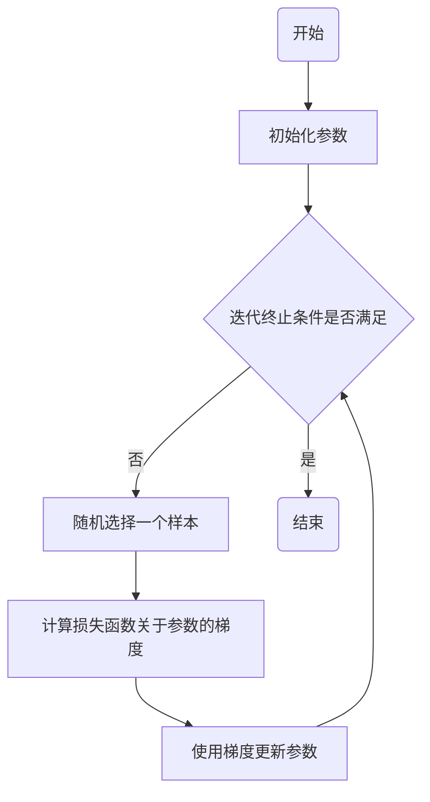

# 随机梯度下降SGD原理与代码实例讲解

## 1.背景介绍
### 1.1 机器学习中的优化问题
#### 1.1.1 损失函数的概念
#### 1.1.2 优化算法的必要性
#### 1.1.3 常见的优化算法

### 1.2 梯度下降算法
#### 1.2.1 梯度下降的基本原理
#### 1.2.2 批量梯度下降(BGD)
#### 1.2.3 随机梯度下降(SGD)的提出

## 2.核心概念与联系
### 2.1 随机梯度下降(SGD)
#### 2.1.1 SGD的定义
#### 2.1.2 SGD与BGD的区别
#### 2.1.3 SGD的优缺点

### 2.2 SGD的收敛性
#### 2.2.1 收敛性的重要性
#### 2.2.2 影响SGD收敛性的因素
#### 2.2.3 SGD收敛性的数学证明

### 2.3 SGD的变体
#### 2.3.1 Mini-batch SGD
#### 2.3.2 SGD with Momentum
#### 2.3.3 AdaGrad、RMSProp和Adam

## 3.核心算法原理具体操作步骤
### 3.1 SGD算法流程
#### 3.1.1 初始化参数
#### 3.1.2 迭代过程
#### 3.1.3 终止条件

### 3.2 学习率的选择
#### 3.2.1 学习率对SGD的影响
#### 3.2.2 学习率调整策略
#### 3.2.3 自适应学习率方法

### 3.3 Mini-batch大小的选择
#### 3.3.1 Mini-batch大小对SGD的影响
#### 3.3.2 Mini-batch大小的选择策略
#### 3.3.3 自适应Mini-batch大小方法

## 4.数学模型和公式详细讲解举例说明
### 4.1 SGD的数学表示
#### 4.1.1 目标函数与梯度
#### 4.1.2 参数更新公式
#### 4.1.3 收敛性分析

### 4.2 SGD with Momentum的数学表示
#### 4.2.1 动量的概念
#### 4.2.2 参数更新公式
#### 4.2.3 收敛性分析

### 4.3 AdaGrad的数学表示
#### 4.3.1 自适应学习率的概念
#### 4.3.2 参数更新公式
#### 4.3.3 收敛性分析

## 5.项目实践：代码实例和详细解释说明
### 5.1 使用SGD训练逻辑回归模型
#### 5.1.1 数据集准备
#### 5.1.2 模型定义
#### 5.1.3 使用SGD优化器训练模型
#### 5.1.4 模型评估

### 5.2 使用SGD训练神经网络模型
#### 5.2.1 数据集准备
#### 5.2.2 模型定义
#### 5.2.3 使用SGD优化器训练模型 
#### 5.2.4 模型评估

### 5.3 使用SGD with Momentum训练卷积神经网络模型
#### 5.3.1 数据集准备
#### 5.3.2 模型定义
#### 5.3.3 使用SGD with Momentum优化器训练模型
#### 5.3.4 模型评估

## 6.实际应用场景
### 6.1 图像分类
#### 6.1.1 数据集介绍
#### 6.1.2 模型选择
#### 6.1.3 使用SGD训练模型
#### 6.1.4 模型部署

### 6.2 自然语言处理
#### 6.2.1 数据集介绍  
#### 6.2.2 模型选择
#### 6.2.3 使用SGD训练模型
#### 6.2.4 模型部署

### 6.3 推荐系统
#### 6.3.1 数据集介绍
#### 6.3.2 模型选择 
#### 6.3.3 使用SGD训练模型
#### 6.3.4 模型部署

## 7.工具和资源推荐
### 7.1 深度学习框架
#### 7.1.1 TensorFlow
#### 7.1.2 PyTorch
#### 7.1.3 Keras

### 7.2 优化算法库
#### 7.2.1 scipy.optimize
#### 7.2.2 scikit-optimize
#### 7.2.3 Optuna

### 7.3 学习资源
#### 7.3.1 在线课程
#### 7.3.2 书籍推荐
#### 7.3.3 论文推荐

## 8.总结：未来发展趋势与挑战
### 8.1 SGD的局限性
#### 8.1.1 鞍点问题
#### 8.1.2 局部最优问题
#### 8.1.3 数据非独立同分布问题

### 8.2 SGD的改进方向  
#### 8.2.1 自适应学习率方法
#### 8.2.2 二阶优化方法
#### 8.2.3 分布式SGD

### 8.3 SGD在深度学习中的应用前景
#### 8.3.1 大规模数据训练
#### 8.3.2 在线学习
#### 8.3.3 强化学习

## 9.附录：常见问题与解答
### 9.1 SGD的参数如何调节?
### 9.2 SGD陷入局部最优怎么办?  
### 9.3 SGD的收敛速度慢怎么办?



## 1.背景介绍

随机梯度下降(Stochastic Gradient Descent, SGD)是机器学习和深度学习中最常用的优化算法之一。在大数据时代,面对海量数据和复杂模型,传统的批量梯度下降算法(Batch Gradient Descent, BGD)往往难以满足实际需求。SGD通过每次迭代只使用一个样本来计算梯度和更新参数,大大提高了优化效率,使得机器学习算法可以更好地应对大规模数据和模型的挑战。

### 1.1 机器学习中的优化问题

在机器学习中,我们通常需要找到一个模型,使其在给定的训练数据上的表现最优。这个过程可以看作是一个优化问题:找到一组最优的模型参数,使得模型在训练数据上的损失函数最小化。

损失函数衡量了模型的预测值与真实值之间的差距,是优化问题的目标函数。常见的损失函数包括均方误差(Mean Squared Error, MSE)、交叉熵(Cross Entropy)等。

优化算法则是用来寻找最优模型参数的工具。除了SGD,常见的优化算法还有BGD、共轭梯度法(Conjugate Gradient)、拟牛顿法(Quasi-Newton Methods)等。

### 1.2 梯度下降算法

梯度下降是一种简单而有效的优化算法,其基本思想是沿着目标函数梯度的反方向更新参数,直到达到局部最小值。

假设我们的目标是最小化损失函数$J(\theta)$,其中$\theta$表示模型参数。梯度下降算法的参数更新公式为:

$$
\theta = \theta - \alpha \nabla_\theta J(\theta)
$$

其中$\alpha$表示学习率(learning rate),控制每次更新的步长;$\nabla_\theta J(\theta)$表示$J(\theta)$关于$\theta$的梯度。

根据每次迭代时使用的样本数量,梯度下降算法可以分为BGD和SGD两种。BGD每次迭代使用整个训练集来计算梯度,更新参数:

$$
\theta = \theta - \alpha \frac{1}{N} \sum_{i=1}^N \nabla_\theta J(\theta; x^{(i)}, y^{(i)})
$$

其中$N$表示训练集样本数,$x^{(i)}, y^{(i)}$表示第$i$个样本的特征和标签。

BGD的优点是能够利用所有样本的信息,更新方向比较准确。但是当训练集很大时,每次迭代需要遍历所有样本,计算量非常大,导致收敛速度慢。

为了克服BGD的缺陷,SGD应运而生。与BGD不同,SGD每次迭代只随机选择一个样本来计算梯度,更新参数:

$$
\theta = \theta - \alpha \nabla_\theta J(\theta; x^{(i)}, y^{(i)})
$$

SGD通过减少每次迭代的计算量,大大提高了优化效率。尽管每次迭代得到的梯度是有噪声的,但是随着迭代次数的增加,SGD最终仍然能够收敛到最优解附近。

## 2.核心概念与联系

### 2.1 随机梯度下降(SGD) 

SGD的基本思想是,每次迭代随机均匀地从训练集中抽取一个样本,根据该样本计算梯度并更新参数。与BGD相比,SGD的主要优点是:
- 每次迭代的计算量大大减少,优化效率更高,尤其适合大规模数据和复杂模型的优化。
- 由于每次迭代使用的样本不同,SGD具有一定的随机性,有助于跳出局部最优,寻找更好的解。

但是,SGD也存在一些缺点:
- 每次迭代得到的梯度有噪声,准确性不如BGD。
- 对学习率、Mini-batch大小等超参数比较敏感,调参难度较大。
- 对非凸问题,可能收敛到局部最优而非全局最优。

### 2.2 SGD的收敛性

SGD能否收敛到最优解是一个重要的理论问题。影响SGD收敛性的主要因素包括:
- 目标函数的性质:对于凸函数,SGD能够以$O(1/\sqrt{T})$的速率收敛到全局最优;对于非凸函数,一般只能保证收敛到局部最优。
- 学习率的选择:学习率过大会导致振荡,过小会导致收敛速度慢。合适的学习率是收敛的必要条件。
- 训练集的性质:如果训练集中的样本不是独立同分布的,SGD的收敛性可能会受到影响。

在一定条件下,可以证明SGD的收敛性。例如,对于凸函数$J(\theta)$,如果学习率满足$\sum_{t=1}^\infty \alpha_t = \infty$和$\sum_{t=1}^\infty \alpha_t^2 < \infty$,那么SGD产生的参数序列$\{\theta_t\}$满足:

$$
\lim_{t \to \infty} J(\theta_t) = J(\theta^*)
$$

其中$\theta^*$表示$J(\theta)$的最小值点。这个结果说明,只要学习率选择得当,SGD就能够收敛到全局最优。

### 2.3 SGD的变体

为了进一步提高SGD的性能,研究者提出了许多SGD的变体,主要包括:
- Mini-batch SGD:每次迭代使用一个Mini-batch的样本,在SGD和BGD之间取得平衡,兼顾效率和准确性。
- SGD with Momentum:引入动量项,利用历史梯度信息,加速SGD的收敛。
- AdaGrad:自适应地调整每个参数的学习率,使得更新幅度与梯度历史相关。
- RMSProp:基于指数加权移动平均的自适应学习率方法。
- Adam:结合了Momentum和RMSProp的优点,是目前最流行的SGD变体之一。

这些变体在保持SGD高效性的同时,从不同角度改进了SGD,使其能够更好地应对实际问题。

## 3.核心算法原理与具体操作步骤

SGD的核心算法可以用下面的伪代码来描述:

```
初始化参数θ
for t = 1, 2, ..., T:
    从训练集中随机均匀地抽取一个样本(x, y)
    计算损失函数关于参数的梯度:g = ∇J(θ; x, y)
    更新参数:θ = θ - α * g
```

其中T表示迭代次数,α表示学习率。

具体实现SGD需要注意以下几个关键步骤:

### 3.1 SGD算法流程

#### 3.1.1 初始化参数
在开始迭代之前,需要对模型参数进行初始化。常见的初始化方法有:
- 全零初始化:将所有参数初始化为0。
- 随机初始化: