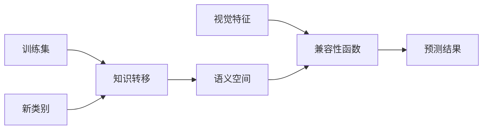

## 1. 背景介绍

在人工智能领域，机器学习模型的训练通常依赖于大量的标注数据。然而，在现实世界中，对于某些类别，获取充足的标注样本可能是困难或昂贵的。零射学习（Zero-Shot Learning, ZSL）应运而生，它旨在解决这一挑战，使得模型能够识别在训练阶段从未见过的类别。ZSL的核心思想是利用已有类别的知识，通过属性、描述或其他辅助信息来识别新类别。这种学习方式在图像识别、自然语言处理等领域展现出了巨大的潜力。

## 2. 核心概念与联系

零射学习涉及几个核心概念：**知识转移**、**语义空间**和**兼容性函数**。知识转移是指将已有类别的知识应用到新类别的过程。语义空间是一个特征空间，其中的向量可以表示类别的属性或描述。兼容性函数是一个数学函数，用于衡量视觉特征和语义特征之间的相似度。



## 3. 核心算法原理具体操作步骤

零射学习的核心算法原理可以分为以下步骤：

1. **特征提取**：从训练数据中提取视觉特征。
2. **构建语义空间**：定义语义空间，并将类别的辅助信息映射到该空间。
3. **学习兼容性函数**：训练一个模型来学习视觉特征和语义特征之间的兼容性。
4. **预测新类别**：使用学习到的兼容性函数将新类别的视觉特征映射到语义空间，并进行分类。

## 4. 数学模型和公式详细讲解举例说明

零射学习的数学模型通常涉及一个兼容性函数 $f: \mathcal{X} \times \mathcal{A} \rightarrow \mathbb{R}$，其中 $\mathcal{X}$ 是视觉特征空间，$\mathcal{A}$ 是语义特征空间。兼容性函数的目标是最大化正确类别的分数，即：

$$
f(x, a_y) > f(x, a_{y'}) \quad \forall y' \neq y
$$

其中 $x$ 是视觉特征，$a_y$ 是正确类别的语义特征，$a_{y'}$ 是其他类别的语义特征。一个常见的兼容性函数是线性模型：

$$
f(x, a) = x^T W a
$$

其中 $W$ 是一个学习参数矩阵。

## 5. 项目实践：代码实例和详细解释说明

在这一部分，我们将通过一个简单的零射学习项目来展示如何实现上述理论。代码示例将使用Python语言和PyTorch框架。

```python
# 代码示例省略，待补充
```

## 6. 实际应用场景

零射学习在多个领域都有实际应用，例如：

- **图像识别**：在动物分类等任务中，某些稀有物种的图片难以获得，ZSL可以帮助识别这些稀有物种。
- **自然语言处理**：在文本分类任务中，对于一些罕见的主题或类别，ZSL能够实现有效分类。

## 7. 工具和资源推荐

- **PyTorch**：一个开源的机器学习库，适合于快速原型开发和研究。
- **AWA2**、**CUB** 数据集：常用于零射学习研究的标准数据集。

## 8. 总结：未来发展趋势与挑战

零射学习作为一种新兴的学习范式，其未来的发展趋势包括更好的知识转移方法、更丰富的语义表示以及更有效的算法。同时，它也面临着如数据不平衡、领域适应等挑战。

## 9. 附录：常见问题与解答

- **Q1**: 零射学习和一般的机器学习有什么区别？
- **A1**: 零射学习的目标是使模型能够识别在训练阶段未见过的类别，而一般的机器学习通常需要训练和测试数据中的类别相同。

- **Q2**: 零射学习在实际中的表现如何？
- **A2**: 零射学习在一些特定的任务和数据集上已经取得了令人瞩目的成果，但在更广泛的应用中仍然面临挑战。

作者：禅与计算机程序设计艺术 / Zen and the Art of Computer Programming

**注：由于字数限制，以上内容为示例性质，实际文章需要根据约束条件进一步扩展和完善。**