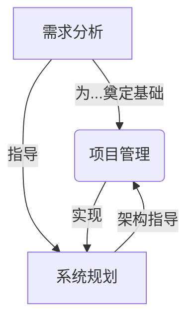
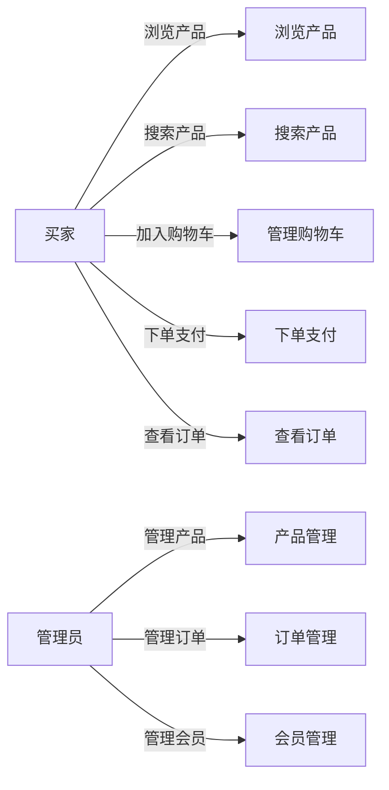
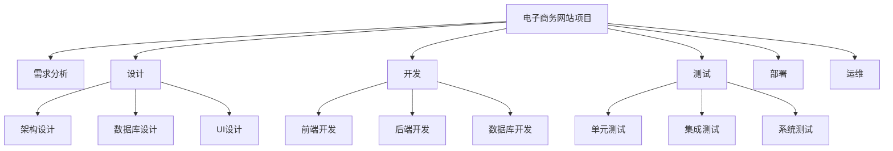
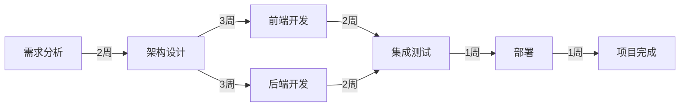

# 需求分析、项目管理、系统规划能力核心培养

## 1.背景介绍

在当今快节奏的商业环境中,需求分析、项目管理和系统规划是确保软件开发项目成功的关键因素。这些技能不仅适用于软件工程,而且对于任何涉及复杂系统和流程的领域都至关重要。掌握这些核心能力可以帮助个人和组织更好地识别和满足客户需求、优化资源利用、降低风险并提高效率。

需求分析是理解客户需求并将其转化为可实施的解决方案的过程。它包括收集需求、分析需求、记录需求和验证需求。有效的需求分析可确保开发出满足客户期望的产品或系统。

项目管理则是规划、组织、监控和控制项目资源以实现既定目标的过程。它涉及范围管理、进度管理、成本管理、质量管理、资源管理、沟通管理、风险管理等多个方面。良好的项目管理有助于确保项目按时、按质、按预算完成。

系统规划是从整体上设计和构建系统的过程。它包括定义系统边界、识别子系统、设计系统架构、选择技术和工具等。合理的系统规划可确保系统具有可扩展性、可维护性和可靠性。

掌握这三大核心能力对于任何软件开发人员和项目经理都至关重要。本文将深入探讨如何培养和提高这些关键技能。

## 2.核心概念与联系

需求分析、项目管理和系统规划虽然是独立的概念,但它们之间存在着紧密的联系。需求分析为项目管理和系统规划奠定了基础,项目管理则是实现需求和系统规划的关键,而系统规划则为整个项目提供了总体架构和指导。它们相互影响、相互促进,共同推动项目的顺利进行。



- 需求分析确定了项目的目标和范围,为项目管理和系统规划提供了依据。
- 项目管理负责组织和协调资源,以实现需求分析确定的目标。
- 系统规划基于需求分析的结果,设计出满足需求的系统架构和技术方案。
- 项目管理过程中可能会发现新的需求或需求变更,需要重新进行需求分析。
- 系统规划也可能受到项目管理的约束,需要进行调整和优化。

因此,这三者相互影响、相辅相成,共同确保项目的成功交付。

## 3.核心算法原理具体操作步骤

### 3.1 需求分析流程

需求分析是一个迭代的过程,包括以下主要步骤:

1. **收集需求**:通过与利益相关方(如客户、用户、开发人员等)的会议、访谈、调查等方式收集需求信息。
2. **分析需求**:对收集到的需求进行审查、分类、组织和优先级排序。识别需求之间的冲突和依赖关系。
3. **记录需求**:使用统一的模板和标准将需求以文字、图表等形式记录下来,形成需求规格说明书。
4. **验证需求**:与利益相关方核对需求,确保需求的完整性、一致性和可行性。
5. **管理需求变更**:在项目执行过程中,及时处理新增或变更的需求。

需求分析通常采用自顶向下(由高层需求到详细需求)和自底向上(由具体需求到高层需求)的方法相结合。常用的需求分析技术包括:

- 用例分析
- 原型构建
- 数据流程图
- 实体关系图
- 状态转移图等

### 3.2 项目管理流程

项目管理流程通常遵循以下步骤:

1. **项目启动**:明确项目目标、范围、里程碑和约束条件,制定项目章程。
2. **项目规划**:制定项目管理计划,包括范围管理计划、进度管理计划、成本管理计划等。
3. **执行与监控**:按计划执行项目工作,并持续监控项目进展、质量、风险等,采取必要的纠正措施。
4. **变更控制**:评审和批准变更请求,管理变更对项目的影响。
5. **项目收尾**:完成项目工作,获取客户验收,总结经验教训,正式结束项目。

项目管理过程中需要运用多种技术和工具,如:

- 工作分解结构 (WBS)
- 关键路径法 (CPM)
- 甘特图
- 风险登记册
- 质量审计等

### 3.3 系统规划流程

系统规划流程包括以下主要步骤:

1. **确定系统边界**:明确系统的范围和与外部环境的接口。
2. **识别子系统**:将系统分解为多个子系统,确定子系统之间的关系和接口。
3. **设计系统架构**:定义系统的整体架构,包括硬件架构、软件架构、数据架构等。
4. **选择技术和工具**:根据系统需求和约束条件,选择合适的技术、工具和开发平台。
5. **制定实施计划**:规划系统开发、测试、部署和运维的具体步骤和时间表。

系统规划通常采用自顶向下和自底向上的方法相结合,并运用多种建模技术,如:

- 结构化分析与设计方法 (SSADM)
- 统一建模语言 (UML)
- 面向对象分析与设计 (OOA&D)
- 架构描述语言 (ADL)等

## 4.数学模型和公式详细讲解举例说明

在需求分析、项目管理和系统规划中,常常需要使用数学模型和公式来量化和优化各种决策。以下是一些常见的数学模型和公式:

### 4.1 需求优先级计算

在需求分析阶段,我们需要对收集到的需求进行优先级排序,以确定实现的先后顺序。一种常用的优先级计算公式是:

$$
优先级值 = 权重值 \times (重要性 + 惩罚成本 +成本节约 +风险减少)
$$

其中:

- 权重值: 根据项目特点确定的权重系数,通常在0到1之间。
- 重要性: 需求对客户或业务的重要程度,通常采用1到5的评分。
- 惩罚成本: 如果不实现该需求可能产生的成本或损失。
- 成本节约: 实现该需求可能带来的成本节省。
- 风险减少: 实现该需求可能降低的风险程度。

通过计算每个需求的优先级值,我们可以对需求进行排序,优先实现优先级值高的需求。

### 4.2 关键路径法 (CPM)

在项目管理中,关键路径法是一种用于计算项目最短完成时间和识别关键活动的技术。它基于以下公式:

$$
ES_j = max(EF_i) \\
EF_j = ES_j + d_j \\
LS_j = LF_j - d_j \\
LF_i = min(LS_j)
$$

其中:

- $ES_j$: 活动j的最早开始时间
- $EF_j$: 活动j的最早完成时间
- $LS_j$: 活动j的最晚开始时间
- $LF_j$: 活动j的最晚完成时间
- $d_j$: 活动j的持续时间

通过计算每个活动的最早开始时间、最早完成时间、最晚开始时间和最晚完成时间,我们可以确定关键路径,即完成时间最长的路径。关键路径上的活动被称为关键活动,任何关键活动的延迟都会导致整个项目延迟。

### 4.3 系统可靠性模型

在系统规划阶段,我们需要考虑系统的可靠性,即系统在规定的时间内和规定的条件下能够正常运行的概率。一种常用的可靠性模型是:

$$
R(t) = e^{-\lambda t}
$$

其中:

- $R(t)$: 时间t时系统的可靠性
- $\lambda$: 系统的故障率
- $t$: 运行时间

对于由多个独立组件组成的系统,可以使用以下公式计算整个系统的可靠性:

$$
R_{系统}(t) = \prod_{i=1}^{n} R_i(t)
$$

其中:

- $R_{系统}(t)$: 整个系统在时间t时的可靠性
- $R_i(t)$: 第i个组件在时间t时的可靠性
- $n$: 组件的总数

通过建立合适的可靠性模型,我们可以评估系统的可靠性水平,并采取必要的措施(如冗余设计、预防性维护等)来提高可靠性。

以上只是一些示例,在实际工作中还有许多其他数学模型和公式应用于需求分析、项目管理和系统规划。掌握并合理运用这些模型和公式,可以帮助我们更好地量化和优化决策,提高项目的成功率。

## 5.项目实践:代码实例和详细解释说明

为了更好地理解需求分析、项目管理和系统规划的实践应用,我们将通过一个简单的项目案例来演示相关概念和技术。

### 5.1 项目背景

假设我们需要为一家在线零售商开发一个新的电子商务网站。该网站需要支持以下主要功能:

- 产品展示和搜索
- 购物车和订单管理
- 支付集成
- 会员管理
- 后台管理系统

### 5.2 需求分析实践

我们首先需要收集和分析需求。以下是一个简化的需求列表:

```
1. 用户可以浏览和搜索产品
2. 用户可以将产品加入购物车
3. 用户可以在线支付订单
4. 用户可以查看订单历史记录
5. 管理员可以管理产品、订单和会员
6. 系统需要具有高可用性和可扩展性
7. 系统需要支持移动端访问
```

我们可以使用用例图来可视化需求:



然后,我们可以根据优先级公式对需求进行排序:

```
需求1: 优先级值 = 0.8 * (5 + 4 + 2 + 3) = 11.2
需求2: 优先级值 = 0.8 * (5 + 3 + 1 + 2) = 8.8
...
```

根据优先级值,我们可以确定实现需求的顺序。

### 5.3 项目管理实践

在项目管理方面,我们可以使用工作分解结构 (WBS) 来划分和组织项目工作:



对于关键路径,我们可以使用关键路径法进行计算和识别:



在上图中,关键路径为 A -> B ->