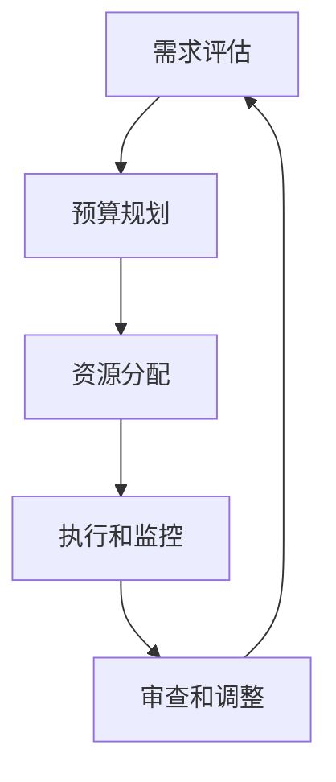

# 预算管理：制定并管理IT预算，确保资源得到高效分配，使IT投资为公司带来价值

## 1.背景介绍

在当今快节奏的商业环境中，信息技术(IT)已经成为推动企业发展和保持竞争优势的关键力量。有效的IT投资和资源管理对于实现业务目标至关重要。然而,制定和管理IT预算却是一项具有挑战性的任务,需要平衡多方利益相关者的需求、评估技术趋势并做出明智的决策。

本文将探讨IT预算管理的重要性、挑战和最佳实践。我们将介绍如何制定符合企业战略的IT预算,如何优化资源分配,并通过持续监控和调整确保IT投资为公司创造价值。无论您是IT领导者、财务经理还是业务决策者,本文都将为您提供宝贵的见解和实用技巧,帮助您更好地管理IT预算。

### 1.1 IT预算管理的重要性

适当的IT预算管理对于确保企业的持续发展至关重要。它可以:

1. **支持业务战略** - 通过将IT投资与企业目标保持一致,确保技术投资为业务增值。
2. **优化资源利用** - 通过审慎分配资金,最大化IT投资回报,避免浪费。
3. **控制成本** - 通过预测和管理IT支出,控制总体IT成本。
4. **降低风险** - 通过评估和缓解与技术相关的风险,保护企业免受财务和运营影响。
5. **提高敏捷性** - 通过保留一定的灵活性,快速响应新的业务需求和技术变革。

### 1.2 IT预算管理的挑战

尽管重要,但IT预算管理也面临着许多挑战:

1. **技术复杂性** - 快速变化的技术环境使得预测未来需求和成本变得困难。
2. **利益相关者需求** - 需要权衡不同部门和个人的需求和优先级。
3. **成本不确定性** - 硬件、软件和服务的价格可能会发生变化。
4. **资源限制** - 必须在有限的财务和人力资源下做出决策。
5. **监控和报告** - 跟踪实际支出与预算的差异,并及时调整。

为了克服这些挑战,需要采用系统化的方法和最佳实践来管理IT预算。

## 2.核心概念与联系

### 2.1 IT预算管理流程

IT预算管理是一个循环过程,包括以下关键步骤:

1. **需求评估** - 收集和评估来自各部门的IT需求,确定优先级。
2. **预算规划** - 根据企业战略目标和可用资金制定IT预算计划。
3. **资源分配** - 将预算资金分配给不同的IT项目和运营支出。
4. **执行和监控** - 实施IT项目,跟踪实际支出与预算的偏差。
5. **审查和调整** - 定期审查预算执行情况,并根据需要进行调整。

### 2.2 IT预算类型

IT预算通常可分为以下几种类型:

1. **资本支出(CapEx)** - 用于购买长期资产,如硬件、软件和基础设施。
2. **运营支出(OpEx)** - 用于日常IT运营,如人力成本、维护和外包服务。
3. **项目支出** - 用于实施新的IT项目,如系统升级或新应用程序开发。
4. **备用支出** - 用于应对意外情况或新出现的需求。

根据企业的具体需求,IT预算可能会侧重于某些特定类型的支出。

### 2.3 IT投资回报率(ROI)

在制定IT预算时,评估每项投资的潜在回报率(ROI)至关重要。ROI可以从多个角度来衡量,包括:

1. **财务回报** - 通过降低成本或增加收入带来的直接经济利益。
2. **运营效率** - 提高生产力、加快流程或优化资源利用。
3. **竞争优势** - 通过技术创新获得市场领先地位。
4. **风险缓解** - 降低潜在的安全、合规或业务中断风险。
5. **员工满意度** - 提供更好的工具和环境,提高员工参与度和留存率。

通过全面评估ROI,企业可以确保IT投资与业务目标保持一致,并产生实际价值。

## 3.核心算法原理具体操作步骤

### 3.1 需求评估

需求评估是IT预算管理流程的第一步,也是确保预算与业务需求保持一致的关键。以下是需求评估的核心步骤:

1. **收集需求** - 从各个部门和利益相关者那里收集IT需求,包括新项目、系统升级、硬件更新等。
2. **分类和优先排序** -根据与业务目标的关联程度、潜在ROI和风险水平,对需求进行分类和优先排序。
3. **成本估算** - 为每个需求估算相关的资本支出和运营支出成本。
4. **风险评估** - 识别并评估与每个需求相关的潜在风险,如技术风险、供应商风险和合规风险。
5. **利益相关者参与** -与关键利益相关者(如业务领导、财务团队和IT团队)协商,确保需求评估过程中的透明度和参与度。

需求评估的结果将为后续的预算规划和资源分配奠定基础。

### 3.2 预算规划

在完成需求评估后,下一步是制定详细的IT预算计划。以下是预算规划的核心步骤:

1. **确定预算限额** - 根据企业的整体财务状况和战略目标,确定IT预算的总体限额。
2. **制定预算策略** -根据企业的优先事项和风险偏好,制定IT预算的总体策略,如侧重于创新还是维护现状。
3. **资金分配** -根据需求评估的结果和预算策略,将预算资金分配给不同的IT需求和支出类别。
4. **场景规划** -制定不同的预算场景,如最佳情况、最坏情况和最可能情况,以应对不确定性。
5. **利益相关者审批** -与高层管理人员和关键利益相关者协商,获得对最终预算计划的批准。

预算规划需要权衡各种因素,如业务需求、技术趋势、财务约束和风险管理。制定出一个符合企业战略的、可执行的IT预算计划是关键。

### 3.3 资源分配

在制定了IT预算计划后,下一步是将资金分配给具体的IT项目和支出。以下是资源分配的核心步骤:

1. **项目优先排序** -根据与业务目标的关联程度、潜在ROI和风险水平,对IT项目进行优先排序。
2. **资金分配** -根据项目优先级和预算限额,为每个项目分配适当的资金。
3. **供应商选择** -对于外包项目或采购,选择合适的供应商并协商合同条款。
4. **人力资源规划** -评估项目所需的人力资源,并制定相应的招聘或培训计划。
5. **时间表制定** -为每个项目制定详细的时间表,包括里程碑和关键任务。

资源分配需要平衡多个因素,如项目优先级、成本效益、风险水平和资源约束。合理分配资源可确保IT投资得到高效利用,为企业创造最大价值。

### 3.4 执行和监控

在资源分配完成后,下一步是执行IT项目并监控预算执行情况。以下是执行和监控的核心步骤:

1. **项目实施** -根据制定的时间表和计划,执行各个IT项目。
2. **支出跟踪** -持续跟踪实际支出与预算的偏差,包括资本支出和运营支出。
3. **绩效监控** -监控项目进度和交付成果,确保符合预期目标。
4. **风险缓解** -识别并缓解项目执行过程中出现的任何潜在风险。
5. **定期报告** -向利益相关者定期报告预算执行情况和项目进展。

执行和监控阶段需要密切关注预算执行情况,及时发现并解决任何偏差或问题。这有助于确保IT投资按计划进行,并最终实现预期的ROI。

### 3.5 审查和调整

IT预算管理是一个持续的过程,需要定期审查和调整。以下是审查和调整的核心步骤:

1. **绩效评估** -评估IT投资的整体绩效,包括实现的ROI、对业务目标的贡献以及任何未解决的问题或风险。
2. **差异分析** -分析实际支出与预算的差异,确定导致偏差的原因。
3. **预算调整** -根据绩效评估和差异分析的结果,对预算进行必要的调整,如重新分配资金或修改支出计划。
4. **流程改进** -识别IT预算管理流程中的任何缺陷或改进机会,并实施相应的变更。
5. **利益相关者沟通** -与关键利益相关者沟通审查结果和调整计划,获取反馈并达成共识。

定期审查和调整有助于确保IT预算与不断变化的业务需求和技术环境保持一致,并提高整体投资回报率。

## 4.数学模型和公式详细讲解举例说明

在IT预算管理中,数学模型和公式可以帮助我们更准确地预测成本、评估投资回报率(ROI)并优化资源分配。以下是一些常用的数学模型和公式:

### 4.1 总拥有成本(TCO)模型

总拥有成本(TCO)模型用于估算IT资产在整个生命周期内的总体成本。TCO包括初始购买成本、运营成本、维护成本和最终处置成本。

TCO公式如下:

$$TCO = C_p + \sum_{t=1}^{n} \frac{C_o + C_m}{(1+r)^t} + C_d$$

其中:

- $C_p$ 是初始购买成本
- $C_o$ 是年度运营成本
- $C_m$ 是年度维护成本
- $n$ 是资产使用年限
- $r$ 是折现率
- $C_d$ 是处置成本

通过计算TCO,企业可以更准确地预测IT资产的长期成本,并在采购决策时权衡不同选择的成本效益。

例如,假设一家公司正在考虑购买一套新的服务器系统,初始购买成本为\$100,000。预计每年的运营成本为\$20,000,维护成本为\$15,000。假设系统使用年限为5年,折现率为8%,处置成本为\$5,000。

根据TCO公式,我们可以计算出该服务器系统的总拥有成本:

$$TCO = 100,000 + \sum_{t=1}^{5} \frac{20,000 + 15,000}{(1+0.08)^t} + 5,000 = \$239,926$$

通过计算TCO,公司可以更全面地评估该投资的长期成本,并与其他选择进行比较。

### 4.2 投资回报率(ROI)模型

投资回报率(ROI)模型用于评估IT投资的潜在回报。ROI通常以百分比表示,反映了投资收益与成本之间的比率。

ROI公式如下:

$$ROI = \frac{投资收益 - 投资成本}{投资成本} \times 100\%$$

投资收益可以是直接的财务收益(如降低成本或增加收入),也可以是间接的收益(如提高效率或降低风险)。投资成本包括初始投资和持续的运营成本。

例如,假设一家公司投资\$500,000实施一个新的客户关系管理(CRM)系统。预计该系统每年可以节省\$150,000的运营成本,并带来\$200,000的额外收入。假设系统使用年限为5年,每年的运营成本为\$50,000。

在这种情况下,投资收益为:

$$投资收益 = (150,000 + 200,000) \times 5 = \$1,750,000$$

投资成本为:

$$投资成本 = 500,000 + 50,000 \times 5 = \$750,000$$

因此,该CRM系统投资