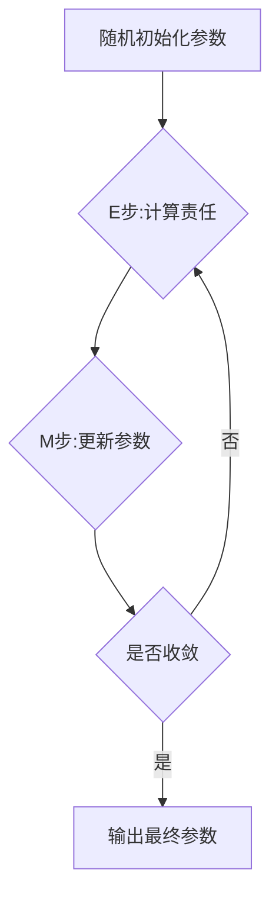

# 高斯混合模型(GMM)原理与代码实战案例讲解

## 1. 背景介绍
### 1.1 高斯混合模型的起源与发展
高斯混合模型(Gaussian Mixture Model, GMM)是一种常用的概率密度估计方法,属于有限混合模型的一种。它最早由Karl Pearson在1894年提出,后经过不断发展和完善,在20世纪后半叶得到广泛应用。GMM作为一种非参数密度估计方法,具有理论基础扎实、模型灵活、计算高效等优点,在模式识别、机器学习等领域有着广泛的应用。

### 1.2 高斯混合模型的应用领域
GMM在许多领域都有重要应用,主要包括:  
- 语音识别:利用GMM对语音信号的频谱特征进行建模,实现说话人识别、情感识别等任务。
- 图像处理:用GMM对图像像素分布建模,进行图像分割、目标检测、背景建模等。
- 生物信息学:使用GMM对基因数据进行聚类分析,研究基因表达模式。  
- 金融工程:用GMM对金融时间序列建模,进行风险度量、投资组合优化等。
- 异常检测:利用GMM学习正常数据的分布,从而检测异常情况。

### 1.3 本文的主要内容
本文将重点介绍高斯混合模型的基本原理,包括GMM的定义、参数估计的EM算法等。同时,通过Python代码实战案例,讲解GMM的具体实现过程。最后,探讨GMM的一些改进方向和研究前沿。

## 2. 核心概念与联系
### 2.1 高斯分布
高斯分布(正态分布)是一种常见的连续概率分布,概率密度函数为:

$$
N(x|\mu,\sigma^2) = \frac{1}{\sqrt{2\pi}\sigma}\exp\left(-\frac{(x-\mu)^2}{2\sigma^2}\right)
$$

其中,$\mu$为均值,$\sigma^2$为方差。高斯分布具有独立性和可加性,是许多实际问题的理想数学模型。

### 2.2 高斯混合模型的定义
高斯混合模型是一种概率模型,它认为观测数据由 $K$ 个高斯分布混合而成。假设观测数据为 $\mathbf{X}=\{\mathbf{x}_1,\mathbf{x}_2,\cdots,\mathbf{x}_N\}$,则GMM可表示为:

$$
p(\mathbf{x}) = \sum_{k=1}^K \pi_k \cdot N(\mathbf{x}|\boldsymbol{\mu}_k,\boldsymbol{\Sigma}_k)
$$

其中,$\pi_k$为第$k$个分量的权重(满足$\sum_{k=1}^K \pi_k=1$),$\boldsymbol{\mu}_k$和$\boldsymbol{\Sigma}_k$分别为第$k$个分量的均值向量和协方差矩阵。

### 2.3 EM算法
EM(Expectation-Maximization)算法是一种通过迭代方式估计GMM参数的方法。EM算法分为两步:

1. E步:根据当前参数计算每个样本属于每个分量的后验概率(责任)。
2. M步:根据当前责任重新估计每个分量的参数。

通过不断迭代E步和M步,使GMM在给定数据下的似然度不断增大,直到收敛。

### 2.4 概念联系图
下图展示了高斯分布、高斯混合模型、EM算法三者之间的关系:


## 3. 核心算法原理具体操作步骤
### 3.1 GMM的生成过程
假设生成一个$D$维样本$\mathbf{x}$的步骤如下:

1. 以$\boldsymbol{\pi}=\{\pi_1,\pi_2,\cdots,\pi_K\}$为概率,选择一个高斯分量$k$。
2. 从第$k$个高斯分量$N(\boldsymbol{\mu}_k,\boldsymbol{\Sigma}_k)$中采样生成$\mathbf{x}$。

### 3.2 EM算法估计GMM参数
给定观测数据$\mathbf{X}=\{\mathbf{x}_1,\mathbf{x}_2,\cdots,\mathbf{x}_N\}$,EM算法估计GMM参数$\boldsymbol{\theta}=\{\pi_k,\boldsymbol{\mu}_k,\boldsymbol{\Sigma}_k\}_{k=1}^K$的步骤如下:

1. 随机初始化模型参数$\boldsymbol{\theta}$。
2. E步:计算每个样本属于每个分量的后验概率(责任)
$$
\gamma_{nk} = \frac{\pi_k \cdot N(\mathbf{x}_n|\boldsymbol{\mu}_k,\boldsymbol{\Sigma}_k)}{\sum_{j=1}^K \pi_j \cdot N(\mathbf{x}_n|\boldsymbol{\mu}_j,\boldsymbol{\Sigma}_j)}
$$
3. M步:根据责任重新估计参数
$$
\begin{aligned}
\pi_k &= \frac{N_k}{N} \\
\boldsymbol{\mu}_k &= \frac{1}{N_k}\sum_{n=1}^N \gamma_{nk}\mathbf{x}_n \\
\boldsymbol{\Sigma}_k &= \frac{1}{N_k}\sum_{n=1}^N \gamma_{nk}(\mathbf{x}_n-\boldsymbol{\mu}_k)(\mathbf{x}_n-\boldsymbol{\mu}_k)^T
\end{aligned}
$$
其中,$N_k=\sum_{n=1}^N \gamma_{nk}$。

4. 重复步骤2和3,直到似然度收敛或达到最大迭代次数。

### 3.3 算法流程图
EM算法估计GMM参数的流程如下图所示:



## 4. 数学模型和公式详细讲解举例说明
### 4.1 高斯混合模型的概率密度函数
对于$D$维观测数据$\mathbf{x}$,高斯混合模型的概率密度函数为:

$$
p(\mathbf{x}|\boldsymbol{\theta}) = \sum_{k=1}^K \pi_k \cdot N(\mathbf{x}|\boldsymbol{\mu}_k,\boldsymbol{\Sigma}_k)
$$

其中,$\boldsymbol{\theta}=\{\pi_k,\boldsymbol{\mu}_k,\boldsymbol{\Sigma}_k\}_{k=1}^K$为GMM的参数。$\pi_k$为第$k$个分量的权重,满足$\sum_{k=1}^K \pi_k=1$。$N(\mathbf{x}|\boldsymbol{\mu}_k,\boldsymbol{\Sigma}_k)$为第$k$个高斯分量的概率密度函数:

$$
N(\mathbf{x}|\boldsymbol{\mu}_k,\boldsymbol{\Sigma}_k) = \frac{1}{(2\pi)^{D/2}|\boldsymbol{\Sigma}_k|^{1/2}}\exp\left(-\frac{1}{2}(\mathbf{x}-\boldsymbol{\mu}_k)^T\boldsymbol{\Sigma}_k^{-1}(\mathbf{x}-\boldsymbol{\mu}_k)\right)
$$

### 4.2 EM算法的推导
EM算法的目标是最大化GMM在观测数据$\mathbf{X}=\{\mathbf{x}_1,\mathbf{x}_2,\cdots,\mathbf{x}_N\}$下的对数似然函数:

$$
\ln p(\mathbf{X}|\boldsymbol{\theta}) = \sum_{n=1}^N \ln \left(\sum_{k=1}^K \pi_k \cdot N(\mathbf{x}_n|\boldsymbol{\mu}_k,\boldsymbol{\Sigma}_k)\right)
$$

引入隐变量$\mathbf{Z}=\{z_{nk}\}$,其中$z_{nk}$表示样本$\mathbf{x}_n$是否由第$k$个分量生成。EM算法通过迭代优化下界来间接优化对数似然函数:

1. E步:计算当前参数下隐变量的后验分布
$$
\gamma_{nk} = p(z_{nk}=1|\mathbf{x}_n,\boldsymbol{\theta}) = \frac{\pi_k \cdot N(\mathbf{x}_n|\boldsymbol{\mu}_k,\boldsymbol{\Sigma}_k)}{\sum_{j=1}^K \pi_j \cdot N(\mathbf{x}_n|\boldsymbol{\mu}_j,\boldsymbol{\Sigma}_j)}
$$
2. M步:最大化下界函数
$$
\begin{aligned}
\pi_k &= \frac{1}{N}\sum_{n=1}^N \gamma_{nk} \\
\boldsymbol{\mu}_k &= \frac{\sum_{n=1}^N \gamma_{nk}\mathbf{x}_n}{\sum_{n=1}^N \gamma_{nk}} \\
\boldsymbol{\Sigma}_k &= \frac{\sum_{n=1}^N \gamma_{nk}(\mathbf{x}_n-\boldsymbol{\mu}_k)(\mathbf{x}_n-\boldsymbol{\mu}_k)^T}{\sum_{n=1}^N \gamma_{nk}}
\end{aligned}
$$

通过不断迭代E步和M步,使得似然函数单调递增,直到收敛到局部最优解。

### 4.3 数值例子
考虑一个二维数据集$\mathbf{X}=\{x_1,x_2,\cdots,x_6\}$,其中
$$
\begin{aligned}
&x_1=(1,2)^T, \quad x_2=(2,1)^T, \quad x_3=(3,3)^T \\
&x_4=(7,8)^T, \quad x_5=(8,7)^T, \quad x_6=(9,9)^T
\end{aligned}
$$
假设用两个高斯分量($K=2$)来拟合该数据集。随机初始化参数为:
$$
\boldsymbol{\pi}=(0.5,0.5), \quad 
\boldsymbol{\mu}_1 = (1,1)^T, \quad
\boldsymbol{\mu}_2 = (8,8)^T, \quad
\boldsymbol{\Sigma}_1 = \boldsymbol{\Sigma}_2 = \mathbf{I}
$$
经过若干次迭代后,EM算法得到的参数估计为:
$$
\begin{aligned}
\boldsymbol{\pi} &= (0.49,0.51) \\
\boldsymbol{\mu}_1 &= (2.0,2.0)^T, \quad
\boldsymbol{\mu}_2 = (8.0,8.0)^T \\
\boldsymbol{\Sigma}_1 &= 
\begin{pmatrix}
1.0 & 0.5 \\
0.5 & 1.0
\end{pmatrix}, \quad
\boldsymbol{\Sigma}_2 = 
\begin{pmatrix}
1.0 & 1.0 \\
1.0 & 1.0
\end{pmatrix}
\end{aligned}
$$
可以看出,GMM很好地拟合了数据集的两个聚类结构。

## 5. 项目实践:代码实例和详细解释说明
下面用Python和Numpy库来实现高斯混合模型和EM算法。

```python
import numpy as np

class GMM:
    def __init__(self, K, max_iter=100):
        self.K = K  # 高斯分量数
        self.max_iter = max_iter  # 最大迭代次数
        
    def fit(self, X):
        N, D = X.shape
        
        # 随机初始化参数
        self.pi = np.ones(self.K) / self.K
        self.mu = X[np.random.choice(N, self.K, replace=False)]
        self.sigma = np.array([np.eye(D)] * self.K)
        
        for _ in range(self.max_iter):
            # E步:计算责任
            gamma = self._e_step(X)
            
            # M步:更新参数
            self._m_step(X, gamma)
            
    def _e_step(self, X):
        N = X.shape[0]
        pdfs = np.zeros((N, self.K))
        
        for k in range(self.K):
            pdfs[:,k] = self._gaussian_pdf(X, self.mu[k], self.sigma[k])
        
        gamma = self.pi * pdfs
        gamma /= gamma.sum(axis=1, keepdims=True)
        
        return gamma
        
    def _m_step(self, X, gamma):
        N = X.shape[0]
        
        # 更新权重
        self.pi = gamma.sum(axis=0) / N
        
        # 更新均值
        self.mu = np.dot(gamma.T, X) / gamma.sum(axis=0, keepdims=True).T
        
        # 更新协方差