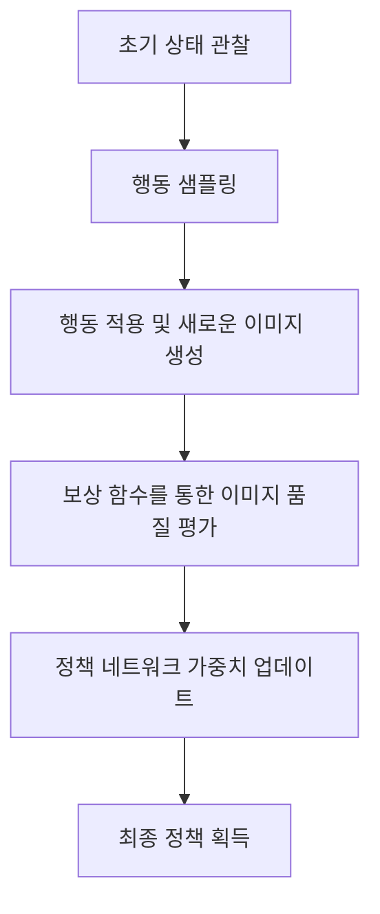

# 강화학습을 이용한 이미지 스타일 전송

## 1. 배경 소개

최근 몇 년 동안 딥러닝 기술이 발전함에 따라 이미지 생성 및 스타일 전송 분야에서 괄목할 만한 성과가 있었습니다. 이미지 스타일 전송은 하나의 콘텐츠 이미지와 스타일 이미지를 입력으로 받아 콘텐츠 이미지의 내용은 유지하면서 스타일 이미지의 스타일 특성을 적용한 새로운 이미지를 생성하는 작업입니다. 기존의 최적화 기반 방법들은 시간이 오래 걸리고 결과물의 품질이 좋지 않은 단점이 있었습니다. 이에 강화학습 기법을 도입하여 이러한 문제를 해결하고자 하는 연구가 활발히 진행되고 있습니다.

## 2. 핵심 개념 및 연관성

### 2.1 이미지 스타일 전송

이미지 스타일 전송은 컴퓨터 비전과 이미지 처리 분야에서 매우 중요한 주제입니다. 이는 콘텐츠 이미지의 의미 있는 내용은 유지하면서 스타일 이미지의 색상, 텍스처, 패턴 등의 스타일 특성을 적용하여 새로운 이미지를 생성하는 기술입니다. 이를 통해 예술적이고 창의적인 이미지를 만들 수 있습니다.

### 2.2 강화학습

강화학습(Reinforcement Learning)은 기계학습의 한 분야로, 에이전트가 환경과 상호작용하면서 보상을 최대화하는 방식으로 학습하는 기법입니다. 에이전트는 현재 상태를 관찰하고 행동을 선택하며, 그 행동에 대한 보상을 받습니다. 이 과정을 반복하면서 최적의 정책을 학습합니다. 강화학습은 게임, 로봇 제어, 최적 경로 탐색 등 다양한 분야에 적용될 수 있습니다.

### 2.3 강화학습과 이미지 스타일 전송의 연관성

기존의 이미지 스타일 전송 방법들은 최적화 기반 접근법을 사용했습니다. 이는 목적 함수를 최소화하는 과정에서 많은 계산 비용이 발생하고, 결과물의 품질이 좋지 않은 단점이 있었습니다. 강화학습을 도입함으로써 이러한 문제를 해결할 수 있습니다. 에이전트는 스타일 전송 과정에서 현재 이미지 상태를 관찰하고, 다음 행동(예: 필터 적용, 변형 등)을 선택합니다. 보상 함수를 통해 생성된 이미지의 품질을 평가하고, 이를 기반으로 정책을 학습합니다. 이렇게 함으로써 계산 효율성과 결과물의 품질을 향상시킬 수 있습니다.

## 3. 핵심 알고리즘 원리 및 구체적인 작동 단계

강화학습 기반 이미지 스타일 전송 알고리즘의 핵심 원리와 작동 단계는 다음과 같습니다.

### 3.1 환경 및 상태 정의

- 환경: 이미지 스타일 전송 작업 자체가 환경이 됩니다.
- 상태: 현재 생성된 이미지가 상태가 됩니다. 상태는 일반적으로 이미지의 특징 벡터로 표현됩니다.

### 3.2 행동 공간 정의

행동 공간은 에이전트가 선택할 수 있는 행동의 집합입니다. 이미지 스타일 전송에서 행동은 다음과 같은 것들이 될 수 있습니다:

- 필터 적용 (예: 가우시안 블러, 샤프닝 등)
- 기하학적 변환 (예: 회전, 크기 조정, 왜곡 등)
- 색상 조정 (예: 명도, 채도, 색조 변경 등)
- 패치 기반 스타일 전송 (이미지의 일부 영역에 스타일 적용)

### 3.3 보상 함수 정의

보상 함수는 생성된 이미지의 품질을 평가하는 역할을 합니다. 일반적으로 다음과 같은 요소들을 고려합니다:

- 콘텐츠 손실: 원본 콘텐츠 이미지와 생성 이미지 간의 차이를 측정합니다. 콘텐츠 손실이 작을수록 원본 콘텐츠가 잘 보존되었음을 의미합니다.
- 스타일 손실: 스타일 이미지와 생성 이미지 간의 스타일 차이를 측정합니다. 스타일 손실이 작을수록 스타일이 잘 전송되었음을 의미합니다.
- 전체 손실: 콘텐츠 손실과 스타일 손실을 가중치를 주어 합친 값입니다.

### 3.4 정책 네트워크 및 학습 과정

정책 네트워크는 에이전트의 정책을 근사화하는 신경망입니다. 이는 현재 상태(이미지 특징 벡터)를 입력으로 받아 다음 행동의 확률 분포를 출력합니다. 학습 과정은 다음과 같습니다:

1. 초기 상태(원본 콘텐츠 이미지)를 관찰합니다.
2. 정책 네트워크를 통해 다음 행동을 샘플링합니다.
3. 선택한 행동을 적용하여 새로운 이미지를 생성합니다.
4. 보상 함수를 통해 생성 이미지의 품질을 평가합니다.
5. 정책 경사 방법(예: REINFORCE)을 사용하여 정책 네트워크의 가중치를 업데이트합니다.
6. 일정 횟수 반복 후 최종 정책을 얻습니다.

이 과정에서 에이전트는 점진적으로 보상을 최대화하는 방향으로 정책을 개선합니다.



## 4. 수학 모델 및 공식 상세 설명

### 4.1 콘텐츠 손실

콘텐츠 손실은 원본 콘텐츠 이미지와 생성 이미지 간의 차이를 측정합니다. 이를 위해 일반적으로 $L_2$ 노름을 사용합니다.

$$L_\text{content}(I, I_0) = \frac{1}{2} \sum_{i,j} (F_{ij}^l(I) - F_{ij}^l(I_0))^2$$

여기서 $I$는 생성 이미지, $I_0$는 원본 콘텐츠 이미지, $F^l$는 $l$번째 레이어의 특징 맵을 의미합니다. 특징 맵의 차이를 최소화함으로써 콘텐츠 보존을 달성할 수 있습니다.

### 4.2 스타일 손실

스타일 손실은 스타일 이미지와 생성 이미지 간의 스타일 차이를 측정합니다. 이를 위해 그램 행렬(Gram Matrix)을 사용합니다.

$$G_{ij}^l = \sum_k F_{ik}^l F_{jk}^l$$

그램 행렬은 특징 맵 간의 상관관계를 나타내며, 이를 통해 스타일 정보를 포착할 수 있습니다. 스타일 손실은 다음과 같이 정의됩니다:

$$L_\text{style}(I, I_s) = \sum_{l=1}^L \frac{1}{N_l^2 M_l^2} \sum_{i,j} (G_{ij}^l(I) - G_{ij}^l(I_s))^2$$

여기서 $I_s$는 스타일 이미지, $N_l$과 $M_l$은 $l$번째 레이어의 특징 맵 크기입니다.

### 4.3 전체 손실 함수

전체 손실 함수는 콘텐츠 손실과 스타일 손실을 가중치를 주어 합친 값입니다.

$$L_\text{total}(I, I_0, I_s) = \alpha L_\text{content}(I, I_0) + \beta L_\text{style}(I, I_s)$$

$\alpha$와 $\beta$는 각각 콘텐츠 손실과 스타일 손실의 가중치를 나타냅니다. 이 손실 함수를 최소화하는 방향으로 에이전트의 정책을 학습시킵니다.

## 5. 프로젝트 실습: 코드 예시 및 상세 설명

이 섹션에서는 PyTorch를 사용하여 강화학습 기반 이미지 스타일 전송을 구현하는 예시 코드와 상세 설명을 제공합니다.

### 5.1 환경 및 상태 정의

```python
import torch
import torchvision.transforms as transforms

# 이미지 전처리
transform = transforms.Compose([
    transforms.ToTensor(),
    transforms.Normalize(mean=[0.485, 0.456, 0.406], std=[0.229, 0.224, 0.225])
])

# VGG-19 특징 추출기 로드
vgg = torch.hub.load('pytorch/vision:v0.6.0', 'vgg19', pretrained=True)
vgg = vgg.features[:36].eval()  # 36번째 레이어까지 사용

# 상태 정의: 이미지의 특징 벡터
def get_state(image):
    image = transform(image).unsqueeze(0)
    features = vgg(image).reshape(512, -1).transpose(0, 1)
    return features
```

이미지를 전처리하고 VGG-19 네트워크를 사용하여 특징 벡터를 추출합니다. 이 특징 벡터가 상태가 됩니다.

### 5.2 행동 공간 정의

```python
import torchvision.transforms.functional as TF

# 행동 공간 정의
actions = [
    'rotate_90',  # 90도 회전
    'rotate_180',  # 180도 회전
    'rotate_270',  # 270도 회전
    'flip_horizontal',  # 좌우 반전
    'flip_vertical',  # 상하 반전
    'gaussian_blur',  # 가우시안 블러 적용
    'sharpen',  # 샤프닝 적용
    'adjust_brightness',  # 밝기 조정
    'adjust_contrast',  # 대비 조정
    'adjust_saturation',  # 채도 조정
]

# 행동 함수 정의
def apply_action(image, action):
    if action == 'rotate_90':
        image = TF.rotate(image, 90)
    elif action == 'rotate_180':
        image = TF.rotate(image, 180)
    elif action == 'rotate_270':
        image = TF.rotate(image, 270)
    elif action == 'flip_horizontal':
        image = TF.hflip(image)
    elif action == 'flip_vertical':
        image = TF.vflip(image)
    elif action == 'gaussian_blur':
        image = TF.gaussian_blur(image, kernel_size=3, sigma=(0.1, 2.0))
    elif action == 'sharpen':
        kernel = torch.Tensor([[0, -1, 0], [-1, 5, -1], [0, -1, 0]])
        image = TF.conv2d(image, kernel.unsqueeze(0).unsqueeze(0), padding=1)
    elif action == 'adjust_brightness':
        factor = torch.rand(1) * 0.4 + 0.8  # 0.8 ~ 1.2 범위
        image = TF.adjust_brightness(image, factor)
    elif action == 'adjust_contrast':
        factor = torch.rand(1) * 0.6 + 0.7  # 0.7 ~ 1.3 범위
        image = TF.adjust_contrast(image, factor)
    elif action == 'adjust_saturation':
        factor = torch.rand(1) * 0.6 + 0.7  # 0.7 ~