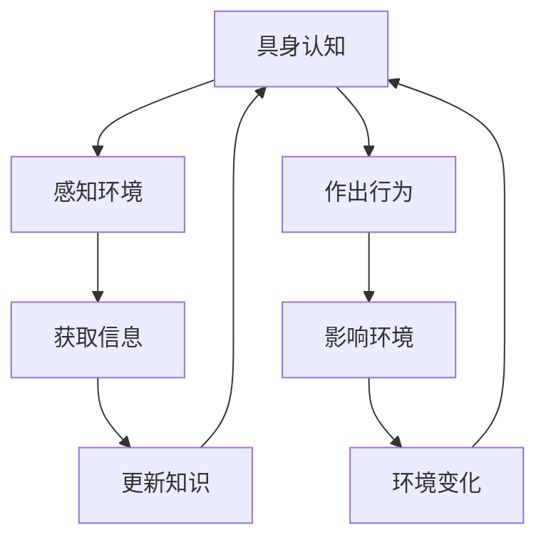
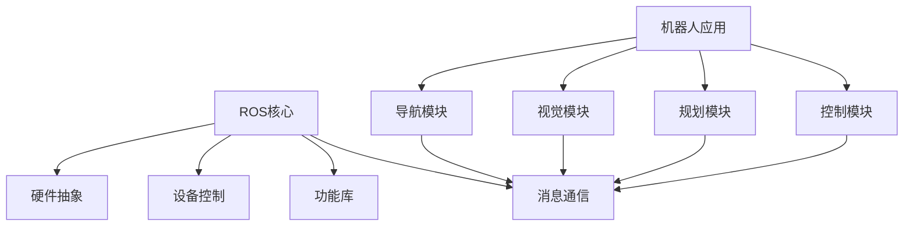
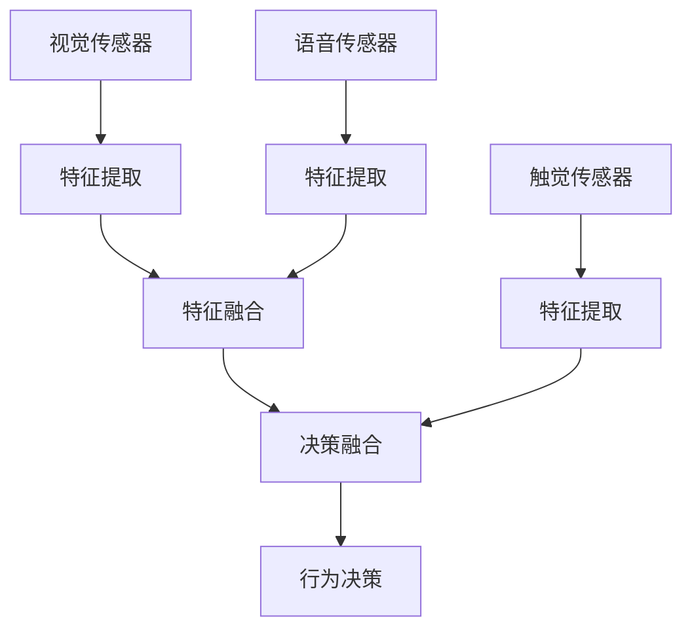
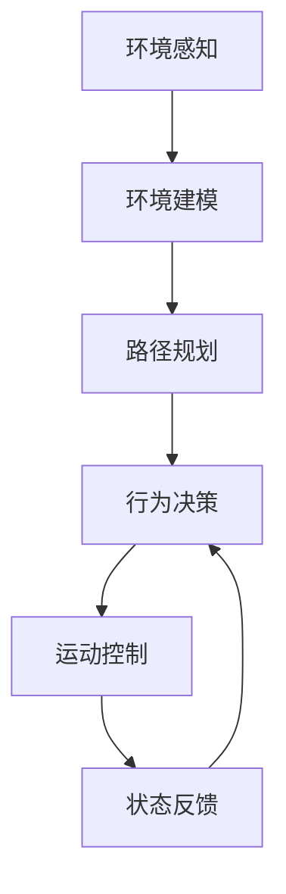

以下是根据您的要求撰写的技术博客文章正文内容：

# AI Agent: AI的下一个风口 具身机器人的应用场景

## 1. 背景介绍

### 1.1 问题的由来

人工智能(AI)技术在过去几十年里取得了长足的进步,尤其是在计算机视觉、自然语言处理、机器学习等领域的突破,使得AI系统能够更好地感知和理解周围环境。然而,传统的AI系统大多是虚拟的软件代理,缺乏与现实世界的物理交互能力,这在很大程度上限制了AI的应用场景和发展潜力。

### 1.2 研究现状 

为了克服这一局限性,具身机器人(Embodied AI Agents)应运而生。具身机器人是指集成了AI技术的物理机器人系统,能够通过机械机构与现实世界进行直接交互。近年来,随着机器人技术和AI技术的融合发展,具身机器人已经在多个领域展现出巨大的应用潜力,例如服务机器人、救援机器人、医疗手术机器人等。

### 1.3 研究意义

具身机器人的出现,标志着AI技术从虚拟世界迈向现实世界的重要一步。它们能够将AI的计算能力与物理世界的操作能力相结合,极大拓展了AI的应用范围。同时,具身机器人也为AI技术的发展提出了新的挑战,如如何实现机器人的自主决策、如何融合多模态感知信息、如何进行安全高效的机器人控制等,这些问题都需要AI研究者进一步探索和解决。

### 1.4 本文结构

本文将从具身机器人的核心概念出发,介绍其与传统AI系统的区别,阐述其关键技术原理,并通过具体的应用场景说明其重要意义。最后,本文还将对具身机器人的发展趋势和面临的挑战进行展望和分析。

## 2. 核心概念与联系

### 2.1 具身认知(Embodied Cognition)

具身认知是指智能体通过与物理世界的交互来获取知识和经验的过程。这一概念强调了认知过程与身体之间的紧密联系,即认知不仅发生在大脑中,还需要依赖于身体与环境的相互作用。具身机器人正是基于这一理论而设计的,它们通过物理机构与环境进行交互,感知环境信息并作出相应的行为反应。

### 2.2 机器人操作系统(Robot Operating System, ROS)

ROS是一个用于机器人软件开发的开源框架,它提供了一套标准的操作系统功能,如硬件抽象、底层设备控制、常用功能库、消息传递等。ROS的模块化设计使得机器人的不同功能模块可以相互通信和协作,大大简化了机器人系统的开发和集成过程。对于具身机器人而言,ROS是其软件系统的核心组成部分。

### 2.3 多模态感知融合(Multimodal Perception Fusion)

具身机器人需要通过多种传感器(如视觉、听觉、触觉等)来感知环境信息,因此多模态感知融合技术就显得尤为重要。它能够将来自不同模态的传感器数据进行融合处理,形成更加完整和准确的环境表征,从而支持机器人的决策和控制。常见的多模态融合方法包括特征级融合、决策级融合等。

### 2.4 概念之间的联系

具身认知理论为具身机器人的设计提供了理论基础,强调了机器人与现实世界交互的重要性。ROS则为具身机器人提供了软件支持,使不同功能模块能够高效协作。而多模态感知融合技术则是具身机器人实现环境感知和决策的关键,它将来自不同传感器的信息进行融合,为机器人的行为决策提供依据。这三个概念相互关联、相辅相成,共同支撑了具身机器人系统的实现。

## 3. 核心算法原理与具体操作步骤

### 3.1 算法原理概述

具身机器人的核心算法主要包括以下几个方面:

1. **环境建模(Environment Modeling)**:通过传感器数据构建机器人所在环境的三维几何模型和语义模型,为机器人的导航、规划和交互提供基础。常用的建模算法有占据栅格映射(Occupancy Grid Mapping)、同态/异态场景重建(Scene Reconstruction)等。

2. **运动规划(Motion Planning)**:根据环境模型和任务目标,计算出机器人从当前状态到目标状态的最优运动轨迹。常见的规划算法有采样式规划(Sampling-based Planning)、优化式规划(Optimization-based Planning)等。

3. **行为决策(Behavior Decision Making)**:融合环境信息和任务需求,生成机器人的高层行为决策,指导机器人完成特定任务。决策算法包括有限状态机(Finite State Machines)、层次任务网络(Hierarchical Task Networks)、强化学习(Reinforcement Learning)等。

4. **控制与执行(Control and Execution)**:将决策指令转化为对机器人执行器(如电机、机械臂等)的具体控制指令,实现期望的运动行为。控制算法有反馈控制(Feedback Control)、模型预测控制(Model Predictive Control)等。

### 3.2 算法步骤详解

以一个典型的导航任务为例,具身机器人的算法步骤如下:

1. **环境感知**:通过激光雷达、RGB-D相机等传感器获取当前环境的点云、深度图和RGB图像数据。

2. **环境建模**:利用占据栅格映射或同态/异态场景重建算法,将传感器数据融合为统一的三维环境模型。

3. **路径规划**:基于环境模型,采用A*、RRT*等采样式规划算法,计算出从当前位置到目标位置的最优路径。

4. **行为决策**:根据规划路径和任务需求,通过有限状态机或层次任务网络等算法,生成机器人的高层行为决策序列,如"前进5米"、"右转90度"等。

5. **运动控制**:将行为决策转化为对机器人底盘电机的控制指令,采用PID控制、模型预测控制等算法,实现期望的运动轨迹。

6. **状态反馈**:实时获取机器人的位置、速度等状态反馈,用于闭环控制和决策调整。

7. **重复3-6**:重复以上步骤,直至抵达目标位置。

### 3.3 算法优缺点

上述算法流程具有以下优点:

- 模块化设计,各模块相对独立,易于开发和维护
- 融合多模态传感器信息,环境感知能力强
- 分层决策,高层决策指导底层控制,行为更加可解释

但也存在一些缺点:

- 模块间存在信息丢失,决策与控制存在跳跃性
- 规划与控制是两个独立的闭环,缺乏全局优化
- 对动态环境的适应性不足,难以处理复杂场景

### 3.4 算法应用领域

上述算法广泛应用于各类具身机器人系统,如:

- 服务机器人:餐厅机器人送餐、清洁机器人打扫等
- 物流机器人:仓储机器人分拣、快递机器人投递等
- 救援机器人:消防机器人救援、排爆机器人拆弹等
- 医疗机器人:手术机器人助手、护理机器人等
- 探索机器人:航天探测器、海洋探测器等

## 4. 数学模型和公式详细讲解与举例说明

### 4.1 数学模型构建

对于具身机器人的环境建模、运动规划和控制等核心任务,往往需要建立相应的数学模型来描述和求解。以运动规划为例,我们可以将其形式化为一个优化问题:

$$
\begin{aligned}
\min\limits_{\boldsymbol{x}(t)} & \quad J(\boldsymbol{x}(t)) \\
\text{s.t.} & \quad \dot{\boldsymbol{x}}(t) = f(\boldsymbol{x}(t), \boldsymbol{u}(t)) \\
& \quad \boldsymbol{x}(t_0) = \boldsymbol{x}_0, \boldsymbol{x}(t_f) = \boldsymbol{x}_f \\
& \quad \boldsymbol{x}(t) \in \mathcal{X}_\text{free}, \forall t \in [t_0, t_f]
\end{aligned}
$$

其中:

- $\boldsymbol{x}(t)$是机器人在时间$t$时的状态向量(如位置、姿态、速度等)
- $J(\boldsymbol{x}(t))$是优化目标,如最短路径、最小能耗等
- $f(\boldsymbol{x}(t), \boldsymbol{u}(t))$是机器人的运动学/动力学方程
- $\boldsymbol{x}_0$和$\boldsymbol{x}_f$分别是起点和终点状态
- $\mathcal{X}_\text{free}$是机器人可行域,避免与障碍物发生碰撞

通过求解这一优化问题,我们可以得到从起点到终点的最优运动轨迹$\boldsymbol{x}^*(t)$。

### 4.2 公式推导过程

以机器人的运动学方程为例,我们来推导其离散时间形式。假设机器人在二维平面运动,状态向量为$\boldsymbol{x}(t) = [x(t), y(t), \theta(t)]^T$,其中$(x, y)$是位置,$ \theta $是朝向角度。控制输入为线速度$v$和角速度$\omega$,则连续时间运动学方程为:

$$
\begin{aligned}
\dot{x}(t) &= v(t) \cos\theta(t) \\
\dot{y}(t) &= v(t) \sin\theta(t) \\
\dot{\theta}(t) &= \omega(t)
\end{aligned}
$$

对上式进行离散化,得到:

$$
\begin{aligned}
x_{k+1} &= x_k + v_k \Delta t \cos\theta_k \\
y_{k+1} &= y_k + v_k \Delta t \sin\theta_k \\
\theta_{k+1} &= \theta_k + \omega_k \Delta t
\end{aligned}
$$

其中$\Delta t$是时间步长,下标$k$表示第$k$个时间步。这就是机器人在离散时间域下的运动学方程,可用于运动规划和控制算法。

### 4.3 案例分析与讲解

现以一个简单的机器人导航案例进行说明。假设机器人的初始状态为$(x_0, y_0, \theta_0) = (0, 0, 0)$,目标状态为$(x_f, y_f, \theta_f) = (5, 5, 0)$,环境中存在一个矩形障碍物,其顶点坐标为$(2, 2)$、$(2, 4)$、$(4, 4)$、$(4, 2)$。

我们可以将这一优化问题离散化为:

$$
\begin{aligned}
\min\limits_{\boldsymbol{X}} & \quad \sum_{k=0}^{N-1} \sqrt{(x_{k+1} - x_k)^2 + (y_{k+1} - y_k)^2} \\
\