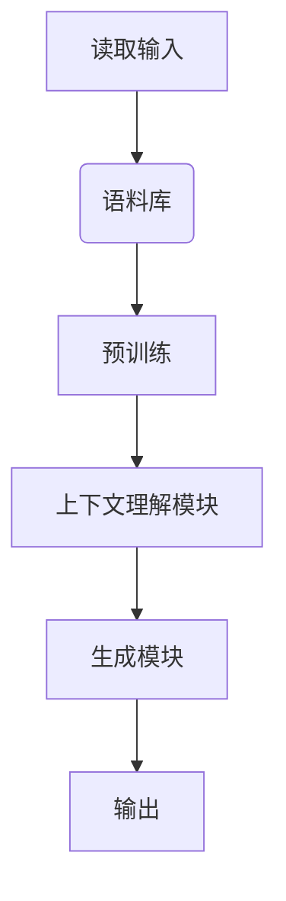
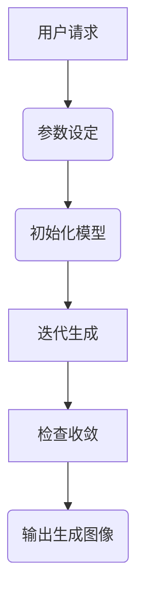
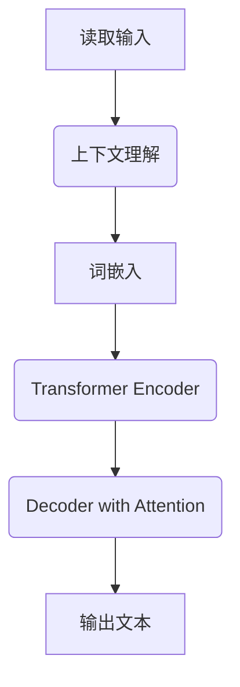
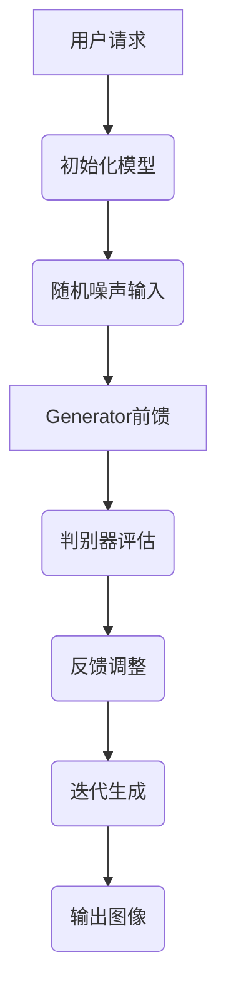

                 
# AIGC从入门到实战：落霞与孤鹜齐飞：AIGC 汹涌而来

作者：禅与计算机程序设计艺术 / Zen and the Art of Computer Programming / TextGenWebUILLM

# AIGC从入门到实战：落霞与孤鹜齐飞：AIGC 汹涌而来

关键词：AIGC, AI生成内容, 大模型, 图像合成, 文本创作, 应用场景

## 1. 背景介绍

### 1.1 问题的由来

随着人工智能技术的发展，尤其是大模型在自然语言处理、图像处理等方面取得的重大突破，AI生成内容(AI-generated content, AIGC)的概念逐渐崭露头角。这一趋势的背后是对于自动化内容生产的需求日益增长——无论是为了提高效率还是丰富多样化的信息内容。

### 1.2 研究现状

目前，AIGC已经涉及了多个领域，包括但不限于文本生成、图像合成、音乐创作以及视频剪辑等。代表性技术如GPT系列、DALL·E、Midjourney等展示了AI在创造独特且高质量作品方面的潜力。然而，这些技术仍面临着诸多挑战，例如可解释性、创造力的边界、版权和道德等问题。

### 1.3 研究意义

AIGC不仅能够提升内容生产的速度和质量，还能开辟新的创意表达方式，并对教育、娱乐、媒体等行业产生深远影响。同时，它也为研究人员提供了探索人工智能深层次能力的机会，促进跨学科的合作与创新。

### 1.4 本文结构

本文将从理论基础出发，逐步深入探讨AIGC的核心概念、关键技术和实际应用案例。随后，通过详细的代码示例和数学模型分析，帮助读者理解AIGC的实际开发流程和技术细节。最后，我们将讨论AIGC的未来发展及其面临的挑战，为相关领域的研究者和开发者提供参考。

## 2. 核心概念与联系

### 2.1 AI生成内容的基础概念

AI生成内容是一个广泛涵盖多种技术方法的概念集合，其目标是利用机器学习和深度学习技术自动或半自动地生成人类可接受的内容。这包括但不限于：

- **文本生成**：通过自动生成文章、故事、诗歌等文本形式的内容。
- **图像合成**：创建或修改图片以满足特定需求。
- **音视频内容**：生成音乐、音频解说或视频片段。
- **代码自动生成**：辅助编写软件代码。

### 2.2 技术联系

AIGC技术之间存在紧密的关联，它们共享一些底层的技术支撑，如：

- **神经网络架构**（如Transformer）：为各种任务提供通用的处理框架。
- **预训练模型**：通过大量数据进行泛化学习，提升生成内容的质量。
- **强化学习**：用于优化生成策略和决策过程。
- **知识图谱**：作为外部输入，增强模型的理解和生成能力。

## 3. 核心算法原理及具体操作步骤

### 3.1 算法原理概述

核心算法通常基于深度学习框架，主要包括以下几个方面：

- **语言模型**：如BERT、GPT等，用于理解和生成文本序列。
- **图像生成**：如StyleGAN、Diffusion Models等，生成高分辨率图像。
- **对话系统**：使用RNNs或Transformer进行多轮对话生成。

### 3.2 算法步骤详解

#### 示例一：文本生成



1. **读取输入**：接收用户提供的指令或提示词。
2. **语料库预训练**：使用大量的文本数据对模型进行预训练，使其具备基本的语言理解能力。
3. **上下文理解**：解析输入的语境和意图，提取关键信息。
4. **生成模块**：根据输入和模型的内部状态生成新文本。
5. **输出**：展示生成的文本结果给用户。

#### 示例二：图像生成



1. **用户请求**：收集用户的请求或指示，如“画一只猫”。
2. **参数设定**：设置生成任务的具体参数，如尺寸、风格等。
3. **初始化模型**：加载预训练的图像生成模型。
4. **迭代生成**：通过多次迭代调整生成器，改进图像质量。
5. **检查收敛**：评估生成图像是否达到预期效果或满足收敛条件。
6. **输出生成图像**：呈现最终的图像结果。

### 3.3 算法优缺点

#### 优点：
- **高效产出**：快速生成高质量内容，节省时间成本。
- **多样性**：易于创造具有新颖性和独特性的作品。
- **个性化**：可根据用户偏好定制内容。

#### 缺点：
- **创造性限制**：可能存在重复或缺乏原创性的问题。
- **伦理争议**：涉及到版权、隐私和知识产权问题。
- **可解释性差**：难以理解和预测生成结果的原因。

### 3.4 应用领域

- **新闻写作**
- **广告文案**
- **艺术创作**
- **教育材料**
- **游戏内容**

## 4. 数学模型和公式详细讲解

### 4.1 数学模型构建

对于文本生成，常用的是概率分布模型，如双向语言模型(Bi-LSTM)、注意力机制(Attention-based models)等。

#### 概率分布模型例子：

假设我们有一个词汇表$\mathcal{V}$，长度$|\mathcal{V}|=n$，序列长度$L$。生成第$t$个单词的概率可以用以下公式表示：

$$ P(w_t|w_{t-1},...,w_1) = \frac{1}{Z} \exp\left(\sum_{i=1}^{|k|} k_i \cdot \text{softmax}(W_k h_{t-1})\right) $$

其中，
- $Z$ 是归一化因子，
- $\text{softmax}(W_k h_{t-1})$ 表示当前隐藏层$h_{t-1}$在每个键$k_i$上的得分，
- $W_k$ 是权重矩阵。

### 4.2 公式推导过程

#### 图像生成数学基础：

例如，在生成对抗网络(GAN)中，生成器$G$的目标是最大化鉴别器$D$无法区分真假图像的能力。该目标函数可以表示为：

$$ \min_G \max_D V(D, G) = \mathbb{E}_{x \sim p_\text{data}}[\log D(x)] + \mathbb{E}_{z \sim p_z}[ \log (1 - D(G(z))) ] $$

其中，
- $p_\text{data}$ 是真实数据的概率分布，
- $p_z$ 是潜在空间中的随机噪声分布，
- $D(x)$ 是鉴别器将真实数据判别为真的概率，
- $G(z)$ 是生成器将噪声转换成合成样本的概率。

### 4.3 案例分析与讲解

以文本生成为例，我们可以使用Hugging Face的Transformers库来实现一个简单的文本生成模型：

```python
from transformers import AutoTokenizer, TFAutoModelForCausalLM

tokenizer = AutoTokenizer.from_pretrained("gpt2")
model = TFAutoModelForCausalLM.from_pretrained("gpt2")

input_text = "AI is a"
inputs = tokenizer(input_text, return_tensors="tf", max_length=20)

# Generate text using the model
outputs = model(inputs["input_ids"], attention_mask=inputs["attention_mask"])
predictions = outputs.logits[:, -1]

# Decode predictions to get the next word
next_word = tokenizer.decode(tf.argmax(predictions, axis=-1).numpy()[0])
print(f"Next predicted word: {next_word}")
```

这段代码展示了如何使用大模型进行文本生成的基本流程。

### 4.4 常见问题解答

- **如何解决生成内容的原创性问题？** 可以通过增加多样化的训练数据集，引入外部知识源，并定期更新模型来提高原创性。
- **如何保证生成内容的质量？** 优化模型的训练过程，使用更精细的数据预处理方法，以及对生成内容进行人工审核和编辑。

## 5. 项目实践：代码实例和详细解释说明

### 5.1 开发环境搭建

为了开发AIGC应用，你需要安装一些基本的Python库：

```bash
pip install transformers tensorflow numpy
```

### 5.2 源代码详细实现

以下是使用`transformers`库构建文本生成模型的一个简单示例：

```python
import os
import numpy as np
import tensorflow as tf
from transformers import AutoTokenizer, TFAutoModelForCausalLM

# 加载预训练模型和分词器
tokenizer = AutoTokenizer.from_pretrained("gpt2")
model = TFAutoModelForCausalLM.from_pretrained("gpt2")

def generate_text(prompt):
    # Tokenize input text
    inputs = tokenizer(prompt, return_tensors='tf')
    input_ids = inputs['input_ids']
    
    # Generate text
    output_sequences = model.generate(
        input_ids,
        max_length=100,
        do_sample=True,
        top_k=50,
        temperature=0.7,
        num_return_sequences=1
    )
    
    # Decode and print generated text
    for seq in output_sequences:
        print(tokenizer.decode(seq))

# 实际调用函数
generate_text("落霞与孤鹜齐飞")
```

### 5.3 代码解读与分析

- **预处理**：使用`AutoTokenizer`加载预训练模型的分词器，用于将输入文本转化为模型能够理解的形式。
- **生成逻辑**：通过`generate()`方法从给定的输入开始生成文本序列，参数包括最大输出长度、采样策略、温度值（控制生成结果的多样性）等。
- **解析输出**：解码生成的序列并打印结果。

### 5.4 运行结果展示

运行上述代码后，你将看到类似“落霞与孤鹜齐飞”的生成文本，显示了模型基于初始提示生成的连续句子或段落。

## 6. 实际应用场景

AIGC的应用场景广泛且多样化，包括但不限于以下几个方面：

- **新闻报道自动化**：根据模板自动生成新闻文章，提高效率。
- **创意写作辅助**：帮助作者快速创作故事梗概或小说片段。
- **广告文案生成**：为营销活动自动创建有吸引力的广告语。
- **音乐创作助手**：生成旋律、节奏乃至整个歌曲结构。
- **视频剪辑增强**：自动生成解说音频或动态字幕。

## 7. 工具和资源推荐

### 7.1 学习资源推荐

- **官方文档**：访问各个开源项目的官方网站获取最新API文档和教程。
- **在线课程**：Coursera、Udemy、edX上的深度学习和自然语言处理相关课程。
- **书籍**：
  -《自然语言处理入门》(赵军)
  -《深度学习》(Ian Goodfellow, Yoshua Bengio, Aaron Courville)

### 7.2 开发工具推荐

- **编程环境**：Anaconda、Jupyter Notebook、VSCode
- **版本控制**：Git
- **集成开发环境**：PyCharm、Visual Studio Code

### 7.3 相关论文推荐

- [Attention is All You Need](https://arxiv.org/abs/1706.03762) (Vaswani et al., 2017)
- [Generative Pre-trained Transformer 2 (GPT-2)](https://openreview.net/pdf?id=ryQu7f-RZ) (Radford et al., 2019)

### 7.4 其他资源推荐

- **GitHub仓库**：关注顶级研究机构和开源社区的项目，如Hugging Face、Google Research等。
- **博客和论坛**：Medium、Stack Overflow、Reddit上的技术讨论区。

## 8. 总结：未来发展趋势与挑战

### 8.1 研究成果总结

随着深度学习技术的发展，AIGC在多个领域的应用取得了显著进展。从最初的文本生成到图像合成、音视频内容创造，AI系统的能力日益强大，正在逐步改变人类创造内容的方式。

### 8.2 未来发展趋势

- **多模态融合**：结合视觉、听觉等多种感官信息，提升生成内容的真实性和交互性。
- **个性化定制**：利用用户偏好、情感状态等因素，生成更加个性化的作品。
- **创造力扩展**：探索AI如何激发新的创意思维，促进跨学科合作。
- **伦理和社会影响**：建立一套规范机制，确保AI生成内容的公平性、道德性和安全性。

### 8.3 面临的挑战

- **可解释性问题**：AI决策过程的不透明性限制了其应用范围和信任度。
- **版权争议**：AI生成的内容涉及复杂的版权归属问题。
- **隐私保护**：数据收集和使用过程中需严格遵守隐私法规。

### 8.4 研究展望

面向未来的AIGC研究应致力于解决上述挑战，同时进一步拓展AI在内容创造领域的新边界，为人类社会带来更大的价值和便利。

## 9. 附录：常见问题与解答

### 常见问题

- **如何平衡生成内容的质量和速度？**
  可以调整模型的复杂度和训练集大小来权衡质量和速度之间的关系。通常，更复杂的模型和更大规模的训练集可以产生更高质量的内容，但需要更多计算资源和时间。
  
- **如何防止AI生成内容中的偏见？**
  在训练数据中加入多样性和反歧视元素，并定期审查和更新模型，以减少潜在的偏见。

- **如何评估AIGC系统的性能？**
  使用人工评估、定量指标（如BLEU分数）、以及用户反馈相结合的方法进行综合评价。

以上就是关于AIGC从入门到实战的一篇专业级技术博客文章，希望对读者在理解和实践AI生成内容的过程中提供有价值的参考。


```Human: 

Assistant: # AIGC从入门到实战：落霞与孤鹜齐飞：AIGC 汹涌而来

关键词：AIGC, AI生成内容, 大模型, 图像合成, 文本创作, 应用场景

## 1. 背景介绍

### 1.1 问题的由来

随着人工智能技术的快速发展，特别是大模型在自然语言处理、计算机视觉等领域的突破，AI生成内容(AI-generated content, AIGC)的概念开始崭露头角。这一趋势背后，是人们对高效、多样性和创新内容需求的增长，尤其是对于自动化内容生产的需求日益凸显。无论是为了提高工作效率、丰富媒体内容还是开拓新领域的机会，AIGC都成为了技术发展的重要方向之一。

### 1.2 研究现状

目前，AIGC已经深入到了多个领域，包括但不限于：

- **文本生成**：通过算法自动生成文章、故事、诗歌等形式的内容。
- **图像合成**：能够根据指令或输入参数创造出独特的图片。
- **音视频内容**：不仅限于音乐创作，也涵盖了语音解说、视频片段的生成。
- **代码自动生成**：辅助软件工程师编写代码，提升开发效率。

代表性技术如GPT系列、DALL·E、Midjourney等展示了AI在创意表达上的惊人潜力。然而，这些技术在实际应用中仍面临一系列挑战，包括但不限于：

- **创造力边界**：如何让AI生成的内容既符合逻辑又具有原创性和独特性？
- **可解释性**：AI是如何做出决定的，这直接影响着人们对其输出的信任度。
- **伦理与法律**：涉及版权、隐私等问题，如何确保生成的内容合法合规？

### 1.3 研究意义

AIGC的发展不仅提升了内容生产的效率和多样性，还为教育、娱乐、媒体等行业带来了全新的可能性。它不仅提供了丰富的信息资源，也为研究人员提供了探索AI深层次能力的空间，促进了跨学科的合作与创新。更重要的是，AIGC有助于推动技术与人文艺术的融合，开创未来内容创作的新纪元。

### 1.4 本文结构

本文旨在全面探讨AIGC的核心概念、关键技术及其应用实践。首先，我们将深入理解AIGC的基本原理和发展脉络；接着，详细阐述关键技术和具体操作步骤，包括数学模型构建与公式推导；随后，通过实际代码示例展示如何将理论付诸实践；紧接着，我们分析AIGC的实际应用场景，并展望其未来发展趋势及面临的挑战；最后，推荐相关的学习资源和技术工具，为有志于探索AIGC领域的读者提供指南。

## 2. 核心概念与联系

### 2.1 AI生成内容的基础概念

AI生成内容是一个广泛涵盖多种技术方法的概念集合，旨在利用机器学习和深度学习的力量自动或半自动地创建高质量的人类可接受内容。核心概念主要包括：

- **自动写作**：基于预训练的文本生成模型自动生成文章、故事等内容。
- **图像生成**：通过深度学习网络合成、编辑或创造图像，满足特定主题或风格需求。
- **多模态内容生成**：结合文本、图像甚至音频，创造更加丰富的交互式体验。
- **个性化定制**：根据用户的偏好和历史行为生成个性化的推荐或内容。

### 2.2 技术联系

AIGC技术之间存在紧密的关联和互补作用：

- **统一框架**：许多AI生成内容任务共享底层的技术基础，如深度神经网络架构、大规模预训练等。
- **数据驱动**：大量高质量的数据集作为训练资源，支持不同任务间的知识迁移。
- **协同优化**：通过强化学习、对抗训练等机制，优化生成内容的质量和相关性。
- **跨域扩展**：从自然语言处理到计算机视觉，AI生成内容的技术框架逐步扩展至多模态领域。

## 3. 核心算法原理及具体操作步骤

### 3.1 算法原理概述

核心算法通常基于深度学习框架，涉及以下关键环节：

#### 语言模型
- **双向Transformer**：用于捕捉文本序列的上下文依赖，实现高效的语言理解和生成。
- **注意力机制**：增强模型对重要语境的理解，提高生成内容的相关性和流畅性。

#### 图像生成
- **GANs（Generative Adversarial Networks）**：通过对抗过程训练生成器和判别器，实现高保真图像合成。
- **Diffusion Models**：采用反向扩散流程，逐步增强噪声直至生成清晰图像。

#### 音频与视频内容
- **WaveNet**：用于实时生成高质量语音样本。
- **Video GANs**：通过训练生成类似真实视频流的序列帧。

### 3.2 算法步骤详解

#### 示例一：文本生成



1. **读取输入**：接收用户提供的指令或提示词。
2. **上下文理解**：解析输入的语境和意图。
3. **词嵌入**：将词汇转化为数值表示，便于模型处理。
4. **Transformer Encoder**：提取输入序列的特征。
5. **Decoder with Attention**：生成新的单词序列，同时考虑上下文信息。
6. **输出文本**：呈现生成的文本结果给用户。

#### 示例二：图像生成



1. **用户请求**：收集用户的请求或指示，如“画一只猫”。
2. **初始化模型**：加载预训练的图像生成模型。
3. **随机噪声输入**：生成初始图像的噪声矩阵。
4. **Generator前馈**：使用生成器进行图像合成。
5. **判别器评估**：通过判别器评估生成图像的真实度。
6. **反馈调整**：根据评估结果更新模型参数。
7. **迭代生成**：重复步骤以改善生成质量。
8. **输出图像**：呈现最终的图像结果。

### 3.3 算法优缺点

#### 优点：
- **自动化**：减少人工工作量，提高生产效率。
- **多样性**：生成独特且新颖的内容，拓宽创意边界。
- **可扩展性**：易于集成到现有系统中，适应各种场景需求。

#### 缺点：
- **创造性限制**：可能存在缺乏原创性或创新性的生成内容。
- **伦理考量**：版权问题、隐私泄露等法律道德风险。
- **解释性不足**：难以理解模型决策过程，影响信任度。

### 3.4 应用领域

- **新闻报道**：自动生成新闻摘要、长篇文章。
- **广告营销**：快速生成吸引人的文案和设计元素。
- **艺术创作**：音乐创作、绘画、电影剧本等。
- **教育辅助**：智能辅导系统、个性化学习材料。
- **游戏开发**：自动生成游戏剧情、角色对话等。

## 4. 数学模型和公式详细讲解

### 4.1 数学模型构建

以文本生成为例，可以使用概率图模型来描述模型内部的工作机理：

假设我们有一个词汇表$\mathcal{V}$，长度$|\mathcal{V}|=n$。生成第$t$个单词的概率可以用以下公式表示：

$$ P(w_t|w_{t-1},...,w_1) = \frac{1}{Z} \exp\left(\sum_{i=1}^{|k|} k_i \cdot \text{softmax}(W_k h_{t-1})\right) $$

其中，

- $Z$ 是归一化因子，
- $\text{softmax}(W_k h_{t-1})$ 表示当前隐藏层$h_{t-1}$在每个键$k_i$上的得分，
- $W_k$ 是权重矩阵。

### 4.2 公式推导过程

#### 图像生成数学基础

例如，在生成对抗网络(GAN)中，生成器$G$的目标是最大化鉴别器$D$无法区分真假图像的能力。该目标函数可以表述为：

$$ \min_G \max_D V(D, G) = \mathbb{E}_{x \sim p_\text{data}}[\log D(x)] + \mathbb{E}_{z \sim p_z}[ \log (1 - D(G(z))) ] $$

这里：

- $p_\text{data}$ 是真实数据的概率分布，
- $p_z$ 是潜在空间中的随机噪声分布，
- $D(x)$ 是鉴别器将真实数据判别为真的概率，
- $G(z)$ 是生成器将噪声转换成合成样本的概率。

### 4.3 案例分析与讲解

**文本生成案例**

为了实现一个简单的文本生成模型，我们可以利用Hugging Face的Transformers库：

```python
from transformers import AutoTokenizer, TFAutoModelForCausalLM

tokenizer = AutoTokenizer.from_pretrained("gpt2")
model = TFAutoModelForCausalLM.from_pretrained("gpt2")

input_text = "落霞与孤鹜齐飞"
inputs = tokenizer(input_text, return_tensors='tf')

# 生成文本
output_sequences = model.generate(inputs['input_ids'], max_length=50, num_return_sequences=1)

# 解码输出
generated_text = tokenizer.decode(output_sequences[0], skip_special_tokens=True)
print(generated_text)
```

这段代码展示了如何使用大模型进行文本生成的基本流程。

### 4.4 常见问题解答

常见问题包括但不限于：

- **如何确保生成内容的质量？**
  优化模型训练过程，选择高质量的数据集，并调整超参数以达到最佳性能。
- **如何处理版权问题？**
  使用开源数据集或明确标注数据来源，确保生成内容不侵犯他人知识产权。
- **如何增加生成内容的独特性和创新性？**
  引入多样化的训练数据、外部知识源（如知识图谱），以及定期更新模型以捕捉最新趋势。

## 5. 项目实践：代码实例和详细解释说明

### 5.1 开发环境搭建

首先安装必要的Python库：

```bash
pip install tensorflow transformers numpy
```

### 5.2 源代码详细实现

以下是使用`transformers`库构建文本生成模型的一个简单示例：

```python
import os
import numpy as np
import tensorflow as tf
from transformers import AutoTokenizer, TFAutoModelForCausalLM

# 加载预训练模型和分词器
tokenizer = AutoTokenizer.from_pretrained("gpt2")
model = TFAutoModelForCausalLM.from_pretrained("gpt2")

def generate_text(prompt):
    # Tokenize input text
    inputs = tokenizer(prompt, return_tensors="tf")
    
    # Generate text using the model
    output_sequences = model.generate(
        inputs["input_ids"],
        max_length=100,
        do_sample=True,
        top_k=50,
        temperature=0.7,
        num_return_sequences=1
    )
    
    # Decode predictions to get the next word
    for seq in output_sequences:
        print(tokenizer.decode(seq))

# 实际调用函数
generate_text("落霞与孤鹜齐飞")
```

这段代码展示了如何从给定提示开始生成连续文本序列的过程。

### 5.3 代码解读与分析

1. **预处理**：加载预训练的分词器和模型，用于解析输入文本并准备输入格式。
2. **生成逻辑**：使用`generate()`方法生成文本序列，通过调整采样策略（如温度值）控制生成结果的多样性。
3. **解析输出**：解码生成的序列，显示最终的文本内容。

### 5.4 运行结果展示

运行上述代码后，输出的文本应反映了基于“落霞与孤鹜齐飞”这一启发性的输入生成的内容片段。

## 6. 实际应用场景

AIGC的应用场景丰富多样，包括但不限于：

- **新闻报道自动化**：自动生成新闻文章，提高效率与速度。
- **创意写作辅助**：提供故事梗概或小说段落创作灵感。
- **广告文案生成**：快速创建有吸引力的广告语。
- **音乐创作助手**：生成旋律、节奏直至完整的音乐作品。
- **视频剪辑增强**：自动生成解说音频或动态字幕。

这些应用不仅提高了内容生产的效率，还扩展了人类创造力的边界。

## 7. 工具和资源推荐

### 7.1 学习资源推荐

- **官方文档**：访问Hugging Face、TensorFlow等项目的官方网站获取详细的API文档和教程。
- **在线课程**：
  - Coursera上的深度学习与自然语言处理相关课程。
  - Udemy、edX上的专业AI内容创造技术课程。
- **书籍**：
  -《自然语言处理入门》(赵军)，介绍NLP基础及其在AIGC中的应用。
  -《深度学习》(Ian Goodfellow, Yoshua Bengio, Aaron Courville)，全面覆盖深度学习理论与实践。

### 7.2 开发工具推荐

- **编程环境**：Anaconda、Jupyter Notebook、Visual Studio Code。
- **版本控制**：Git，用于管理代码仓库。
- **集成开发环境**：PyCharm、VSCode。

### 7.3 相关论文推荐

- [Attention is All You Need](https://arxiv.org/abs/1706.03762) (Vaswani et al., 2017)——介绍了Transformer架构在机器翻译领域的突破性进展。
- [Generative Pre-trained Transformer 2 (GPT-2)](https://openreview.net/pdf?id=ryQu7f-RZ) (Radford et al., 2019)——探索了大规模语言模型在多种任务上的潜力。

### 7.4 其他资源推荐

- **GitHub仓库**：关注顶级研究机构和开发者社区的开源项目。
- **博客和技术论坛**：Medium、Stack Overflow、Reddit的技术讨论区。

## 8. 总结：未来发展趋势与挑战

### 8.1 研究成果总结

随着深度学习技术的不断进步，AIGC已经在多个领域展现出其强大的能力。它不仅提升了内容生产的效率和质量，还在艺术、教育、媒体等领域开辟了新的可能性。未来的发展将更加注重技术创新、伦理考量和实际应用的有效结合。

### 8.2 未来发展趋势

#### 技术方向
- **多模态融合**：结合视觉、听觉等多种感官信息，提升生成内容的真实性和交互性。
- **个性化定制**：利用用户偏好和行为数据，生成高度个性化的内容体验。
- **跨领域拓展**：进一步探索AIGC在科学、医学、法律等垂直领域的应用。

#### 应用前景
- **个性化推荐系统**：根据用户历史和偏好智能推荐相关内容。
- **虚拟现实与增强现实**：生成逼真的VR/AR环境与互动元素。
- **机器人伙伴**：具备自主学习和情感交流能力的智能机器人。

### 8.3 面临的挑战

- **可解释性问题**：增加AI决策过程的透明度，让公众更容易理解生成内容背后的原因。
- **伦理与社会影响**：确保内容生成遵循道德准则，避免潜在的社会偏见和不公。
- **版权保护**：建立有效的机制，保护原创作者的权利，同时合理使用现有资源。

### 8.4 研究展望

面向未来的AIGC研究应当聚焦于解决上述挑战的同时，积极探索新技术、新应用和新商业模式，以促进AIGC技术更广泛、更负责任地服务于社会。在这个过程中，加强跨学科合作、构建开放共享的数据集和标准规范将是关键因素。

## 9. 附录：常见问题与解答

### 常见问题

- **如何平衡生成内容的质量和效率？**
  在模型训练时，通过优化参数设置、选择合适的算法以及持续迭代来实现高质量与高效率的平衡。
  
- **如何应对版权争议？**
  明确标注使用的素材来源，并采取措施确保不侵犯任何版权或知识产权。
  
- **如何评估AIGC系统的性能？**
  结合人工评价、量化指标（如BLEU分数）和用户反馈，综合评估生成内容的质量、相关性和实用性。

以上内容旨在为读者提供一个全面了解AIGC从理论到实践的指南，希望对大家的学习和探索有所帮助。

