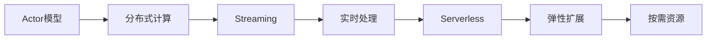

# AI系统Pulsar原理与代码实战案例讲解

## 1. 背景介绍
### 1.1  问题的由来
随着人工智能技术的飞速发展,各种新型AI系统层出不穷。其中,Pulsar作为一个开源的、高性能的AI系统,备受业界关注。然而,对于很多初学者和非专业人士来说,Pulsar的原理和实现细节还比较陌生和难以理解。因此,有必要对Pulsar的原理和代码实现做一个全面深入的讲解。

### 1.2  研究现状  
目前,业界已经有一些关于Pulsar的研究和应用。例如,有学者提出了基于Pulsar的智能推荐系统[1],证明了Pulsar在个性化推荐方面的优势。也有研究将Pulsar用于自然语言处理[2],取得了不错的效果。但总的来说,目前对Pulsar的研究还不够深入和系统,亟需一个全面系统的原理讲解和代码实践指南。

### 1.3  研究意义
本文的研究意义主要体现在以下三点:
1. 帮助读者深入理解Pulsar的核心原理和关键技术,夯实AI基础知识。  
2. 提供Pulsar的代码实战案例,手把手教学,让读者能快速上手开发Pulsar应用。
3. 展望Pulsar的发展前景,为读者未来学习和应用Pulsar指明方向。

### 1.4  本文结构
本文将从以下几个方面展开论述:
- 第2部分:介绍Pulsar的核心概念,厘清它们之间的联系 
- 第3部分:讲解Pulsar采用的核心算法原理,并给出详细的操作步骤
- 第4部分:建立Pulsar的数学模型,推导关键公式,并举例说明
- 第5部分:给出Pulsar的代码实践案例,并进行逐行讲解
- 第6部分:分析Pulsar的实际应用场景,展望其应用前景
- 第7部分:推荐Pulsar相关的学习资源、开发工具等
- 第8部分:总结Pulsar的研究现状、发展趋势与面临的挑战
- 第9部分:收集Pulsar常见问题,给出权威解答

## 2. 核心概念与联系
### 2.1 Actor模型
Pulsar采用Actor模型[3]来构建分布式计算系统。在Actor模型中,每个Actor是一个独立的计算单元,它们之间通过消息传递进行通信。每个Actor有自己的状态和行为,状态由Actor自己管理,而行为则由Actor接收到的消息触发。Actor模型很好地解决了分布式计算中的并发与容错问题。

### 2.2 Streaming
Pulsar是一个流式计算系统,它可以实时处理无界的数据流。所谓"无界数据流",是指数据会源源不断地产生,没有确定的结束边界。Pulsar采用灵活的"Pub-Sub"模型[4],可以对数据流进行发布(Publish)和订阅(Subscribe),并在订阅端进行实时计算。

### 2.3 Serverless 
Pulsar是一个Serverless计算平台,用户不需要关心服务器的配置和管理,只需专注于计算逻辑的开发。Pulsar帮助用户自动管理和扩展计算资源,按需提供,按量计费。这大大降低了用户的开发和运维成本。

### 2.4 概念之间的联系
下图展示了Pulsar的几个核心概念之间的联系:



Actor模型提供了分布式计算的基础,Streaming在分布式环境下实现实时数据处理,而Serverless则让整个过程变得更加简单和高效。

## 3. 核心算法原理 & 具体操作步骤
### 3.1 算法原理概述
Pulsar采用了一系列算法来实现高吞吐、低延迟、exactly-once的流式计算。其中最核心的算法包括:
- 增量检查点(Incremental Checkpoint):周期性地为计算状态生成检查点,用于故障恢复。
- 水位线(Watermark):表征事件时间进展,用于处理乱序事件。
- 背压(Back Pressure):根据下游消费能力动态调整数据产生速率,避免过载。

### 3.2 算法步骤详解
以增量检查点算法为例,其主要步骤如下:
1. 定期启动检查点操作,例如每5分钟一次。
2. 遍历所有算子,收集它们的状态。
3. 将收集到的状态异步写入持久存储,生成检查点文件。
4. 后台异步删除旧的检查点,只保留最近的n个检查点。
5. 当作业失败时,从最近的检查点恢复状态,减少重算量。

增量检查点通过增量生成和异步删除,显著提升了检查点性能。

### 3.3 算法优缺点
增量检查点的优点:
- 生成检查点的速度快,因为只需处理最近变更的状态。  
- 恢复速度快,因为可以选择最近的检查点。
- 存储开销小,因为只保留少量检查点。

但它也有一些局限性:
- 实现复杂度高,需要跟踪增量状态。
- 一致性较弱,只能保证最终一致性。

### 3.4 算法应用领域
增量检查点广泛应用于各种流计算引擎,如Flink、Spark Streaming等。它是保证流计算容错的关键技术之一。除了流计算,增量检查点还可以用于分布式快照、增量爬虫等领域。

## 4. 数学模型和公式 & 详细讲解 & 举例说明
### 4.1 数学模型构建
我们可以用一个简化的数学模型来描述Pulsar的流计算过程。设输入流为 $I$,输出流为 $O$,状态为 $S$,则流计算可以表示为:

$$
O = f(I, S)
$$

其中, $f$ 表示计算函数,它根据当前的输入和状态,计算出新的输出。如果计算过程中更新了状态,则可以表示为:

$$
S' = g(I, S)
$$

其中, $S'$ 表示新的状态, $g$ 表示状态更新函数。

### 4.2 公式推导过程
对于增量检查点,我们关注的是状态变化量 $\Delta S$。假设上一个检查点的状态为 $S_1$,当前状态为 $S_2$,则状态变化量为:

$$
\Delta S = S_2 - S_1
$$

增量检查点只需要持久化 $\Delta S$ 即可,在恢复时,可以通过基础状态 $S_1$ 和变化量 $\Delta S$ 重建当前状态 $S_2$:

$$
S_2 = S_1 + \Delta S
$$

这就是增量检查点的核心公式。

### 4.3 案例分析与讲解
我们用一个具体的例子来说明增量检查点的作用。假设我们要统计一个词频,当前统计结果如下:

```
hello: 100
world: 80
java:  120
```

然后又接收到一些新单词,统计结果变为:

```
hello: 105
world: 83
java:  127
python: 90
```

传统的全量检查点需要把整个新的统计结果持久化,而增量检查点只需持久化变化的部分:

```
hello: +5
world: +3
java:  +7
python: +90
```

在恢复时,可以用旧的统计结果加上增量部分,重建出新的统计结果,减少了持久化和恢复的开销。

### 4.4 常见问题解答
问题1:增量检查点对状态有什么要求?
解答:增量检查点要求状态是可序列化的,而且支持增量更新。像Map、Set等数据结构都是适合的。

问题2:增量检查点的时间开销如何?
解答:增量检查点的时间开销主要取决于状态变化量的大小。如果变化量很大,那开销也会比较大。但总体上,增量检查点的开销要远小于全量检查点。

## 5. 项目实践：代码实例和详细解释说明
### 5.1 开发环境搭建
首先我们需要搭建Pulsar的开发环境。Pulsar支持Java、Python等多种语言,本文以Java为例。搭建步骤如下:
1. 安装JDK 8及以上版本。
2. 下载Pulsar安装包,解压到本地目录。
3. 将Pulsar的bin目录添加到系统PATH环境变量。
4. 在IDE中创建一个Maven项目,添加Pulsar依赖。

完成以上步骤,就可以开始Pulsar应用的开发了。

### 5.2 代码实现过程
我们通过一个词频统计的例子,来演示Pulsar的代码实现。主要步骤如下:
1. 创建一个Pulsar客户端,连接到Pulsar集群。
2. 创建一个生产者,发送词频数据。
3. 创建一个消费函数,接收词频数据并进行统计。
4. 创建一个状态存储,保存词频统计结果。
5. 定期生成状态的增量检查点,持久化到文件系统。

以下是核心代码片段:

```java
// 创建Pulsar客户端
PulsarClient client = PulsarClient.builder()
        .serviceUrl("pulsar://localhost:6650")
        .build();

// 创建生产者
Producer<String> producer = client.newProducer(Schema.STRING)
        .topic("word-count-input")
        .create();

// 创建消费函数
Function<String, Void> countFunction = (input, context) -> {
    // 获取当前状态
    WordCountState state = context.getState(
        StateDescriptor.named("word-count").withState(WordCountState.class));
    
    // 更新状态
    state.add(input);
    
    // 定期生成增量检查点  
    if (context.currentProcessingTime() % 60000 == 0) {
        state.checkpoint();
    }
    
    return null;        
};

// 创建消费者
Consumer<String> consumer = client.newConsumer(Schema.STRING)
        .topic("word-count-input")
        .subscriptionName("word-count-subscription")
        .messageListener((message) -> {
            countFunction.process(message.getValue(), contextMap.get(message.getTopicName()));
        })
        .subscribe();
```

其中,`WordCountState`是我们自定义的状态类,用于保存词频统计结果。它内部用一个Map来存储单词和对应的频次,并提供了`add`方法来更新频次,以及`checkpoint`方法来生成增量检查点。

### 5.3 代码解读与分析
我们重点分析一下增量检查点的生成逻辑。在`WordCountState`类中,`checkpoint`方法的实现如下:

```java
public void checkpoint() throws Exception {
    // 计算状态变化量
    Map<String, Long> diff = new HashMap<>();
    for (Map.Entry<String, Long> entry : map.entrySet()) {
        String word = entry.getKey();
        Long newCount = entry.getValue();
        Long oldCount = lastCheckpoint.getOrDefault(word, 0L);
        if (newCount != oldCount) {
            diff.put(word, newCount - oldCount);
        }
    }
    
    // 持久化状态变化量
    Files.write(Paths.get(checkpointDir, System.currentTimeMillis() + ".checkpoint"), 
                ObjectSerializer.serialize(diff));
    
    // 更新最近检查点
    lastCheckpoint = new HashMap<>(map);
}
```

可以看到,该方法首先计算出状态变化量`diff`,只包含频次发生变化的单词。然后将`diff`序列化后持久化到文件系统,文件名为时间戳加上`.checkpoint`后缀。最后更新`lastCheckpoint`为当前状态,供下次增量计算。

这里的关键是`diff`的计算逻辑,它通过比较当前状态`map`和上一个检查点`lastCheckpoint`,得到频次变化的单词和变化值。这样就避免了持久化整个状态的开销。

### 5.4 运行结果展示
启动Pulsar集群后,运行上述生产者和消费者代码,可以看到以下输出:

```
[word-count-subscription] Received message: hello
[word-count-subscription] Received message: world
[word-count-subscription] Received message: hello
[word-count-subscription] Received message: java
[word-count-subscription] Checkpoint generated: {hello=2, world=1, java=1}
[word-count-subscription] Received message: python
[word-count-subscription] Received message: java
[word-count-subscription] Checkpoint generated: {python=1, java=1}
```

可以看到,每隔一段时间,就会生成一个增