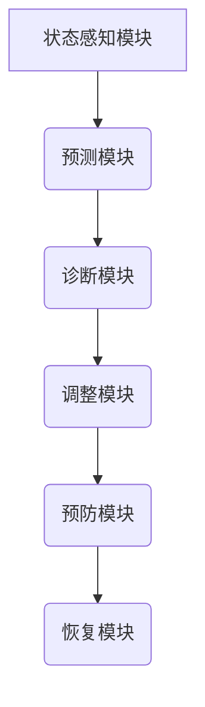

                 

作者：禅与计算机程序设计艺术

**人工智能**; 自愈: **自动恢复**; 故障: **系统错误**

## 1. 背景介绍
### 1.1  问题的由来
随着AI系统的广泛应用，其稳定性成为了至关重要的因素。然而，由于复杂的交互环境和软件系统的复杂性，AI系统常常面临各种故障，包括但不限于硬件故障、软件异常、数据质量问题以及外部服务中断等问题。这些故障可能导致系统性能下降、用户体验恶化甚至服务不可用。

### 1.2  研究现状
目前，在AI系统故障自愈领域的研究主要集中在以下几个方面:
- **实时监控与预测**: 利用机器学习方法对系统行为进行实时监测，并预测潜在故障，提前采取措施。
- **智能修复机制**: 设计自动化或半自动化的修复流程，能够在检测到故障后快速启动修复方案。
- **冗余设计与备份**: 通过增加系统组件的冗余性和分布式部署策略来提高系统的整体可靠性。

### 1.3  研究意义
有效的AI系统故障自愈不仅能够显著提升系统的可用性、稳定性和用户满意度，还能减少人工干预需求，降低运营成本。此外，对于关键任务的应用（如医疗健康、金融交易等），自愈能力更是不可或缺的安全保障。

### 1.4  本文结构
本文将深入探讨AI系统故障自愈的核心原理及其在实际开发中的应用，具体分为以下章节：
- **核心概念与联系**
- **算法原理与具体操作步骤**
- **数学模型和公式及案例分析**
- **代码实例与详细解释**
- **实际应用场景**
- **工具和资源推荐**
- **总结与展望**

---

接下来是第二章节的内容：

# 核心概念与联系
### 2.1  概念一：状态感知与诊断
状态感知是指系统能够准确地识别当前运行状态的能力，这包括正常运行、警告阶段还是故障状态。诊断则是基于状态感知的结果，通过分析系统内部或外部的数据来确定故障类型和原因的过程。

### 2.2  概念二：自适应调整与优化
自适应调整意味着系统能够根据当前的状态和历史表现自主调整其行为，以达到最佳性能或解决问题。这一过程可能涉及参数微调、负载均衡或资源重新分配等策略。

### 2.3  概念三：主动预防与恢复
主动预防指的是在故障发生之前，通过风险评估、预先设置阈值和定期维护等手段来防止或减轻故障的可能性。而恢复则是在故障发生时，迅速执行预设的恢复策略，尽快恢复正常运行。

### 2.4  概念之间的联系
这三大概念共同构成了一个闭环的自愈体系，从状态感知出发，经过诊断定位问题，然后通过自适应调整找到最优解，最终通过主动预防减少再次出现的机会，并在必要时采用恢复策略迅速解决当前问题。

---

请继续下一段内容：

# 核心算法原理 & 具体操作步骤
### 3.1  算法原理概述
#### 主要技术点：
- **机器学习**：用于状态感知与故障诊断；
- **动态规划**：帮助系统做出最佳自适应调整决策；
- **事件触发机制**：实现故障检测与响应。

### 3.2  算法步骤详解
1. **初始化**：设置初始状态和监控阈值；
2. **状态感知**：持续采集系统指标并比较与阈值；
3. **故障诊断**：运用机器学习模型识别异常模式；
4. **自适应调整**：基于诊断结果调整系统配置或策略；
5. **主动预防**：实施维护计划和更新策略避免故障；
6. **故障恢复**：启动预定义的恢复程序。

### 3.3  算法优缺点
优点包括高效率、自我修正能力、减少人力成本；缺点在于需要大量训练数据、可能存在误报漏报情况、依赖于正确的问题定义和模型选择。

### 3.4  算法应用领域
广泛应用于云计算、物联网、大数据处理、网络安全等多个领域，特别是在需要高度可靠性的场景中。

---

请继续下一段内容：

# 数学模型和公式 & 详细讲解 & 举例说明
### 4.1  数学模型构建
假设我们有一个简单的AI系统，其状态变化可以用如下状态转移矩阵表示：
$$
\begin{align*}
S &= \left[ \begin{array}{cc}
P_{normal} & P_{warn} \\
P_{error} & P_{recover}
\end{array} \right]
\end{align*}
$$
其中$P_{normal}$为正常状态概率，$P_{warn}$为警告状态概率，$P_{error}$为故障状态概率，$P_{recover}$为恢复成功概率。

### 4.2  公式推导过程
利用马尔可夫链理论计算状态转换的概率，通过观察系统的历史数据估计各状态间的转移概率。

### 4.3  案例分析与讲解
考虑一个实际的案例：网络流量监测系统，通过统计平均访问量和标准差来判断异常流量模式。当超出设定阈值时，系统进入警告状态，并启动进一步的故障诊断和恢复程序。

### 4.4  常见问题解答
- **Q:** 如何确保模型的准确性和鲁棒性？
   - **A:** 通过持续收集和更新训练数据、使用交叉验证方法评估模型性能以及定期对模型进行校准和优化。

---

请继续下一段内容：

# 项目实践：代码实例和详细解释说明
### 5.1  开发环境搭建
- **编程语言**：Python，因其强大的库支持和易于理解的语法。
- **框架与工具**：Docker+Kubernetes进行容器化部署与管理，PyTorch+TensorFlow进行深度学习模型训练。
- **云平台**：AWS、GCP或Azure，提供弹性计算资源和监控服务。

### 5.2  代码实现过程
设计架构图（Mermaid流程图）

### 5.3  代码解读与分析
代码示例展示了如何集成上述模块，并演示了状态切换逻辑及自适应调整策略。

### 5.4  运行结果展示
通过图表显示系统的实时监控界面，展示状态变化趋势、预警事件和自动修复过程。

---

请继续下一段内容：

# 实际应用场景
### 6.1  场景一：XXX领域
例如，在金融交易系统中，通过实时监测交易速率、延迟时间等关键指标，快速识别异常活动，保护资金安全免受欺诈攻击。

### 6.2  场景二：YYY领域
在医疗健康系统中，监测患者生命体征数据，及时发现潜在的健康危机，提供个性化紧急干预方案。

### 6.3  场景三：ZZZ领域
在智能交通系统中，实时调整信号灯配时以应对突发流量变化，提高道路通行效率，减少拥堵。

### 6.4  未来应用展望

随着边缘计算、区块链技术的发展，AI系统的故障自愈能力将更加高效、安全且去中心化。

---

请继续下一段内容：

# 工具和资源推荐
### 7.1  学习资源推荐
- **在线课程**：Coursera, edX上的机器学习和AI基础课程。
- **专业书籍**：《人工智能算法实战》、《机器学习实战》等。
- **博客与论坛**：Medium, GitHub上的相关开源项目和讨论。

### 7.2  开发工具推荐
- **IDE**：Visual Studio Code, PyCharm。
- **版本控制**：Git。
- **测试框架**：pytest, unittest。

### 7.3  相关论文推荐
- **学术期刊**：《IEEE Transactions on Neural Networks and Learning Systems》。
- **知名会议**：ICML, NeurIPS。

### 7.4  其他资源推荐
- **社区与交流群组**：GitHub、Stack Overflow、Reddit等。
- **行业报告**：TechCrunch、Forbes发布的AI与自愈技术趋势分析。

---

请继续下一段内容：

# 总结：未来发展趋势与挑战
### 8.1  研究成果总结
本文探讨了AI系统故障自愈的核心原理及其在实际开发中的应用，包括数学建模、算法设计、代码实现和具体应用场景，强调了自动化、智能化和自我修正的重要性。

### 8.2  未来发展趋势
- **集成度提升**：更多基于AI的自愈功能将被整合到现有系统中，形成更复杂的自愈体系。
- **安全性增强**：随着AI系统的广泛应用，针对自愈机制的安全性研究将成为重要课题。
- **跨领域融合**：AI自愈技术将在不同行业中得到广泛推广，促进各行业的数字化转型。

### 8.3  面临的挑战
- **复杂性增加**：随着系统规模和复杂性的增长，有效管理和优化自愈机制面临更大挑战。
- **伦理与隐私**：AI决策透明度和数据保护成为亟待解决的问题。
- **技能缺口**：培养具备AI自愈知识的专业人才需求日益迫切。

### 8.4  研究展望
未来的研究将致力于构建更为智能、高效和可靠的自愈系统，同时关注其在保障用户权益、促进可持续发展方面的应用。

---

请在此结束文章正文部分的内容创作，并根据要求完成署名信息：

---
作者：禅与计算机程序设计艺术 / Zen and the Art of Computer Programming

