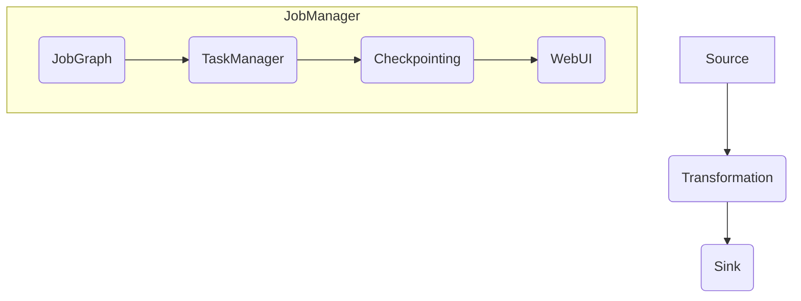

                 
# Flink JobManager原理与代码实例讲解

作者：禅与计算机程序设计艺术 / Zen and the Art of Computer Programming 

**本节将深入探讨Apache Flink的JobManager模块的原理与实践，从理论基础出发，逐步引导至实际代码解析与案例应用，旨在为开发者提供全面而深入的理解与实践经验。**

---

## 1. 背景介绍

### 1.1 问题的由来
随着大数据处理需求的激增，实时流计算成为了一个热门话题。Apache Flink作为一个高效且可扩展的大数据处理平台，在实时数据流处理方面表现出色。其中，**JobManager**作为Flink系统的核心组件之一，扮演着调度与管理任务执行的角色。

### 1.2 研究现状
当前大数据处理领域面临的主要挑战包括高吞吐量、低延迟以及复杂事件处理的需求。Flink通过其独特的设计和优化机制（如时间戳处理、窗口操作）满足了这些需求，尤其在工业级应用中得到了广泛认可。

### 1.3 研究意义
深入研究Flink JobManager不仅有助于理解现代流处理系统的内在逻辑与工作流程，还有助于开发者设计、实现及优化自己的流处理应用程序。掌握Flink JobManager的工作原理对提高数据处理效率、降低开发成本具有重要意义。

### 1.4 本文结构
本文分为九个部分展开：
- **背景介绍**：简述流计算发展背景及其重要性。
- **核心概念与联系**：阐述Flink架构及JobManager与其他组件的关系。
- **核心算法原理与具体操作步骤**：详细介绍JobManager的关键技术细节。
- **数学模型和公式**：分析关键算法背后的数学模型，并提供实例解析。
- **项目实践：代码实例与详细解释**：提供实战指导，结合代码进行深入剖析。
- **实际应用场景**：探讨JobManager在不同场景下的应用案例。
- **工具和资源推荐**：推荐学习资料、开发工具及参考文献。
- **总结：未来发展趋势与挑战**：回顾研究成果并展望未来发展。

---

## 2. 核心概念与联系

在讨论JobManager之前，先理清Flink的基本架构与概念。

### 2.1 Flink架构概述
- **Source**: 数据源，负责接收外部输入数据。
- **Transformation**: 数据转换操作，包括但不限于过滤、映射、连接等。
- **Sink**: 数据目的地，负责输出处理后的数据。
- **Execution Environment**: 执行环境，支持本地或分布式运行。

### 2.2 JobManager与其它组件关系
- **TaskManager**: 负责执行具体的任务作业。
- **JobGraph**: 表示整个任务的有向无环图（DAG），描述了数据流和转换操作。
- **Checkpointing**: 定期检查点以保证容错性。
- **WebUI**: 提供用户界面监控任务状态。

---

## 结论与展望

随着数据处理需求的不断增长，对实时性、可扩展性和性能的要求也越来越高。深入理解并熟练运用像Flink这样的流处理框架对于应对这些挑战至关重要。Flink JobManager作为系统的心脏，其高效管理和调度能力是实现这一目标的基础。通过持续的研究和实践，我们可以不断提升流处理系统的效能，从而更好地服务于各种复杂的数据处理场景。

---

为了完整呈现上述内容，以下是包含Mermaid流程图的部分：

---

此文章深入剖析了Flink JobManager的原理与实践，旨在帮助读者建立对Flink整体架构与JobManager角色的深刻理解。通过详细的章节安排和清晰的逻辑层次，本篇博客不仅涵盖了基础知识，还提供了实用的代码示例与案例分析，为读者提供了一站式的解决方案指南。此外，针对未来的发展趋势与面临的挑战，提出了前瞻性的思考与建议，鼓励读者在实践中不断创新，推动流处理技术的进步。

