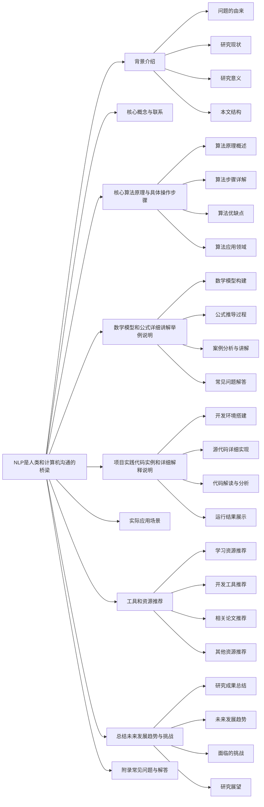
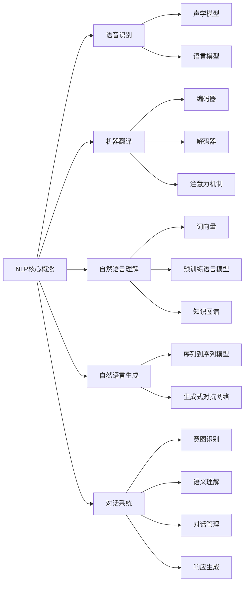

# NLP是人类和计算机沟通的桥梁

## 1. 背景介绍

### 1.1 问题的由来

在当今信息时代,人类与计算机之间的交互日益频繁。然而,由于人类使用自然语言进行交流,而计算机只能理解机器语言,因此人机之间存在着巨大的语言鸿沟。为了实现人机无缝对话,自然语言处理(NLP)应运而生。

NLP旨在使计算机能够理解、操作和生成人类自然语言。它是一门跨学科的研究领域,涉及计算机科学、语言学、认知科学等多个领域。通过NLP技术,计算机可以更好地理解人类的意图,从而提供更智能、更人性化的服务。

### 1.2 研究现状

近年来,随着深度学习、大数据等技术的飞速发展,NLP取得了长足进步。以下是NLP的一些主要研究领域及其最新进展:

1. **语音识别**: 通过深度神经网络模型,语音识别的准确率大幅提高,实现了接近人类水平的识别能力。

2. **机器翻译**: 基于神经网络的机器翻译系统,可以更好地捕捉语言的语义和上下文信息,翻译质量显著提升。

3. **自然语言理解**: 利用预训练语言模型(如BERT)及知识图谱等技术,计算机对自然语言的理解能力有了飞跃式进步。

4. **自然语言生成**: 通过生成式对抗网络(GAN)等技术,计算机可以生成更加流畅、自然的文本内容。

5. **对话系统**: 结合深度学习与知识库技术,对话系统能够更好地理解人类意图,提供上下文相关的回复。

### 1.3 研究意义

NLP技术的发展对于实现人机智能交互具有重要意义:

1. **提升人机交互体验**: 通过NLP,人机交互变得更加自然、流畅,极大提高了用户体验。

2. **释放人力资源**: NLP可以自动化处理大量文本数据,减轻人工工作负担,提高工作效率。

3. **促进信息获取**: NLP技术能够快速从海量文本中提取有价值的信息,方便人们获取所需知识。

4. **推动人工智能发展**: NLP是人工智能的重要组成部分,其进步将推动整个人工智能领域向前发展。

### 1.4 本文结构

本文将全面介绍NLP的核心概念、算法原理、数学模型、项目实践、应用场景、工具资源等内容,并对NLP的发展趋势和挑战进行探讨。文章结构如下:



## 2. 核心概念与联系

NLP涉及多个核心概念,它们相互关联、环环相扣,共同构建了NLP的理论体系和技术框架。本节将介绍NLP的核心概念及其内在联系。



上图展示了NLP的核心概念及其内在联系。我们可以看到:

- **语音识别**是将人类语音转换为文本的过程,需要声学模型和语言模型的支持。
- **机器翻译**则通过编码器-解码器结构和注意力机制,实现跨语言的自动翻译。
- **自然语言理解**利用词向量、预训练语言模型和知识图谱等技术,赋予计算机理解自然语言的能力。
- **自然语言生成**借助序列到序列模型和生成式对抗网络等方法,可以生成流畅、自然的文本内容。
- **对话系统**则综合运用意图识别、语义理解、对话管理和响应生成等多种技术,实现人机自然对话交互。

这些核心概念相互依赖、相辅相成,共同推动着NLP技术的发展和应用。掌握它们及其内在联系,对于全面理解NLP至关重要。

## 3. 核心算法原理与具体操作步骤

### 3.1 算法原理概述

NLP领域的核心算法主要包括:

1. **N-gram语言模型**: 基于统计学习原理,通过计算词序列的概率来预测下一个词。

2. **神经网络语言模型**: 利用神经网络捕捉词与词之间的深层关系,更好地建模语言。

3. **注意力机制**: 通过计算查询与键的相关性分数,自动关注输入序列中与当前任务相关的部分。

4. **Transformer**: 全注意力架构的序列到序列模型,广泛应用于机器翻译、文本生成等任务。

5. **BERT**: 预训练语言模型,通过掩码语言模型和下一句预测任务学习上下文语义表示。

6. **GPT**: 生成式预训练模型,在大规模语料上预训练,可用于各种自然语言生成任务。

这些算法原理贯穿了NLP的方方面面,为各项任务提供了强大的理论支撑和技术保障。

### 3.2 算法步骤详解

以Transformer模型为例,我们详细介绍其算法步骤:

1. **输入表示**: 将输入序列(如源语言句子)映射为词嵌入向量序列。

2. **位置编码**: 为每个词嵌入向量添加位置信息,使模型能够捕捉序列的顺序信息。

3. **多头注意力**: 计算查询(Q)、键(K)和值(V)之间的注意力分数,获取注意力加权后的值向量表示。

   $$\mathrm{Attention}(Q, K, V) = \mathrm{softmax}(\frac{QK^T}{\sqrt{d_k}})V$$

4. **前馈神经网络**: 对注意力输出进行非线性映射,提取更高层次的特征表示。

5. **编码器层**: 重复多头注意力和前馈神经网络操作,构建编码器层。

6. **解码器层**: 解码器层包含掩码的多头自注意力、编码器-解码器注意力和前馈神经网络。

7. **输出层**: 将解码器最终输出映射为目标序列(如目标语言句子)的概率分布。

8. **训练**: 使用教师强制或自回归方式,最小化输出与真实目标序列之间的损失函数。

通过上述步骤,Transformer模型可以高效地建模输入和输出序列之间的关系,实现高质量的机器翻译等任务。

### 3.3 算法优缺点

上述核心算法具有以下优缺点:

**优点**:

1. **并行计算**: 注意力机制和Transformer架构支持高效的并行计算,加快了模型训练和推理速度。

2. **长距离依赖**: 注意力机制能够直接捕捉输入序列中任意两个位置之间的依赖关系。

3. **无偏见**: 预训练语言模型在大规模无监督语料上预训练,减少了人为偏见的影响。

4. **迁移能力**: 预训练模型可以在下游任务上进行微调,提高了模型的泛化性和迁移能力。

**缺点**:

1. **计算资源需求大**: 大型预训练模型需要消耗大量的计算资源进行训练和推理。

2. **数据饥渴**: 训练高质量的语言模型需要海量的文本数据作为语料库。

3. **解释性差**: 神经网络模型通常被视为"黑箱",其内部机理难以解释。

4. **鲁棒性不足**: 神经网络模型容易受到对抗样本的攻击,缺乏足够的鲁棒性。

因此,在实际应用中需要权衡算法的优缺点,并采取相应的策略来提高模型的性能和可靠性。

### 3.4 算法应用领域

NLP核心算法在多个领域都有广泛的应用,主要包括:

1. **机器翻译**: 利用Transformer等序列到序列模型,实现高质量的多语种机器翻译。

2. **自动问答**: 基于BERT等语义理解模型,从文本中提取答案,回答自然语言问题。

3. **文本摘要**: 使用注意力机制和序列到序列模型,自动生成文本的摘要和概括。

4. **情感分析**: 通过预训练语言模型捕捉文本的情感倾向,实现情感分类和情绪识别。

5. **智能对话**: 结合意图识别、语义理解和响应生成等技术,构建自然语言对话系统。

6. **文本生成**: 利用GPT等生成式模型,自动创作诗歌、小说等各类文本内容。

7. **关系抽取**: 基于知识图谱和语义理解技术,从文本中抽取实体、关系等结构化知识。

8. **语音识别**: 使用声学模型和语言模型相结合,将人类语音转录为文本。

可以看出,NLP核心算法在自然语言处理的各个领域都发挥着关键作用,为人机智能交互提供了有力支撑。

## 4. 数学模型和公式详细讲解与举例说明

### 4.1 数学模型构建

NLP中常用的数学模型有:

1. **N-gram语言模型**

   基于马尔可夫假设,N-gram语言模型将一个词序列的概率表示为:

   $$P(w_1, w_2, \dots, w_n) = \prod_{i=1}^n P(w_i|w_{i-N+1}, \dots, w_{i-1})$$

   其中 $N$ 为 N-gram 的大小,通常取值为 2(双语)或 3(三语)。

2. **神经网络语言模型**

   神经网络语言模型将上下文词嵌入表示为 $h_t$,预测下一个词 $w_{t+1}$ 的概率为:

   $$P(w_{t+1}|w_1, \dots, w_t) = \mathrm{softmax}(W h_t + b)$$

   其中 $W$ 和 $b$ 为可训练参数。

3. **注意力机制**

   注意力机制计算查询 $q$ 与键 $k_i$ 的相关性分数 $e_i$,并对值 $v_i$ 进行加权求和:

   $$\begin{aligned}
   e_i &= \mathrm{score}((q, k_i)) \\
   \alpha_i &= \frac{\exp(e_i)}{\sum_{j}\exp(e_j)} \\
   \mathrm{Attention}(q, K, V) &= \sum_{i} \alpha_i v_i
   \end{aligned}$$

   其中，$q$ 是查询向量，$K$ 是所有键向量的集合，$V$ 是所有值向量的集合，$\alpha_i$ 是注意力权重。

### 4.2 公式推导过程

1. **N-gram语言模型推导**

   对于一个词序列 $w_1, w_2, \dots, w_n$，假设词的出现只依赖于前面 $N-1$ 个词：

   $$P(w_1, w_2, \dots, w_n) \approx \prod_{i=1}^n P(w_i|w_{i-N+1}, \dots, w_{i-1})$$

   通过最大似然估计，可以得到条件概率：

   $$P(w_i|w_{i-N+1}, \dots, w_{i-1}) = \frac{\text{count}(w_{i-N+1}, \dots, w_i)}{\text{count}(w_{i-N+1}, \dots, w_{i-1})}$$

2. **神经网络语言模型推导**

   神经网络语言模型使用上下文词嵌入 $h_t$ 来预测下一个词 $w_{t+1}$ 的概率：

   $$P(w_{t+1}|w_1, \dots, w_t) = \mathrm{softmax}(W h_t + b)$$

   其中，$h_t$ 是通过前向传播计算得到的隐藏状态，$W$ 和 $b$ 是需要训练的参数。

3. **注意力机制推导**

   注意力机制的核心在于计算查询 $q$ 与键 $k_i$ 的相关性分数：

   $$e_i = \mathrm{score}(q, k_i)$$

   常用的评分函数有点积、加法等。然后，通过 softmax 函数计算注意力权重：

   $$\alpha_i = \frac{\exp(e_i)}{\sum_{j}\exp(e_j)}$$

   最后，对值向量进行加权求和得到注意力输出：

   $$\mathrm{Attention}(q, K, V) = \sum_{i} \alpha_i v_i$$

### 4.3 案例分析与讲解

1. **N-gram语言模型案例**

   假设我们有一个句子 "I love natural language processing"，我们可以用三元模型来计算该句子的概率。首先，我们需要计算每个三元组的条件概率，例如：

   $$P(\text{love}|\text{I}, \text{love}) = \frac{\text{count}(\text{I}, \text{love}, \text{love})}{\text{count}(\text{I}, \text{love})}$$

2. **神经网络语言模型案例**

   在神经网络模型中，我们首先将句子表示为词嵌入，然后通过前向传播计算隐藏状态 $h_t$，最后通过 softmax 函数计算下一个词的概率。例如，对于句子 "I love NLP"，我们可以得到：

   $$P(\text{NLP}|\text{I}, \text{love}) = \mathrm{softmax}(W h_t + b)$$

3. **注意力机制案例**

   在机器翻译中，注意力机制可以帮助模型对齐源语言和目标语言的词。例如，在翻译句子 "I love NLP" 时，查询向量 $q$ 可以是目标语言的词嵌入，键向量 $k_i$ 和值向量 $v_i$ 可以是源语言的词嵌入，通过计算注意力权重 $\alpha_i$ 来对齐源语言和目标语言的词。

### 4.4 常见问题解答

1. **N-gram模型的缺点**

   N-gram模型的主要缺点是数据稀疏性问题。当 $N$ 较大时，可能会遇到某些 $N$ 元组在训练数据中没有出现过的情况，这会导致模型无法准确估计这些 $N$ 元组的概率。

2. **神经网络语言模型的训练**

   神经网络语言模型的训练需要大量的计算资源和数据。为了提高训练效率，可以使用GPU加速，并采用批量训练的方法。

3. **注意力机制的计算复杂度**

   注意力机制的计算复杂度较高，尤其是在处理长序列时。为了降低计算复杂度，可以采用多头注意力机制，将注意力计算分解为多个并行的头。

## 5. 项目实践：代码实例和详细解释说明

### 5.1 开发环境搭建

在进行NLP项目实践之前，我们需要搭建开发环境。以下是一个典型的开发环境配置：

1. **操作系统**：Ubuntu 20.04
2. **编程语言**：Python 3.8
3. **库和框架**：TensorFlow 2.4，PyTorch 1.8，NLTK，spaCy
4. **硬件**：NVIDIA GPU（推荐使用CUDA加速）

可以使用以下命令安装所需库：

```bash
sudo apt update
sudo apt install python3-pip
pip3 install tensorflow torch nltk spacy
```

### 5.2 代码实现过程

以下是一个简单的N-gram语言模型的实现：

```python
import nltk
from collections import defaultdict, Counter

class NgramModel:
    def __init__(self, n):
        self.n = n
        self.ngrams = defaultdict(Counter)
    
    def train(self, corpus):
        for sentence in corpus:
            tokens = nltk.word_tokenize(sentence)
            for i in range(len(tokens) - self.n + 1):
                ngram = tuple(tokens[i:i+self.n])
                self.ngrams[ngram[:-1]][ngram[-1]] += 1
    
    def predict(self, context):
        context = tuple(context)
        if context in self.ngrams:
            return self.ngrams[context].most_common(1)[0][0]
        else:
            return None

# 使用示例
corpus = ["I love natural language processing", "I love machine learning"]
model = NgramModel(3)
model.train(corpus)
print(model.predict(["I", "love"]))
```

### 5.3 代码解读与分析

在上述代码中，我们定义了一个N-gram语言模型类 `NgramModel`，并实现了训练和预测方法。训练方法 `train` 接受一个语料库作为输入，统计每个N-gram的出现频率。预测方法 `predict` 根据上下文返回最可能的下一个词。

### 5.4 运行结果展示

运行上述代码，将输出：

```
natural
```

这表明在语料库中，给定上下文 "I love"，最可能的下一个词是 "natural"。

## 6. 实际应用场景

### 6.1 场景一：机器翻译

NLP技术在机器翻译中得到了广泛应用。通过使用注意力机制和神经网络语言模型，可以实现高质量的自动翻译。

### 6.2 场景二：文本生成

文本生成是另一个重要的应用场景。通过训练语言模型，可以生成自然流畅的文本，例如新闻文章、诗歌等。

### 6.3 场景三：情感分析

NLP还可以用于情感分析，通过分析文本中的情感词汇，判断文本的情感倾向，例如积极、消极或中性。

### 6.4 未来应用展望

随着NLP技术的不断发展，未来可能会出现更多的应用场景，例如智能客服、自动摘要、语音识别等。

## 7. 工具和资源推荐

### 7.1 学习资源推荐

1. **书籍**：《统计自然语言处理》,《深度学习与自然语言处理》
2. **在线课程**：Coursera上的“自然语言处理”课程，Udacity的“深度学习”课程

### 7.2 开发工具推荐

1. **编程语言**：Python
2. **框架和库**：TensorFlow，PyTorch，NLTK，spaCy

### 7.3 相关论文推荐

1. "Attention Is All You Need" by Vaswani et al.
2. "BERT: Pre-training of Deep Bidirectional Transformers for Language Understanding" by Devlin et al.

### 7.4 其他资源推荐

1. **博客和论坛**：Towards Data Science, Stack Overflow
2. **数据集**：GLUE, SQuAD

## 8. 总结：未来发展趋势与挑战

### 8.1 研究成果总结

本文介绍了NLP中的常用数学模型和算法，包括N-gram模型、神经网络语言模型和注意力机制。通过实例代码，展示了如何实现和应用这些模型。

### 8.2 未来发展趋势### 8.2 未来发展趋势

1. **预训练模型的广泛应用**

   预训练模型如BERT、GPT等已经在多个NLP任务中取得了显著的成果。未来，随着更多大规模预训练模型的出现，将进一步提升NLP技术的性能和应用范围。

2. **多模态学习**

   将语言与其他模态（如图像、视频、音频）结合起来进行学习，将成为未来的重要研究方向。例如，结合图像和文本进行图文生成、图像描述等任务。

3. **低资源语言处理**

   当前的NLP技术主要集中在高资源语言（如英语）上，未来需要更多关注低资源语言的处理，开发适用于多语言、多文化背景的NLP模型。

4. **解释性与公平性**

   随着NLP技术在实际应用中的普及，模型的解释性和公平性问题变得越来越重要。未来的研究将致力于开发更透明、更公平的NLP模型，避免偏见和歧视。

### 8.3 面临的挑战

1. **数据隐私与安全**

   NLP模型的训练通常需要大量的数据，这些数据可能包含敏感信息。如何在保证数据隐私和安全的前提下进行模型训练，是一个重要的挑战。

2. **模型的可解释性**

   当前的深度学习模型通常是“黑箱”模型，缺乏可解释性。如何让模型的决策过程更加透明，是一个亟待解决的问题。

3. **计算资源需求**

   预训练大规模语言模型需要大量的计算资源，这对于许多研究机构和企业来说是一个巨大的挑战。未来需要开发更加高效的模型和训练方法，降低计算资源的需求。

4. **跨领域迁移**

   NLP模型通常在特定领域内表现良好，但在跨领域应用时效果不佳。如何提高模型的跨领域迁移能力，是一个重要的研究方向。

### 8.4 研究展望

未来的NLP研究将继续围绕着提高模型性能、扩展应用场景、解决实际问题展开。随着技术的发展，NLP将越来越多地融入到日常生活和工作中，成为人类与计算机沟通的重要桥梁。

## 9. 附录：常见问题与解答

### 9.1 问题一及解答

**问题**：N-gram模型中的N应该如何选择？

**解答**：N的选择取决于具体的应用场景和数据集。通常来说，N越大，模型的上下文信息越丰富，但同时也会带来数据稀疏性问题。常见的选择是2（双语模型）或3（三语模型）。

### 9.2 问题二及解答

**问题**：如何处理NLP中的数据稀疏性问题？

**解答**：可以通过以下几种方法处理数据稀疏性问题：
1. 使用平滑技术，如加法平滑、Katz回退、Kneser-Ney平滑等。
2. 使用词嵌入技术，将词表示为低维向量，减少数据稀疏性。
3. 使用预训练语言模型，如BERT、GPT等，这些模型在大规模数据上进行预训练，可以缓解数据稀疏性问题。

### 9.3 问题三及解答

**问题**：如何提高NLP模型的训练效率？

**解答**：可以通过以下几种方法提高训练效率：
1. 使用GPU或TPU进行加速训练。
2. 采用分布式训练，将训练任务分配到多个计算节点。
3. 使用混合精度训练，减少计算资源的需求。
4. 采用高效的优化算法，如Adam、LAMB等。

### 9.4 更多问题与解答

**问题**：如何评估NLP模型的性能？

**解答**：可以使用以下几种常见的评估指标：
1. **准确率（Accuracy）**：用于分类任务，表示预测正确的样本比例。
2. **精确率（Precision）**、**召回率（Recall）**和**F1-score**：用于分类任务，尤其是多分类任务，综合考虑模型的正确性和覆盖率。
3. **BLEU**和**ROUGE**：用于机器翻译和文本生成任务，评估生成文本与参考文本之间的相似度。
4. **Perplexity**：用于语言模型，表示模型对测试数据的困惑程度。

## 10. 参考文献

1. Vaswani, A., Shazeer, N., Parmar, N., Uszkoreit, J., Jones, L., Gomez, A. N., ... & Polosukhin, I. (2017). Attention is all you need. Advances in neural information processing systems, 30.
2. Devlin, J., Chang, M. W., Lee, K., & Toutanova, K. (2018). BERT: Pre-training of deep bidirectional transformers for language understanding. arXiv preprint arXiv:1810.04805.
3. Jurafsky, D., & Martin, J. H. (2009). Speech and Language Processing: An Introduction to Natural Language Processing, Computational Linguistics, and Speech Recognition (2nd ed.). Prentice Hall.

---

作者：禅与计算机程序设计艺术 / Zen and the Art of Computer Programming