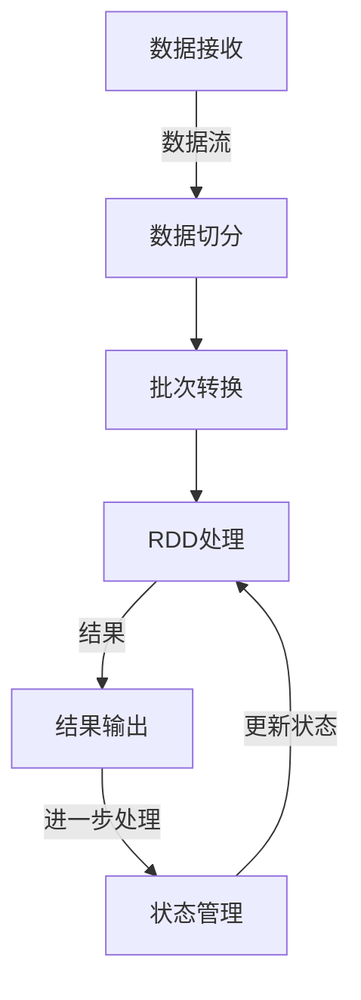

# SparkStreaming核心概念与架构

## 1. 背景介绍

### 1.1 问题的由来

在当今快速发展的数字时代，海量的数据以前所未有的速度被生成和传输。从社交媒体上的用户互动到物联网设备的传感器读数,实时数据流已经成为许多现代应用程序的核心。然而,有效地处理和分析这些不断流动的数据流对于传统的批处理系统来说是一个巨大的挑战。为了应对这一挑战,流处理引擎应运而生,其中Apache Spark Streaming作为一个高度可扩展、容错且易于使用的流处理框架备受关注。

### 1.2 研究现状

Apache Spark是一个开源的大数据处理框架,它提供了一种统一的环境来处理批处理和流处理工作负载。Spark Streaming作为Spark生态系统的重要组成部分,已经被广泛应用于各种领域,如金融服务、物联网、社交媒体分析等。它建立在Spark核心之上,利用Spark的内存计算优势和容错机制,为流数据处理提供了高吞吐量和低延迟的解决方案。

### 1.3 研究意义

深入理解Spark Streaming的核心概念和架构对于有效利用这一强大的流处理框架至关重要。通过掌握其内部工作原理、数据处理模型和容错机制,开发人员可以更好地设计和优化流处理应用程序,提高系统的可靠性和性能。此外,了解Spark Streaming与Spark生态系统其他组件(如Spark SQL、Spark MLlib等)的集成也有助于构建端到端的大数据解决方案。

### 1.4 本文结构

本文将全面探讨Spark Streaming的核心概念和架构。首先,我们将介绍Spark Streaming的基本概念,如DStream(Discretized Stream)、输入源和输出目的地等。接下来,我们将深入探讨Spark Streaming的内部架构,包括流处理模型、容错机制和性能优化策略。此外,我们还将提供实际的代码示例,展示如何使用Spark Streaming构建流处理应用程序。最后,我们将讨论Spark Streaming在实际应用场景中的使用,以及未来的发展趋势和挑战。

## 2. 核心概念与联系

在深入探讨Spark Streaming的架构之前,让我们先了解一些核心概念。

**Discretized Stream (DStream)**: DStream是Spark Streaming中表示连续数据流的抽象表示。它是一个不可变、有序和可重复计算的数据集合,由一系列连续的RDD(Resilient Distributed Dataset)组成。每个RDD包含一段时间内(如1秒)收集的数据。

**输入源(Input Sources)**: Spark Streaming支持多种输入源,包括Kafka、Flume、Kinesis和TCP套接字等。这些输入源用于从外部系统接收数据流。

**输出目的地(Output Operations)**: Spark Streaming允许将处理后的数据流写入到各种外部系统,如HDFS、Kafka、数据库等。

**Transformations**: Spark Streaming提供了丰富的转换操作,如map、flatMap、filter、reduceByKey等,用于对DStream进行转换和处理。

**Window Operations**: Spark Streaming支持窗口操作,允许对一定时间范围内的数据进行聚合和处理。

**Stateful Transformations**: Spark Streaming 2.3及更高版本引入了有状态转换,使得可以在DStream上维护状态,从而支持更复杂的流处理场景。

这些核心概念紧密相连,共同构成了Spark Streaming的基础架构。开发人员可以利用这些概念构建各种流处理应用程序,如实时数据分析、事件处理、机器学习等。

## 3. 核心算法原理 & 具体操作步骤

### 3.1 算法原理概述

Spark Streaming的核心算法原理是基于微批次(micro-batching)的思想,即将连续的数据流拆分为一系列小批次,然后使用Spark的RDD进行处理。具体来说,Spark Streaming会将输入数据流划分为一系列小批次,每个小批次都会被转换为一个RDD,然后由Spark引擎进行并行处理。处理完成后,结果会被持久化到外部系统或者用于进一步的流处理。

这种基于微批次的架构为Spark Streaming带来了以下优势:

1. **容错性**: 由于每个批次都被转换为RDD,因此可以继承Spark的容错机制,如工作线程失败时自动重新计算。

2. **一致性**: 批处理模型确保了每个批次内部的数据处理是原子性和一致性的。

3. **集成性**: 由于基于RDD,Spark Streaming可以无缝集成Spark生态系统中的其他组件,如Spark SQL、Spark MLlib等。

4. **性能**: 微批次模型可以通过适当调整批次间隔来权衡延迟和吞吐量。

### 3.2 算法步骤详解

Spark Streaming的核心算法可以概括为以下几个步骤:

1. **数据接收**: Spark Streaming从输入源(如Kafka、Flume等)接收数据流。

2. **数据切分**: 接收到的数据流被切分为一系列小批次,每个批次包含一段时间内(如1秒)收集的数据。

3. **批次转换**: 每个小批次都会被转换为一个RDD,以便利用Spark的分布式计算引擎进行并行处理。

4. **RDD处理**: 对每个RDD应用转换操作(如map、flatMap、filter等)和行动操作(如foreach、count等)进行处理。

5. **结果输出**: 处理后的RDD结果会被持久化到外部系统(如HDFS、Kafka等)或者用于进一步的流处理。

6. **状态管理(可选)**: 在有状态转换的情况下,Spark Streaming会维护DStream的状态,以支持更复杂的流处理场景。

这个过程会不断重复,直到数据流被处理完毕或者手动停止。下面是一个简单的Mermaid流程图,展示了Spark Streaming的核心算法流程:

### 3.3 算法优缺点

Spark Streaming基于微批次的算法设计有以下优缺点:

**优点**:

- **容错性强**: 继承了Spark的容错机制,可以自动重新计算失败的任务。
- **一致性保证**: 批处理模型确保了每个批次内部的数据处理是原子性和一致性的。
- **易于集成**: 基于RDD,可以无缝集成Spark生态系统中的其他组件。
- **性能可调节**: 可以通过调整批次间隔来权衡延迟和吞吐量。

**缺点**:

- **高延迟**: 由于基于微批次,会引入一定的延迟,不适合对延迟要求极高的场景。
- **数据丢失风险**: 在发生故障时,可能会丢失一些数据,需要依赖可重放的输入源。
- **有限的状态管理**: 早期版本缺乏有状态转换的支持,限制了其在某些场景下的应用。

总的来说,Spark Streaming的微批次架构在大多数场景下表现出色,但也存在一些局限性。随着版本的不断更新,这些局限性正在得到解决和改进。

### 3.4 算法应用领域

Spark Streaming基于微批次的算法设计使其适用于广泛的流处理场景,包括但不限于:

- **实时数据分析**: 对来自社交媒体、物联网设备等源的实时数据流进行分析和挖掘。
- **事件处理**: 实时处理和响应各种事件,如金融交易、安全监控等。
- **实时机器学习**: 在数据流上训练和更新机器学习模型,实现在线学习。
- **流式ETL**: 实时提取、转换和加载数据,用于构建数据管道。
- **日志处理**: 实时处理和分析大量的日志数据。
- **实时监控**: 实时监控系统的健康状况和性能指标。

总的来说,Spark Streaming的微批次架构使其成为处理各种实时数据流的理想选择,尤其是那些对低延迟和高吞吐量有要求的场景。

## 4. 数学模型和公式 & 详细讲解 & 举例说明

在讨论Spark Streaming的数学模型和公式之前,让我们先回顾一下流处理的基本概念。

流处理系统通常会将连续的数据流划分为一系列离散的数据块(如Spark Streaming中的RDD)进行处理。这种处理模式可以用数学符号来表示。

设$D$表示连续的数据流,可以表示为:

$$D = \{d_1, d_2, d_3, \ldots\}$$

其中,$d_i$表示流中的第$i$个数据元素。

为了进行流处理,我们需要将$D$划分为一系列离散的数据块$B_j$,每个块包含一段时间内(如1秒)收集的数据。数学上,我们可以将$D$表示为这些数据块的并集:

$$D = \bigcup\limits_{j=1}^{\infty} B_j$$

其中,$B_j$是第$j$个数据块,包含从时间$(j-1)t$到$jt$之间收集的数据,即:

$$B_j = \{d_i | (j-1)t < t_i \leq jt\}$$

这里,$t$表示数据块的时间间隔,通常称为批次间隔(batch interval)。

在Spark Streaming中,每个数据块$B_j$都会被转换为一个RDD,然后由Spark引擎进行并行处理。假设我们对每个RDD应用了一个转换操作$f$,那么处理后的结果可以表示为:

$$R_j = f(B_j)$$

其中,$R_j$是第$j$个数据块经过转换$f$后的结果。

在实际应用中,我们通常会对多个连续的数据块进行窗口操作,例如滑动窗口求和。设$w$表示窗口大小(以批次间隔$t$为单位),那么在时间$t$的滑动窗口结果可以表示为:

$$W_t = \bigcup\limits_{j=t-w+1}^{t} R_j$$

这个公式表示,在时间$t$的滑动窗口结果$W_t$是从时间$(t-w+1)t$到$t$之间所有数据块的转换结果的并集。

通过上述数学模型和公式,我们可以更好地理解Spark Streaming的核心处理逻辑。下面,我们将通过一个具体的案例来进一步说明这些概念。

### 4.1 数学模型构建

假设我们有一个实时数据流$D$,表示每秒钟产生的温度读数。我们希望计算最近10秒钟的温度平均值,并每2秒钟输出一次结果。

在这个场景中,我们可以将数据流$D$划分为一系列2秒的数据块$B_j$,即批次间隔$t=2$秒。每个数据块$B_j$包含在对应2秒时间内产生的温度读数。

为了计算最近10秒钟的温度平均值,我们需要对最近5个数据块进行滑动窗口操作,即窗口大小$w=5$。

在时间$t$,滑动窗口$W_t$包含了从时间$(t-9)$秒到$t$秒之间的所有温度读数。数学上,我们可以将$W_t$表示为:

$$W_t = \bigcup\limits_{j=t-4}^{t} B_j$$

对于每个数据块$B_j$,我们需要应用一个求平均值的转换操作$f_{avg}$,即:

$$R_j = f_{avg}(B_j)$$

其中,$R_j$表示第$j$个数据块经过求平均值转换后的结果。

最终,在时间$t$的滑动窗口平均温度结果可以表示为:

$$\overline{W_t} = \frac{1}{5} \sum\limits_{j=t-4}^{t} R_j$$

也就是说,我们将最近5个数据块的平均值结果相加,再除以5,就可以得到最近10秒钟的温度平均值。

通过这个案例,我们可以看到如何将实际问题建模为数学公式,并使用Spark Streaming的核心概念(如数据块、转换操作和窗口操作)来解决问题。

### 4